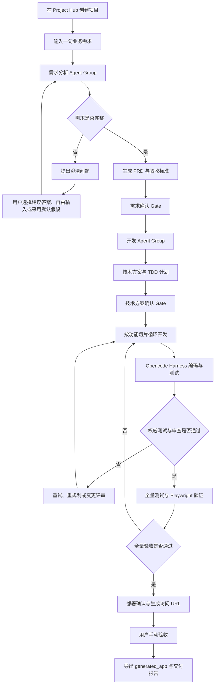

# OneCompany 考试提交说明

> 题目：业务需求到可运行应用的智能体生成系统  
> 项目名称：OneCompany  
> 项目形态：本地优先、多智能体协同的软件交付平台  
> 提交入口：OneCompany TUI2  
> 核心目标：将用户的一句话业务需求开发为可运行、可测试、可部署、可审计的独立应用

## 1. 项目摘要

OneCompany 不是一个预先写好的 AI 面试助手，而是一个通用的 AI 应用生成器。用户在 TUI2 中创建项目并输入一句业务需求后，系统先通过需求分析 Agent Group 完成需求规范化、结构化分析、完整度评分、缺口追问、PRD 和验收标准生成；随后通过开发 Agent Group 完成技术方案、测试设计、功能切片规划、TDD 编码、代码审查、全量测试、部署和交付。

整个过程不是一次性 Prompt。OneCompany 使用 LangGraph 管理宏观工作流、循环预算、状态转换、失败恢复和人工审批；使用结构化 Agent 承担需求分析、架构设计、测试设计等专业任务；使用 Opencode Harness 驱动真实代码读取、编辑和命令执行。所有关键过程都会形成事件、工具调用、命令输出、代码差异、测试结果和交付产物，用户可以在 TUI2 中实时观察并介入。

最终输出包括：

- 独立的 `generated_app` 应用源码；
- PRD、验收标准和技术方案；
- 测试脚本与至少 8 条验收用例；
- 初始化数据；
- Dockerfile 或 Docker Compose；
- 安装、启动、验证和部署说明；
- 工具调用日志、命令输出、Diff 和测试结果；
- 部署 URL 和最终交付报告。

## 2. 用户看到的完整业务闭环



目前项目仅通过 TUI2 进行展示互动，不附带 OneCompany Web 控制台。TUI2 包含 Project Hub 和项目控制台：Agent 区展示需求组、开发组及各 Agent 的实时状态；Timeline 展示用户输入、Agent 的 Plan/Act/Observe/Reflect、工具调用、测试和 Gate；Inspector 展示项目状态、完整度及 PRD、验收标准、技术方案和交付报告等产物。用户可以使用建议答案，也可以自由输入；可以批准或拒绝 Gate；可以暂停、恢复、插话、提交需求变更并查看文件内容。

输入框在全部生命周期阶段保持可用：用户在任意时刻输入的自由文本（如「继续」「暂停」「加一个导出 Excel 的功能」「批准」「导出提交包」「现在到哪了」「slice 为什么 failed」）都先经过 Taizi（太子）调度 Agent 分类意图；信息类问题会触发只读工具调研后再作答，动作类指令则分发到对应的 Agent 或工作流，无需记忆命令或快捷键。

API 入口：`POST /projects/:id/taizi/message`，TUI2 输入框全程走该接口。

## 3. 双层工作流设计

OneCompany 将“一句话生成应用”拆成两个职责清晰、通过持久化产物衔接的 Agent Group。这样可以避免需求尚未确定时直接编码，也避免单个 Agent 同时承担产品、架构、编码和验收职责。

### 3.1 第一层：需求确定工作流

需求阶段采用“顺序执行 + 评分反馈 + 循环追问”的工作流：

```text
用户原始需求
  -> Intake 规范化
  -> Analyst 结构化分析
  -> Scorer 完整度评分与缺口识别
  -> 达标：生成 PRD/验收标准
  -> 未达标：Question Planner 生成一轮问题
  -> 用户回答或采用默认假设
  -> 回到 Analyst/Scorer 重新分析
```

每轮都保存需求状态、问题、答案、假设、缺口和分数。正常情况下，系统在完整度达到阈值且不存在关键缺口后生成 PRD；如果连续多轮提升不足或问题预算耗尽，则创建 `requirement_stuck` Gate，由用户选择继续提问、基于现有假设强制继续或终止项目。

最终提交版本累计提出至少 6 个有效业务澄清问题，并允许逐题回答、选择建议答案或跳过后采用明确记录的默认假设继续。

需求阶段的输出不是聊天文本，而是后续开发的正式输入：

- 规范化需求摘要；
- 目标用户与用户目标；
- 核心功能、页面和业务流程；
- 数据对象及其关系；
- 角色与权限；
- 外部集成和非功能需求；
- 假设、风险和未解决缺口；
- PRD；
- 可逐条验证的验收标准。

### 3.2 第二层：开发交付工作流

开发阶段以需求阶段保存的 PRD 和验收标准为唯一业务基线，采用“Plan + ReAct + 测试驱动的开发 + 人工审批”的执行方式：

```text
PRD/验收标准
  -> Architect 生成技术方案
  -> 技术方案确认 Gate
  -> Planner 拆分功能切片并设计每个切片的测试命令
  -> 对每个切片执行：
       先确定失败测试和验收检查
       -> Opencode Harness 读取/编辑代码并运行命令
       -> OneCompany 独立执行权威测试
       -> Review 审查改动
       -> 通过后 Git 提交
       -> 失败则重试、重规划或进入变更评审
  -> 全部切片通过
  -> 全量测试、构建、Playwright 验证
  -> 部署
  -> 最终人工验收
  -> 交付报告
```

这里的 Plan 由架构师和切片规划 Agent 共同形成（切片规划 Agent 同时负责为每个切片设计测试命令）；ReAct 主要发生在单个开发切片内部，由编码模型根据当前目标反复读取文件、编辑文件、执行测试、观察结果并修正实现。LangGraph 不会把工作流控制权交给编码模型：重试预算、状态转换、Gate 和是否进入下一切片始终由 OneCompany 决定。

开发过程中用户仍可以输入新要求。系统会先分析变更影响，形成变更单并进入 `Change Review`；批准后只重做受影响的计划、切片和测试，项目代码通过 Git 保存提交点，保证可追踪和可回滚。

## 4. Agent 注册机制与职责

所有 Agent 都通过统一注册表声明 `id`、`version`、所属 Group、角色、输入输出 Schema、可用工具、模型层级、风险等级和权限。工作流按 `agent-id@version` 解析 Agent，因此新增、替换或升级 Agent 不需要改变整个系统架构；工具也必须先注册并进入 Agent allowlist 后才能调用。

### 4.1 需求分析 Agent Group

| Agent | 主要职责 | 核心能力 | 主要输出 |
| --- | --- | --- | --- |
| Intake | 接收并规范化用户原始需求 | 识别应用类型、目标用户、用户目标和缺失上下文 | `normalizedSummary`、`targetUsers`、`userGoals`、`appType` |
| Requirement Analyst | 将自然语言需求转为业务结构 | 提取功能、页面流程、数据对象、角色权限、集成、非功能要求和假设 | 结构化需求模型 |
| Completeness Scorer | 判断需求能否进入开发 | 0-100 完整度评分、关键缺口识别、循环停止判断 | `completenessScore`、`gaps[]` |
| Question Planner | 规划每轮缺口追问 | 聚焦业务场景、流程、状态、权限、边界和验收，提供可选建议答案 | 主题化问题轮次 |
| PRD & Acceptance | 固化需求阶段结果 | 生成 Markdown PRD、验收标准、假设和风险 | PRD 版本、验收标准版本 |

问题规划 Agent 只追问影响业务范围和验收结果的问题，不把框架、协议等纯技术决策转嫁给业务用户。问题按主题分轮，答案提交后重新经过分析和评分，而不是简单追加到聊天记录。

### 4.2 开发 Agent Group

| Agent | 主要职责 | 核心能力 | 主要输出 |
| --- | --- | --- | --- |
| Architect | 把 PRD 转成可执行技术方案 | 技术栈、架构、模块、数据模型、风险与 TDD 策略 | Technical Plan |
| Planner | 将整体计划拆成可独立验证的功能切片，并为每个切片设计测试 | 依赖排序、切片目标、预期文件、验收检查、将验收标准转成测试命令 | 有序 Slice Queue |
| Coding | 实现一个功能切片 | 在 Opencode Harness 中执行 ReAct/TDD，读取、编辑代码并运行测试 | 源码、测试、变更文件 |
| Review | 独立审查切片改动 | 对照验收标准检查正确性、一致性、缺陷与风险 | 通过/拒绝、Findings |
| QA | 验证整个应用而非单个函数 | 运行测试、检查预览、浏览器行为、控制台错误和证据 | 测试结果与 QA 结论 |
| DevOps & Delivery | 将开发结果整理为可交付应用 | 生成运行说明、初始化数据、Docker 产物、部署信息和交付报告 | 完整交付包 |

### 4.3 Taizi（太子）调度 Agent

Taizi 是用户自由输入的统一入口，注册为 `taizi@1.0.0`（orchestration 组）。它解决一个核心交互问题：用户在任意阶段都可能输入任何话——「继续」「停」「加一个xxx功能」「批准」「为什么 slice failed」——而这些话的正确含义取决于项目当前状态，或需要先查阅项目事实再回答。

Taizi 采用**双模式**工作，职责边界清晰：

| 模式 | 触发 | 行为 | 是否改系统状态 |
| --- | --- | --- | --- |
| **调度路由** | 继续、暂停、批准、加功能、导出等动作类输入 | 输出 `TaiziDecision`，由 API dispatcher 调用目标 service/Agent | 是（视意图而定） |
| **只读调研** | `status_query`、`chat` 及被误判为变更的状态问句 | 调用只读工具查库/读文件/读事件，再生成中文回答 | 否 |

| 属性 | 说明 |
| --- | --- |
| 职责 | ① 接收任意阶段的用户自由文本并路由到工作流；② 对信息类问题调研项目后作答 |
| 输入 | 用户消息 + 项目上下文快照（状态、打开的 Gate 及选项、待答问题数、是否有活跃编码会话） |
| 输出（路由） | `TaiziDecision`：意图（13 类）、给用户的中文回复、门禁选项、规范化正文、是否硬打断 |
| 输出（调研） | 自然语言回答 + `taizi.routed` 事件（`action: taizi.research`）；工具调用走统一 `tool_call.*` 事件 |
| 权限 | `read` only；**禁止** shell、写文件、部署、代替用户过 Gate |
| 模型 | cheap 档；调研模式最多 8 轮工具调用 |

**A2A 协作方式**：Taizi 与其他 Agent 之间不直接对话。调度模式下 Taizi 产出 `TaiziDecision` 后，dispatcher 把它落成具体调用（恢复项目、跳过澄清、启动开发、解析 Gate、创建变更单、向活跃 Opencode 会话插话/打断等），并发出 `taizi.routed` 事件；目标 Agent 的后续产出通过统一事件流（`agent.*`、`tool_call.*`）回流给用户。长耗时动作后台执行，Taizi 立即应答，避免阻塞输入。调研模式下 Taizi 自身调用只读工具，不触发工作流。

#### 4.3.1 调度能力（13 类意图）

| 意图 | 典型用户说法 | 系统动作（按当前状态落地） |
| --- | --- | --- |
| `continue` | 继续、接着做、go | `Paused`→恢复；有 Gate→按类型默认放行；澄清期→跳过问题；`PRD Ready`→启动开发；`Developing` 静止→续跑切片 |
| `pause` | 暂停、先停一下 | 暂停整个项目 |
| `stop` | 停、别做了、打断 | 打断活跃编码会话；无会话则暂停项目 |
| `new_requirement` | 一段全新需求描述 | 仅在 `Draft Requirement` 启动需求录入 |
| `answer_question` | 对澄清问题的回答 | 引导在问题卡片作答（澄清进行中） |
| `skip_clarification` | 跳过、用默认的 | 跳过剩余澄清，用默认假设生成 PRD |
| `gate_decision` | 批准、拒绝、通过 | 同步解析当前 Gate（须在 options 内） |
| `change_request` | 加一个xxx、把yyy改成zzz | 开发/测试期：插话活跃会话或创建变更单；`!` 前缀硬打断 |
| `start_development` | 开始开发、启动 | `PRD Ready` / 开发期启动或续跑 |
| `start_testing` | 跑测试 | 启动测试流程 |
| `export_submission` | 导出、打包提交包 | 导出完整提交包 |
| `status_query` | 进度、到哪了、下一步是啥、卡在哪 | **只读调研**后回答，不改状态 |
| `chat` | 项目咨询、闲聊、拿不准的输入 | **只读调研**后回答或引导用户确认意图 |

**三级分类策略**：

1. **规则快速通道**（零成本零延迟）：「继续/暂停/停/跳过/批准/拒绝/导出/进度」以及「!」硬打断前缀等高频输入直接命中；
2. **LLM 分类**：规则未命中时，将用户消息与项目上下文交给 cheap 档结构化模型，按提示词中的状态机规则判断意图；拿不准一律降级为 `chat`（只读调研，不动作）；
3. **状态保底**：LLM 不可用或失败时，按当前状态选择最合理的保守解释（澄清期视为补充回答、开发期视为插话、草稿期视为需求），保证调度永不阻塞用户。

**状态感知路由要点**：

- 同一句「继续」会按状态落到不同动作——`Paused` 恢复项目；有 Gate 时按类型放行（确认类 Gate→`approve`、需求卡住→`force_continue`、切片失败→`retry`、变更评审→`update_plan`）；`Asking Questions` 跳过澄清；`PRD Ready` 启动开发；`Developing` 静止时续跑切片。
- 进度/下一步类问句（如「下一步是啥」「目前卡在哪儿」）**不会**创建变更单，强制走 `status_query`。
- 有风险的决策（最终验收、拒绝重做）不会被自动推断，必须由用户明确表态。
- 「加一个xxx功能」在开发期优先插话给活跃编码会话（`!` 前缀先打断当前生成），无会话时转为正式变更单进入 `Change Review`。
- Gate 解析**同步完成**后再回复用户，避免「已放行」但 Gate 仍 open。

#### 4.3.2 只读调研工具（8 个）

信息类问题（`status_query` / `chat`）进入调研模式后，Taizi 可自由组合调用以下工具；所有调用经统一 `callTool` 管线，产生 `tool_call.started` / `tool_call.output` 事件，TUI2 可实时观察。

| 工具 ID | 作用 | 典型用途 |
| --- | --- | --- |
| `project-overview@1.0.0` | 项目元数据：名称、状态、slug、时间戳、事件数量 | 先 orient 当前项目 |
| `list-recent-events@1.0.0` | 最近事件流（可筛 `test.result`、`human_gate.*` 等，最多 50 条） | 查 slice 失败原因、最近 Agent 动作 |
| `read-dev-session@1.0.0` | 开发会话：切片队列、当前切片、重试次数、测试结果、风险 | 查开发进度、哪一切片卡住 |
| `read-requirement-session@1.0.0` | 需求会话：摘要、完整度、缺口、澄清轮次 | 查需求阶段状态 |
| `list-project-gates@1.0.0` | 打开/已解决的人工 Gate 列表 | 查待确认门禁及历史决策 |
| `read-tech-plan@1.0.0` | 最新技术方案正文 | 查架构与切片规划依据 |
| `read-artifact@1.0.0` | 最新 PRD 或验收标准 | 查正式业务基线 |
| `workspace-read@1.0.0` | 项目 Git 工作区内读文件或列目录（有路径边界） | 读 tests/、package.json 等源码与配置 |

**调研作答要求**（prompt 约束）：先查事实再回答；结构为「现状 → 原因（如有）→ 建议下一步」；不编造未查证数据；LLM 不可用或调研失败时降级为控制台快照摘要（`summarizeStatus`）。

**示例问法**（均走只读调研，不触发工作流）：

- 「目前什么进度」「开发多久了」「下一步该说什么」
- 「slice-1 为什么 failed」「最近发生了什么事」
- 「change_review 门禁我该回复什么」「测试过了为什么还显示失败」
- 「帮我看看 tests 目录有什么」「读一下 package.json」

**明确不做的事**：不执行 shell / 不编辑文件 / 不替用户点批准或拒绝 / 不启动开发或测试 / 不导出提交包（这些需用户说出动作类指令，走调度路由）。

### 4.4 PAOR 可观察性

每个 Agent 都输出可供用户审计的四类摘要：

- `Plan`：准备如何完成当前任务；
- `Act`：正在调用什么模型、工具或命令；
- `Observe`：从工具、代码、测试或用户输入中得到什么结果；
- `Reflect`：结果是否满足目标，还存在哪些风险或后续动作。

TUI2 同时展示 Agent 当前状态、工作时长、工具次数、产物数量和步骤数。PAOR 是面向用户的可解释摘要；完整工具参数、命令输出、Diff 和测试结果仍被保留，默认折叠以避免信息过载。

### 4.5 各 Agent 模型配置

每个注册 Agent 在 `packages/agent-core` 中声明 `modelPolicy.tier`（`cheap` / `standard` / `strong`）。运行时按两条独立通道解析为具体模型：

| 通道 | 适用 Agent | 环境变量 | 当前配置（仓库根目录 `.env`） |
| --- | --- | --- | --- |
| **Workflow LLM** | 除 Coding / Review 外的 LangChain 结构化 Agent | `OC_LLM_API_KEY`、`OC_LLM_BASE_URL`、`OC_WORKFLOW_MODEL_CHEAP` / `STANDARD` / `STRONG` | DeepSeek：`https://api.deepseek.com/v1`；cheap / standard → `deepseek-v4-flash`；strong → `deepseek-v4-pro` |
| **Coding Harness** | Coding、Review（mimo / OpenCode 切片写码与只读审查） | `OC_OPENCODE_MODEL_CHEAP` / `STANDARD` / `STRONG`（须为 `provider/model` 格式） | `xiaomi-token-plan-cn/mimo-v2.5-pro`（三档相同）；CLI 优先 `mimo`，凭证读 `~/.local/share/mimocode/auth.json` |

切片 harness 在 workflow 中固定使用 **strong** 档，因此编码与审查实际走 `OC_OPENCODE_MODEL_STRONG`。

注：这里使用的mimo harness是小米公司在OpenCode基础上实现的mimo增强版，通过设置环境变量也可以无缝切换到OpenCode harness。

#### 需求分析 Agent Group

| Agent | tier | 实际模型（当前） | 执行器 |
| --- | --- | --- | --- |
| Intake | cheap | `deepseek-v4-flash` | LangChain |
| Requirement Analyst | **strong** | `deepseek-v4-pro` | LangChain |
| Completeness Scorer | cheap | `deepseek-v4-flash` | LangChain |
| Question Planner | cheap | `deepseek-v4-flash` | LangChain |
| PRD & Acceptance | standard | `deepseek-v4-flash` | LangChain |

#### 开发 Agent Group

| Agent | tier | 实际模型（当前） | 执行器 |
| --- | --- | --- | --- |
| Architect | strong | `deepseek-v4-pro` | LangChain |
| Planner | strong | `deepseek-v4-pro` | LangChain |
| Coding | strong | `xiaomi-token-plan-cn/mimo-v2.5-pro` | mimo Harness |
| Review | strong | `xiaomi-token-plan-cn/mimo-v2.5-pro` | mimo Harness（只读） |
| QA | standard | `deepseek-v4-flash` | LangChain |
| DevOps & Delivery | standard | `deepseek-v4-flash` | LangChain |

#### Taizi（太子）

| 属性 | 值 |
| --- | --- |
| tier | **strong** |
| 实际模型 | `deepseek-v4-pro` |
| 说明 | 调度分类与只读调研；见 §4.3 |

修改模型时：LangChain Agent 改 `OC_WORKFLOW_MODEL_*`；Coding / Review 改 `OC_OPENCODE_MODEL_*`。亦支持 legacy 别名 `OC_MODEL_*`（workflow 用纯模型 id，harness 用 `provider/model`）。

## 5. Opencode Harness 的作用

Opencode Harness 是 OneCompany 开发阶段的代码执行适配层。它不是第二套工作流引擎，也不负责决定项目状态；它负责把一个已经规划好的功能切片交给真实编码助手执行，并把执行过程重新纳入 OneCompany 的治理和审计体系。

它承担以下职责：

1. **隔离编码引擎**：OneCompany 只依赖统一的 `CodingHarness.runSlice()` 和 `runReview()` 接口，通过接口方式调用OpenCode harness进行coding和review，充分利用开源harness的能力，并且与 LangGraph 工作流解耦。
2. **每项目独立会话**：在项目自己的 Git 工作区启动本地 Opencode Server，创建切片会话并选择对应模型层级。
3. **注入 TDD 任务**：Prompt 包含切片目标、验收检查和测试命令，要求编码过程围绕可执行测试完成。
4. **执行真实 ReAct**：编码模型可以读取文件、修改文件、运行命令、查看失败结果并继续修正，而不是一次性输出代码块。
5. **事件桥接**：Event Bridge 把 Opencode 的思考片段、工具调用、命令、文件编辑、Diff、成功和错误转换为 OneCompany 统一事件，供 TUI2 实时展示。
6. **权限桥接**：Permission Bridge 将每个 `read/edit/shell/MCP` 请求转成受治理操作，经过工具 allowlist、目录边界和风险分级后才执行。
7. **日志桥接**：Log Bridge 对输出进行密钥脱敏；较大输出写入日志或 Artifact，数据库保存摘要、路径、大小和哈希。
8. **收集真实改动**：会话结束后从 Opencode 状态和 Git 工作区收集变更文件，禁止把“模型说完成了”直接视为代码完成。
9. **独立代码审查**：同一 Harness 可以启动只读 Review 会话，对照切片目标和验收标准给出结构化审查结论。

最重要的边界是：Opencode 可以建议代码已经完成，但只有 OneCompany 自己运行的权威测试通过，LangGraph 才允许切片提交并进入下一步。这防止了模型自报成功、伪造测试结果或绕过工作流状态机。

## 6. 工具、MCP 与真实调用证据

### 6.1 进入核心流程的工具能力

OneCompany 的工具不是展示用标签，而是进入 Agent 和 Harness 执行链路并生成 `tool_call.started`、`tool_call.output` 或 `tool_call.failed` 事件。核心能力包括：

| 工具能力 | 在流程中的实际作用 | 结果如何进入后续流程 |
| --- | --- | --- |
| `requirement-context` | 读取当前需求摘要、功能、缺口、分数和问题轮次 | 需求分析 Agent 基于最新状态继续分析 |
| `read-artifact` | 读取最新 PRD 或验收标准 | Architect、Planner、Review 和 **Taizi 调研** 使用正式业务基线 |
| `workspace-read` | 在项目目录边界内读取文件或目录 | 架构设计、代码理解、审查和 **Taizi 读仓库** |
| **Taizi 只读工具集**（`project-overview`、`list-recent-events`、`read-dev-session`、`read-requirement-session`、`list-project-gates`、`read-tech-plan` 等，见 §4.3.2） | 用户向 Taizi 提问时查项目状态、事件、Gate、切片与产物 | 生成自然语言回答，产生 `tool_call.*` 事件，**不改变工作流** |
| 文件编辑/生成 | 创建和修改源码、测试、配置与说明文件 | 形成真实工作区 Diff 和 Git 提交 |
| 受治理 Shell | 执行安装、测试、类型检查、构建和启动命令 | 输出进入日志，退出码进入测试判断 |
| Git/Diff | 记录每个切片的变更和提交点 | Review、回滚和变更影响分析 |
| Vitest Runner | 执行单元和集成测试并解析结构化结果 | 决定切片通过、重试或失败 Gate |
| TypeScript/Build Runner | 验证类型和构建产物 | 进入全量验收和交付报告 |
| Playwright/Browser | 访问预览 URL、检查页面、截图、控制台错误和 Trace | 作为 E2E 与人工验收证据 |
| Artifact/Report | 保存大日志、测试证据、PRD、技术方案和交付报告 | TUI2 可查看，导出包可交付 |

最终标准演示会固定执行并在工具日志中展示至少 5 种不同工具能力，确保评分人员可以直接核验，而不依赖代码推断。 

### 6.2 MCP 与 Integration Gateway

项目包含真实的 `oc-gateway-mcp` 服务，使用官方 Model Context Protocol SDK 和 stdio transport。它根据当前项目已启用的 Integration 动态注册 `oc_{integrationId}__{toolName}` 工具，并将调用转发到 OneCompany Integration Gateway。

当前 P1 集成包括：

- Playwright/Browser：页面导航、截图和控制台错误检查；
- Figma MCP：读取设计上下文和导出设计截图；
- GitHub MCP：仓库读取、分支创建、Issue 读取和 PR 交付；
- Supabase MCP：表结构读取、迁移和初始化数据；
- Vercel Native Adapter：项目查询、预览部署和日志读取。

仓库还预安装或预留了 Cloudflare、Linear、Sentry、PostHog、Context7、Postgres、Docker、Stripe、Slack、Notion 和 Kubernetes 等 MCP 服务。所有外部工具必须先注册、按项目启用并通过工具 allowlist；高风险调用会创建人工 Gate；远端返回内容被视为不可信数据，不能覆盖系统策略。

离线环境下，Integration Gateway 可以根据 `offlineFallbackSkillPackId` 切换到本地 Skill Pack。Skill Pack 固化工具使用说明、脚本、模板和离线替代流程，使项目不依赖某个远程 MCP 才能完成基本开发和验收。

## 7. TDD、测试和运行验证

OneCompany 采用测试驱动开发的软件工程范式，在三个层次执行验证：

1. **切片前测试设计**：Planner 在拆分切片时，根据验收标准为每个切片生成绑定的测试命令。
2. **切片内 TDD**：Opencode Harness 根据目标和失败测试实现代码，循环执行测试并修正。
3. **切片外权威测试**：OneCompany 独立运行测试命令并解析结果。只有权威结果通过才允许提交。
4. **项目级全量测试**：全部切片完成后执行 Unit、Integration、Typecheck、Build、Playwright E2E 和验收用例。
5. **人工最终验收**：预览或部署 URL 可访问后，由用户实际操作核心路径并决定接受或退回开发。

生成应用会自动补齐依赖声明、安装命令、启动命令、测试命令、README/RUN 文档和最终自检，保证从独立目录安装后可以启动和验证。

当测试失败时，系统保存失败详情并回到开发循环；当切片重试预算耗尽时，用户可以重试、重规划、申请跳过切片或终止。跳过切片不会被静默视为通过，而是进入变更评审并更新需求或验收基线。

## 8. 风险控制与人在回路

OneCompany 对 Shell、文件编辑、网络和部署操作进行分级：

| 风险 | 示例 | 策略 |
| --- | --- | --- |
| 低风险 | 文件读取、状态查询、测试和类型检查 | 本地执行并记录日志 |
| 中风险 | 文件生成、数据库初始化、启动开发服务 | 在项目工作区执行并记录 Diff/输出 |
| 中风险受限 | 依赖安装等可能触发脚本的操作 | 使用受限参数和明确目录边界 |
| 高风险 | 删除、未知脚本、越界写入 | 人工确认，适合时进入 Docker Sandbox |
| 高风险部署 | 对外暴露 URL、远程部署或生产变更 | 人工确认，在真实网络环境执行 |

关键 Gate 包括需求确认、技术方案确认、需求卡住、切片失败、变更评审、危险操作、部署确认和最终验收。Gate 只展示策略允许的选项，同时支持用户输入自定义意见；自定义文字不会被隐式解释为批准。

高风险操作默认不能由 Agent 自行放行。TUI2 的 YOLO 模式仅针对危险操作 Gate，并持续显示醒目状态，不影响需求确认、技术方案确认、部署确认和最终验收等业务 Gate。

## 9. 状态、日志与可恢复性

项目状态由持久化状态机管理，主要路径为：

```text
Draft Requirement
  -> Asking Questions
  -> PRD Ready
  -> Tech Plan Review
  -> Developing
  -> Testing
  -> Deploying
  -> Awaiting Acceptance
  -> Delivered
```

`Paused`、`Failed` 和 `Change Review` 用于暂停恢复、不可恢复失败和需求变更。非法状态转换会被拒绝，例如项目不能从 `Developing` 直接跳到 `Delivered`。

Agent 之间不依赖 SSE 互相通信。内部协作通过 LangGraph 状态、SQLite 持久化数据、任务状态和事件日志完成；SSE 只负责把后端事件推送给 TUI/Web。TUI2 同时使用 SSE 和低频 Snapshot 轮询，因此断线重连后仍能恢复项目状态和未处理 Gate。

系统保留：

- 用户原始输入与规范化摘要；
- Agent Plan/Act/Observe/Reflect；
- 状态变更和人工决策；
- 工具名称、调用状态、输出摘要和错误；
- 完整命令输出或外置日志引用；
- 文件 Diff 和 Git 提交；
- 单项及全量测试结果；
- PRD、验收标准、技术方案、截图、Trace 和交付报告。

## 10. 当前技术栈

OneCompany 采用 TypeScript 全栈 Monorepo，当前实际实现如下：

| 层级 | 技术 |
| --- | --- |
| Monorepo | pnpm workspace、Turborepo |
| 主提交界面 | Node.js TypeScript TUI、picocolors、原生终端输入与鼠标事件 |
| API | Hono、Node.js |
| 宏观工作流 | LangGraph.js StateGraph、interrupt/Command resume、SQLite Checkpoint |
| 非编码 Agent | LangChain `ChatOpenAI.withStructuredOutput`，兼容 OpenAI 协议模型服务 |
| 编码与审查 | mimo CLI（MimoCode，OpenCode 兼容 API）/ SDK，通过可替换 `CodingHarness` 接入 |
| 数据库 | SQLite、better-sqlite3、Drizzle ORM |
| 数据契约 | TypeScript、Zod、版本化 Schema |
| 实时通信 | REST + SSE，事件序号支持重放 |
| 测试 | Vitest、TypeScript typecheck、Build Runner、Playwright |
| 项目工作区 | 每项目独立目录、独立 Git 仓库、Artifacts 和 Logs |
| 安全执行 | 本机工作区 + 高风险 Docker Sandbox + 人工 Gate |
| MCP/集成 | Model Context Protocol SDK、oc-gateway-mcp、Native Adapter、Skill Pack |
| 部署 | 本地预览、用户提供的 Cloudflare Tunnel，以及受治理的 Vercel/外部连接器 |

本次统一样例生成的是独立浏览器 Web App，采用 TypeScript、原生 DOM、静态开发服务器、Vitest 和 Docker。该技术栈属于 Agent 根据当前项目需求形成的生成结果，不是 OneCompany 控制台的固定前端技术栈。

当前代码中普通需求/规划 Agent 的真实执行器是 LangChain 结构化模型调用，而不是早期方案中的 OpenAI Agents SDK；提交文档以实际实现为准。模型提供商通过 OpenAI-compatible API 接入，可按 cheap、standard、strong 三档路由；各 Agent 与当前 `.env` 下的具体映射见 **§4.5**。

## 11. AI 面试助手统一样例

评审使用以下需求时：

> 设计一个 AI 面试助手。HR 可以创建岗位，上传或粘贴候选人简历，系统根据岗位要求生成面试问题，记录面试评价，并给出候选人匹配度建议。

OneCompany 会将其作为普通业务需求进入同一套生成流程，而不是选择固定的“面试助手模板”。需求阶段会澄清用户角色、岗位字段、简历输入方式、问题数量、评价维度、匹配度解释和数据保存方式；开发阶段据此生成独立应用。

最终标准样例覆盖以下主路径：创建岗位并填写名称、职责和要求；粘贴或上传候选人简历；生成至少 5 个针对岗位的面试问题；记录评价或打分；展示候选人与岗位的匹配度建议及理由。该样例不是固定模板，来自项目 `ai-867d975f` 的实际工作区导出，并连同源码、初始化演示数据、运行说明、Docker 产物、测试及结构化工作流记录作为 `generated_app` 提交。

打包前使用全新临时目录独立复核该应用：`npm install` 成功且审计结果为 0 个已知漏洞；`npm run verify` 依次通过 TypeScript typecheck、47 条 Vitest 测试和 TypeScript build；`npm run dev` 后首页与编译后的应用脚本均可通过 `http://127.0.0.1:3000` 访问。

## 12. 导出和最终交付结构

TUI2 在项目达到交付条件后提供生成应用导出。本次考试压缩包将 OneCompany 源码和该导出结果合并，结构如下：

```text
OneCompany/
├── apps/
│   ├── api/                    # Hono API、SSE、Gate 与工作流入口
│   └── tui/                    # 唯一正式交互界面 TUI2
├── packages/                   # Agent、Workflow、Workspace、MCP 等核心源码
├── generated_app/              # 由统一样例自动生成的独立应用
│   ├── src/
│   ├── tests/
│   ├── e2e/
│   ├── public/
│   ├── scripts/
│   ├── package.json
│   ├── Dockerfile
│   ├── docker-compose.yml
│   ├── README.md
│   └── RUN.md
├── artifacts/
│   ├── requirement.json
│   ├── plan.json
│   ├── file-list.json
│   ├── test-cases.json
│   ├── delivery-report.md
│   ├── independent-verification.md
│   └── generated-app.png
├── logs/
│   └── tool-call-log.json
├── docs/
│   └── week3-level2-submission.md
├── README.md                    # OneCompany 安装、启动、演示和常见问题
├── Dockerfile
└── docker-compose.yml
```

其中 `generated_app`、`artifacts` 和 `logs` 来自 OneCompany 的实际项目导出。打包时移除 `.pytest_cache`、`__pycache__`、临时测试结果、构建目录和本地密钥，仅保留可复现源码及可审计记录，直接回应题目对“生成结果”和“可复现交付”的要求。

## 13. 运行方式

### 13.1 环境要求

- Node.js 22+
- pnpm 9+
- Git
- mimo CLI（MimoCode；或 OpenCode CLI）
- 至少一个 OpenAI-compatible 模型 API Key
- Docker，可选，用于高风险沙箱

### 13.2 安装与启动

```bash
pnpm install
pnpm migrate
```

终端一启动 API：

```bash
pnpm api
```

终端二启动正式提交界面：

```bash
pnpm tui2
```

也可以直接进入指定项目：

```bash
pnpm tui2 --project <project-id>
```

正式验收使用真实引擎，不使用 `--stub`。缺少 API Key 时，系统会明确展示环境缺口；对于允许降级的外部服务，可生成 Mock 数据并提示补充密钥。

### 13.3 建议现场演示顺序

1. 在 Project Hub 新建项目。
2. 输入统一 AI 面试助手需求。
3. 展示累计 6 个以上澄清问题、建议答案、自由输入和默认假设继续。
4. 打开 PRD 与验收标准，批准需求确认 Gate。
5. 展示 Architect、Planner 的 PAOR 和技术方案。
6. 批准技术方案，展示 Opencode Harness 的真实文件读取、编辑、Shell、测试和 Diff。
7. 展示至少 5 种工具调用及其中一次失败/重试。
8. 在输入框向 Taizi 提问（如「slice 为什么 failed」「现在该说什么」），展示 `tool_call.*` 只读调研（事件流、dev session、Gate）及中文作答，说明 Taizi 只读、不改工作流。
9. 展示全量测试和 Playwright 页面验证。
10. 输入部署 URL，完成最终人工验收。
11. 导出 `generated_app`、结构化日志和交付报告，并按 README 启动生成应用。

## 14. 考试验收用例

| 编号 | 验收场景 | 操作 | 预期结果 |
| --- | --- | --- | --- |
| TC-01 | 输入统一示例需求 | 新建项目并输入 AI 面试助手需求 | 创建生成任务并进入需求分析 |
| TC-02 | 至少 6 个有效问题 | 完成需求澄清 | 累计出现不少于 6 个业务问题 |
| TC-03 | 跳过澄清 | 选择使用默认假设继续 | 假设被记录并继续生成 PRD   |
| TC-04 | 输出应用规划 | 批准需求并进入开发 | 可查看技术栈、模块、数据结构、文件计划和验收标准 |
| TC-05 | 至少 5 种工具 | 观察一次标准开发运行 | 日志中可核验至少 5 种真实工具 |
| TC-06 | 生成独立应用 | 完成开发流程 | 导出包中存在非固定模板的 `generated_app` |
| TC-07 | 独立启动 | 在生成目录按 README 安装并启动 | 页面或服务可访问，核心提示清楚   |
| TC-08 | AI 面试助手主路径 | 创建岗位、输入简历、生成问题、评价并查看匹配度 | 五步主路径完整通过   |
| TC-09 | 失败与重试 | 制造测试失败或拒绝审查 | 保存错误，重新进入编码或变更评审 |
| TC-10 | MCP 调用 | 启用并调用项目集成工具 | 工具经 MCP/Gateway 返回结构化结果并被记录 |
| TC-11 | 风险控制 | 触发高风险命令或部署操作 | 创建 Gate，未经批准不得执行 |
| TC-12 | 导出结果 | 完成交付并执行导出 | 获得源码、日志、JSON、验收用例和运行说明   |

## 15. 对评分项的逐条回应

| 考试评分点 | OneCompany 的对应实现与证据 |
| --- | --- |
| 题目完成度 | TUI2 从需求输入开始，串联需求澄清、规划、编码、测试、部署、验收和导出，不是文档生成器 |
| 至少 2 个 Agent 阶段 | 明确拆分需求确定和开发交付两层工作流，共 13 个专业 Agent（含 Taizi 调度），输入输出通过 Schema 和持久化产物衔接 |
| Agent 职责清晰 | 每个 Agent 有注册 ID、版本、角色、Schema、模型策略、工具 allowlist、风险等级和权限 |
| 至少 5 个工具能力 | 工作区读取、文件编辑、Shell、Git/Diff、Vitest、Typecheck、Build、Playwright、Artifact 等真实进入流程 |
| 至少 1 个 MCP/等价服务 | `oc-gateway-mcp` 使用 MCP SDK 和 stdio transport，向 Opencode 暴露受治理的项目工具 |
| 工具不是仅展示 | 调用经过统一执行管线，产生工具事件、数据库记录、输出引用和后续状态判断 |
| 生成 `generated_app` | 每个项目拥有独立工作区，Coding Agent 根据 PRD 动态生成源码和测试，最终导出独立目录 |
| 不是固定预写应用 | 需求、PRD、技术方案、Slice Queue 和代码均由当前项目输入驱动；AI 面试助手只是标准验收样例 |
| 可运行和可验证 | 生成运行说明、依赖、启动命令、测试、Docker 产物；执行权威测试和 Playwright 验证  |
| AI 面试助手主路径 | 标准样例覆盖岗位、简历、5 个以上问题、评价和匹配建议   |
| 日志与结构化输出 | 统一事件、PAOR、工具调用、命令日志、Diff、测试结果、需求 JSON、文件清单和交付报告 |
| 错误处理 | 工具失败、测试失败、超时和审查拒绝均有可理解错误，并进入重试、Gate 或变更评审 |
| 人工控制 | 需求、技术方案、危险操作、部署和最终验收均可阻塞等待用户决定；Taizi 调度让用户在任意时刻用自然语言继续、暂停、打断或变更工作流，并用只读工具回答进度与失败原因 |
| 运行说明 | 提交根 README 说明安装、环境变量和启动；生成应用 README/RUN 说明独立启动与验证 |
| 至少 8 条验收用例 | 本文给出 12 条，覆盖主流程、跳过澄清、失败、MCP、风险、启动和导出 |
| 可维护性 | TypeScript Monorepo 分离 API、Workflow、Agent Core、Workspace、Integrations、Shared 和 TUI；Agent/Harness/Integration 均可注册或替换 |


## 16. 总结

OneCompany 对本题的回答不是“让一个模型写一些代码”，而是建立一条可控制、可恢复、可观察、可验收的软件生产流程：需求组负责把模糊意图转成稳定业务契约，开发组负责把契约转成经过 TDD、代码审查和运行验证的独立应用；LangGraph 控制宏观生命周期，Opencode Harness 完成受治理的真实编码，Integration Gateway/MCP 提供外部能力，TUI2 让用户持续看见并控制整个过程。

因此，本项目覆盖了题目要求的输入、澄清、规划、多 Agent、真实工具、MCP、代码生成、运行验证、错误恢复、结构化日志、人工验收和结果导出，并最终交付可独立运行的 `generated_app`。

ps. 但其实需要注意的是，本项目的编排极为复杂，coding agent和review agent采用的opencode harness也是按照max规格来跑，所以使用oneCompany生成一个可运行应用的时间很漫长，目前测试阶段已经成功生成了五子棋、日历、AI面试助手等应用。但由于oneCompany编排和tui2并不是完全完善，在试用过程中会存在跑飞了的情况。

pps. 而且根据实测，在实际“一句话需求到可运行应用”的场景中，单独使用任何一个coding agent的都比oneCompany更快更强……现在的基模可能不需要如此复杂的编排，oneCompany更像是用于理解agent harness原理的作业

ppps. agent配置的model均采用个人url和key，在提交源码过程中已删除。
