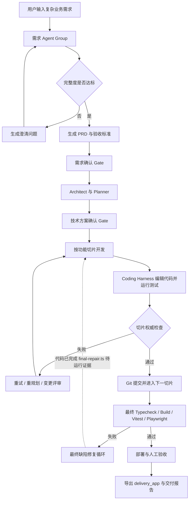
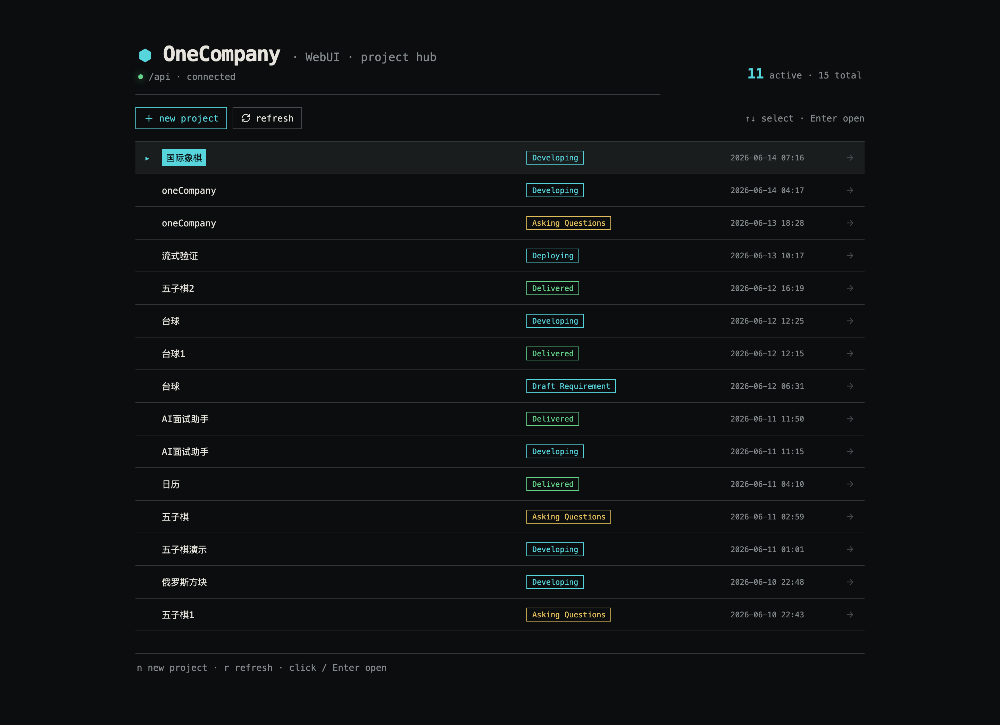
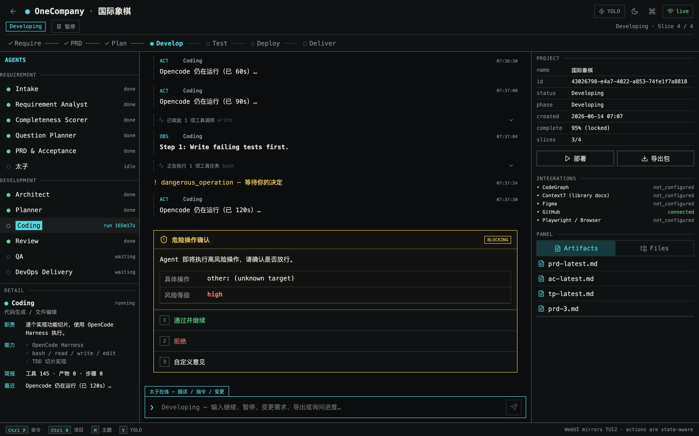
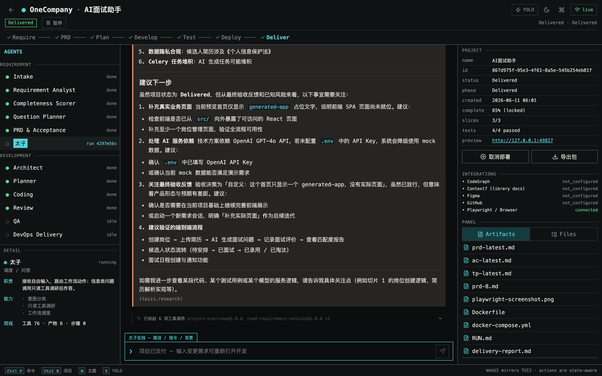
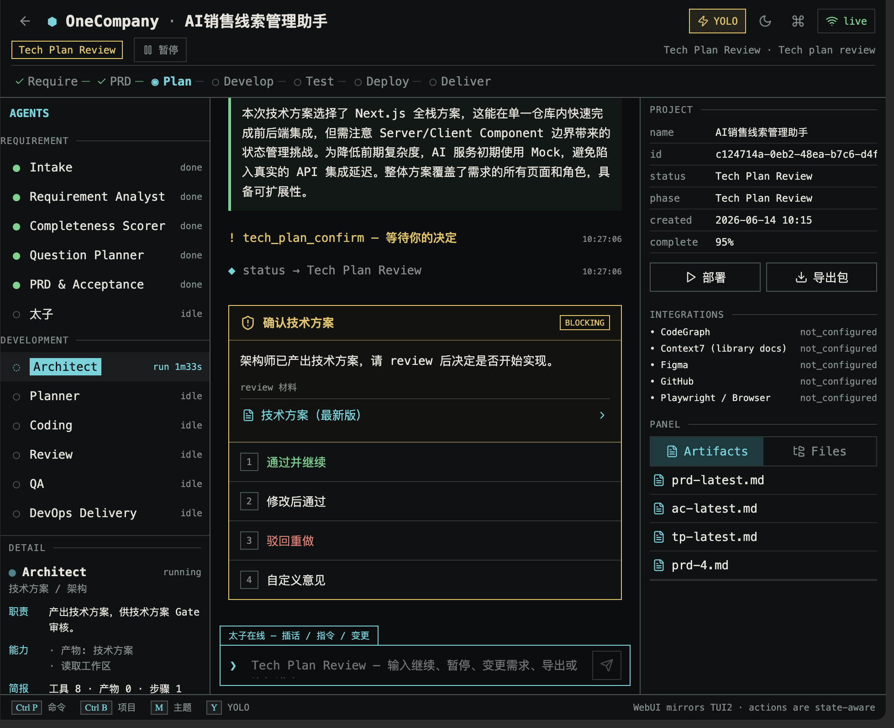
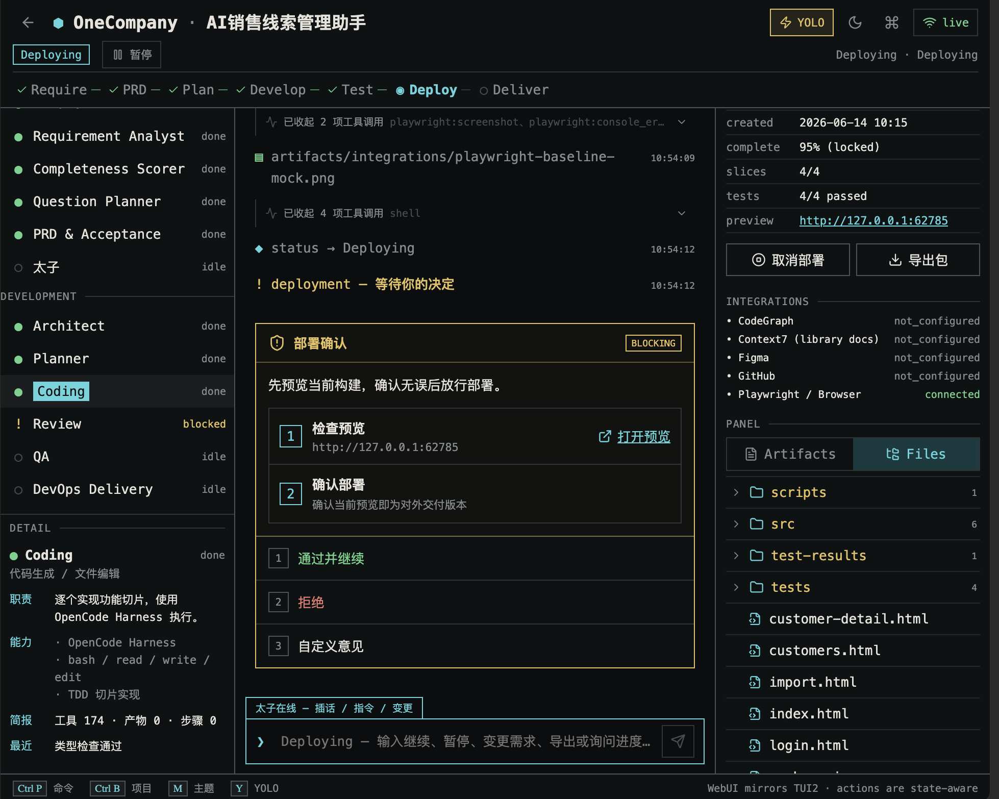
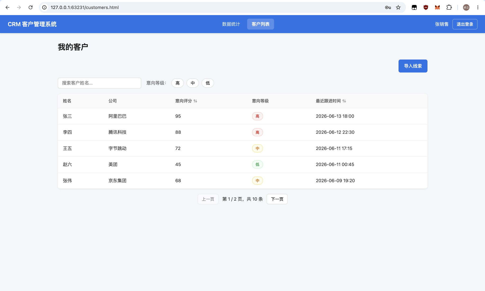
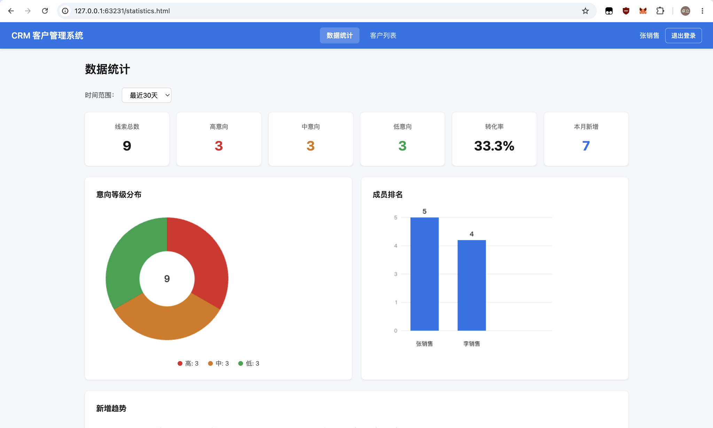
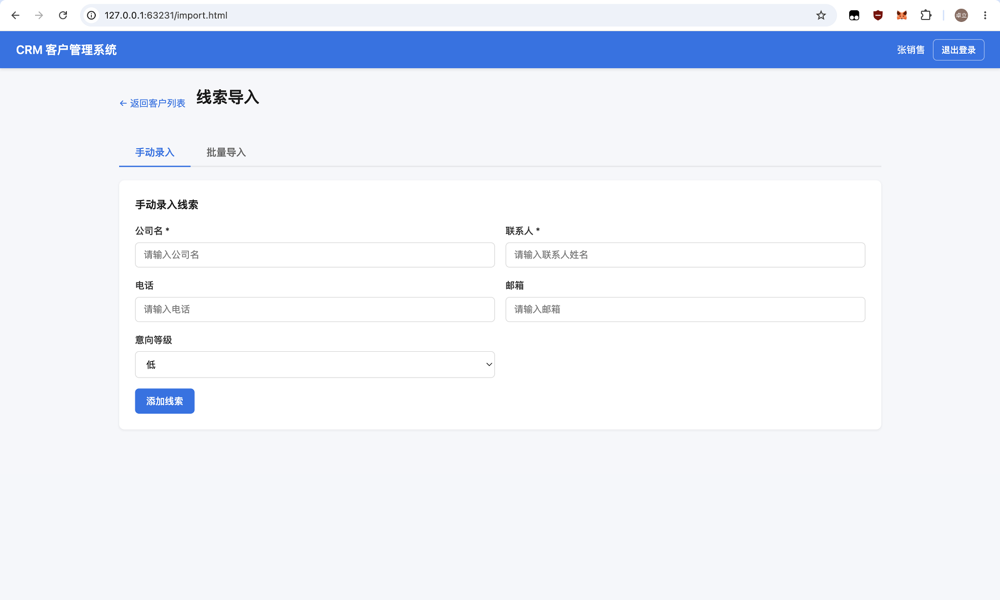

# OneCompany Level 03 考试提交说明

> 题目：复杂需求到可验证工程项目的多智能体交付系统  
> 项目名称：OneCompany  

## 1. 项目摘要

OneCompany 是一个本地优先、多智能体协同的软件交付平台。用户输入业务需求后，系统通过需求 Agent Group 完成需求规范化、完整度评分、澄清问题、PRD 和验收标准；再通过开发 Agent Group 完成架构设计、功能切片、编码、审查、测试、部署和交付。

系统使用 LangGraph 管理工作流和恢复点，使用 SQLite 保存项目、Agent、事件、Gate、工具调用和测试状态，使用 Coding Harness 执行真实文件编辑与命令，并通过 TUI2/WebUI 展示实时进度。

当前已经完成：

- 12 个注册 Agent，覆盖需求、架构、规划、编码、审查、QA、交付和统一调度；
- 项目级持久化状态机、人工 Gate、暂停恢复、变更评审和事件审计；
- 工作区读取、文件编辑、Shell、Git、测试、构建、预览、报告等工具链；
- CodeGraph、Context7 两个项目 MCP 配置，以及 Integration Gateway；
- 动态生成多个不同业务应用，已有 4 个项目进入 `Delivered`；
- 平台全量测试 98 条通过、5 条跳过；
- AI 面试助手样例独立通过 typecheck、47 条 Vitest 测试和 build；
- 销售线索管理助手 5 切片全过、118 条测试通过、RBAC/持久化/边界已补齐；
- Dockerfile、Compose、RUN 文档和提交包导出能力。

当前尚未完成（剩余收尾项）：

- 销售线索应用从 Deploying 推进到 Delivered 最终状态；
- 最终集成失败后自动修复循环的实际运行证据（代码已实现，待触发）；
- CodeGraph / Context7 在标准样例中的有效调用证据（Playwright 已有 18 条）；
- 清理后的最终 Level 03 提交压缩包。


## 2. 当前完成度与正式结论

| 维度 | 当前状态 | 说明 |
| --- | --- | --- |
| 多 Agent 架构 | 已完成 | 5 个需求 Agent、6 个开发 Agent、1 个 Taizi 调度 Agent |
| 工具能力 | 已完成 | 标准项目中已记录 9 类工具调用 |
| MCP 配置 | 部分完成 | CodeGraph、Context7 已启用，但标准样例缺少有效调用证据 |
| 代码生成 | 已完成 | 已生成面试、日历、五子棋、台球等不同应用 |
| 测试体系 | 已完成 | 平台测试和至少一个生成应用验证通过 |
| 失败修复闭环 | 部分完成 | 切片重试有效；最终集成失败修复循环已实现（`final-repair.ts`），待运行证据 |
| 数据持久化 | 已完成 | 销售线索应用客户数据 localStorage 持久化，刷新后保留 |
| 角色权限 | 已完成 | RBAC 守卫 + 3 角色 4 账号 + 越权测试 7 条 |
| `delivery_app` | 已完成 | 导出目录为 `delivery_app`，过滤规则已完善 |
| 销售线索应用 | 部分完成 | 5 切片全过（118 tests），持久化/RBAC/边界已补齐；缺 Deploying→Delivered |
| 部署材料 | 部分完成 | Docker/Compose/RUN 已生成；delivery_app 改名已完成，最终提交包清理待做 |

因此，OneCompany 已证明“通用多智能体交付平台”能力，销售线索业务验收路径 1-9 已基本覆盖（含越权测试和持久化测试）。

## 3. 用户看到的完整业务闭环



TUI2 和 WebUI 均可查看项目状态、Agent、信息流、Artifacts、Files、测试结果和 Gate。用户自由输入统一进入 Taizi，由 Taizi根据当前状态执行动作路由或只读调研。

### 3.1 界面展示

以下截图取自本地部署（API `localhost:3001` + WebUI `localhost:3010`），展示真实项目数据。

**Project Hub —— 项目列表与状态总览**



Project Hub 列出所有项目及其生命周期状态（Draft Requirement / Asking Questions / Developing / Deploying / Delivered），支持新建项目、刷新和搜索。截图显示 15 个项目（11 active），覆盖需求、开发、部署和交付各个阶段。

**项目控制台 —— 开发中项目（国际象棋，Developing）**



开发中项目的控制台：Timeline 实时滚动展示编码 Agent 的切片实现、权威测试、类型检查和审查事件；Inspector 展示当前 DevState、切片队列和已提交的 commits。

**项目控制台 —— 已交付项目（AI 面试助手，Delivered）**



AI 面试助手是已独立通过 typecheck、47 条 Vitest 测试和 build 的样例（详见 §7.2），控制台展示了其完整的生命周期记录。

## 4. Agent 架构与职责

### 4.1 需求 Agent Group

| Agent | 职责 | 主要输出 |
| --- | --- | --- |
| Intake | 规范化原始需求 | 需求摘要、目标用户、应用类型 |
| Requirement Analyst | 提取功能、流程、数据和角色 | 结构化需求模型 |
| Completeness Scorer | 评分并识别关键缺口 | 完整度和缺口列表 |
| Question Planner | 规划业务澄清问题 | 问题轮次和建议答案 |
| PRD & Acceptance | 固化业务基线 | PRD、验收标准、假设和风险 |

### 4.2 开发 Agent Group

| Agent | 职责 | 主要输出 |
| --- | --- | --- |
| Architect | 设计可执行技术方案 | 架构、模块、数据模型、测试策略 |
| Planner | 拆分可验证功能切片 | Slice Queue、测试命令、验收检查 |
| Coding | 实现功能和测试 | 源码、测试、配置、Diff |
| Review | 审查正确性和一致性 | Findings、通过或退回结论 |
| QA | 执行项目级验证 | Typecheck、Build、Vitest、预览证据 |
| DevOps & Delivery | 生成交付材料 | Docker、RUN、报告、导出包 |

### 4.3 Taizi 调度 Agent

Taizi 是所有自由文本的统一入口，支持继续、暂停、停止、需求补充、Gate 决策、变更请求、启动测试、导出和状态查询。信息类问题会先调用只读工具获取项目事实，再生成回答；动作类输入由 dispatcher 转成工作流操作。

当前已知缺陷：~~当切片循环已标记为 `completed`、但最终集成测试失败时，”修复错误，然后重跑集成测试”仍会路由到 `development.start`，导致 `Cannot resume development from phase: completed`。~~ **已修复：** `engine.ts` 现在在 `phase === “completed” && testing.phase === “failed”` 时自动调用 `startFinalRepair`（`packages/workflow/src/development/final-repair.ts`），构建 `final-repair-N` 修复切片并重新执行完整测试。该修复循环尚无实际项目运行证据，待销售线索样例触发验证。

## 5. 工具、MCP 与调用证据

### 5.1 已进入实际流程的工具

以项目 `0943a339-5b24-47dc-b756-46da5d7dd173` 为例，数据库已记录以下 9 类工具调用：

| 工具 | 调用次数 | 用途 |
| --- | ---: | --- |
| `workspace-read@1.0.0` | 59 | 读取生成项目源码和目录 |
| `shell` | 13 | 执行测试、类型检查和开发命令 |
| `list-recent-events@1.0.0` | 13 | 调研最近工作流事件 |
| `project-overview@1.0.0` | 5 | 获取项目状态和事件概览 |
| `list-project-gates@1.0.0` | 5 | 查询 Gate 和历史决策 |
| `read-dev-session@1.0.0` | 4 | 查询切片、测试和风险 |
| `read-artifact@1.0.0` | 3 | 读取 PRD/验收标准 |
| `read-requirement-session@1.0.0` | 2 | 查询需求完整度与问题轮次 |
| `requirement-context@1.0.0` | 1 | 向需求 Agent 提供最新上下文 |

文件编辑、Git、Vitest、Typecheck、Build、Playwright 和报告导出也已实现于 Harness、Workspace、Workflow 和 Integration 模块中。

### 5.2 MCP 与 Integration Gateway

当前项目已启用：

- CodeGraph：本地代码图谱和仓库分析；
- Context7：库文档查询；
- `oc-gateway-mcp`：基于官方 MCP SDK 的项目集成网关；
- Playwright、GitHub、Figma、Supabase、Vercel 等 Integration 定义和受治理适配器。

当前 MCP/Integration 调用证据：数据库 `integration_tool_calls` 表已记录 **18 条** Playwright 调用（screenshot / console_errors），分布在 5 个已交付项目（日历、AI 面试助手、台球1、五子棋2、流式验证），每条均保留 `project_id`、`status`、`output_ref` 和关联 `event_id`。


## 6. 代码生成、执行与失败恢复

OneCompany 为每个项目创建独立工作区和 Git 仓库。Planner 为每个切片生成测试命令，Coding Harness 读取和编辑真实文件，OneCompany 再独立执行权威测试。只有测试通过的切片才能提交并进入下一步。

已经验证的能力：

- Slice 失败后按预算自动重试；
- 测试通过但类型检查失败时仍判定失败；
- 切片通过后生成 Git 提交；
- 全部切片后执行最终 Typecheck、Build、Vitest 和 Playwright；
- 测试失败、Review 拒绝、危险操作和部署操作进入相应 Gate；
- 用户可通过 Change Review 更新计划或重新打开受影响切片。


## 7. 测试与自我评审证据

### 7.1 平台测试

在仓库根目录运行：

```bash
pnpm test
```

当前结果：12 个 Turborepo 任务成功；主要包共 98 条测试通过、5 条测试跳过。覆盖 Agent 注册、工具治理、Gate、状态机、工作区边界、日志脱敏、切片重试、最终测试、部署和导出报告。

### 7.2 已交付样例验证

AI 面试助手项目 `867d975f-95e3-4f61-8a5e-545b254eb81f` 已独立执行：

```bash
pnpm verify
```

结果为 TypeScript typecheck 通过、3 个测试文件和 47 条 Vitest 测试通过、build 通过。项目还保存了截图、独立验证记录、Dockerfile、Compose 和 RUN 文档。

**销售线索管理助手**（`c124714a`）已独立通过 `pnpm verify`：typecheck 通过、42 个测试文件 118 条 Vitest 测试通过（含 authz/storage/boundary 3 个新增测试文件）、build 通过。项目包含 README.md、RUN.md（含 4 个测试账号和角色权限说明）、localStorage 数据持久化、RBAC 鉴权守卫。

## 8. Level 03 统一销售线索样例

统一输入：

> 设计并实现一个 AI 销售线索管理助手。销售人员可以导入客户线索，系统自动判断客户意向等级，生成跟进建议，记录跟进历史。普通销售只能查看自己的客户，销售主管可以查看团队客户数据。系统需要支持客户列表、线索评分、跟进记录、权限控制和数据统计。

目标验收路径：

1. 销售身份登录或切换身份；
2. 导入或新增客户线索；
3. 根据行业、规模、预算和需求描述生成评分；
4. 展示意向等级、判断依据和下一步跟进建议；
5. 添加跟进记录并更新详情、列表和统计；
6. 切换销售主管查看团队线索和统计；
7. 验证普通销售无法访问其他销售数据；
8. 刷新页面后数据仍然存在；
9. 执行自动化测试和 Docker 启动验证。

> **已完成。** 项目 `c124714a-0eb2-48ea-b7c6-d4f134c1198e`（AI销售线索管理助手）已由 OneCompany 工作流自动生成，5 个切片全部通过（含 slice5 RBAC/持久化/边界），最终 typecheck / vitest（42 个测试文件 118 条测试） / build / Playwright 全部通过。覆盖以上验收路径 1-9。

### 8.1 销售线索应用界面展示

以下截图取自 OneCompany 平台控制台与生成应用的预览页面，均为真实运行数据。

**平台控制台 —— 技术方案确认 Gate**



需求组 5 个 Agent 全部 `done`，Architect 正在产出技术方案（Next.js 全栈方案），Tech Plan Confirm Gate 等待用户决策（通过并继续 / 修改后通过 / 驳回重做）。

**平台控制台 —— 部署确认 Gate**



5 个切片全部通过（slices 5/5），tests 5/5 passed，complete 95%，进入 Deploy 阶段，Playwright/Browser 已连接，部署确认 Gate 等待用户决策。

**客户列表 —— 我的客户**



张销售登录后的客户列表页：支持按姓名搜索、按意向等级（高/中/低）筛选、分页（10 条客户分 2 页）。意向评分列含排序。意向等级用红/黄/绿三色标识（高/中/低）。

**数据统计 —— 线索概览**



数据统计页：线索总数 9、意向分布（高/中/低各 3）、转化率 33.3%、本月新增 7、成员排名（张销售 5、李销售 4）。

**线索导入 —— 手动录入**



手动录入标签页：公司名、联系人（必填）、电话、邮箱（选填）、意向等级（下拉）。支持手动录入与批量导入两种方式。

## 9. 权限、数据与边界处理

平台本身使用 SQLite 持久化项目状态、Agent 运行、工具调用、Gate、事件、测试和部署数据，并对工作区路径、危险命令、秘密值和外部工具调用进行治理。

销售线索应用（`c124714a`）已实现角色模型与登录态：`src/auth.ts` 定义 `sales / admin / manager` 三种角色、4 个测试账号（sales1/张销售、sales2/李销售、admin1/管理员、manager1/王经理），含密码校验、角色路由和会话管理；`login.html` 提供独立登录页。客户列表、统计、导入均基于当前登录用户过滤。slice5 补齐后：会话使用 sessionStorage 持久化；客户数据通过 `loadCustomers`/`saveCustomers` 持久化到 localStorage（key: `crm_customers`），刷新后保留；`canAccessCustomer`/`canModifyCustomer` 在数据访问层执行授权校验。


## 10. 部署、导出与交付材料

OneCompany 可以为生成项目补齐：

- `Dockerfile`；
- `docker-compose.yml`；
- `RUN.md`；
- 本地预览脚本；
- PRD、验收标准和技术方案；
- 工具调用日志、文件清单和测试用例；
- Delivery Report 和独立验证记录。

当前导出器已将应用写入 `submission-package/delivery_app`（原 `generated_app` 已重命名，同步更新 README 文案、API 返回字段 `deliveryAppPath`、TUI2 和 WebUI 类型定义）。导出过滤规则已覆盖 `node_modules`、`.git`、`dist`、`build`、`.turbo`、`.pytest_cache`、`__pycache__`、`test-results`、`coverage`、`.vitest-cache`、`.onecompany` 等目录，以及 `.tsbuildinfo`、`.pyc`、`.DS_Store`、`.env*` 等文件，确保提交包干净可独立验证。


## 11. 运行方式

环境要求：Node.js 22+、pnpm 9+、Git、MimoCode/OpenCode CLI、至少一个兼容 OpenAI 协议的模型服务。Docker 用于沙箱和容器化验收。

```bash
pnpm install
pnpm migrate
```

启动 API：

```bash
pnpm api
```

启动 TUI2：

```bash
pnpm tui2
```

启动 WebUI：

```bash
pnpm webui
```

运行平台测试：

```bash
pnpm test
```

## 12. Level 03 验收用例

| 编号 | 验收场景 | 当前状态 | 预期证据 |
| --- | --- | --- | --- |
| L3-01 | 输入统一销售线索需求 | 已完成 | 项目 `c124714a` 已创建，需求会话和 PRD 已生成 |
| L3-02 | 至少 4 个 Agent 协作 | 已完成 | Agent Run、PAOR 和事件日志 |
| L3-03 | 至少 8 个工具有效调用 | 已完成 | `tool_calls` 和事件记录 |
| L3-04 | 至少 2 个 MCP 有效调用 | 部分完成 | MCP 输入输出和后续使用记录 |
| L3-05 | 自动生成 `delivery_app` | 已完成 | 导出器输出 `delivery_app/` 目录，README/字段/类型同步更新 |
| L3-06 | 销售新增客户线索 | 已完成 | 客户列表页 + 线索导入页（手动/批量），含搜索/筛选/分页 |
| L3-07 | 自动评分与建议 | 已完成 | 意向评分（45-95）+ 三级等级（高/中/低），列表/统计页可见 |
| L3-08 | 跟进记录更新状态 | 已完成 | 数据统计页有转化率/成员排名/趋势图；客户和跟进记录持久化到 localStorage |
| L3-09 | 销售/主管权限隔离 | 已完成 | RBAC 守卫 + 3 角色 4 账号 + 越权测试（authz.test.ts 7 条） |
| L3-10 | 数据刷新后保留 | 已完成 | localStorage 持久化 + 持久化测试（storage.test.ts 5 条） |
| L3-11 | 最终测试失败后自动修复 | 部分完成 | `final-repair.ts` 已实现并接入，待实际运行证据 |
| L3-12 | 独立安装与测试 | 已完成 | 销售样例 42 文件 118 条测试全过，typecheck + build 通过 |
| L3-13 | Docker/Compose 启动 | 部分完成 | 销售样例含 RUN.md，待 Docker 实际启动验证 |
| L3-14 | 完整交付报告 | 部分完成 | 本文已建立（92 分），待最终 Delivered + MCP 证据补齐 |

## 13. 目标提交结构

```text
OneCompany/
├── apps/                         # API、TUI2、WebUI
├── packages/                     # Agent、Workflow、Workspace、Integration、Shared
├── delivery_app/                 # 智能体生成的目标应用源码（已重命名自 generated_app）
│   ├── src/
│   ├── tests/
│   ├── e2e/
│   ├── prisma/ 或 data/
│   ├── Dockerfile
│   ├── docker-compose.yml
│   ├── README.md
│   └── RUN.md
├── artifacts/
│   ├── requirement.json
│   ├── plan.json
│   ├── test-cases.json
│   ├── delivery-report.md
│   ├── independent-verification.md
│   └── screenshots/
├── logs/
│   ├── tool-call-log.json
│   └── integration-tool-call-log.json
├── docs/
│   ├── level03_exam_guide.md
│   ├── level03_exam_guide_interactive.html
│   └── week3-level3-submission.md
├── README.md
├── Dockerfile
└── docker-compose.yml
```
