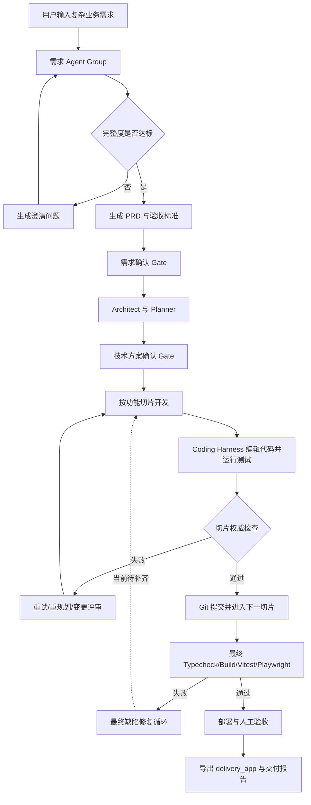

# OneCompany Level 03 考试提交说明

> 题目：复杂需求到可验证工程项目的多智能体交付系统  
> 项目名称：OneCompany  
> 当前分支：`codex/webui-tui-replica`  
> 评估日期：2026-06-14  
> 当前严格估分：70 / 100  
> 当前结论：能力框架基本具备，但尚未满足 Level 03 硬性通过条件

## 1. 项目摘要

OneCompany 是一个本地优先、多智能体协同的软件交付平台。用户输入业务需求后，系统通过需求 Agent Group 完成需求规范化、完整度评分、澄清问题、PRD 和验收标准；再通过开发 Agent Group 完成架构设计、功能切片、编码、审查、测试、部署和交付。

系统使用 LangGraph 管理工作流和恢复点，使用 SQLite 保存项目、Agent、事件、Gate、工具调用和测试状态，使用 Coding Harness 执行真实文件编辑与命令，并通过 TUI2/WebUI 展示实时进度。

当前已经完成：

- 12 个注册 Agent，覆盖需求、架构、规划、编码、审查、QA、交付和统一调度；
- 项目级持久化状态机、人工 Gate、暂停恢复、变更评审和事件审计；
- 工作区读取、文件编辑、Shell、Git、测试、构建、预览、报告等工具链；
- CodeGraph、Context7 两个项目 MCP 配置，以及 Integration Gateway；
- 动态生成多个不同业务应用，已有 4 个项目进入 `Delivered`；
- 平台全量测试 443 条通过、6 条跳过；
- AI 面试助手样例独立通过 typecheck、47 条 Vitest 测试和 build；
- Dockerfile、Compose、RUN 文档和提交包导出能力。

当前尚未完成：

- Level 03 统一测试输入对应的 AI 销售线索管理应用；
- 符合题目命名要求的根目录 `delivery_app`；
- 销售/销售主管的真实鉴权、数据隔离和持久化验收；
- 最终集成失败后自动回到修复循环的完整闭环；
- 两个 MCP 服务在标准样例中的有效调用证据；
- 清理后的最终 Level 03 提交压缩包。

## 2. 当前完成度与正式结论

| 维度 | 当前状态 | 说明 |
| --- | --- | --- |
| 多 Agent 架构 | 已完成 | 5 个需求 Agent、6 个开发 Agent、1 个 Taizi 调度 Agent |
| 工具能力 | 已完成 | 标准项目中已记录 9 类工具调用 |
| MCP 配置 | 部分完成 | CodeGraph、Context7 已启用，但标准样例缺少有效调用证据 |
| 代码生成 | 已完成 | 已生成面试、日历、五子棋、台球等不同应用 |
| 测试体系 | 已完成 | 平台测试和至少一个生成应用验证通过 |
| 失败修复闭环 | 部分完成 | 切片重试有效；最终集成失败后无法自动恢复开发 |
| 数据持久化 | 未完成 | 当前可交付样例业务数据使用进程内 `Map` |
| 角色权限 | 未完成 | 存在角色字段和管理页面，但没有真实登录与授权校验 |
| `delivery_app` | 未完成 | 当前导出目录为 `generated_app` |
| 销售线索应用 | 未完成 | 尚未按统一测试输入生成并完成验收 |
| 部署材料 | 部分完成 | Docker/Compose/RUN 已生成，最终提交包仍需清理和改名 |

因此，OneCompany 当前已经证明“通用多智能体交付平台”能力，但尚未证明 Level 03 指定的完整销售线索业务验收路径。正式提交前必须补齐硬性项。

## 3. 用户看到的完整业务闭环



TUI2 和 WebUI 均可查看项目状态、Agent、信息流、Artifacts、Files、测试结果和 Gate。用户自由输入统一进入 Taizi，由 Taizi根据当前状态执行动作路由或只读调研。

## 4. Agent 架构与职责

### 4.1 需求 Agent Group

| Agent | 职责 | 主要输出 |
| --- | --- | --- |
| Intake | 规范化原始需求 | 需求摘要、目标用户、应用类型 |
| Requirement Analyst | 提取功能、流程、数据和角色 | 结构化需求模型 |
| Completeness Scorer | 评分并识别关键缺口 | 完整度和缺口列表 |
| Question Planner | 规划业务澄清问题 | 问题轮次和建议答案 |
| PRD & Acceptance | 固化业务基线 | PRD、验收标准、假设和风险 |

### 4.2 开发 Agent Group

| Agent | 职责 | 主要输出 |
| --- | --- | --- |
| Architect | 设计可执行技术方案 | 架构、模块、数据模型、测试策略 |
| Planner | 拆分可验证功能切片 | Slice Queue、测试命令、验收检查 |
| Coding | 实现功能和测试 | 源码、测试、配置、Diff |
| Review | 审查正确性和一致性 | Findings、通过或退回结论 |
| QA | 执行项目级验证 | Typecheck、Build、Vitest、预览证据 |
| DevOps & Delivery | 生成交付材料 | Docker、RUN、报告、导出包 |

### 4.3 Taizi 调度 Agent

Taizi 是所有自由文本的统一入口，支持继续、暂停、停止、需求补充、Gate 决策、变更请求、启动测试、导出和状态查询。信息类问题会先调用只读工具获取项目事实，再生成回答；动作类输入由 dispatcher 转成工作流操作。

当前已知缺陷：当切片循环已标记为 `completed`、但最终集成测试失败时，“修复错误，然后重跑集成测试”仍会路由到 `development.start`，导致 `Cannot resume development from phase: completed`。该问题列为 Level 03 P0 修复项。

## 5. 工具、MCP 与调用证据

### 5.1 已进入实际流程的工具

以项目 `0943a339-5b24-47dc-b756-46da5d7dd173` 为例，数据库已记录以下 9 类工具调用：

| 工具 | 调用次数 | 用途 |
| --- | ---: | --- |
| `workspace-read@1.0.0` | 59 | 读取生成项目源码和目录 |
| `shell` | 13 | 执行测试、类型检查和开发命令 |
| `list-recent-events@1.0.0` | 13 | 调研最近工作流事件 |
| `project-overview@1.0.0` | 5 | 获取项目状态和事件概览 |
| `list-project-gates@1.0.0` | 5 | 查询 Gate 和历史决策 |
| `read-dev-session@1.0.0` | 4 | 查询切片、测试和风险 |
| `read-artifact@1.0.0` | 3 | 读取 PRD/验收标准 |
| `read-requirement-session@1.0.0` | 2 | 查询需求完整度与问题轮次 |
| `requirement-context@1.0.0` | 1 | 向需求 Agent 提供最新上下文 |

文件编辑、Git、Vitest、Typecheck、Build、Playwright 和报告导出也已实现于 Harness、Workspace、Workflow 和 Integration 模块中。

### 5.2 MCP 与 Integration Gateway

当前项目已启用：

- CodeGraph：本地代码图谱和仓库分析；
- Context7：库文档查询；
- `oc-gateway-mcp`：基于官方 MCP SDK 的项目集成网关；
- Playwright、GitHub、Figma、Supabase、Vercel 等 Integration 定义和受治理适配器。

> [PLACEHOLDER: L3-MCP-EVIDENCE] 在最终销售线索标准样例中实际调用至少两个 MCP/等价服务，并保留输入、输出、后续使用结果和 `integration_tool_calls` 记录。

## 6. 代码生成、执行与失败恢复

OneCompany 为每个项目创建独立工作区和 Git 仓库。Planner 为每个切片生成测试命令，Coding Harness 读取和编辑真实文件，OneCompany 再独立执行权威测试。只有测试通过的切片才能提交并进入下一步。

已经验证的能力：

- Slice 失败后按预算自动重试；
- 测试通过但类型检查失败时仍判定失败；
- 切片通过后生成 Git 提交；
- 全部切片后执行最终 Typecheck、Build、Vitest 和 Playwright；
- 测试失败、Review 拒绝、危险操作和部署操作进入相应 Gate；
- 用户可通过 Change Review 更新计划或重新打开受影响切片。

当前缺口：

> [PLACEHOLDER: L3-FINAL-REPAIR] 增加最终集成失败专用修复状态。失败后创建修复切片或重开受影响切片，允许 Coding/Review/QA 修复并重新执行完整测试，直至通过或用户终止。

## 7. 测试与自我评审证据

### 7.1 平台测试

在仓库根目录运行：

```bash
pnpm test
```

当前结果：12 个 Turborepo 任务成功；主要包共 443 条测试通过、6 条测试跳过。覆盖 Agent 注册、工具治理、Gate、状态机、工作区边界、日志脱敏、切片重试、最终测试、部署和导出报告。

### 7.2 已交付样例验证

AI 面试助手项目 `867d975f-95e3-4f61-8a5e-545b254eb81f` 已独立执行：

```bash
pnpm verify
```

结果为 TypeScript typecheck 通过、3 个测试文件和 47 条 Vitest 测试通过、build 通过。项目还保存了截图、独立验证记录、Dockerfile、Compose 和 RUN 文档。

### 7.3 当前失败证据

项目 `0943a339-5b24-47dc-b756-46da5d7dd173` 的 4 个切片均通过，但最终 `typecheck` 失败。重新安装依赖后可复现 4 个 `TS6059`：`tsconfig.json` 同时配置 `rootDir: src` 和 `include: [src, tests]`。

这证明平台能够保存真实失败结果，但也暴露最终失败修复闭环尚未完成。

## 8. Level 03 统一销售线索样例

统一输入：

> 设计并实现一个 AI 销售线索管理助手。销售人员可以导入客户线索，系统自动判断客户意向等级，生成跟进建议，记录跟进历史。普通销售只能查看自己的客户，销售主管可以查看团队客户数据。系统需要支持客户列表、线索评分、跟进记录、权限控制和数据统计。

目标验收路径：

1. 销售身份登录或切换身份；
2. 导入或新增客户线索；
3. 根据行业、规模、预算和需求描述生成评分；
4. 展示意向等级、判断依据和下一步跟进建议；
5. 添加跟进记录并更新详情、列表和统计；
6. 切换销售主管查看团队线索和统计；
7. 验证普通销售无法访问其他销售数据；
8. 刷新页面后数据仍然存在；
9. 执行自动化测试和 Docker 启动验证。

> [PLACEHOLDER: L3-SALES-APP] 尚未生成并完成以上路径。正式提交前必须使用 OneCompany 自身工作流生成，不得预先手写固定应用后包装。

## 9. 权限、数据与边界处理

平台本身使用 SQLite 持久化项目状态、Agent 运行、工具调用、Gate、事件、测试和部署数据，并对工作区路径、危险命令、秘密值和外部工具调用进行治理。

但当前已交付 AI 面试助手的业务数据使用进程内 `Map`，刷新后会丢失；`HR/Admin` 仅存在于数据模型，管理页面始终可见，没有登录态和授权校验。因此不能作为 Level 03 的角色权限与业务数据持久化证据。

> [PLACEHOLDER: L3-DATA] 销售线索应用使用 LocalStorage、JSON、SQLite 或数据库持久化客户、评分、建议和跟进记录。

> [PLACEHOLDER: L3-RBAC] 提供销售和销售主管测试账号或明确身份切换器；所有列表、详情、统计和写操作在数据访问层执行授权校验，并包含越权测试。

> [PLACEHOLDER: L3-BOUNDARY] 覆盖空列表、必填字段、无权限、无效评分输入、重复导入和不存在客户等异常状态。

## 10. 部署、导出与交付材料

OneCompany 可以为生成项目补齐：

- `Dockerfile`；
- `docker-compose.yml`；
- `RUN.md`；
- 本地预览脚本；
- PRD、验收标准和技术方案；
- 工具调用日志、文件清单和测试用例；
- Delivery Report 和独立验证记录。

当前导出器将应用写入 `submission-package/generated_app`。Level 03 明确要求 `delivery_app`，因此当前命名不满足硬性条件；过滤规则也尚未排除 `.pytest_cache`、`__pycache__` 和 `test-results` 等中间产物。

> [PLACEHOLDER: L3-EXPORT] 将导出目录改为 `delivery_app`，同步更新 README、返回字段、测试和 UI 文案。

> [PLACEHOLDER: L3-PACKAGE-CLEAN] 清理缓存、测试临时结果、构建产物、本地数据库、密钥和无关生成文件，并在全新目录执行安装、测试、构建和 Docker 验证。

## 11. 运行方式

环境要求：Node.js 22+、pnpm 9+、Git、MimoCode/OpenCode CLI、至少一个兼容 OpenAI 协议的模型服务。Docker 用于沙箱和容器化验收。

```bash
pnpm install
pnpm migrate
```

启动 API：

```bash
pnpm api
```

启动 TUI2：

```bash
pnpm tui2
```

启动 WebUI：

```bash
pnpm webui
```

运行平台测试：

```bash
pnpm test
```

> [PLACEHOLDER: L3-RUN-ACCOUNT] 最终销售线索应用需要在 `delivery_app/README.md` 和 `delivery_app/RUN.md` 中提供测试账号、身份切换方式、初始化数据和完整验收命令。

## 12. Level 03 验收用例

| 编号 | 验收场景 | 当前状态 | 预期证据 |
| --- | --- | --- | --- |
| L3-01 | 输入统一销售线索需求 | 待完成 | 项目、需求会话和 PRD |
| L3-02 | 至少 4 个 Agent 协作 | 已完成 | Agent Run、PAOR 和事件日志 |
| L3-03 | 至少 8 个工具有效调用 | 已完成 | `tool_calls` 和事件记录 |
| L3-04 | 至少 2 个 MCP 有效调用 | 部分完成 | MCP 输入输出和后续使用记录 |
| L3-05 | 自动生成 `delivery_app` | 待完成 | 独立源码目录和文件清单 |
| L3-06 | 销售新增客户线索 | 待完成 | UI、数据记录和测试 |
| L3-07 | 自动评分与建议 | 待完成 | 评分依据、建议和测试 |
| L3-08 | 跟进记录更新状态 | 待完成 | 列表、详情、统计同步变化 |
| L3-09 | 销售/主管权限隔离 | 待完成 | 两种身份和越权测试 |
| L3-10 | 数据刷新后保留 | 待完成 | 持久化实现和重载测试 |
| L3-11 | 最终测试失败后自动修复 | 待完成 | 失败、修复、复测日志 |
| L3-12 | 独立安装与测试 | 部分完成 | 已有面试样例通过，销售样例待验证 |
| L3-13 | Docker/Compose 启动 | 部分完成 | 生成机制已有，最终样例待验证 |
| L3-14 | 完整交付报告 | 部分完成 | 本文已建立，最终证据待补齐 |

## 13. 当前严格估分

| 评分项 | 满分 | 当前得分 | 主要依据 |
| --- | ---: | ---: | --- |
| 交付工程功能完成度 | 18 | 8 | 有多个生成应用，但没有销售线索统一样例 |
| 多 Agent 架构 | 18 | 18 | 12 个 Agent，职责、Schema、日志和状态清楚 |
| Tools 与 MCP 集成 | 17 | 14 | 9 类工具有调用；2 个 MCP 已配置但调用证据不足 |
| 代码生成与执行闭环 | 15 | 9 | 切片循环有效，最终集成失败无法自动恢复 |
| 测试与自我评审 | 14 | 12 | 平台和样例测试充分，但权限/销售路径未覆盖 |
| 权限、数据与边界处理 | 8 | 2 | 平台边界较强，生成业务应用缺持久化和真实授权 |
| 部署与交付材料 | 6 | 4 | Docker/RUN/报告已有，命名和清理不符合最终要求 |
| 运行完整性与扩展性 | 4 | 3 | 已生成多类应用，但标准路径仍有断点 |
| **合计** | **100** | **70** | **低于 75 分，且存在硬性条件缺失** |

## 14. 硬性通过条件清单

| 硬性条件 | 状态 | 说明 |
| --- | --- | --- |
| 总分不低于 75 | 未满足 | 当前严格估分 70 |
| 必须有 `delivery_app` | 未满足 | 当前导出为 `generated_app` |
| 至少 4 个 Agent | 已满足 | 当前 12 个 |
| 至少 8 个工具能力 | 已满足 | 标准项目记录 9 类调用 |
| 至少 2 个 MCP/等价服务 | 部分满足 | 配置存在，有效调用证据待补 |
| 必须包含数据存储 | 未满足 | 标准业务交付应用未完成持久化 |
| 必须体现角色/权限差异 | 未满足 | 尚无真实销售/主管授权 |
| 必须有测试/验证脚本 | 已满足 | 平台和生成样例均有测试 |
| 必须有自检/评审阶段 | 已满足 | Review、QA、报告和风险记录已实现 |
| Docker/Compose/一键启动 | 已满足机制 | 最终销售应用仍需验证 |
| 完整交付报告 | 部分满足 | 本文为当前进度版，最终版待补证据 |

## 15. 目标提交结构

```text
OneCompany/
├── apps/                         # API、TUI2、WebUI
├── packages/                     # Agent、Workflow、Workspace、Integration、Shared
├── delivery_app/                 # [PLACEHOLDER] 销售线索管理助手
│   ├── src/
│   ├── tests/
│   ├── e2e/
│   ├── prisma/ 或 data/
│   ├── Dockerfile
│   ├── docker-compose.yml
│   ├── README.md
│   └── RUN.md
├── artifacts/
│   ├── requirement.json
│   ├── plan.json
│   ├── test-cases.json
│   ├── delivery-report.md
│   ├── independent-verification.md
│   └── screenshots/
├── logs/
│   ├── tool-call-log.json
│   └── integration-tool-call-log.json
├── docs/
│   ├── level03_exam_guide.md
│   ├── level03_exam_guide_interactive.html
│   └── week3-level3-submission.md
├── README.md
├── Dockerfile
└── docker-compose.yml
```

## 16. 提交前修复优先级

### P0：决定是否通过

1. 导出目录统一改为 `delivery_app`；
2. 使用统一需求生成销售线索应用；
3. 实现持久化销售数据和销售/主管真实权限；
4. 修复最终集成失败后的自动修复循环；
5. 跑通销售线索全部验收路径并保存证据。

### P1：决定能否达到 85 分以上

1. 在标准样例中实际调用两个 MCP/等价服务；
2. 增加权限、异常、刷新持久化和越权 E2E；
3. 清理提交包中缓存、构建和测试临时产物；
4. 保证 PRD、技术方案、实际技术栈和交付报告一致；
5. 在全新目录和 Docker 中重复安装、测试、构建和启动。

### P2：展示质量

1. 为 WebUI/TUI2 提供清晰的 Level 03 演示入口；
2. 将工具调用默认折叠，突出用户消息、Agent 结论和业务状态；
3. 为最终交付生成可打印评分摘要、截图索引和演示脚本。

## 17. 总结

OneCompany 已经具备 Level 03 所需的大部分平台能力：多 Agent 编排、真实工具执行、代码生成、切片测试、人工 Gate、日志审计、部署材料和多类型应用生成均有实现与测试证据。

当前问题不是缺少系统框架，而是尚未把框架收敛成符合考试硬性目录和统一业务路径的最终交付。正式提交的关键是补齐 `delivery_app`、销售线索业务、持久化、角色权限和最终失败修复闭环，并对交付包进行一次干净、独立、可复现的验收。
