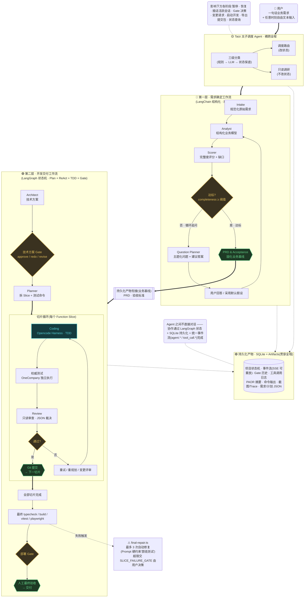

# 双层工作流流程图 · 中间格式(Mermaid)

> **用途**:这是 `apps/webui/public/about.html` 里"双层工作流"流程图的**可编辑中间格式**。
> 你在 Mermaid 上调整布局 / 节点 / 连接 / 文字,改完告诉我,我按新版本重写 about.html 的 HTML(CSS 样式保留)。

## 怎么预览和编辑

- **在线**(推荐):复制下面代码块的全部内容 → 粘贴到 <https://mermaid.live> → 实时预览 + 直接编辑
- **VSCode**:装 "Markdown Preview Mermaid Support" 插件,直接预览这个 .md 文件
- **Typora / Obsidian**:原生支持 mermaid 代码块预览

## 怎么改(语法速查)

| 你想做的 | Mermaid 语法 |
|---|---|
| 箭头 A→B | `A --> B` |
| 带标签箭头 | `A -- "否" --> B` 或 `A -->\|否\| B` |
| 虚线箭头(关联/贯穿) | `A -.-> B` |
| 粗箭头(主流) | `A ==> B` |
| 方形节点(普通步骤) | `X["标题"]` |
| 菱形节点(Gate/判断) | `X{"达标?"}` |
| 圆形节点(起止) | `X("用户")` |
| 六边形 / 产物 | `X{{"PRD"}}` |
| 圆柱 / 数据库 | `X[("SQLite")]` |
| 分组 | `subgraph 组名["组标题"] ... end` |
| 分组内方向 | `direction LR`(横向)/ `direction TB`(纵向) |

**改完把整个代码块贴回给我,或在这个文件里改好告诉我**,我按新布局重写 about.html 的 HTML 结构(CSS 样式 / 颜色保留当前的实现)。

---

## 当前流程图(原样翻译)



---

## 当前布局的 7 个组成部分(对应 HTML 结构)

| # | 部分 | Mermaid subgraph / 节点 | HTML 里的位置 |
|---|---|---|---|
| ① | 用户入口 | `User` | `.fd-entry` |
| ② | Taizi 横跨全程 | `subgraph TAIZI` | `.fd-band.fd-taizi` |
| ③ | 第一层 · 需求确定 | `subgraph REQ` | `.fd-layer.fd-req` |
| ④ | 持久化桥接 | `Bridge` | `.fd-bridge` |
| ⑤ | 第二层 · 开发交付 | `subgraph DEV`(内含 `subgraph SLICE`) | `.fd-layer.fd-dev` + `.fd-slice-loop` |
| ⑥ | final-repair 警告 | `FR` | `.fd-note-warn` |
| ⑦ | 持久化产物 贯穿全程 | `subgraph STORE` | `.fd-band.fd-storage` |

## 你可以怎么调整(举例)

- **觉得切片循环太挤**:把 `subgraph SLICE` 拆成更清晰的纵向,或把 `Retry` 分支单独拉出来
- **想让 Taizi 更突出**:把它放到流程图正中间,用箭头辐射到各阶段
- **想合并 / 拆分节点**:直接改节点文字 / 增删节点
- **想改箭头方向或回流**:改 `-->` 的目标

改完把整个 ```mermaid 代码块贴给我(或在文件里改好告诉我),我按新布局重写 about.html 的 HTML(保留当前的深/浅色双主题 + 颜色 + 字号样式)。
