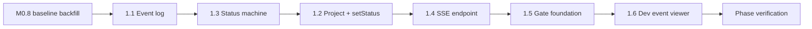

# M1 Implementation Plan — Event Log + SSE + Status Machine + Gate Foundation

Status: ready to execute
Branch: `feat/m1-event-backbone` (branch from `feat/m0-foundations` after merge, or continue on a child branch)
Source: `spec.md` v0.3.2 §3.1, §6, §8, §8.1, §8.2, §10.3; `handbook/phase-01-event-log-sse-status.md`; `dev-plan.md` (TDD Operating Model)
Estimated effort: 3–5 days (one engineer)
Depends on: M0 complete + **M0 Task 0.8 baseline backfill** green

## 1. Goal

Build the platform backbone every later phase uses:

- Append-only **event log** with monotonic per-project `seq`
- **Status machine** as the only legal path to change `projects.status`
- **SSE stream** for UI replay + live push
- **Gate foundation**: create / wait / resolve / API, with events

No LangGraph, no gate UI cards (M4), no requirement workflow (M3).

## 2. TDD Rules for M1

Per handbook **13 Golden Rules** #3 and dev-plan **Platform TDD loop**:

1. **Red first** for every behavior-changing task (1.1–1.5). Task 1.6 (throwaway viewer) may use manual verify only.
2. Test scope stays **small**: unit for pure logic, integration for DB/API/SSE boundaries.
3. Assert **side effects**: DB rows, event envelopes, `seq` order, gate status, rejected illegal transitions.
4. Do not delete failing tests. Do not fake green results.
5. Run `pnpm -w test` after each task; never leave the tree red.

### M1 test matrix (write these before implementation)

| Area | Test file (proposed) | What to prove |
| --- | --- | --- |
| Status machine | `packages/shared/src/status/machine.test.ts` | Allowed/rejected transitions; terminal states; `Paused` enter/resume; cross-cutting `Failed` |
| Event log | `packages/shared/src/events/log.test.ts` | `emit()` assigns seq 1,2,3…; transactional uniqueness; envelope shape validated |
| Project + status | `apps/api/src/projects/projects.test.ts` | `POST /projects` creates row + `project.created`; `setStatus` writes history + `project.status_changed`; illegal move throws |
| SSE replay | `apps/api/src/events/sse.test.ts` | `afterSeq` ordering; live event delivery after connect |
| Gate lifecycle | `apps/api/src/gates/gates.test.ts` | open row + `human_gate.created`; resolve API + `human_gate.resolved`; `waitForGate` unblocks |

## 3. Prerequisites

| Check | Command / criterion |
| --- | --- |
| M0 DoD | `pnpm -w build`, `pnpm migrate`, `pnpm -w typecheck` |
| M0 baseline (Task 0.8) | `pnpm -w test` includes migration table count, schema parse/fail, import smoke |
| DB tables exist | `events`, `projects`, `project_status_history`, `human_gates` |
| Shared exports | `EventEnvelope`, `AgentEvent`, `ProjectStatus`, `STATUS_TRANSITIONS` |

If Task 0.8 is not done, complete it **before** Task 1.1. Do not rebuild M0 scaffolding.

## 4. Target Module Layout (end state)

```text
packages/shared/src/
  events/
    log.ts              # emit(), listEvents(), getNextSeq() — DB-backed
    log.test.ts
  status/
    machine.ts          # canTransition(), assertTransition(), isTerminal(), isActive()
    machine.test.ts
  gates/
    types.ts            # GateStatus, create/resolve input schemas (optional M1)
  index.ts              # re-export public API

apps/api/src/
  db.ts                 # shared Drizzle client for API
  projects/
    routes.ts           # POST /projects, GET /projects/:id
    service.ts          # createProject(), setStatus()
    projects.test.ts
  events/
    routes.ts           # GET /projects/:id/events/stream
    sse.ts              # replay + live broadcaster
    sse.test.ts
  gates/
    routes.ts           # POST /gates/:id/resolve
    service.ts          # createGate(), resolveGate(), waitForGate()
    gates.test.ts
  index.ts              # mount routes

apps/web/src/app/
  dev/events/page.tsx   # throwaway SSE JSON viewer (Task 1.6)
```

## 5. Execution Order



Note: **1.3 before 1.2** is intentional — `setStatus` depends on the machine module. Handbook lists 1.2 before 1.3 but 1.3's tests can be written first; implement machine before wiring `setStatus`.

---

### Task 1.1 — Event log writer

**Red**: `packages/shared/src/events/log.test.ts` — emit 3 events, assert `seq` 1/2/3 and monotonic `eventId`/timestamp fields; second concurrent emit cannot duplicate seq (use transaction test or sequential asserts).

**Green**: `packages/shared/src/events/log.ts`

```ts
async function emit(input: {
  projectId: string;
  payload: AgentEvent;
  runId?: string;
  agentId?: string;
  correlationId?: string;
}): Promise<EventEnvelope>;
```

Rules:
- Transaction: `SELECT MAX(seq)` → insert with `seq + 1`
- `eventId` = uuid, `schemaVersion` = `"1"`, `timestamp` = ISO now
- Validate payload with `AgentEventSchema` before insert
- Persist full envelope fields + `type` discriminator + JSON `payload`
- **Append-only**: no update/delete on `events`

Also export:
- `listEvents(projectId, { afterSeq?: number })` for SSE replay

**Verify**: `pnpm --filter @oc/shared test` — log tests pass.

---

### Task 1.3 — Status machine (before setStatus)

**Red**: `packages/shared/src/status/machine.test.ts`

Minimum cases:
- `Developing → Testing` allowed
- `Developing → Delivered` rejected
- `Delivered → *` rejected (terminal)
- `Failed → *` rejected (terminal)
- `Developing → Paused → Developing` (resume prior)
- Any active → `Failed` allowed
- Any active → `Paused` allowed
- `Paused` cannot go directly to unrelated state without resume semantics

**Green**: `packages/shared/src/status/machine.ts`

```ts
function canTransition(from: ProjectStatus, to: ProjectStatus, ctx?: { pausedFrom?: ProjectStatus }): boolean;
function assertTransition(from: ProjectStatus, to: ProjectStatus, ctx?: ...): void;
function isTerminal(status: ProjectStatus): boolean;
function isActive(status: ProjectStatus): boolean;
```

Implementation notes:
- Base rules from `STATUS_TRANSITIONS` (M0)
- Cross-cutting §3.1: active → `Paused`, active → `Failed`
- `Paused` resume: store `pausedFrom` on project or in memory for M1 (durable column optional — can use `project_status_history` last non-paused state)
- Export from `@oc/shared`

**Verify**: `pnpm --filter @oc/shared test` — machine tests pass.

---

### Task 1.2 — Project create + setStatus

**Red**: `apps/api/src/projects/projects.test.ts` (use in-memory or temp sqlite; reuse `createDb()` + migrate in `beforeEach`)

Cases:
- `POST /projects { name }` → 201, status `Draft Requirement`, one `project.created` event
- Legal `setStatus` → updates `projects`, inserts `project_status_history`, emits `project.status_changed`
- Illegal transition → 4xx/throws, status unchanged, no new history row

**Green**:
- `POST /projects` — generate `id`, `slug`, timestamps
- `setStatus(projectId, nextStatus, trigger)` — only path to change status
- Wire `assertTransition` before DB write

API routes (minimum):
- `POST /projects`
- `GET /projects/:id` (helps debugging / viewer)
- Internal/exported `setStatus` for later workflows

**Verify**: project integration tests pass.

---

### Task 1.4 — SSE endpoint

**Red**: `apps/api/src/events/sse.test.ts`

Cases:
- Given events seq 1–3, `GET .../stream?afterSeq=0` yields all three in order
- `afterSeq=2` yields only event 3
- After stream open, newly emitted event arrives on live connection

**Green**: `GET /projects/:id/events/stream`

- `Content-Type: text/event-stream`
- Replay phase: `listEvents(projectId, { afterSeq })`
- Live phase: in-process broadcaster/subscriber (EventEmitter or Hono streaming helper)
- Each message: `data: ${JSON.stringify(EventEnvelope)}\n\n`
- Heartbeat comment optional (`: ping\n\n`) every 15s

**Verify**: SSE tests pass (may use `fetch` + read stream in vitest).

---

### Task 1.5 — Gate foundation

**Red**: `apps/api/src/gates/gates.test.ts`

Cases:
- `createGate` → `human_gates.status = open`, `human_gate.created` emitted
- `resolveGate` → `resolved`, `human_gate.resolved` emitted
- `waitForGate` blocks until resolve (poll OK for M1)
- `POST /gates/:id/resolve { decision }` end-to-end

**Green**:
- `createGate(projectId, gateType, options[])`
- `resolveGate(gateId, decision)`
- `waitForGate(gateId, { pollMs?, timeoutMs? })`
- `POST /gates/:id/resolve`

No per-gate action policy yet (M4). Any decision string accepted in M1.

**Verify**: gate tests pass.

---

### Task 1.6 — Throwaway event viewer

**Scope**: dev-only page, no TDD required beyond manual check.

- `apps/web/src/app/dev/events/page.tsx`
- Query param or input: `projectId`
- `EventSource` → `/projects/:id/events/stream?afterSeq=0`
- Render each envelope as `<pre>` JSON list, append-only UI

**Verify**: create project via API, open page, see `project.created` live.

---

## 6. Phase Verification

```bash
pnpm -w typecheck
pnpm -w test          # M0 baseline + M1 unit/integration tests
pnpm --filter @oc/api dev &
curl -s -X POST localhost:3001/projects -H 'Content-Type: application/json' -d '{"name":"Demo"}'
# open SSE stream, confirm project.created
# illegal setStatus via test or curl → rejected
# create + resolve gate → two gate events
pnpm --filter @oc/web dev
# open /dev/events?projectId=...
```

## 7. Definition of Done

Mirror `phase-01-event-log-sse-status.md`:

- [ ] `emit()` writes enveloped events with correct per-project `seq`
- [ ] `POST /projects` creates project + `project.created`
- [ ] `setStatus` rejects illegal transitions; records history + `project.status_changed`
- [ ] Status machine unit tests pass (`Paused`, `Failed`, terminal)
- [ ] SSE replays `afterSeq` then streams live
- [ ] Gate create / wait / resolve via API + both gate events
- [ ] Dev event viewer shows live events
- [ ] **All M1 tests were written red-first and pass green**

## 8. Out of Scope

- LangGraph workflows (M2)
- Gate card UI + per-gate policy (M4)
- Human gate types registry beyond string `gateType` (M4)
- Event projection / Stream Mode renderer (M9)
- Secret redaction pipeline (M5) — but do not log secrets in test fixtures
- `packages/integrations`, opencode, CodingHarness

## 9. Risks & Decisions

| Topic | Decision |
| --- | --- |
| `emit` location | `packages/shared` — reusable from M2 workflows without importing `apps/api` |
| SSE live fan-out | In-process pub/sub in `apps/api` for M1; Redis later if needed |
| `waitForGate` | DB polling acceptable for M1 (100–250ms interval) |
| `Paused` resume state | Store `paused_from_status` on `projects` or derive from `project_status_history` |
| Test DB | Temp file sqlite per test suite; run `drizzle-kit push` in setup |
| API test runner | Vitest + `app.request()` (Hono) for HTTP contract tests |

## 10. Suggested PR Checklist

1. `pnpm -w test` green (include test file list in PR description)
2. Paste sample `EventEnvelope` from first `project.created`
3. Screen recording or notes: `/dev/events` receiving live SSE
4. Show illegal transition test failure → fix → pass git history (or describe in PR)
5. Confirm no direct `projects.status` writes outside `setStatus`

## 11. What M2 / M4 Need From M1

| Artifact | Consumer |
| --- | --- |
| `emit()` | All agents, workflows, gates |
| `setStatus` + machine | LangGraph nodes (M2), requirement/dev graphs |
| SSE `/events/stream` | M9 stream renderer, M1 viewer |
| Gate create/wait/resolve | M3 stuck gate, M4 UI, M6 slice failure |
| M1 test patterns | Template for registry/harness tests in M2 |

---

*Start with Task 0.8 backfill if needed, then branch `feat/m1-event-backbone` and execute Tasks 1.1 → 1.3 → 1.2 → 1.4 → 1.5 → 1.6.*
