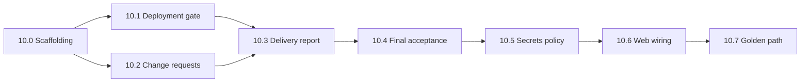

# M10 Implementation Plan — Deployment, Delivery, Change Requests（部署交付与变更请求）

Status: planned
Branch: `feat/m10-deployment-delivery`（从 `feat/m9.5-real-engine` 或 `main` 切出）
Source: `spec.md` v0.3.3 §3.1、§5.4、§5.5、§6、§12、§16、§17；`handbook/phase-10-deployment-delivery.md`；`dev-plan.md` M10
Estimated effort: 10–14 days（一名工程师）
Depends on: M4 complete（gate UI + policy）；M5 complete（git、shell、`createAuthorize`、`high_deploy` 分级）；M6 complete（Change Review skip-slice 骨架）；M7 complete（Testing → `Deploying` / `Awaiting Acceptance` 路由）；M8 complete（Report tab）；M9.5 complete（真实引擎默认路径）

## 1. Goal

闭合 MVP **交付闭环**：测试通过后可选部署、生成完整交付报告、处理开发中变更请求，最终经人工验收进入 `Delivered`。

M0–M9.5 已打通「需求 → 开发 → 测试 → 预览」；M10 补上最后三段：

| 区域 | 交付物 |
| --- | --- |
| Deployment workflow | `Deploying` 状态自动拉起 `deployment` gate；批准后才写入 URL；→ `Awaiting Acceptance` |
| Change requests | 用户中途改需求 + skip-slice 两条路径均走 `Change Review`；更新 PRD/验收标准；禁止静默豁免 |
| Delivery report | 按 spec §17 全章节生成 `artifacts/delivery-report.md`；风险含 force-continue / skip-slice / skip-risk |
| Final acceptance | `Awaiting Acceptance` 拉起 `final_acceptance` gate；`accept` → `Delivered`；`reject_and_redo` → `Developing` |
| Secrets policy | 缺第三方 key → mock data + 明确提示；密钥永不进日志/报告/流 |

**M10 不做**（明确边界）：

- M11 §18 全量验收清单走查、Figma UI 回归、M9 stream §14.3.1 打磨
- Cloudflare Tunnel **token 自动化**（MVP 仅用户手动提供/运行 tunnel + 提交 URL）
- Vercel / Pages / Workers 等远程部署集成（M12 Integration Gateway）
- `requirement_confirm` gate 接入（可留 M11；非 M10 阻塞项，但可在 10.2 一并评估）
- 删除 stub/fixture 路径（M9.5 已降级为 test-only）

## 2. 问题陈述（当前缺口）

### 2.1 部署链路断裂

```text
Testing passed + requestDeploy=true
  → setStatus("Deploying")          ✅ packages/workflow/src/testing/engine.ts
  → raise deployment gate             ❌ 无
  → store deployments row           ❌ 表存在但无 insert
  → DevState.deploymentUrl            ❌ 无写入
  → Awaiting Acceptance               ❌ 卡在 Deploying
```

- `apps/api/src/gates/resume.ts` 仅处理 `requirement_stuck` + development gate types；**无** `deployment` / `final_acceptance`
- Top nav Deploy 按钮为占位：`title="Deploy in M10"`

### 2.2 变更请求仅覆盖 skip-slice

`packages/workflow/src/development/change-review.ts` 已实现：

- `createSkipChangeRequest` + `change_request.created/resolved` 事件
- `update_plan` / `revise_tech_plan` / `reject` 决策路由

**缺失**：

- Composer / API **无**「开发中提交需求变更」入口
- 无 impact analysis（PRD、验收标准、数据模型、测试、代码、受影响 commit）
- `change_requests` 表无 `kind` / `impact` 字段区分 skip vs requirement-change
- spec §5.4 要求的需求变更路径未实现

### 2.3 交付报告只读不写

- `packages/workflow/src/panel/report.ts` 的 `buildReportSnapshot` **读取** `artifacts/delivery-report.md`，但全库无生成逻辑
- `devops-delivery` agent 仍为 scripted：`"Delivery deferred to M10"`
- Report tab 显示 empty state：`"Delivery report — not generated yet"`

### 2.4 最终验收未接线

- `final_acceptance` gate 已在 registry + UI presentations 注册
- 进入 `Awaiting Acceptance` 后**不会**自动创建 gate
- 无法到达 `Delivered` 终态

### 2.5 Secrets / mock data 不完整

- M9.5 仅有 workflow LLM key 降级（`assertOpenAiConfigured`）
- spec §12：生成应用若缺第三方 API key，agent 应生成 mock data 并提示用户；交付链路需验证 redaction 覆盖报告

## 3. 编排边界（不得破坏）

```text
LangGraph / workflow（@oc/workflow）     → 状态迁移、gate 节点、delivery 阶段编排
runAgent（@oc/agent-core）               → DevOps Delivery agent 生成 §17 报告内容
createAuthorize（@oc/workspace）          → tunnel/deploy 命令 high_deploy 分级
GateService（apps/api）                  → 唯一 gate 创建/resolve 入口；resume handler 分发
Event log                                → deployment.* / change_request.* / artifact.created
UI projection                            → 只读事件投影；不直接写 DB
```

**硬规则**：

- **禁止**在 gate 批准前暴露 `deploymentUrl`（API、SSE、Report tab、console snapshot 均不得提前泄露）
- tunnel / deploy 命令 **`high_deploy`**：走真实网络/机器，**不进** Docker sandbox（§12、M5）
- skip-slice / 需求变更：**禁止**静默删除必选验收项；必须新版本 PRD/acceptance 或保持 blocking
- 交付完成**只认**持久化产物：`deployments` 行、`delivery-report.md`、`gate` 决策、`Delivered` 状态 — 不信 agent 口头总结
- 所有 gate 决策必须进 event log，并汇入 delivery report risks 段

## 4. TDD Rules for M10

1. Task 10.1–10.7 **先写失败测试**，再实现行为。
2. **两层测试**：
   - 默认 CI：`pnpm -w test` 不依赖 Cloudflare、不启动真实 tunnel（stub URL 提交 + gate 流程测）
   - 集成：扩展 `golden-path.test.ts` 覆盖 `Testing → Deploying → Awaiting Acceptance → Delivered`（仍可用 stub engine）
3. 每个新 API route 至少有 **happy path + policy rejection** 测试。
4. 断言 **status 迁移**、**gate 创建/resolve**、**DB 行**、**artifact 文件存在**、**§17 section 完整性** — 不接受仅 HTTP 200。
5. 每步后 `pnpm -w test` + `pnpm -w typecheck` + `pnpm -w build` 保持绿。

### M10 test matrix

| Area | Test file（建议） | 证明什么 |
| --- | --- | --- |
| Deployment engine | `packages/workflow/src/deployment/engine.test.ts` | Deploying 时创建 gate；批准前无 URL；批准后写 deployments + `Awaiting Acceptance` |
| Deployment gate policy | `apps/api/src/gates/gates-policy.test.ts`（扩展） | deployment gate 不提供 `skip_risk_and_continue` |
| Deployment resume | `apps/api/src/gates/gates-resume-deploy.test.ts` | approve/reject/custom 正确恢复 workflow |
| Deployment API | `apps/api/src/deployment/deployment.test.ts` | start/confirm 路由；未批准不返回 url |
| Change request API | `apps/api/src/change-requests/change-requests.test.ts` | 开发中提交变更 → Change Review → 路由 |
| Requirement change impact | `packages/workflow/src/development/change-request-impact.test.ts` | queue-only → Developing；architecture → Tech Plan Review |
| Skip-slice regression | `packages/workflow/src/development/change-review.test.ts`（保留） | 现有 skip 路径不退化 |
| Report generator | `packages/workflow/src/delivery/report-generator.test.ts` | §17 每节存在；risks 含 gate 决策 |
| Report completeness | `packages/workflow/src/delivery/report-sections.test.ts` | schema 校验 section ids |
| Final acceptance | `packages/workflow/src/delivery/final-acceptance.test.ts` | accept → Delivered；reject → Developing |
| Secrets in report | `packages/workflow/src/delivery/report-redaction.test.ts` | 报告/日志无 key 明文 |
| Mock data degradation | `apps/api/src/config/degradation.test.ts`（扩展） | 缺第三方 key 时 mock + 用户可见提示 |
| Golden path M10 | `apps/api/src/integration/golden-path.test.ts`（扩展） | 完整交付路径（stub engine 可） |
| Web deploy UX | `apps/web/src/components/console/top-nav.test.tsx` | Deploy 按钮触发 API |
| Web change request | `apps/web/src/components/console/composer.test.tsx`（扩展） | 开发中可提交变更 |

## 5. Prerequisites

| 检查 | 标准 |
| --- | --- |
| M9.5 DoD | 默认真实引擎；golden-path 到 slice + preview 绿 |
| M7 DoD | `runTestingPhase` 可设 `Deploying` / `Awaiting Acceptance` |
| M4 DoD | `deployment` / `final_acceptance` gate 定义 + GateCard 渲染 |
| M5 DoD | `classifyCommand("cloudflared tunnel run")` → `high_deploy` |
| M8 DoD | Report tab 读 `buildReportSnapshot` |
| Schema | `deployments`、`change_requests` 表已存在（M0） |
| 分支 | 从 M9.5 合并后的主线切 `feat/m10-deployment-delivery` |

## 6. Target Module Layout

```text
packages/workflow/src/
  deployment/
    engine.ts                 # Deploying 阶段：gate → URL → Awaiting Acceptance
    engine.test.ts
    types.ts
  delivery/
    report-generator.ts       # §17 全章节 Markdown 生成
    report-generator.test.ts
    report-sections.ts        # section 定义 + 完整性校验
    final-acceptance.ts       # 进入 Awaiting Acceptance 时拉 final_acceptance gate
    final-acceptance.test.ts
  development/
    change-review.ts          # 扩展：requirement-change 路径
    change-request-impact.ts  # 影响分析 + git commit 定位
    change-request-impact.test.ts

packages/agent-core/src/agents/development/
  devops-delivery-runner.ts   # 真实 DevOps agent（LangChain structured output）
  devops-delivery-runner.test.ts

packages/shared/src/
  schemas/
    change-request.ts         # kind: skip_slice | requirement_change；impact 字段
    delivery-report.ts        # §17 section schema
  db/schema.ts                # change_requests 增列（migration）

apps/api/src/
  deployment/
    service.ts                # orchestrate deployment workflow
    routes.ts                 # POST start, POST confirm-url, GET status
    deps.ts
    deployment.test.ts
  delivery/
    service.ts                # trigger report generation
    routes.ts                 # POST generate（内部或由 deployment/final-acceptance 调用）
    delivery.test.ts
  change-requests/
    service.ts
    routes.ts                 # POST change-requests
    change-requests.test.ts
  gates/
    resume.ts                 # 扩展 deployment + final_acceptance handlers

apps/web/src/
  components/console/
    top-nav.tsx               # Deploy 按钮接线
    composer.tsx              # 开发中变更请求输入
    deployment-url-form.tsx   # gate 阻塞时提交 tunnel URL（新建）
  lib/
    api/deployment.ts         # API client（新建）

handbook/
  m10-implementation-plan.md  # 本文档
```

## 7. Execution Order



建议并行：**10.2** 与 **10.1** 可并行（不同模块）；**10.6** 可在 10.1/10.4 API 稳定后穿插。

---

### Task 10.0 — Scaffolding & schema extensions

**Red**：`change-request.ts` schema 测试 — `kind` 枚举校验；migration smoke 通过。

**Green**：

1. `packages/shared/src/schemas/change-request.ts`：

```ts
export const ChangeRequestKindSchema = z.enum(["skip_slice", "requirement_change"]);
export const ChangeRequestImpactSchema = z.enum(["queue_only", "architecture", "unknown"]);
```

2. DB migration：`change_requests` 增列 `kind`、`impact_summary`（text, nullable）、`affected_commits`（text JSON, nullable）。
3. 新建空模块 export：`packages/workflow/src/deployment/index.ts`、`packages/workflow/src/delivery/index.ts`。
4. `apps/api/src/app.ts` 预留 route 挂载点（可先 404）。

**Verify**：`pnpm -w typecheck && pnpm --filter @oc/shared test`

---

### Task 10.1 — Deployment gate + tunnel URL

**Red**：`deployment/engine.test.ts`

- 给定 `Deploying` 状态，调用 `startDeploymentPhase` → 创建 `deployment` gate，**不**写 `deployments`。
- gate `approve` + 提交 URL → `deployments` 行 `status=active`；`DevState.deploymentUrl` 更新；status → `Awaiting Acceptance`。
- gate `reject` → 保持 `Deploying` 或 → `Failed`（按 spec 取保守：`Deploying` + gate resolved 无 URL，允许用户重试）。
- API 在 gate 未批准时 `GET panel/report` 的 `deploymentUrl` 为 `undefined`。

**Green**：

1. `packages/workflow/src/deployment/engine.ts`：

```ts
export type DeploymentWorkflowDeps = {
  db: Db;
  createGate: (projectId: string, type: "deployment") => GateRecord;
  setStatus: (projectId: string, status: ProjectStatus, reason: string) => void;
  loadSession: (projectId: string) => DevelopmentSessionPayload;
  saveSession: (projectId: string, payload: DevelopmentSessionPayload) => void;
  onEvent?: (envelope: EventEnvelope) => void;
  // 可选：runTunnelCommand via createAuthorize（非 MVP 必须）
};

export function startDeploymentPhase(deps, input: { projectId: string }): DeploymentSessionPayload;
export function confirmDeploymentUrl(deps, input: { projectId: string; url: string }): void;
export function handleDeploymentGateDecision(deps, input: { projectId: string; decision: string; url?: string }): void;
```

2. **MVP tunnel 模式**（spec §16）：
   - 用户在 gate UI 或 `POST /projects/:id/deployment/url` 提交已运行的 tunnel URL（`https://*.trycloudflare.com` 等）。
   - 系统**不**自动执行 `cloudflared`（可作为 follow-up：经 `createAuthorize` + `high_deploy` 执行用户提供的 command）。
   - 可选读 `process.env.CLOUDFLARE_TUNNEL_URL` 作为预填建议（environment service 已有 `tunnelConfigured`）。

3. `deployments` insert：

```ts
{ id, project_id, url, status: "pending" | "active" | "rejected", created_at }
```

4. 触发点：在 `apps/api/src/testing/service.ts` 的 `start()` 返回后，若 `projectStatus === "Deploying"`，调用 `deploymentService.start(projectId)`。
   - 若 `requestDeploy === false` 已直接到 `Awaiting Acceptance`，走 Task 10.4 的 `enterAwaitingAcceptance`。

5. `apps/api/src/gates/resume.ts` 扩展：

```ts
const DEPLOYMENT_GATE_TYPES = new Set(["deployment"]);
// approve + url → confirmDeploymentUrl → trigger delivery report (Task 10.3)
```

6. 事件（新增 payload types 于 `@oc/shared`）：

```ts
| { type: "deployment.started"; projectId: string }
| { type: "deployment.url_confirmed"; projectId: string; url: string }
| { type: "deployment.completed"; projectId: string }
```

**Verify**：

```bash
pnpm --filter @oc/workflow test deployment
pnpm --filter @oc/api test deployment gates-resume-deploy
```

---

### Task 10.2 — Change request flow（补全需求变更）

**Red**：

- `change-request-impact.test.ts` — 提交 requirement change 后创建 `kind=requirement_change` 行 + `change_request.created`。
- impact=`queue_only` → `Change Review` gate → `update_plan` → `Developing`。
- impact=`architecture` → `revise_tech_plan` → `Tech Plan Review`。
- 验收标准：必选 feature **不能**在没有新版 acceptance 的情况下被标为 waived。

**Green**：

1. `POST /projects/:id/change-requests`：

```ts
{ summary: string; kind?: "requirement_change"; details?: string }
```

仅当 `projectStatus` 为 `Developing` | `Testing` | `Tech Plan Review`（spec：技术方案确认后）接受。

2. `packages/workflow/src/development/change-request-impact.ts`：
   - 读最新 PRD、acceptance、tech plan、`commits` 表（M5）。
   - 调用 Dev agent（可用轻量 structured runner，非完整 opencode）输出 `{ impact, affectedCommits, rollbackHints, prdPatch?, acceptancePatch? }`。
   - **无 LLM key 时**：规则化 fallback（关键词 "database/schema/auth" → architecture；纯文案 → queue_only）+ 记录 risk。

3. 扩展 `raiseChangeReviewGate` / `handleChangeReviewDecision`：
   - skip-slice 路径保持现有行为（回归 `change-review.test.ts`）。
   - requirement-change + `update_plan`：写新版 PRD/acceptance version（`prdVersions` / `acceptanceCriteriaVersions`），记录 risk，→ `Developing`。
   - `revise_tech_plan`：→ `Tech Plan Review`，清空/冻结当前 slice 队列（与 M6 replan 一致）。

4. Composer（Task 10.6 可先 stub API）：开发中非 gate 阻塞时，允许提交「补充/变更需求」文本。

**Verify**：

```bash
pnpm --filter @oc/workflow test change-request change-review
pnpm --filter @oc/api test change-requests
```

---

### Task 10.3 — Delivery report generator

**Red**：`report-generator.test.ts` / `report-sections.test.ts`

- 给定完整项目 fixture，生成 Markdown 后解析出 **9 个 §17 section**（requirement summary, tech stack, features, directory structure, run instructions, test results, deployment URL, risks, follow-up）。
- `risks` 段必须包含：`force_continue` 决策、skip-slice 批准、任意 `skip_risk_and_continue` gate 决策（从 event log 聚合）。
- 写出 `artifacts/delivery-report.md` 并 emit `artifact.created`。

**Green**：

1. `packages/workflow/src/delivery/report-sections.ts` — 常量列表 + `assertReportComplete(sections)`。

2. `packages/workflow/src/delivery/report-generator.ts`：

```ts
export function generateDeliveryReport(deps: DeliveryReportDeps, input: {
  projectId: string;
  repoPath: string;
  artifactsPath: string;
}): { relativePath: "delivery-report.md"; content: string };
```

数据来源：

| Section | 来源 |
| --- | --- |
| Requirement summary | 最新 PRD |
| Confirmed tech stack | 最新 tech plan |
| Feature list | PRD + task queue passed/skipped |
| Directory structure | 生成仓库 `tree` 或读 Architect 产出 |
| Run instructions | `RUN.md` / `README.md`；缺失则 DevOps agent 生成 |
| Test results | `test_results` 表 + final suite 摘要 |
| Deployment URL | `deployments` 或 `previewUrl` |
| Risks | `DevState.risks` + event log gate 决策聚合 |
| Follow-up recommendations | DevOps agent 输出 |

3. `packages/agent-core/src/agents/development/devops-delivery-runner.ts`：
   - 替换 scripted `"Delivery deferred to M10"`。
   - LangChain structured output；stub mode 下可返回 deterministic fixture（仅测试）。

4. 触发时机：
   - `deployment` gate 批准且 URL 确认后；或
   - 无部署请求、`Awaiting Acceptance` 进入时（Task 10.4 调用）。
   - 幂等：已有 report 且 hash 未变可跳过（记录 `deliveryArtifacts`）。

5. `buildReportSnapshot` 无需大改 — 继续读 `artifacts/delivery-report.md`；生成后 Report tab 自动有内容。

**Verify**：

```bash
pnpm --filter @oc/workflow test delivery report-generator
pnpm --filter @oc/api test panel   # delivery-report section 非 empty
```

---

### Task 10.4 — Final acceptance gate

**Red**：`final-acceptance.test.ts`

- 进入 `Awaiting Acceptance` → 自动创建 `final_acceptance` gate（仅一个 open gate）。
- `accept` → `Delivered`；gate resolved；事件记录。
- `reject_and_redo` → `Developing`；gate resolved；dev session 可继续。
- `Delivered` 为 terminal；不可再转 `Developing`（除非 spec 未来允许 — 当前不允许）。

**Green**：

1. `packages/workflow/src/delivery/final-acceptance.ts`：

```ts
export function enterAwaitingAcceptance(deps, input: { projectId: string }): void;
export function handleFinalAcceptanceDecision(deps, input: { projectId: string; decision: string }): void;
```

2. `enterAwaitingAcceptance` 内：
   - 若尚未生成 delivery report → 调用 Task 10.3 `generateDeliveryReport`。
   - 创建 `final_acceptance` gate。

3. `apps/api/src/gates/resume.ts`：

```ts
if (gate.gateType === "final_acceptance") {
  await deliveryService.resumeFinalAcceptance(projectId, decision);
}
```

4. 无部署路径：`testing/start` 且 `requestDeploy: false` → 直接 `enterAwaitingAcceptance`。

**Verify**：

```bash
pnpm --filter @oc/workflow test final-acceptance
pnpm --filter @oc/api test gates-resume-deploy
```

---

### Task 10.5 — Secrets / mock data policy

**Red**：扩展 `degradation.test.ts` + `report-redaction.test.ts`

- 生成报告时，输入含 fake `sk-xxx` 的 PRD → 输出 redacted。
- 缺 `STRIPE_API_KEY` 类占位 → agent 输出含 `[MOCK]` 标记 + stream 出现 `environment.missing_key` 类提示事件（或复用现有 event 类型）。

**Green**：

1. 在 `devops-delivery-runner` 和 change-impact runner 输出前走 `redactSecrets`（`@oc/shared`）。
2. `packages/workflow/src/delivery/collect-risks.ts` — 从 events 聚合 gate 决策进 risks，**不含** secret 值。
3. Settings / environment API 扩展：`thirdPartyKeys: { name, configured }[]`（只报 configured 布尔，不报值）。
4. 生成代码模板（Dockerfile / compose）时若检测到 env 引用无 key → 写入 run instructions 的 manual setup 段。

**Verify**：

```bash
pnpm --filter @oc/workflow test report-redaction
pnpm --filter @oc/api test degradation environment
```

---

### Task 10.6 — Web wiring

**Red**：组件测试

- Top nav Deploy → `POST .../testing/start { requestDeploy: true }`（若当前 `Testing`）或触发 deployment flow。
- `deployment` gate 阻塞时显示 URL 输入 + approve/reject。
- `final_acceptance` gate 显示 accept / reject_and_redo。
- Composer 在 `Developing` 显示「提交变更」入口。

**Green**：

1. `apps/web/src/lib/api/deployment.ts` — fetch wrappers。
2. `top-nav.tsx` — Deploy 按钮按 `projectStatus` 启用/禁用 + loading。
3. `deployment-url-form.tsx` — 嵌在 GateCard 或 inline gate 区域。
4. `composer.tsx` — `onSubmitChangeRequest`；与 gate 阻塞互斥（复用现有 composer gate 逻辑）。
5. Project Hub timeline：`Deploying` / `Awaiting Acceptance` / `Delivered` 步骤已有映射，确认高亮正确。

**Verify**：

```bash
pnpm --filter @oc/web test top-nav composer gate-card
```

---

### Task 10.7 — Integration golden path（M10 段）

**Red**：扩展 `apps/api/src/integration/golden-path.test.ts`

```ts
// stub engine 即可
testing/start { requestDeploy: true }
→ resolve deployment gate + submit url
→ assert deployments row + delivery-report.md
→ resolve final_acceptance accept
→ assert status === "Delivered"
```

**Green**：

- 使用 `OC_USE_STUB_ENGINE=1` + 内存 DB + temp repo。
- 可选：`OC_M10_INTEGRATION=1` 单独 job（与 M9.5 opencode job 分离，保持快速默认 CI）。

**Verify**：

```bash
OC_USE_STUB_ENGINE=1 pnpm --filter @oc/api test golden-path
```

---

## 8. API Surface（M10 新增）

| Method | Path | Purpose |
| --- | --- | --- |
| `POST` | `/projects/:id/deployment/start` | 手动从 `Deploying` 拉起 gate（通常由 testing 自动触发） |
| `POST` | `/projects/:id/deployment/url` | Gate 待定时提交 tunnel URL |
| `GET` | `/projects/:id/deployment` | 当前 deployment 状态 + 最新 URL |
| `POST` | `/projects/:id/delivery/generate` | 幂等生成 delivery report |
| `POST` | `/projects/:id/change-requests` | 提交需求变更 |
| `GET` | `/projects/:id/change-requests` | 列表（open + 近期 resolved） |

现有路由保持不变：`testing/start`、`gates/:id/resolve`、panel/report。

## 9. Event Types（M10 新增）

在 `packages/shared/src/schemas/event-envelope.ts` 扩展：

```ts
| { type: "deployment.started"; projectId: string }
| { type: "deployment.url_confirmed"; projectId: string; url: string }
| { type: "deployment.completed"; projectId: string }
| { type: "delivery.report_generated"; projectId: string; artifactPath: string }
// change_request.* 已存在；补充 kind 字段可选
```

## 10. Risks & Mitigations

| Risk | Mitigation |
| --- | --- |
| Tunnel 自动化 scope creep | MVP 锁定「用户提交 URL」；command 执行列为 10.1 follow-up |
| DevOps agent 输出不稳定 | `report-sections` 程序化必填段 + agent 只填 narrative 段；缺段则 fail test |
| Change impact 误判路由 | 默认保守走 `Tech Plan Review`；用户可在 gate 覆盖 |
| Golden path 变慢 | M10 段用 stub engine；与 opencode integration job 分离 |
| 与 M6 skip-slice 行为冲突 | 保留 `change-review.test.ts` 全绿；新测例用 `kind` 区分 |
| Secret 泄露进报告 | 生成前后各跑一次 redaction test；CI grep `sk-` / `Bearer ` |

## 11. Definition of Done

- [ ] `Deploying` 自动拉起 `deployment` gate；批准前 API/UI 无 `deploymentUrl`
- [ ] 用户提交 tunnel URL 后写入 `deployments` + `DevState.deploymentUrl`；→ `Awaiting Acceptance`
- [ ] 需求变更 + skip-slice 均走 `Change Review`；`change_requests` 有 `kind`；无静默豁免
- [ ] `artifacts/delivery-report.md` 含 spec §17 **全部**章节；risks 含 force-continue / skip / skip-risk 决策
- [ ] `Awaiting Acceptance` 拉起 `final_acceptance` gate；`accept` → `Delivered`
- [ ] 缺 key → mock data + 用户提示；secrets 不进 logs/report/stream
- [ ] 上述行为均有先红后绿的测试；`pnpm -w test` + `typecheck` + `build` 绿
- [ ] `handbook/phase-10-deployment-delivery.md` DoD 复选框全部 `[x]`
- [ ] README 里程碑表：M10 → ✅；M11 标为下一里程碑

## 12. Suggested PR Slices

便于 review，建议拆 3–4 个 PR：

1. **PR-A**：10.0 + 10.1 — deployment engine + gate resume + API
2. **PR-B**：10.2 — change requests（API + workflow + schema）
3. **PR-C**：10.3 + 10.4 + 10.5 — delivery report + final acceptance + secrets
4. **PR-D**：10.6 + 10.7 — web wiring + golden path

每个 PR 合并前跑全量 `pnpm -w test`。

## 13. Output

完成 M10 后，用户应能：

1. 跑通测试 → 选择部署 → 在 gate 批准后看到 tunnel URL
2. 在 Report tab 阅读完整交付报告
3. 开发中提交变更并经 Change Review 更新计划
4. 最终验收进入 `Delivered`

项目进入 **M11 加固与 §18 验收** 阶段。
