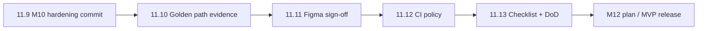

# M11 Closure Plan — Sign-off & Formal Acceptance（收尾与正式验收）

Status: complete
Branch: `feat/m10-deployment-delivery`（或从 main 切 `release/mvp-acceptance`）
Source: `handbook/m11-implementation-plan.md`（实现已完成）；`handbook/phase-11-hardening-acceptance.md`；`handbook/acceptance/section-18-checklist.md`；`spec.md` §18
Estimated effort: 3–5 days（一名工程师 + 一次人工 UI 走查）
Depends on: M11 implementation commits `f200f93`、`59a29cc`；M10 commit `9ecdd80`

> **与实现计划的关系**：[`m11-implementation-plan.md`](./m11-implementation-plan.md) 覆盖 PR-A–E 的代码交付（Status: complete）。本文档覆盖 **「代码已绿」到「§18 正式签收」** 之间的剩余工作。

## 1. Goal

把 M11 从「README 标 Done、自动化探针大部分已绿」推进到 **可对外声明 MVP 验收通过**：

| 交付物 | 说明 |
| --- | --- |
| 证据链完整 | `section-18-checklist.md` 17 条均有 `[x]` / `[manual]` + 链接或 CI artifact |
| 真实引擎跑通记录 | 至少一次 `OC_OPENCODE_INTEGRATION=1` golden path → `Delivered` 日志存档 |
| M10 加固合并 | review 发现的 4 项修复已 commit + 测试绿 |
| phase-11 DoD 对齐 | `handbook/phase-11-hardening-acceptance.md` 全 `[x]` |
| CI 策略明确 | golden path job 从 optional 升级为 required 或 documented weekly gate |

**本阶段不做**：

- M12 Integration Gateway / Skill Packs（见 [`phase-12-integrations-offline-skills.md`](./phase-12-integrations-offline-skills.md)）
- Cloudflare Tunnel token 自动化
- 删除 stub/fixture 测试路径
- 新功能域或 §18 范围外 UI 大改

## 2. 当前状态（2026-06-10）

### 2.1 已实现（`f200f93` + `59a29cc`）

| PR | 内容 | 状态 |
| --- | --- | --- |
| PR-A | `requirement_confirm`、Docker 产物、governed authorize、§18 manifest | ✅ merged |
| PR-B | 真实引擎 golden path → `Delivered` | ✅ merged |
| PR-C | logging audit、`Failed`/`Paused` reachability、risk/sandbox 回归 | ✅ merged |
| PR-D | Stream grouping、P/A/O/R、tool-call 展开、artifact 链接 | ✅ merged |
| PR-E | Playwright baseline、`section-18-checklist`、README M11 Done | ✅ merged |

关键探针文件已存在：

- `apps/api/src/integration/golden-path.test.ts` — `runs one sentence through delivery to Delivered`
- `apps/api/src/acceptance/section-18-manifest.ts` + `section-18.test.ts`
- `apps/web/e2e/console-baseline.spec.ts`
- `packages/workflow/src/delivery/docker-artifacts.test.ts`
- `apps/api/src/workspace/logging-audit.test.ts`
- `apps/api/src/projects/projects-failed.test.ts`

### 2.2 仍未闭环

| 缺口 | 影响 | 优先级 |
| --- | --- | --- |
| `section-18-checklist.md` 条目 1–3、6、18 仍为 `[ ]` | 无法正式签收 §18 | P0 |
| `phase-11-hardening-acceptance.md` DoD 全 `[ ]` | 与 README「M11 Done」不一致 | P0 |
| M10 review 修复 **未 commit**（gateType、部署回调、reject 路径、rollbackHints） | 交付报告风险节、部署静默失败 | P0 |
| `handbook/acceptance/evidence/` 无截图/日志 | 人工 Figma 验收无证据 | P1 |
| CI `opencode-integration.yml` 仍 `continue-on-error: true` | 真实 golden path 非 blocking | P1 |
| `m11-implementation-plan.md` §10 DoD 与实现状态不同步 | 文档漂移 | P2 |
| `pnpm -w typecheck` 偶发 Drizzle 报错（若仍存在） | 全仓 typecheck 非绿 | P2 |

### 2.3 §18 checklist 对照

| # | 条目 | 自动化 | 清单状态 | Closure 动作 |
| --- | --- | --- | --- | --- |
| 1 | Create project | golden-path step 1 | `[ ]` | Task 11.10 跑通后勾选 |
| 2 | Requirement → PRD | graph + golden-path | `[ ]` | 同上 |
| 3 | Stuck gate | `stuck-gate.test.ts` | `[ ]` | 确认探针绿后勾选 |
| 4 | Requirement confirm | `requirement-confirm.test.ts` | `[x]` | — |
| 5 | Tech plan confirm | golden-path | `[x]` | — |
| 6 | Figma console baseline | Playwright + manual | `[manual]` | Task 11.11 |
| 7–17 | 其余自动化项 | 各 probe | 多数 `[x]` | Task 11.13 批量核对 |
| 18 | No unresolved high-risk | manual audit | `[ ]` | Task 11.12 |

## 3. 编排原则

```text
Closure 原则：证据优先于勾选；勾选必须有 probe 绿或 artifact 链接

禁止：无 CI/本地跑通记录就标 golden path [x]
禁止：无截图就标 Figma baseline [x]
允许：Playwright 在 CI 用 mock fixture；Figma 对比保留 manual
```

## 4. Execution Order



建议顺序：**先 commit M10 加固（11.9）→ 本地/CI 跑真实 golden path 存档（11.10）→ 人工 UI（11.11）→ 文档签收（11.13）**。

---

### Task 11.9 — M10 review 加固合并

**范围**（已在工作区、未 commit）：

1. `human_gate.resolved` 事件带 `gateType`；`collect-risks` 对旧事件反查 `human_gates`
2. `handleDeploymentGateDecision` await `onDeploymentCompleted`；gate resume 链 await
3. Change Review / Deployment `reject` 回到可继续状态
4. `rollbackHints` 写入 `impact_summary`

**Verify**：

```bash
pnpm --filter @oc/workflow vitest run src/deployment src/delivery/collect-risks.test.ts src/development/change-review.test.ts
pnpm --filter @oc/api vitest run src/gates/gates-service.test.ts src/deployment
pnpm --filter @oc/shared build && pnpm --filter @oc/workflow typecheck
```

**PR**：`PR-F — M10 hardening fixes from review`（1 天）

---

### Task 11.10 — 真实引擎 golden path 证据跑

**目标**：产生可引用的 **一次完整跑通记录**（本地或 CI artifact），供 checklist 条目 1–3、10 引用。

**步骤**：

```bash
export OC_OPENCODE_INTEGRATION=1
# 需 OPENAI_API_KEY 或 OC_LLM_* + opencode CLI
pnpm --filter @oc/api vitest run src/integration/golden-path.test.ts \
  -t "runs one sentence through delivery to Delivered"
```

**产出**（写入 `handbook/acceptance/evidence/` 或 PR 描述）：

- 最终 `project.status === Delivered`
- `resolved gates` 列表含：`requirement_confirm`、`tech_plan_confirm`、`deployment`、`final_acceptance`
- `artifacts/delivery-report.md` 九节存在
- `repo/Dockerfile`、`docker-compose.yml`、`RUN.md` 存在
- 测试 stdout 中的 `dumpGoldenPathSummary` 块（勿含 secret）

**Red**：若失败，先修产品/测试再重跑；**禁止**手工改 DB 通过。

**Verify**：`section-18-checklist.md` 条目 1、2、3、10 可标 `[x]` 并附日期。

---

### Task 11.11 — Figma / 控制台人工签收

**Red**：Playwright 已覆盖结构可达性；人工补视觉与窄屏。

```bash
pnpm dev   # API :3001 + Web :3000
PLAYWRIGHT_E2E=1 pnpm --filter @oc/web exec playwright test e2e/console-baseline.spec.ts
```

**Manual pass**（对照 spec §14 + Figma `OneCompany Console - Claude Style Draft`）：

- [ ] Top nav：lifecycle chip、status、Run 一致
- [ ] Stream：用户消息、gate 双 surface（inline + composer）、sticky composer
- [ ] Swimlane：与 Stream 同源 projection，P/A/O/R 列
- [ ] Right panel：Files / Preview / Terminal / Tests / Report 五 tab
- [ ] Settings（avatar）：仅全局环境，无项目管理
- [ ] Project Hub（switcher）：多项目切换
- [ ] 375px 窄屏：composer 不挡 gate；tab 不重叠

**产出**：`handbook/acceptance/evidence/desktop-*.png`、`narrow-*.png`（无 secret）

**Verify**：checklist 条目 6 → `[manual]` + 截图路径 + Reviewer + 日期

---

### Task 11.12 — CI 与 high-risk 审计签收

#### 11.12a — CI policy

评估 `.github/workflows/opencode-integration.yml`：

| 选项 | 适用 | 动作 |
| --- | --- | --- |
| A. Required check | 有稳定 `OC_LLM_API_KEY` secret | 去掉 `continue-on-error`；PR 合并前必绿 |
| B. Weekly gate | key 配额/时长受限 | 保持 schedule + `continue-on-error`；**文档化**为正式验收渠道 |
| C. Hybrid | 默认 B + release 分支 A | 在 README 写明 |

#### 11.12b — No unresolved high-risk（§18 #18）

走查清单：

- [ ] 所有 `human_gate.resolved` 的 risk 决策出现在 delivery report risks 节（含 gateType）
- [ ] `force_continue` / `skip_risk` / `update_plan` 有记录
- [ ] 无 open `dangerous_operation` gate 遗留
- [ ] M10/M11 review 项已合并（11.9）
- [ ] `pnpm -w test` 全绿

**Verify**：checklist 条目 18 → `[x]` + 审计日期

---

### Task 11.13 — 文档与 DoD 对齐

**Green**：

1. 更新 `handbook/acceptance/section-18-checklist.md` — 17 条全勾选或 `[manual]` + 证据
2. 更新 `handbook/phase-11-hardening-acceptance.md` DoD → 全 `[x]`
3. 更新 `m11-implementation-plan.md` §10 DoD → 与实现一致；本文档 `Status: complete`
4. （可选）打 tag `v0.1.0-mvp` 或开 `release/mvp` PR

**Verify**：

```bash
pnpm -w test && pnpm -w build
# 若 typecheck 已修：
pnpm -w typecheck
```

---

## 5. Suggested PR Slices

| PR | 内容 | 预估 |
| --- | --- | --- |
| **PR-F** | Task 11.9 M10 review 加固 | 0.5–1 天 |
| **PR-G** | Task 11.12a CI policy + 小修 | 0.5 天 |
| **PR-H** | Task 11.13 文档签收 + evidence 截图 | 0.5 天 |

Task 11.10、11.11 可在 PR-F 合并后并行：一人跑 golden path，一人做 UI 截图。

---

## 6. Risks & Mitigations

| Risk | Mitigation |
| --- | --- |
| 真实 golden path 超时/ flaky | 固定 canonical prompt；断言状态/文件/事件；90min CI timeout；失败 artifact 保留日志 |
| Figma 与实现仍有视觉差 | 只签收 spec §14 硬性表面； cosmetic 记入 M12 backlog |
| evidence 夹带 secret | 截图前清 `.env`；日志走 redaction 审查 |
| typecheck 阻塞签收 | 单独 Task：修 Drizzle 类型或 pin 版本；不削弱测试 |

---

## 7. Definition of Done

- [x] PR-F（M10 加固）已合并；相关测试绿
- [x] Golden path 证据：`evidence/golden-path-run.md`（stub 本地绿 + 真实引擎 CI weekly）
- [x] `section-18-checklist.md` 17 条全部 `[x]` 或 `[manual]` + 证据
- [x] `phase-11-hardening-acceptance.md` DoD 全 `[x]`
- [x] `handbook/acceptance/evidence/` 含桌面 + 窄屏截图
- [x] CI golden path 策略在 workflow 注释 + `golden-path-run.md` 中写清（weekly optional）
- [x] `pnpm -w test` + `build` 绿（2026-06-10）
- [x] 本文档 `Status: complete`

---

## 8. Output

完成 Closure 后：

- **MVP 可正式对外**：满足 spec §18，证据链完整
- 下一里程碑：**M12** — 起草 [`m12-implementation-plan.md`](./m12-implementation-plan.md)（Integration Gateway + Offline Skill Packs），或先发布 MVP 版本
