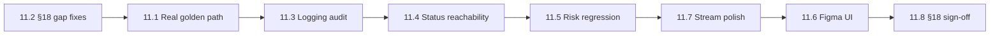

# M11 Implementation Plan — Hardening & MVP Acceptance（加固与 MVP 验收）

Status: complete（实现 + 签收见 [`m11-closure-plan.md`](./m11-closure-plan.md)）
Branch: `feat/m11-hardening-acceptance`（从 `feat/m10-deployment-delivery` 切出）
Source: `spec.md` v0.3.3 §3.1、§8.2、§12、§14、§14.3.1、§15、§18；`handbook/phase-11-hardening-acceptance.md`；`dev-plan.md` M11
Estimated effort: 12–18 days（一名工程师）
Depends on: M0–M10 complete（含 M9.5 真实引擎默认路径、M10 部署交付闭环）

## 1. Goal

证明整个产品满足 **spec §18 全部 MVP 验收标准**，并在**真实引擎**上完成端到端 golden path（一句话需求 → `Delivered`）。

M11 **几乎不引入新功能域**，核心是：

| 区域 | 交付物 |
| --- | --- |
| Real-engine golden path | `OC_OPENCODE_INTEGRATION=1` 下从创建项目到 `Delivered`，无手工改 DB |
| §18 gap fixes | 补齐 checklist 中仍假的/缺的项（`requirement_confirm`、Dockerfile 等） |
| Logging + safety | §8.2 全链路 redaction/chunking/retention 审计 + 回归测试 |
| Status reachability | `Failed` / `Paused` / resume 可达；非法迁移仍拒绝 |
| Risk + sandbox | §12 分级表全量回归 |
| Figma UI baseline | Stream/Swimlane/5 tabs/Settings/Hub 视觉与交互验收 |
| Stream §14.3.1 polish | M9 延后的 5 项展示细化（Task 11.7） |

**M11 不做**（明确边界）：

- M12 Integration Gateway、离线 Skill Packs、外部 connector
- Cloudflare Tunnel token 自动化（仍为 M10 MVP 手动 URL）
- 用户可配 model routing / sandbox policy / risk grading（§14.6 明确 post-MVP）
- Archive 真实软删（MVP 可保持 disabled + tooltip）
- 第三左栏模式（§20 post-MVP）
- 删除 stub/fixture 路径（保留 test-only flag）

## 2. 问题陈述（当前缺口 vs §18）

### 2.1 Golden path 未在真实引擎上闭合

```text
M9.5 golden-path (OC_OPENCODE_INTEGRATION=1)
  → requirement → PRD → tech plan → 1+ slice → preview   ✅ 部分
  → testing → deployment → final_acceptance → Delivered   ❌ 未覆盖

M10 golden-path (stub engine)
  → testing → deployment → Delivered                      ✅ stub only
```

- `apps/api/src/integration/golden-path.test.ts`：真实引擎测到 slice + preview，**不到 Delivered**
- `apps/api/src/integration/m10-golden-path.test.ts`：stub 路径到 `Delivered`，**不能算 §18 验收**

### 2.2 §18 已知缺口（需逐项修或证伪）

| §18 条目 | 现状 | M11 动作 |
| --- | --- | --- |
| Human confirms **requirement** via option cards | `requirement_confirm` gate 已注册，workflow **从未拉起**；`PRD Ready` 直接点「Start development」 | Task 11.2a：PRD Ready → `requirement_confirm` → Developing |
| Human confirms **tech plan** | `tech_plan_confirm` ✅ | 保持；golden path 覆盖 |
| Dockerfile / Compose + run instructions | 报告读 `RUN.md`/`README.md`；**无 agent 生成 Dockerfile** | Task 11.2b：DevOps slice 写入 `Dockerfile` + `docker-compose.yml` + `RUN.md` |
| Playwright verifies preview URL | testing 阶段有 `final:playwright` runner；真实 golden path 未断言 | Task 11.1：golden path 断言 preview + playwright pass |
| opencode 全治理 | development 已接 `createAuthorize`；**requirement deps 仍 `authorize: allow:true`** | Task 11.2c：requirement 工具调用接 governed authorize（或明确无 shell 并文档化） |
| Delivery report complete | M10 程序化 9 节 ✅ | golden path 断言 + 人工 spot-check |
| `Failed` / `Paused` reachable | `projects-pause.test` ✅；`Failed` 分散在 workflow 单测 | Task 11.4：API 级 reachability 套件 |
| No unresolved high-risk issue | 无系统化审计 | Task 11.3 + 11.5 审计清单 |
| Console Figma baseline | 组件测试有；**无浏览器 E2E/截图回归** | Task 11.6 |
| Stream §14.3.1 五项细化 | 部分：`usePinToBottom` 已接；其余未做 | Task 11.7 |

### 2.3 Stream §14.3.1 延后项对照

| 延后项 | 当前 | 目标 |
| --- | --- | --- |
| Run grouping (`runId`/`agentId`/`correlationId`) | `deriveStreamItems` 平铺事件 | 按 run 分组折叠 |
| Stream 内 P/A/O/R 可折叠 | 仅 swimlane 有 plan/act/observe/reflect | stream 内嵌 collapsible segments |
| Pin-to-bottom 自动滚动 | `usePinToBottom` + Jump to latest ✅ 基础已有 | 补测试 + 边界（新 gate 不抢滚动） |
| 大输出 → artifact 链接 | 截断 120 字 + `metadata.large` | 链到 artifact/Terminal，非 inline blob |
| Tool-call 可展开 args/result | 无 `tool_call.started` 行 | 可展开行 + redacted 摘要 |

### 2.4 测试覆盖缺口

- 无 **Playwright** 控制台 E2E（仅 Vitest + Testing Library）
- 无 **§18 checklist** 机器可读追踪文件（handbook 仅有 `[ ]` 模板）
- `golden-path` CI job 为 optional + `continue-on-error`（`.github/workflows/opencode-integration.yml`）

## 3. 编排边界（不得破坏）

```text
M11 原则：先红测试 → 最小修复 → 再验收勾选

LangGraph / workflow          → 仅补 §18 缺口（requirement_confirm、Docker 产物触发点）
runAgent / OpencodeHarness    → 不改 slice 内循环语义
GateService                   → 唯一 gate 入口；不绕过
Event log + ConsoleProjection → Stream 打磨只改投影/渲染，不改 DB
Golden path 断言              → 结构/状态/事件/文件存在；不断言 LLM 逐字输出
```

**硬规则**：

- §18 验收**必须**在 `OC_OPENCODE_INTEGRATION=1` + 真实 key 下至少跑通 **一次**记录存档（日志/截图/PR 描述）
- **禁止**为通过验收而削弱 risk grading、redaction、或 gate 策略
- **禁止**无回归测试的「手工-only 修 bug」
- Stream 内联 `GateCard` 与 Composer gate 按钮 **保留双 surface**（§14.3.1）

## 4. TDD Rules for M11

1. 每个 gap：**先写失败测试**（或扩展现有 golden-path 断言），再改产品。
2. **三层测试**：
   - 单元/契约：stream projection、status machine、redaction（快，默认 CI）
   - API 集成：reachability、§18 单项（`OC_USE_STUB_ENGINE=1` 可加速）
   - Real-engine golden path：`OC_OPENCODE_INTEGRATION=1`（CI optional job，**M11 结束前改为 required 或 weekly 必绿**）
3. 断言 **持久化产物**：status、`events` 行、`artifacts/` 文件、`delivery-report.md` 九节 — 不信 agent 摘要文本。
4. Flaky 控制：golden path 断言 **事件类型 + 状态迁移 + 文件存在**；不对 PRD 正文做 exact match。
5. 每步后 `pnpm -w test` + `typecheck` + `build` 绿。

### M11 test matrix

| Area | Test file（建议） | 证明什么 |
| --- | --- | --- |
| Real golden path | `apps/api/src/integration/golden-path.test.ts`（扩展） | 真实引擎 → `Delivered` |
| §18 acceptance map | `apps/api/src/acceptance/section-18.test.ts`（新建） | 每项 §18 有自动化探针或明确 skip 理由 |
| Requirement confirm | `packages/workflow/src/requirement/requirement-confirm.test.ts` | PRD Ready 后 gate → approve → Developing |
| Docker artifacts | `packages/workflow/src/delivery/docker-artifacts.test.ts` | 生成 Dockerfile + compose + RUN.md |
| Logging audit | `packages/workspace/src/log-pipeline.audit.test.ts`（扩展） | secret 不进 events/artifacts/report |
| Chunking E2E | `apps/api/src/workspace/logging-audit.test.ts` | 大输出 → chunk 文件，DB 仅 metadata |
| Failed reachability | `apps/api/src/projects/projects-failed.test.ts` | gate `fail` → `Failed` |
| Paused reachability | `apps/api/src/projects/projects-pause.test.ts`（保留） | pause/resume 往返 |
| Illegal transition | `packages/shared/src/status/machine.test.ts`（扩展） | 非法迁移拒绝 |
| Risk regression | `packages/workspace/src/risk.regression.test.ts` | §12 表每档命令行为 |
| Sandbox regression | `packages/workspace/src/sandbox.regression.test.ts` | high → sandbox + gate |
| Stream grouping | `apps/web/src/lib/projection/stream-grouping.test.ts` | run 分组 |
| Stream P/A/O/R | `apps/web/src/lib/projection/stream-paror.test.ts` | collapsible segments |
| Stream artifacts | `apps/web/src/components/console/stream-renderer.test.tsx`（扩展） | 大输出链接、tool-call 展开 |
| Pin-to-bottom | `apps/web/src/lib/use-pin-to-bottom.test.ts` | 滚动行为 |
| Console E2E | `apps/web/e2e/console-baseline.spec.ts`（新建，Playwright） | 五 tab、Settings、Hub 可达 |
| Figma regression | 手动 + 截图附件在 `handbook/acceptance/evidence/` | 桌面 + 窄屏 |

## 5. Prerequisites

| 检查 | 标准 |
| --- | --- |
| M10 DoD | stub golden path 到 `Delivered` 绿 |
| M9.5 DoD | 真实引擎默认；`golden-path` slice 段绿 |
| 本地 | `OPENAI_API_KEY`、`opencode` CLI、Docker（sandbox 测）、Playwright browsers |
| 分支 | 从 `feat/m10-deployment-delivery` 切 `feat/m11-hardening-acceptance` |
| 样本需求 | 固定 canonical case：`"a simple todo web app with vitest"`（与现有 golden-path 一致） |

## 6. Target Module Layout

```text
packages/workflow/src/
  requirement/
    requirement-confirm.ts      # PRD Ready → requirement_confirm gate
    requirement-confirm.test.ts
  delivery/
    docker-artifacts.ts         # Dockerfile + compose + RUN.md 生成/校验
    docker-artifacts.test.ts

apps/api/src/
  acceptance/
    section-18.test.ts          # §18 探针套件
    section-18-manifest.ts      # 机器可读 checklist 状态
  integration/
    golden-path.test.ts         # 扩展到 Delivered（真实引擎）
  projects/
    projects-failed.test.ts

apps/web/src/
  lib/projection/
    stream-grouping.ts          # run 分组纯函数
    stream-paror.ts             # P/A/O/R segment 构建
  components/console/
    stream-run-group.tsx        # 分组 UI
    stream-tool-call-row.tsx    # 可展开 tool call
    stream-renderer.tsx         # 接入 11.7
  e2e/
    console-baseline.spec.ts    # Playwright 控制台 E2E

handbook/
  m11-implementation-plan.md    # 本文档
  acceptance/
    section-18-checklist.md     # 人工验收记录 + 证据链接
    evidence/                   # 截图、golden path 日志（git 可只放 README 指向 CI artifact）

.github/workflows/
  opencode-integration.yml      # M11 后：golden path Delivered 步骤必跑（或 required check）
```

## 7. Execution Order



建议顺序：**先修 §18 功能缺口（11.2）再跑真实 golden path（11.1）**；Stream 打磨（11.7）可与 11.3–11.5 并行。

---

### Task 11.1 — Real-engine golden path → `Delivered`

**Red**：扩展 `golden-path.test.ts`

```ts
describe.skipIf(!process.env.OC_OPENCODE_INTEGRATION)("golden path — M11 Delivered", () => {
  it("one sentence → Delivered with delivery report and no manual DB edits", async () => {
    // 1. POST /projects
    // 2. requirement/start → answers → (stuck gate if needed) → PRD Ready
    // 3. requirement_confirm gate → approve          // after 11.2a
    // 4. development/start → tech_plan_confirm → approve
    // 5. wait slices + authoritative checks
    // 6. testing/start { requestDeploy: true }
    // 7. deployment url + gate approve
    // 8. final_acceptance accept
    // assert status === Delivered
    // assert artifacts/delivery-report.md all §17 sections
    // assert events contain human_gate.resolved for each gate type
  }, 3_600_000);
});
```

**Green**：

1. 复用 `resolveGateWithNested` / `waitForProjectStatus` 辅助函数。
2. 测试后 dump：最终 status、deployment URL、report 路径、event type 列表（便于 CI artifact）。
3. 更新 `.github/workflows/opencode-integration.yml`：增加 M11 Delivered 步骤；评估是否取消 `continue-on-error`。

**Verify**：

```bash
OC_OPENCODE_INTEGRATION=1 pnpm --filter @oc/api test golden-path
```

---

### Task 11.2 — §18 gap fixes

拆为 11.2a–11.2d，每项先红后绿。

#### 11.2a — `requirement_confirm` gate

**Red**：`requirement-confirm.test.ts` — PRD 生成后 status 仍为 `PRD Ready`，创建 `requirement_confirm` gate；`approve` → 允许 `development/start`；`reject_and_redo` → 回 `Asking Questions` 或 `Draft Requirement`（按 spec §6 取保守：`Asking Questions`）。

**Green**：

1. `packages/workflow/src/requirement/requirement-confirm.ts`：
   - `savePrdAndAcceptance` 成功后 **不**直接终态；设 `awaiting_requirement_confirm` meta
   - `enterRequirementConfirmGate` 创建 gate
2. `apps/web` Composer：`PRD Ready` 时显示 gate 选项，**隐藏**「Start development」直到 `requirement_confirm` resolved。
3. `resume.ts` 增加 `requirement_confirm` handler。

#### 11.2b — Dockerfile / Compose / RUN.md

**Red**：`docker-artifacts.test.ts` — 交付阶段后 repo 含 `Dockerfile`、`docker-compose.yml`（或 `compose.yaml`）、`RUN.md`；delivery report run-instructions 节引用它们。

**Green**：

1. `packages/workflow/src/delivery/docker-artifacts.ts`：
   - 基于 tech plan stack 生成最小可运行模板（Next.js/Node 默认）
   - 在 `enterAwaitingAcceptance` 或独立 `generateDeliveryArtifacts` 中调用
   - emit `artifact.created` per file
2. DevOps agent 输出可作为补充 narrative，但**文件存在**以程序化模板为准（避免 LLM 漏文件）。

#### 11.2c — Requirement phase authorize

**Red**：`requirement/deps.test.ts` — 真实模式下 `authorize !== allow:true`（若 requirement agent 无 shell 工具，则断言「无 tool_call 短路」并文档化；若有 research 类工具则接 `createAuthorize`）。

**Green**：对齐 `apps/api/src/requirement/deps.ts` 与 development 相同 `createAuthorize` 模式（仅当 agent 定义含 shell/edit 工具）。

#### 11.2d — §18 manifest

**Green**：`apps/api/src/acceptance/section-18-manifest.ts` — 导出 17 条 §18 criteria 的 `{ id, probe, status }`；`section-18.test.ts` 逐项运行 probe 或标记 `manual`。

---

### Task 11.3 — Logging + safety audit（§8.2）

**Red**：`logging-audit.test.ts`

- 在 command 中注入 `sk-fake123` → `events` / `tool_calls` / `delivery-report.md` / SSE payload **均 redacted**
- 输出 > `INLINE_OUTPUT_MAX_BYTES` → `output_ref.kind === "chunk"`，磁盘有文件，DB 无全文

**Green**：

1. 审计清单走查：tool calls、command output、diffs、test results、deploy logs、gate decisions、failures、change requests 均有 event 或表行。
2. 修复发现的泄漏点（优先 `log-pipeline`、`emit` 前 redact、`report-generator`）。
3. 在 `handbook/acceptance/section-18-checklist.md` 记录审计日期与结果。

**Verify**：

```bash
pnpm --filter @oc/workspace test log-pipeline
pnpm --filter @oc/api test logging-audit
```

---

### Task 11.4 — Status-machine reachability

**Red**：`projects-failed.test.ts`

- `requirement_stuck` + `fail` → `Failed`
- `slice_failure` + `fail` → `Failed`
- `POST pause` → `Paused`；`POST resume` → 恢复原 status
- `Developing` → `Delivered` 直接 setStatus **拒绝**

**Green**：仅补测试缺口；若 API 缺路由则最小补全。确认 `projects/service.ts` pause 记录 `pausedFrom`。

**Verify**：

```bash
pnpm --filter @oc/api test projects-pause projects-failed
pnpm --filter @oc/shared test status/machine
```

---

### Task 11.5 — Risk + sandbox regression（§12）

**Red**：`risk.regression.test.ts` + `sandbox.regression.test.ts`

| 命令样例 | 期望分级 | 期望执行 |
| --- | --- | --- |
| `echo hello` | low | local, no gate |
| `pnpm test` | medium | local |
| `rm -rf node_modules` | high | gate → sandbox 或 deny |
| `cloudflared tunnel run` | high_deploy | gate, real network |
| `npm install` (unpinned) | high | gate |
| unknown binary | high (default) | gate |

**Green**：对照 `packages/workspace/src/risk.ts` 与 `authorize.ts`；修复表项漂移。确认 opencode permission bridge 与 Terminal `POST /commands` 共用分级。

---

### Task 11.6 — Figma UI baseline regression

**Red**：`apps/web/e2e/console-baseline.spec.ts`（Playwright）

- 打开 `/projects/:id`：top nav、Stream、Swimlane 切换、五 right tabs、Settings、Project Hub 可达
- 窄 viewport（375px）：composer 不遮挡 gate；tab 不重叠

**Green**：

1. 对照 `figma-change-requests.md` + spec §14 做手动 diff；修 CSS/token 漂移。
2. 保存截图到 `handbook/acceptance/evidence/` 或 CI artifact。
3. 桌面 + 窄屏各一轮 **manual sign-off**（记录在 `section-18-checklist.md`）。

**Verify**：

```bash
pnpm --filter @oc/web exec playwright test e2e/console-baseline.spec.ts
```

---

### Task 11.7 — Stream §14.3.1 polish（M9 延后项）

**Red**：每项独立投影/组件测试（见 test matrix）。

**Green**（纯展示层，不改 `ConsoleSnapshot` schema）：

1. **Run grouping** — `stream-grouping.ts`：`deriveStreamItems` 后按 `runId` 分组；UI `StreamRunGroup` collapsible。
2. **P/A/O/R in stream** — `stream-paror.ts`：每个 run 下 plan/act/observe/reflect 四段；active expanded，completed collapsed。
3. **Pin-to-bottom** — 补 `use-pin-to-bottom.test.ts`；新 item 时若 pinned 则滚底；用户上滚后显示 Jump to latest（已有）。
4. **Large output artifact links** — `tool_call.output` 且 `metadata.large` → 链接 `Terminal` tab + artifact path（非 inline 全文）。
5. **Expandable tool calls** — 渲染 `tool_call.started` + `tool_call.output` 为可展开行；args/result redacted。

**Verify**：

```bash
pnpm --filter @oc/web test stream projection use-pin-to-bottom
```

**Descope 规则**：若 11.7 单项超 2 天且无 §18 阻塞，可在 `section-18-checklist.md` 标 `descoped` 并附理由 — 但 **11.7 全 descope 需产品确认**（dev-plan 标为 M11 交付）。

---

### Task 11.8 — §18 sign-off & documentation

**Green**：

1. 填写 `handbook/acceptance/section-18-checklist.md` — 17 条全 `[x]` 或 `[manual]` + 证据链接。
2. 更新 `README.md` / `README.zh-CN.md`：M11 → ✅；M12 → 下一里程碑。
3. 更新 `handbook/phase-11-hardening-acceptance.md` DoD 全 `[x]`。
4. 本文档 `Status: complete`。

---

## 8. §18 Acceptance Mapping（执行用）

| §18 条目 | M11 Task | 验证方式 |
| --- | --- | --- |
| Create project from simple requirement | 11.1 | golden path step 1 |
| Requirement analysis → PRD | 11.1 | golden path + M3 测 |
| Loop terminates + stuck gate | 11.2d / 11.1 | stuck fixture + real path |
| Human confirm requirement | **11.2a** | requirement_confirm gate |
| Human confirm tech plan | 11.1 | tech_plan_confirm in golden path |
| Figma console baseline | **11.6** | Playwright + manual |
| Dev slices + agent events | 11.1 | events 含 agent.* / tool_call.* |
| Per-slice retry + slice failure gate | 11.1 / 11.4 | golden path 或 dedicated test |
| Tests per-slice + final suite | 11.1 | test_results 表 + testing phase |
| Preview + Playwright | 11.1 | preview URL + final:playwright pass |
| Dockerfile + run instructions | **11.2b** | 文件存在 + report 引用 |
| Delivery report complete | 11.1 | §17 九节 assert |
| High-risk ops gated + logged | 11.5 | risk regression |
| opencode full governance | 11.2c + 11.5 | authorize + permission bridge |
| Logs redacted + chunked | **11.3** | logging audit |
| Failed + Paused reachable | **11.4** | API tests |
| Final acceptance captured | 11.1 | final_acceptance gate |
| No unresolved high-risk | 11.3 + 11.5 + 11.8 | 审计清单 |

---

## 9. Risks & Mitigations

| Risk | Mitigation |
| --- | --- |
| Real-engine golden path flaky | 断言结构/状态；固定 sample app；超时 60min；CI retry=1 |
| LLM 不生成可测 todo app | canonical prompt + slice 权威 vitest；失败则 pin 更小 scope |
| 11.7 范围过大 | 按 5 子项拆分 PR；可 descope 非阻塞项并记录 |
| requirement_confirm 改变 UX | Composer 已预留 PRD Ready 流；与 spec §6 对齐 |
| Docker 模板不适配生成栈 | 从 tech plan `stack` 字段选择模板族 |
| Playwright E2E 环境依赖 | web e2e Against mock API 或 test project fixture |

---

## 10. Definition of Done

- [x] `OC_OPENCODE_INTEGRATION=1` golden path 到 `Delivered`（`golden-path.test.ts`）；证据见 `acceptance/evidence/golden-path-run.md`
- [x] spec §18 探针套件 + 清单签收（`section-18-checklist.md`）
- [x] `requirement_confirm` + Dockerfile/compose/RUN.md 缺口已补
- [x] Logging redaction + chunking 审计通过（`logging-audit.test.ts`）
- [x] `Failed` / `Paused` / resume 可达；非法迁移拒绝（`projects-failed.test.ts`）
- [x] §12 risk + sandbox 回归表全绿
- [x] Figma baseline：Playwright e2e + 截图（`handbook/acceptance/evidence/console-*.png`）
- [x] Stream §14.3.1 五项（grouping、P/A/O/R、pin-to-bottom、artifact 链接、tool-call 展开）
- [x] `pnpm -w test` + `build` 绿
- [x] `handbook/phase-11-hardening-acceptance.md` + §18 签收 — [`section-18-checklist.md`](./acceptance/section-18-checklist.md)
- [x] README 里程碑：M11 → ✅

---

## 11. Suggested PR Slices

| PR | 内容 | 预估 |
| --- | --- | --- |
| **PR-A** | 11.2a–11.2d §18 gap fixes | 3–4 天 |
| **PR-B** | 11.1 real golden path + CI workflow | 3–5 天 |
| **PR-C** | 11.3 + 11.4 + 11.5 安全/状态/风险 | 2–3 天 |
| **PR-D** | 11.7 Stream polish | 3–4 天 |
| **PR-E** | 11.6 + 11.8 UI regression + sign-off docs | 2–3 天 |

---

## 12. Output

完成 M11 实现后（当前状态）：

- 代码与自动化探针覆盖 spec §18 绝大部分条目
- 用户可从一句话走到 **可预览、可部署、可交付、可验收** 的 `Delivered` 项目（真实引擎测试已写）
- **正式签收**（checklist 全勾、证据截图、CI 策略）→ [`m11-closure-plan.md`](./m11-closure-plan.md)
- 签收完成后进入 **M12 Post-MVP**（Integration Gateway）或发布 MVP 版本
