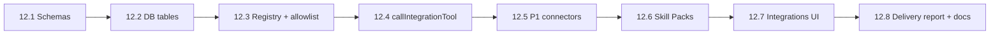

# M12 Implementation Plan — Integration Gateway + Offline Skill Packs（集成网关与离线技能包）

Status: complete
Branch: `feat/m12-integration-gateway`（从 `main` 或 `feat/m10-deployment-delivery` 切出）
Source: `spec.md` v0.3.3 §10.5、§10.6、§12、§8.2、§14.6、§16、§17；`handbook/phase-12-integrations-offline-skills.md`
Estimated effort: 20–30 days（一名工程师；P1 连接器 + 离线包约 3–4 周，P2 可后续迭代）
Depends on: M11 complete（§18 签收；`handbook/acceptance/section-18-checklist.md`）

## 1. Goal

在 **不破坏** OneCompany 本地优先、受治理执行模型的前提下，增加 **受管外部集成**：

| 区域 | 交付物 |
| --- | --- |
| Integration Gateway | 注册表 + 项目级连接 + 工具 allowlist + 统一 `callIntegrationTool` 管道 |
| Governed connector calls | 走 `tool_call.*` 事件、redaction、chunking、§12 风险分级与 gate |
| P1 connectors | Playwright/Browser、Figma、GitHub、Supabase、Vercel 定义 + 最小可用适配 |
| Offline Skill Packs | P1 各连接器对应 `skill-packs/*-offline/`，诚实降级（不伪造远程成功） |
| Integrations UI | 连接器就绪 / 过期 / 离线 fallback 状态；密钥仅显示 readiness |
| Delivery honesty | 交付报告声明哪些集成走了 offline fallback + 人工后续步骤 |

**M12 不做**（明确边界）：

- 任意 MCP 服务器动态注册（仅预注册 definition）
- 绕过 risk grading / gate 的 connector 写操作
- 在 Project Hub 内做详细连接器配置（配置归 Integrations 面）
- P3 协作类（Slack/Notion）与 K8s 级基础设施连接器（可 stub 路线图）
- Cloudflare Tunnel **token 全自动**（可扩展 connector，仍走 gate）
- 删除本地 shell / opencode 路径；Integration Gateway **补充**而非替代 workspace 工具

## 2. 问题陈述（当前缺口 vs spec）

### 2.1 无 `packages/integrations`

```text
spec §10.2 packages/integrations/     ❌ 目录不存在（M0 刻意推迟）
IntegrationDefinition / SkillPack   ❌ shared 无类型
integration_* DB 表                 ❌ schema 无
callIntegrationTool                 ❌ 无统一入口
```

Agent  today 仅能通过 `agent.tools` → 本地 workspace / harness；**无法**合法调用 GitHub、Supabase、Vercel 等。

### 2.2 Settings 仅有环境检查占位

- `apps/web` Settings modal（§14.6）有 Node/pnpm/Git/Docker/Playwright 检查
- **无** connector readiness、offline fallback、project-scoped connection 展示
- spec §14.6 post-MVP：只读展示 external integration / Skill Pack fallback 状态

### 2.3 交付报告未声明 offline 集成

- `packages/workflow/src/delivery/report-generator.ts` 九节完整，但 **无**「integrations / offline fallback」节或 risks 子项
- spec §10.6：交付报告必须说明哪些远程集成被 Skill Pack 替代

### 2.4 现有能力可复用

| 已有 | M12 复用方式 |
| --- | --- |
| `createAuthorize` + `risk.ts` | connector 写/部署/secret 动作映射到同级 gate |
| `emit` + `tool_call.*` 事件 | connector 调用统一包装 |
| `redact` + log pipeline chunking | connector 输出同等处理 |
| Playwright runners（M7） | P1 browser connector 对齐现有 preview/E2E |
| M10 deployment gate + 手动 URL | Cloudflare/Vercel connector 扩展，仍 gate 后执行 |
| `environment` API | 扩展 integration readiness 探针 |

## 3. 编排边界（不得破坏）

```text
GateService                    → 唯一 gate 创建入口；connector 高风险写仍走 dangerous_operation / 专用 gate
Event log                      → connector 调用必须 emit tool_call.* + integration_tool_calls 行
LangGraph / workflow           → 不内嵌 MCP 客户端；workflow 通过 integrations 包调用
ConsoleProjection              → 只读事件；connector 结果以 stream tool-call 行展示
Skill Pack                     → 仅本地文件工具读 pack；脚本执行仍走 authorize
Remote MCP resources           → 不可信；禁止覆盖 policy / gate / allowlist
```

**硬规则**：

- **禁止** agent 调用未注册 integration 或 allowlist 外 tool
- **禁止** integration definition / log / artifact / SSE 出现 secret 明文
- **禁止** offline pack 声称「已开 PR / 已部署 / 已迁移生产库」
- connector deploy/env/domain/DB-write **必须** §12 分级 + gate，与 shell 同级严格
- 远程 MCP 返回内容 **仅作数据**，不得当作 system instruction

## 4. TDD Rules for M12

1. 每个 Task：**先红测试**（schema 拒绝 secret、未注册拒绝、allowlist 拒绝、offline 诚实降级），再实现。
2. **三层测试**：
   - 单元：`packages/shared` schema、`packages/integrations` registry/allowlist
   - API：`apps/api` connection CRUD、call wrapper、gate 触发
   - 契约：P1 connector 定义快照 + mock adapter 集成测（不依赖真实 API key 默认 CI）
3. 真实 connector E2E：`describe.skipIf(!process.env.OC_INTEGRATION_E2E)` 可选 job
4. 每步后 `pnpm -w test` + `typecheck` + `build` 绿

### M12 test matrix

| Area | Test file（建议） | 证明什么 |
| --- | --- | --- |
| Integration schemas | `packages/shared/src/schemas/integration.test.ts` | secret 拒绝、status/mode 枚举 |
| Migrations | `packages/shared/src/db/integration-tables.test.ts` | 五表存在、project scope |
| Registry | `packages/integrations/src/registry.test.ts` | 未注册 / 非 allowlist 拒绝 |
| Project enablement | `packages/integrations/src/connection.test.ts` | per-project scopes |
| Call wrapper | `packages/integrations/src/call-tool.test.ts` | events + redaction + chunking |
| High-risk write gate | `packages/integrations/src/risk-gate.test.ts` | deploy/secret write → gate |
| Untrusted resource | `packages/integrations/src/untrusted-resource.test.ts` | MCP 资源不覆盖 policy |
| Offline fallback | `packages/integrations/src/offline-fallback.test.ts` | `offline_fallback` + 诚实 artifact |
| Skill pack loader | `packages/integrations/src/skill-pack.test.ts` | 读 pack、列 capabilities |
| API routes | `apps/api/src/integrations/integrations.test.ts` | list/enable/call |
| Delivery report | `packages/workflow/src/delivery/report-integrations.test.ts` | offline 声明写入报告 |
| Integrations UI | `apps/web/e2e/integrations-baseline.spec.ts` | 状态展示、无 secret 泄漏 |

## 5. Prerequisites

| 检查 | 标准 |
| --- | --- |
| M11 DoD | `section-18-checklist.md` 全签收 |
| 分支 | 从含 M11 的 `main` 或 `feat/m10-deployment-delivery` 切 `feat/m12-integration-gateway` |
| 本地 | 可选 P1 沙箱账号：GitHub PAT、Supabase dev、Vercel token（仅 E2E，不进 repo） |
| MCP | 明确 P1 用 **native adapter** 还是 **本地 MCP server**；建议 Phase 1 用 native/mock，Phase 2 接 MCP |

## 6. Target Module Layout

```text
packages/
  shared/src/
    schemas/integration.ts          # IntegrationDefinition, Connection, SkillPack zod
    db/schema.ts                    # +5 tables
  integrations/                     # NEW @oc/integrations
    src/
      registry.ts                   # registerIntegration, get, list
      connection.ts                 # enableIntegrationForProject
      call-tool.ts                  # callIntegrationTool
      offline.ts                    # detect offline, resolve skill pack
      skill-pack-loader.ts
      connectors/
        playwright.ts
        figma.ts
        github.ts
        supabase.ts
        vercel.ts
      index.ts

skill-packs/                        # repo root, versioned bundles
  playwright-offline/
  figma-offline/
  github-offline/
  supabase-offline/
  vercel-offline/
  cloudflare-offline/               # P2 stub pack early

apps/api/src/
  integrations/
    routes.ts
    service.ts
    integrations.test.ts

apps/web/src/
  components/integrations/          # Integrations page/modal (post-MVP surface)
  app/integrations/page.tsx       # or settings subsection

packages/workflow/src/delivery/
  report-integrations.ts          # offline / connector summary for §17
```

## 7. Execution Order



建议：**12.1–12.4 串行**（基础设施）；**12.5 P1 连接器可并行 2–3 个**；**12.6 与 12.5 每个 P1 配对**；12.7–12.8 收尾。

---

### Task 12.1 — Integration schemas（shared）

**Red**：`integration.test.ts`

```ts
it("rejects secret values in IntegrationDefinition", () => {
  expect(() => IntegrationDefinitionSchema.parse({
    id: "github",
    secretRefs: ["GITHUB_TOKEN"],
    // ...attempt to embed token in displayName
  })).toThrow();
});
```

**Green**：`packages/shared/src/schemas/integration.ts`

- `IntegrationDefinitionSchema`（id, version, protocol, mode, toolAllowlist, permissions, riskLevel, secretRefs, offlineFallbackSkillPackId）
- `IntegrationConnectionSchema`（status 枚举、projectId、scopes）
- `SkillPackSchema`
- export types from `@oc/shared`

**Verify**：`pnpm --filter @oc/shared test integration`

---

### Task 12.2 — Database tables

**Red**：migration / schema test — 五表 + project_id FK where needed

**Green**：`packages/shared/src/db/schema.ts` + drizzle push

| Table | Purpose |
| --- | --- |
| `integration_definitions` | 注册定义（版本化 JSON，无 secret 值） |
| `integration_connections` | 项目级连接状态 |
| `integration_tool_calls` | 审计元数据（关联 tool_call / event） |
| `skill_packs` | 已安装/发现的 pack 元数据 |
| `skill_pack_runs` | pack 脚本执行记录 |

**Verify**：`pnpm migrate`；`pnpm --filter @oc/shared test integration-tables`

---

### Task 12.3 — Gateway registry and allowlist

**Red**：`registry.test.ts` — 未注册 integration、allowlist 外 tool 拒绝

**Green**：`packages/integrations`

```ts
registerIntegration(def: IntegrationDefinition): void
getIntegration(idAtVersion: string): IntegrationDefinition
listIntegrations(): IntegrationDefinition[]
enableIntegrationForProject(projectId, integrationId, scopes): Promise<IntegrationConnection>
```

- 启动时 seed P1 definition 行（或代码注册 + DB 同步）
- `assertToolAllowed(integrationId, toolName)`

**Verify**：`pnpm --filter @oc/integrations test registry connection`

---

### Task 12.4 — Normalized `callIntegrationTool`

**Red**：`call-tool.test.ts` + `risk-gate.test.ts`

- emit `tool_call.started/output/failed`
- insert `integration_tool_calls`
- redact + chunk 大输出
- `permissions` 含 `deploy` / `secrets` / `write` → 走 gate（复用 `createAuthorize` 或专用 `integration_write` gate）

**Green**：`packages/integrations/src/call-tool.ts`

```ts
export async function callIntegrationTool(deps, input: {
  projectId: string;
  integrationId: string;
  toolName: string;
  args: unknown;
}): Promise<unknown>
```

- MCP/native adapter 接口：`ConnectorAdapter { callTool, listTools }`
- **Untrusted**：MCP resource 解析结果标注 `untrusted: true`，不 merge 进 agent system prompt

**Verify**：`pnpm --filter @oc/integrations test call-tool risk-gate untrusted-resource`

---

### Task 12.5 — P1 connector definitions（分阶段）

每个连接器：**definition + adapter（mock 默认可测）+ 可选真实 E2E**

| # | Connector | MVP 能力（allowlist 初版） | Risk notes |
| --- | --- | --- | --- |
| 1 | **Playwright/Browser** | screenshot, console errors, navigate preview URL | medium；非本地副作用 gate |
| 2 | **Figma** | get_design_context（read）、export screenshot | read-only default |
| 3 | **GitHub** | list repos, create branch, open PR（描述）, read issues | delete repo / force push → high |
| 4 | **Supabase** | list tables, apply migration（dev）, seed SQL | prod write → high |
| 5 | **Vercel** | list projects, create preview deploy, read logs | env/domain change → high_deploy |

**Red**：每 connector `connectors/*.test.ts` — definition 快照 + mock call 返回 + gate 触发用例

**Green**：`packages/integrations/src/connectors/*.ts` + seed definitions

**Verify**：`pnpm --filter @oc/integrations test connectors`

**Descope 规则**：单个 connector 超 4 天无进展 → 先 ship mock adapter + offline pack，真实 API 进 12.5.x follow-up PR

---

### Task 12.6 — Offline Skill Packs

**Red**：`offline-fallback.test.ts` + `skill-pack.test.ts`

- 网络不可用或 `OC_OFFLINE_MODE=1` → status `offline_fallback`
- 调用 `github.push` → 执行 `github-offline` recipe，产出 `artifacts/github-push-checklist.md`，**不** emit 假 `pr.opened` 成功事件

**Green**：`skill-packs/` 目录 + loader

每个 P1 pack 最小集：

```text
skill-packs/github-offline/
  skill.json
  SKILL.md
  templates/pr-description.md
  recipes/local-branch-and-push.md
  scripts/validate-git-clean.sh
  tests/pack-manifest.test.ts
```

**Verify**：`pnpm --filter @oc/integrations test offline skill-pack`

---

### Task 12.7 — Integrations UI

**Red**：`integrations-baseline.spec.ts`（Playwright，mock API）

- 列表显示 P1 connectors：connected / not_configured / offline_fallback
- 显示 secret **readiness**（`GITHUB_TOKEN: configured`），永不显示值
- Project binding 显示当前 project scopes

**Green**：

- `apps/web/src/app/integrations/page.tsx` 或 Settings 内「Integrations」入口（§14.6：非 Project Hub）
- `apps/api/src/integrations/routes.ts`：`GET /integrations`、`POST /projects/:id/integrations/:id/enable`
- 复用 environment 探针风格 chips

**Verify**：`PLAYWRIGHT_E2E=1 pnpm --filter @oc/web exec playwright test e2e/integrations-baseline.spec.ts`

---

### Task 12.8 — Delivery report + documentation

**Green**：

1. `report-integrations.ts` — 新增 delivery report 子节或 risks 条目：`Offline fallbacks used: github, vercel`
2. 更新 `handbook/phase-12-integrations-offline-skills.md` DoD
3. 更新 `README.md`：M12 → 🔄 In Progress → ✅
4. 本文档 `Status: complete`

**Verify**：`packages/workflow/src/delivery/report-integrations.test.ts`

---

## 8. Suggested PR Slices

| PR | 内容 | 预估 |
| --- | --- | --- |
| **PR-A** | 12.1–12.2 schemas + DB + `@oc/integrations` 包骨架 | 3–4 天 |
| **PR-B** | 12.3–12.4 registry + `callIntegrationTool` + risk/gate | 4–5 天 |
| **PR-C** | 12.5a Playwright + Figma connectors | 3–4 天 |
| **PR-D** | 12.5b GitHub + Supabase connectors | 4–5 天 |
| **PR-E** | 12.5c Vercel + 12.6 P1 offline packs | 4–5 天 |
| **PR-F** | 12.7 Integrations UI + API routes | 3–4 天 |
| **PR-G** | 12.8 delivery report + docs + E2E | 2–3 天 |

---

## 9. Risks & Mitigations

| Risk | Mitigation |
| --- | --- |
| MCP 协议漂移 | P1 优先 native adapter；MCP 作为可选 transport |
| Secret 泄漏 | schema 拒绝 + redact 审计 + UI 仅 readiness |
| Agent 滥用 connector | 硬 allowlist + per-project enablement |
| Offline 伪造远程成功 | 测试断言无假成功事件；报告强制声明 manual steps |
| 范围膨胀（12+ connectors） | 严格 P1 五件套；P2 仅 stub definition + pack 骨架 |
| 与 opencode permission bridge 冲突 | connector 调用走独立 `callIntegrationTool`，不注入 opencode 任意 MCP |

---

## 10. Definition of Done

- [x] `@oc/integrations` 包：注册表、项目连接、allowlist、`callIntegrationTool`
- [x] 五张 integration 相关 DB 表 + migrations
- [x] P1 五连接器 definition + mock adapter；至少 2 个有可选真实 E2E
- [x] P1 五 offline Skill Pack 目录完整（skill.json + SKILL.md + templates/recipes）
- [x] 高风险 connector 写操作触发 gate；测试先红后绿
- [x] Integrations UI 展示 status / offline fallback / secret readiness
- [x] 交付报告含 offline integration 声明
- [x] `pnpm -w test` + `typecheck` + `build` 绿
- [x] `handbook/phase-12-integrations-offline-skills.md` DoD 全 `[x]`（P2 stub 路线图保留未勾选）
- [x] README 里程碑：M12 → ✅

---

## 11. Output

完成 M12 后：

- Agent 可通过 **受管、可审计、可离线降级** 的方式使用 GitHub / Supabase / Vercel 等外部能力
- 用户在 Integrations 面看清连线状态与 offline fallback
- 交付报告诚实记录集成与人工后续
- 为 P2 连接器（Cloudflare 全量、Linear、Sentry、Postgres、Docker）和 P3（Stripe、协作类）留下 registry 扩展点
