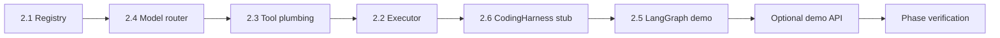

# M2 Implementation Plan — Agent Registry + Orchestration Skeleton

Status: complete (M2 DoD passed)
Branch: `feat/m2-agent-orchestration` (from `feat/m1-event-backbone`)
Source: `spec.md` v0.3.2 §7, §8.1, §10.1, §10.4, §13; `handbook/phase-02-agent-registry.md`; `dev-plan.md` (TDD Operating Model)
Estimated effort: 4–6 days (one engineer)
Depends on: M1 complete (`emit`, `setStatus`, SSE, gate foundation)

## 1. Goal

证明 **LangGraph（宏观）+ 单 Agent 执行器（微观）** 的编排边界，用 dummy/stub agent 跑通一条演示工作流：

- Agent 按 `agentId@version` 注册并持久化到 `agents` 表
- `runAgent` 发出完整 **P/A/O/R** 事件序列，写入 `agent_runs`
- 强制失败时发出 `agent.error` + `run.failed`，图不崩溃
- `callTool` 发出 `tool_call.*` 事件，写入 `tool_calls`
- 模型路由按 §13 tier 映射（非用户可配）
- LangGraph demo 图：2 节点 + gate 占位 + durable state 预算计数
- **`CodingHarness` 接口 + `StubHarness`**（真实 `OpencodeHarness` 在 M6）

**M2 不做**：真实需求/开发 Agent（M3/M6）、opencode 集成、闸门 UI（M4）、workspace 风险分级（M5 提供真实 `authorize`）。

## 2. Orchestration Boundary（必须遵守）

```text
LangGraph 节点          → 预算、状态迁移、gate 节点、下一跳决策
runAgent / callTool     → 单节点内的 ReAct 步骤 + 事件发射
CodingHarness.runSlice  → 单切片编码工作（M2 仅 stub）
```

预算、重试、状态、闸门 **永远不能** 写进 `runAgent`、Agent 推理循环或 `CodingHarness` 内部。

## 3. TDD Rules for M2

1. 每个 Task 2.1–2.6 先写失败测试，再实现。
2. 断言 **事件顺序**、**DB 行**、**registry 解析**、**authorize 被调用**。
3. M2 测试默认 **不依赖 OpenAI API key** — 使用 `StubAgentRunner`；接口形状对齐 Agents SDK 边界，M3 再换真 Agent。
4. 每步后 `pnpm --filter @oc/agent-core test` 必须通过；全仓库 `pnpm -w test` 保持绿。

### M2 test matrix

| Area | Test file | 证明什么 |
| --- | --- | --- |
| Registry | `packages/agent-core/src/registry.test.ts` | register/get/list；`agents` 表持久化；未知 id 抛错 |
| Model router | `packages/agent-core/src/router.test.ts` | cheap/standard/strong → 固定 model id |
| Executor | `packages/agent-core/src/executor.test.ts` | started→plan→act→observe→reflect；`agent_runs` 行；失败→error+run.failed |
| Tool calls | `packages/agent-core/src/tools.test.ts` | started→output；失败→failed；`tool_calls` 行 |
| CodingHarness | `packages/agent-core/src/harness/stub.test.ts` | plan/act/observe；`authorize` 调用一次 |
| Demo graph | `packages/agent-core/src/graph.demo.test.ts` | 2 节点图跑完；事件顺序；预算在 state 不在 executor |

## 4. Prerequisites

| 检查 | 标准 |
| --- | --- |
| M1 DoD | `emit`, SSE, status machine, gate API 均绿 |
| DB 表 | `agents`, `agent_runs`, `tool_calls`, `events` |
| 共享类型 | `AgentDefinition`, `AgentEvent`, `EventEnvelope` |
| 分支 | 从 `feat/m1-event-backbone` 切 `feat/m2-agent-orchestration` |

## 5. Target Module Layout

```text
packages/agent-core/src/
  registry.ts              # registerAgent, getAgent, listAgents, parseIdAtVersion
  registry.test.ts
  router.ts                # pickModel(tier) -> model id
  router.test.ts
  executor.ts              # runAgent — stub runner in M2
  executor.test.ts
  tools.ts                 # callTool
  tools.test.ts
  graph/
    types.ts               # OrchestrationContext, GraphState, budget helpers
    demo-graph.ts          # 2-node demo + optional gate node
    demo-graph.test.ts
  harness/
    types.ts               # CodingHarness, SliceSpec, DevContext, ToolOp, ...
    stub.ts                # StubHarness
    stub.test.ts
  test-utils.ts            # temp DB + dummy agent fixture
  index.ts                 # public exports

packages/workflow/         # 仍为空壳；M3 需求图、M6 开发图迁入

apps/api/src/              # 可选薄集成
  orchestration/
    routes.ts              # POST /projects/:id/demo-run（手动验收用）
```

### 新增依赖（`@oc/agent-core`）

| 包 | 用途 |
| --- | --- |
| `@langchain/langgraph` | 宏观工作流 |
| `@oc/shared` | 类型、emit、Db、AgentDefinition |
| `drizzle-orm` | registry / agent_runs / tool_calls 写入 |

M2 **不强制** 安装 `@openai/agents` — 用 `AgentRunner` 接口 + `StubAgentRunner`；Task 2.2 注释标明 M3 接入点。

### 默认模型映射（§13，写死在 `router.ts`）

| Tier | 默认 model id（可 env 覆盖，非用户 UI） |
| --- | --- |
| `cheap` | `gpt-4.1-mini` |
| `standard` | `gpt-4.1` |
| `strong` | `gpt-4.1` 或 `o4-mini`（实现时选一个并锁定测试） |

## 6. Execution Order



Router 与 registry 无依赖，但 executor 需要两者；harness 可与 executor 并行，建议在 graph 前完成。

---

### Task 2.1 — Agent registry

**Red**: `registry.test.ts`

- `registerAgent(def)` → `getAgent("dummy@1.0.0")` 返回相同 def
- 重启模拟：新 `Db` 实例从 `agents` 表 `loadRegistry()` 仍能 `getAgent`
- `getAgent("missing@1.0.0")` throws
- `listAgents()` 含已注册项

**Green**: `registry.ts`

```ts
function parseIdAtVersion(idAtVersion: string): { id: string; version: string };
function registerAgent(db: Db, def: AgentDefinition): void;
function getAgent(db: Db, idAtVersion: string): AgentDefinition;
function listAgents(db: Db): AgentDefinition[];
```

- `agents` 表：`id` + `version` 列 + `definition` JSON（完整 `AgentDefinition`）
- 用 `AgentDefinitionSchema` 校验后写入
- 导出 `DUMMY_AGENT` fixture 供后续任务使用

**Verify**: `pnpm --filter @oc/agent-core test registry`

---

### Task 2.4 — Model router

**Red**: `router.test.ts` — 三档 tier 返回预期 model id；未知 tier 抛错

**Green**: `router.ts`

```ts
function pickModel(tier: "cheap" | "standard" | "strong"): string;
```

- 允许 `process.env.OC_MODEL_CHEAP` 等覆盖（仅内部，非用户设置 UI）

**Verify**: router tests pass

---

### Task 2.3 — Tool-call plumbing

**Red**: `tools.test.ts`

- 成功：`tool_call.started` → `tool_call.output`，`tool_calls` 行 `status=completed`
- 失败：`tool_call.started` → `tool_call.failed`

**Green**: `tools.ts`

```ts
type ToolContext = { db: Db; projectId: string; onEvent?: (e: EventEnvelope) => void };

async function callTool(
  ctx: ToolContext,
  input: { toolName: string; args: unknown; impl: () => Promise<unknown> },
): Promise<{ ok: true; output: unknown } | { ok: false; error: string }>;
```

- `toolCallId` = uuid；大 output 仅存 summary（M5 再做 chunking）
- 通过 `emit()` 写事件

**Verify**: tools tests pass

---

### Task 2.2 — Single-agent executor (stub runner)

**Red**: `executor.test.ts`

- 事件顺序：`agent.started` → `plan` → `act` → `observe` → `reflect`
- `agent_runs` 行：`status=completed`，`run_id` 一致
- `forceFail: true` → `agent.error` + `run.failed`，`failed: true`，不向外 throw
- `pickModel` 被调用且 tier 来自 registry 中的 agent

**Green**: `executor.ts`

```ts
type ExecutorContext = {
  db: Db;
  projectId: string;
  onEvent?: (e: EventEnvelope) => void;
};

async function runAgent(
  ctx: ExecutorContext,
  input: { agentIdAtVersion: string; task: unknown; forceFail?: boolean },
): Promise<{ runId: string; output: unknown; failed: boolean }>;
```

**Stub 行为**（M2 默认）：
1. `getAgent` + `pickModel`
2. insert `agent_runs` (`status=running`)
3. 依次 `emit` P/A/O/R（短摘要，无 chain-of-thought）
4. update `agent_runs` (`status=completed|failed`)
5. 返回 `{ output: { summary: "stub" }, failed }`

预留 `AgentRunner` 接口，M3 替换为 OpenAI Agents SDK 适配器。

**Verify**: executor tests pass

---

### Task 2.6 — CodingHarness + StubHarness

**Red**: `harness/stub.test.ts`

- `runSlice` 发出 plan/act/observe（经 `ctx.emit`）
- `ctx.authorize` 恰好调用 1 次
- `dec.allow=false` → `passed=false`
- harness 内无状态机/预算字段

**Green**: `harness/types.ts` + `harness/stub.ts`（形状同 handbook Task 2.6）

- `ctx.emit` 在 M2 测试里收集为数组；生产里由 host 包成 `EventEnvelope`
- `SliceSpec.testCommand` 仅作为 authorize 的 shell op 示例

**Verify**: stub tests pass

---

### Task 2.5 — LangGraph demo harness

**Red**: `graph/demo-graph.test.ts`

- 图状态含 `attempts: number` 预算字段
- Node A 调 `runAgent`；Node B 仅写标记 / emit artifact
- 跑完后 `attempts` 递增在 **state** 里，不在 executor
- 可选：gate 节点调用 M1 gate 服务（内存 fake 或注入 `createGate`/`waitForGate`）

**Green**: `graph/types.ts` + `graph/demo-graph.ts`

```ts
type DemoGraphState = {
  projectId: string;
  attempts: number;
  maxAttempts: number;
  done: boolean;
  lastRunFailed: boolean;
};

async function runDemoGraph(ctx: OrchestrationContext, state: DemoGraphState): Promise<DemoGraphState>;
```

- 使用 LangGraph `StateGraph` + `END`
- Gate 占位节点：若 `lastRunFailed && attempts >= maxAttempts` → 调 gate（测试里用 mock resolve）
- 预算检查在节点入口，超限不调用 `runAgent`

**Verify**: demo graph tests pass

---

### Task 2.7 — Optional API demo endpoint（手动验收）

**Scope**: 薄集成，可不做 E2E 测试（handbook 允许 manual）。

- `POST /projects/:id/demo-run` → 对已有 project 跑 `runDemoGraph`
- 客户端用 M1 `/dev/events` 或 curl SSE 观察 P/A/O/R

**Verify**: 手动 — SSE 可见 agent 事件序列

## 7. Phase Verification

```bash
pnpm -w build
pnpm -w typecheck
pnpm -w test                    # M0 + M1 + M2 全绿

pnpm --filter @oc/agent-core test

# 手动
pnpm --filter @oc/api dev
curl -X POST localhost:3001/projects -H 'Content-Type: application/json' -d '{"name":"M2 Demo"}'
curl -X POST localhost:3001/projects/<id>/demo-run
# 打开 /dev/events?projectId=<id> 或 SSE stream
```

## 8. Definition of Done

- [x] `registerAgent` / `getAgent` / `listAgents`，`agents` 表持久化
- [x] `runAgent` 完整 P/A/O/R + `agent_runs`
- [x] 强制失败 → `agent.error` + `run.failed`，图继续
- [x] `callTool` → `tool_call.started` + output/failed
- [x] `pickModel` 三档映射 + 测试
- [x] LangGraph demo 图跑通，预算在 durable state
- [x] `CodingHarness` + `StubHarness`，`authorize` 必调
- [x] 所有 M2 测试先红后绿
- [x] 无 chain-of-thought 泄露；workflow 不硬编码 Agent class

## 9. Out of Scope

- 真实 OpenAI Agents SDK 调用（M3 起）
- `OpencodeHarness`（M6）
- Requirement / Development 完整图（M3 / M6）
- `packages/workflow` 业务图定义
- 闸门 UI、per-gate policy（M4）
- 真实 `authorize` 风险分级（M5；M2 用 `() => ({ allow: true })` 或简单 deny mock）
- Integration Gateway（M12）

## 10. Risks & Decisions

| 主题 | 决策 |
| --- | --- |
| 无 API key 的 CI | M2 默认 `StubAgentRunner`；不阻塞 CI |
| Agents 表主键 | `id` + `version` 两列；`getAgent` 用 `id@version` 字符串 |
| LangGraph 状态持久化 | M2 内存 state 足够；M3 再接 SQLite checkpointer |
| emit 位置 | executor/tools 接受 `Db` + 调 `@oc/shared` `emit`；API 层传 `onEvent=broadcastEvent` |
| Harness emit 形状 | stub 发 payload 级事件；host（M6）包成 `EventEnvelope` |
| demo-run API | 可选但推荐，方便 M9 前肉眼验收 |

## 11. What M3 / M6 Need From M2

| 产出 | 消费者 |
| --- | --- |
| Registry + `runAgent` | M3 需求 Agent 节点 |
| `callTool` | 所有 Agent 工具调用 |
| LangGraph harness 模式 | M3 需求循环图、M6 切片循环 |
| `pickModel` | M3/M6 模型路由 |
| `CodingHarness` + `StubHarness` | M6 `OpencodeHarness` 实现同一接口 |
| Demo graph 事件契约 | M9 信息流渲染验证 |

## 12. Suggested PR Checklist

1. `pnpm -w test` 绿，列出新增测试文件
2. 粘贴一次 demo-run 的 SSE 事件序列（started → reflect）
3. 粘贴一次 force-fail 的 error + run.failed
4. 确认 `grep` 无 workflow 文件 import 具体 Agent 类
5. `StubHarness` 测试显示 `authorize` 被调用

---

*下一步：切分支 `feat/m2-agent-orchestration`，按 Task 2.1 → 2.4 → 2.3 → 2.2 → 2.6 → 2.5 → 2.7 执行。*
