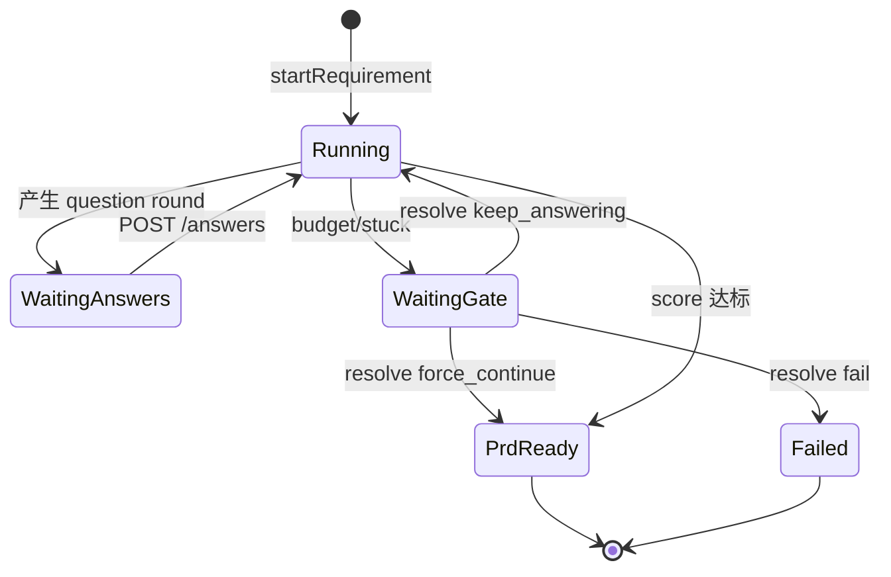
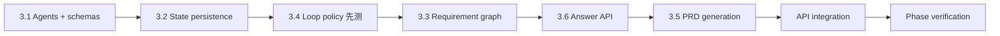

# M3 Implementation Plan — Requirement Workflow（需求确认工作流）

Status: complete (M3 DoD passed)
Branch: `feat/m3-requirement-workflow`（从 `feat/m2-agent-orchestration` 切出）
Source: `spec.md` v0.3.2 §3.1、§4、§6、§7、§8.1、§10.1、§10.3、§13；`handbook/phase-03-requirement-workflow.md`；`dev-plan.md`（TDD Operating Model）
Estimated effort: 6–8 days（一名工程师）
Depends on: M2 complete（registry、`runAgent`、LangGraph harness、gate 占位、`pickModel`）

## 1. Goal

把**一句话需求**变成**已确认的 PRD + 验收标准**，且提问循环**必须能自行终止**（预算耗尽或 stuck），绝不能无限循环：

- 注册并运行 5 个需求组 Agent（intake → analyst → scorer → question-planner → prd-acceptance）
- `RequirementState` 持久化（含阈值 85、轮次预算 6、每轮 `scoreAfter`）
- LangGraph 需求循环图：分析 → 打分 → 决策 → 提问轮 / PRD / Stuck Gate
- **Requirement Stuck gate**（M1 gate 原语）：`keep_answering` / `force_continue` / `fail` 三选项均可测
- 答案 API：`POST /projects/:id/requirement/answers` 触发重打分
- 达标或 force-continue 后写入 `prd_versions` + `acceptance_criteria_versions`

**M3 不做**：闸门 UI 卡片（M4）、技术方案/开发循环（M6）、workspace/shell（M5）、用户确认需求进入开发（`PRD Ready → Tech Plan Review` 的人工闸门在 M4 完整化）。

## 2. 编排边界（延续 M2，不得破坏）

```text
LangGraph 节点（packages/workflow）  → 轮次预算、stuck 判定、状态迁移、gate 节点、下一跳
runAgent（packages/agent-core）      → 单 Agent 的 ReAct + P/A/O/R 事件
RequirementState 服务                → durable state 读写（非 Agent 内部字段）
```

**硬规则**：

- `maxQuestionRounds`、stuck 检测（连续两轮涨幅 < 3）、`completenessScore >= 85`、是否存在 `critical` gap — **只在图节点 / 纯函数策略模块**，不进 Agent prompt 推理循环。
- Agent 只产出结构化输出；图负责「是否继续问、是否开门、是否生成 PRD」。
- `force_continue` **必须**写入 `RequirementState.risks`，禁止静默跳过 gate。

## 3. 需求循环核心参数（背下来）

| 参数 | 默认值 | 来源 |
| --- | --- | --- |
| `completenessScore` 量纲 | 0–100 | spec §4.2 |
| `completenessThreshold` | 85 | `@oc/shared` `DEFAULT_COMPLETENESS_THRESHOLD` |
| `maxQuestionRounds` | 6 | `DEFAULT_MAX_QUESTION_ROUNDS` |
| 每轮最多问题数 | 10 | spec §4.1 / L1 |
| Stuck 判定 | 连续 2 轮 `scoreAfter` 合计涨幅 < 3，且仍 < 85 | spec §4.3 / H1 |
| 达标条件 | `score >= 85` **且** gaps 中无 `severity=critical` | spec §4.3 |

### 状态迁移（M3 范围内）

| From | To | 触发 |
| --- | --- | --- |
| `Draft Requirement` | `Asking Questions` | 首次分析未达标 |
| `Draft Requirement` | `PRD Ready` | 首次分析已达标（R3 直通） |
| `Asking Questions` | `Asking Questions` | 新一轮提问（预算内） |
| `Asking Questions` | `PRD Ready` | 重打分达标 |
| `Asking Questions` | `PRD Ready` | Stuck gate 选 `force_continue`（记 risk） |
| `Asking Questions` | `Failed` | Stuck gate 选 `fail` |

## 4. TDD Rules for M3

1. 每个 Task 3.1–3.6 **先写失败测试**，再实现。
2. 断言 **durable state**、**status 迁移**、**gate 行**、**版本表行**、**事件类型** — 不接受「Agent 说了什么」作为唯一证据。
3. **CI 默认不依赖 OpenAI API key**：需求 Agent 使用 `ScriptedAgentRunner`（按 fixture profile 返回确定性结构化输出）；生产路径接入 `@openai/agents`（有 key 时启用）。
4. 循环终止（Task 3.4）是 **最高优先级** 测试，必须在 gate 逻辑存在前先红。
5. 每步后 `pnpm --filter @oc/workflow test` + `pnpm -w test` 保持绿。

### M3 test matrix

| Area | Test file（建议） | 证明什么 |
| --- | --- | --- |
| Agent 输出 schema | `packages/shared/src/schemas/requirement-agents.test.ts` | 五类 Agent 输出 zod 解析/拒绝 |
| Agent 注册 | `packages/agent-core/src/agents/requirement/registry.test.ts` | 5 个 agent `id@version` 可 resolve |
| Scripted runner | `packages/agent-core/src/agents/requirement/scripted-runner.test.ts` | vague/complete/stuck profile 返回合法结构 |
| State 持久化 | `packages/workflow/src/requirement/state.test.ts` | create/update/load；`requirement_scores` 按轮写入 |
| Loop policy（纯函数） | `packages/workflow/src/requirement/loop-policy.test.ts` | 达标判定、预算耗尽、stuck 检测、可再问判定 |
| 需求图（集成） | `packages/workflow/src/requirement/graph.test.ts` | 模糊输入→至少 1 轮提问；完整输入→直通 PRD Ready |
| 循环终止 + gate | `packages/workflow/src/requirement/stuck-gate.test.ts` | 预算/stuck 触发 gate；三选项行为 |
| PRD 版本化 | `packages/workflow/src/requirement/prd.test.ts` | PRD Ready 写入两版本表 + state 字段 |
| 答案 API | `apps/api/src/requirement/requirement.test.ts` | POST answers 更新 round 并触发重打分 |

## 5. Prerequisites

| 检查 | 标准 |
| --- | --- |
| M2 DoD | registry、stub `runAgent`、demo graph、15 项 agent-core 测试绿 |
| M1 DoD | `createGate` / `waitForGate` / `resolveGate`、SSE、`setStatus` |
| DB 表 | `requirement_sessions`、`requirement_scores`、`prd_versions`、`acceptance_criteria_versions`、`human_gates` |
| 共享类型 | `RequirementState`、`RequirementStateSchema`、`STATUS_TRANSITIONS` |
| 分支 | 从 `feat/m2-agent-orchestration` 切 `feat/m3-requirement-workflow` |

## 6. Target Module Layout

```text
packages/shared/src/schemas/
  requirement-agents.ts       # IntakeOutput, AnalystOutput, ScorerOutput, ...
  requirement-agents.test.ts

packages/agent-core/src/
  agents/
    requirement/
      definitions.ts          # 5 个 AgentDefinition + 注册 helper
      scripted-runner.ts      # CI/测试用确定性 runner
      openai-runner.ts        # 可选：@openai/agents 适配（有 key 时）
      registry.test.ts
      scripted-runner.test.ts
  executor.ts                 # 扩展：注入 AgentRunner（默认 scripted，可换 openai）

packages/workflow/src/
  requirement/
    state.ts                  # load/save RequirementState + requirement_scores
    state.test.ts
    loop-policy.ts            # isReadyForPrd, isBudgetExhausted, isStuck, canAskAnotherRound
    loop-policy.test.ts
    graph.ts                  # LangGraph 需求循环 + gate 节点 + interrupt 恢复点
    graph.test.ts
    stuck-gate.test.ts
    prd.ts                    # 保存 prd_versions / acceptance_criteria_versions
    prd.test.ts
    types.ts                  # RequirementGraphState, WorkflowRunStatus
  index.ts

apps/api/src/requirement/
  service.ts                  # startWorkflow, submitAnswers, resumeAfterGate
  routes.ts                   # POST .../requirement/start, .../answers
  requirement.test.ts
```

### 新增依赖

| 包 | 依赖 | 用途 |
| --- | --- | --- |
| `@oc/workflow` | `@oc/agent-core`、`@oc/shared`、`@langchain/langgraph` | 需求图 |
| `@oc/agent-core` | `@openai/agents`（可选生产路径） | 真 Agent 执行 |
| `@oc/api` | `@oc/workflow` | HTTP 入口 |

### Agent id@version 约定（默认 `1.0.0`）

| Agent id | tier | 职责 |
| --- | --- | --- |
| `intake@1.0.0` | cheap | 归一化原始输入 |
| `requirement-analyst@1.0.0` | standard | 抽取结构化需求 |
| `completeness-scorer@1.0.0` | cheap | 0–100 分 + gaps |
| `question-planner@1.0.0` | cheap | 单主题 ≤10 问 |
| `prd-acceptance@1.0.0` | standard | PRD + 验收标准 |

## 7. 工作流执行模型（重要设计）

M3 的需求流 **不是** 单次 `graph.invoke()` 跑到底，而是 **多段执行 + 人工输入断点**：



**实现策略**：

1. **Phase A（自动段）**：`startRequirement` / `submitAnswers` 调用图，跑到下一个 **interrupt 点**（待答题 / 待 gate / PRD Ready）。
2. **Interrupt 点**：
   - `awaiting_answers`：state 含当前 `questionRounds[-1].questions`，`answers` 为空；API 返回 `{ status, questions }`。
   - `awaiting_gate`：已 `createGate("requirement_stuck", [...])`；API 返回 `{ status, gateId, options }`。
   - `completed`：`PRD Ready` + 版本已写入。
3. **Gate 恢复**：`POST /gates/:id/resolve`（M1 已有）后，workflow service 读取 decision，调用 `resumeAfterGate(decision)` 继续图。
4. **Checkpointer**：M3 引入 LangGraph **内存或 SQLite checkpointer**（推荐 SQLite 表或复用 `requirement_sessions.state` 存 graph checkpoint + `RequirementState` 快照）；图节点每次 mutate 后 persist。

> 若 LangGraph interrupt API 过重，可退化为 **显式状态机 + 命名步骤**（`currentStep: "score" | "plan_questions" | ...`）仍放在 `packages/workflow`，但节点边界须与 handbook 一致，且决策逻辑仍在图/策略模块。

## 8. Execution Order



**说明**：Task 3.4 的纯函数（budget/stuck）在 3.3 图之前完成，确保「循环必停」先红后绿。

---

### Task 3.1 — 需求 Agent 注册 + 结构化输出

**Red**：

- `requirement-agents.test.ts`：五类 output schema 合法/非法样例
- `registry.test.ts`：五个 agent 注册后可 `getAgent`

**Green**：

1. `packages/shared/src/schemas/requirement-agents.ts` 定义输出 zod 类型（与 `RequirementState` 字段对齐）。
2. `definitions.ts` 构造 5 个 `AgentDefinition`（`group: "requirement"`）。
3. `scripted-runner.ts`：按 `RequirementFixtureProfile`（`vague` | `complete` | `stuck` | `improving`）返回确定性 JSON。
4. 扩展 `runAgent`：接受可选 `runner` 注入；默认 scripted；`OC_OPENAI_API_KEY` 存在时可选 `openai-runner`。

**Verify**：

```bash
pnpm --filter @oc/shared test requirement-agents
pnpm --filter @oc/agent-core test agents/requirement
```

---

### Task 3.2 — RequirementState 持久化

**Red**：`state.test.ts`

- `createRequirementSession(projectId, rawRequirement)` → 初始 state（threshold=85, maxRounds=6, score=0）
- `saveRequirementState` / `loadRequirementState` 往返一致
- 每轮打分后 `appendRequirementScore(projectId, roundIndex, score)` → `requirement_scores` 行

**Green**：`packages/workflow/src/requirement/state.ts`

```ts
function createRequirementSession(db: Db, projectId: string, rawRequirement: string): RequirementState;
function loadRequirementState(db: Db, projectId: string): RequirementState;
function saveRequirementState(db: Db, state: RequirementState): void;
function appendRequirementScore(db: Db, projectId: string, roundIndex: number, score: number): void;
```

- `requirement_sessions.state` 存完整 `RequirementState` JSON（`RequirementStateSchema` 校验）
- 与 `requirement_scores` 双写（scores 表便于查询/报表）

**Verify**：`pnpm --filter @oc/workflow test state`

---

### Task 3.4 — 循环终止（预算 + stuck）【最高优先级】

**Red**：`loop-policy.test.ts`（**在图实现之前**）

| 用例 | 输入 | 期望 |
| --- | --- | --- |
| 达标 | score=90, gaps 无 critical | `isReadyForPrd=true` |
| critical 阻挡 | score=90, 有 critical gap | `isReadyForPrd=false` |
| 预算耗尽 | `questionRounds.length=6`, 未达标 | `isBudgetExhausted=true` |
| 仍可问 | `questionRounds.length=2` | `canAskAnotherRound=true` |
| Stuck | 最近两轮 scoreAfter: 70→71→72 | `isStuck=true` |
| 非 Stuck | 70→75→80 | `isStuck=false` |
| 应开门 | exhausted 或 stuck | `shouldRaiseStuckGate=true` |

**Green**：`loop-policy.ts` 纯函数，零 IO，供图节点调用。

**Gate 选项行为**（`stuck-gate.test.ts`，可与 3.3 并行但先写红测试）：

| Decision | 期望 |
| --- | --- |
| `keep_answering` | `maxQuestionRounds += 3`（内部常量 `STUCK_BUDGET_EXTENSION=3`），清除 stuck 标记，继续循环 |
| `force_continue` | `setStatus(PRD Ready)` + `risks` 追加一条 force-continue 记录 + 进入 Task 3.5 |
| `fail` | `setStatus(Failed)` |

**Verify**：`pnpm --filter @oc/workflow test loop-policy stuck-gate`

---

### Task 3.3 — 需求循环 LangGraph

**Red**：`graph.test.ts`

- **Integration C（完整输入）**：`complete` profile → 不经提问轮 → `PRD Ready`（R3）
- **Integration A（模糊输入）**：`vague` profile → 至少 1 个 question round → `awaiting_answers`
- 图内计数器：`questionRounds.length` 只在图节点递增，不在 runner 内

**Green**：`graph.ts` 节点顺序（handbook §4.3）：

1. `intakeNode` → 更新 `normalizedSummary` 等
2. `analystNode` → 合并结构化字段
3. `scorerNode` → `completenessScore`、`gaps`；`appendRequirementScore`
4. `decisionNode`（纯策略，不调用 LLM）：
   - 达标 → `prdNode`（Task 3.5）
   - 可再问 → `questionPlannerNode` → `setStatus(Asking Questions)` → **interrupt `awaiting_answers`**
   - 应开门 → `stuckGateNode` → `createGate("requirement_stuck", ["keep_answering","force_continue","fail"])` → **interrupt `awaiting_gate`**
5. 用户答题后从 `scorerNode` 重入（非从 intake 重头）

**节点调用 Agent**：统一 `runAgent({ agentIdAtVersion, task: { state, profile? } })`。

**Verify**：`pnpm --filter @oc/workflow test graph`

---

### Task 3.6 — 答案摄入 API

**Red**：`requirement.test.ts`

- `POST /projects/:id/requirement/start` body `{ requirement: "..." }` → 创建/更新 session，返回 `{ status, questions? }`
- `POST /projects/:id/requirement/answers` body `{ answers: string[] }` → 写入当前轮 `answers`，触发重打分；若达标则 `PRD Ready`

**Green**：

- `apps/api/src/requirement/service.ts` 封装 workflow 多段执行
- `routes.ts` 挂到 `/projects/:id/requirement/*`
- 答题后若进入 `awaiting_gate`，响应含 `gateId`

**Verify**：`pnpm --filter @oc/api test requirement`

---

### Task 3.5 — PRD + 验收标准生成

**Red**：`prd.test.ts`

- 进入 `PRD Ready` 时调用 `prd-acceptance@1.0.0`
- 写入 `prd_versions`、`acceptance_criteria_versions` 各 1 行
- 更新 state：`prdVersion`、`acceptanceCriteriaVersion`
- 发出 `artifact.created` 事件（path 指向 artifacts 逻辑路径即可）

**Green**：`prd.ts` + 图内 `prdNode`

**Verify**：`pnpm --filter @oc/workflow test prd`

---

### Task 3.7 — API 汇总与 gate 恢复（薄集成）

- `POST /projects/:id/requirement/start`
- `POST /projects/:id/requirement/answers`
- 复用 `POST /gates/:id/resolve` + workflow `resumeAfterGate(projectId, gateId, decision)`
- 所有路径经 `setStatus`（M1 状态机），非法迁移抛错

## 9. Phase Verification

```bash
pnpm -w build
pnpm -w typecheck
pnpm -w test

# Integration A — 模糊需求
curl -X POST localhost:3001/projects -d '{"name":"M3 Demo"}'
curl -X POST localhost:3001/projects/<id>/requirement/start \
  -H 'Content-Type: application/json' \
  -d '{"requirement":"做一个 todo 应用"}'
# → status=awaiting_answers, questions 非空

curl -X POST localhost:3001/projects/<id>/requirement/answers \
  -d '{"answers":["个人用户","需要增删改查"]}'
# → 重复直到 PRD Ready 或 gate

# Integration B — stuck（scripted stuck profile 或故意低分答案）
# → requirement_stuck gate 出现
curl -X POST localhost:3001/gates/<gateId>/resolve -d '{"decision":"force_continue"}'
# → PRD Ready + risks 有记录

# Integration C — 完整需求一句说完
curl -X POST .../requirement/start -d '{"requirement":"完整的 ...（complete fixture 触发）"}'
# → 直接 PRD Ready

# SSE：/dev/events 可见 agent P/A/O/R、human_gate.created/resolved、artifact.created
```

## 10. Definition of Done

- [x] 五个需求 Agent 已注册，输出通过 `@oc/shared` schema 校验
- [x] `RequirementState` 持久化（threshold、budget、每轮 `scoreAfter`）
- [x] 循环产出版本化 PRD + acceptance criteria
- [x] 循环 **必定终止**：预算耗尽与 stuck 均触发 Requirement Stuck gate
- [x] 三个 gate 选项均可工作（keep_answering / force_continue / fail）
- [x] `force_continue` 写入 `RequirementState.risks`
- [x] 完整初始输入可 `Draft Requirement → PRD Ready` 直通（R3）
- [x] 状态、循环、gate、答题、PRD 版本化均有先红后绿的测试
- [x] 预算/stuck 逻辑不在 Agent 内；workflow 不 import 具体 Agent class

## 11. Out of Scope

- Gate 卡片 UI、per-gate L4 策略 UI（M4）
- `PRD Ready → Tech Plan Review` 需求确认闸门完整产品化（M4；M3 可预留事件）
- 开发组 Agent、opencode、`OpencodeHarness`（M6）
- Workspace / shell / sandbox / 真实 `authorize`（M5）
- Stream/Swimlane 渲染器（M9）
- 用户可配模型路由（§13 MVP 禁止）

## 12. Risks & Decisions

| 主题 | 决策 |
| --- | --- |
| CI 无 API key | 默认 `ScriptedAgentRunner` + fixture profile；OpenAI runner 仅集成/本地手动 |
| 图暂停 vs 长 invoke | 多段执行 + interrupt；state 存 `workflowPhase` |
| `keep_answering` 扩预算 | 默认 `+3` 轮，常量 `STUCK_BUDGET_EXTENSION` |
| Checkpointer | M3 最低：`requirement_sessions.state` 存 state + `workflowMeta`；可选 LangGraph SqliteSaver |
| Gate 等待 | 测试用同步 `resolveGate` mock；生产 `waitForGate` 轮询/回调 |
| Agent 失败 | `runAgent` 返回 `failed` → 图转 `Failed` 或重试一次（M3 选：直接 `Failed` + `run.failed` 事件） |
| PRD 内容格式 | Markdown 字符串入 `prd_versions.content`；结构化 JSON 可后置 |
| 问题 UI | M3 仅 API 返回 `questions[]`；前端 M4/M9 消费 |

## 13. What M4 / M6 Need From M3

| 产出 | 消费者 |
| --- | --- |
| Requirement Stuck gate 类型 + 三选项 | M4 GateCard 渲染与策略 |
| `RequirementState` + PRD/AC 版本 | M6 开发入口、M9 信息流 |
| 需求循环图模式（interrupt + resume） | M6 切片循环同类模式 |
| `POST .../requirement/*` API | M9 Stream 模式用户答题 composer |
| `artifact.created` / gate 事件 | M9 历史卡片、Swimlane |

## 14. Suggested PR Checklist

1. `pnpm -w test` 绿，列出新增测试文件与数量
2. 粘贴 Integration C（直通 PRD Ready）的 status + 版本表查询结果
3. 粘贴 Integration B（stuck gate）三选项各一次的状态与 `risks` 字段
4. `grep` 确认 `loop-policy.ts` 无 openai/langgraph import；Agent 文件无 budget/stuck 字段
5. 证明 `questionRounds.length` 在 6 轮后不再增加（除非 `keep_answering`）

---

*下一步：切分支 `feat/m3-requirement-workflow`，按 Task 3.1 → 3.2 → 3.4 → 3.3 → 3.6 → 3.5 → 3.7 执行。*
