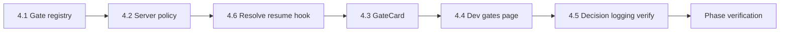

# M4 Implementation Plan — Human Gate UI + Gate Policies（人工闸门 UI + 策略）

Status: complete (M4 DoD passed)
Branch: `feat/m4-human-gate-ui`（从 `feat/m3-requirement-workflow` 切出）
Source: `spec.md` v0.3.2 §6、§8.1、§8.2、§14.3；`handbook/phase-04-human-gate-ui.md`；`dev-plan.md`（TDD Operating Model）
Estimated effort: 4–5 days（一名工程师）
Depends on: M1 complete（gate 原语 + resolve API）；M3 完成（真实 `requirement_stuck` gate 可端到端验收）

## 1. Goal

让人类决策**可见、可点、可审计、可恢复工作流**：

- 在 `@oc/shared` 定义 **8 种 gate 类型** + 每类 **允许选项**（L4 策略）
- **服务端强制校验**：`POST /gates/:id/resolve` 拒绝非法 decision，绝不信任客户端
- **`GateCard` 组件**：选项 Tab + 可选 custom 输入，调用 resolve API
- **最小闸门页**：列出项目 open gates，解析后工作流继续
- **resolve → resume 挂钩**：解析 gate 后自动恢复被阻塞的 workflow（M3 `requirement_stuck` 为首条真实路径）

**M4 不做**：完整 M9 Stream/Swimlane 布局、Project Hub、Settings 模态、M6 slice failure 真实图、M5 dangerous_operation 真实风险分级（仅 registry + 策略占位）、M10 deployment gate 真实触发。

## 2. 策略边界（L4，必须遵守）

```text
客户端（GateCard / Composer）  → 只展示 registry 允许的 options
服务端（resolveGate）           → 二次校验；非法 decision 返回 400
Workflow resume hook            → 合法 resolve 后恢复阻塞图（按 gateType 分发）
```

**硬规则**：

- `skip_risk_and_continue` **仅**出现在 low/medium 的 `dangerous_operation` gate；**绝不**出现在 deployment、requirement_confirm、tech_plan_confirm、final_acceptance、destructive dangerous_operation。
- stuck / slice_failure / change_review 使用**专属选项集**，不用通用 Approve/Reject 套。
- Custom 文本必须绑定到允许的 `custom` 选项（decision 形如 `custom:<text>` 或分字段 `decision` + `customText`），不能算隐式批准。
- 工作流**不能**在无 `human_gate.resolved` 记录的情况下越过 gate。

## 3. Gate 类型与允许选项（背下来）

| gateType | 允许 options | custom | skip_risk |
| --- | --- | --- | --- |
| `requirement_confirm` | `approve` / `revise_then_approve` / `reject_and_redo` / `custom` | ✓ | ✗ |
| `tech_plan_confirm` | 同上 | ✓ | ✗ |
| `requirement_stuck` | `keep_answering` / `force_continue` / `fail` | ✗ | ✗ |
| `slice_failure` | `retry` / `replan` / `request_skip_slice` / `fail` | ✗ | ✗ |
| `change_review` | `update_plan` / `revise_tech_plan` / `reject` | ✗ | ✗ |
| `deployment` | `approve` / `reject` / `custom` | ✓ | ✗ |
| `dangerous_operation` | 见下方动态规则 | ✓ | 条件 |
| `final_acceptance` | `accept` / `reject_and_redo` / `custom` | ✓ | ✗ |

### `dangerous_operation` 动态选项

| 创建时 `riskLevel` | 允许 options |
| --- | --- |
| `low` / `medium` | `approve` / `skip_risk_and_continue` / `reject` / `custom` |
| `high`（含 destructive） | `approve` / `reject` / `custom`（**无** skip） |

创建 gate 时在 `human_gates` 行或 JSON metadata 存 `riskLevel`（M4 扩展 `options` 旁加 `metadata` 列，或把 metadata 塞进现有 `options` JSON 包装 — 实现时选最小 diff）。

## 4. TDD Rules for M4

1. Task 4.1–4.5 **先写失败测试**，再实现。
2. **策略测试与 UI 测试分离**：L4 纯函数在 `@oc/shared` / `@oc/api` 测；`GateCard` 只测渲染与提交 payload，不测业务策略。
3. 非法 decision 必须断言 **HTTP 400** + gate 仍为 `open`。
4. resolve 成功必须断言 **`human_gate.resolved` 事件** + `human_gates.decision` + **workflow phase 变化**（M3 stuck 路径）。
5. 每步后 `pnpm -w test` 保持绿。

### M4 test matrix

| Area | Test file（建议） | 证明什么 |
| --- | --- | --- |
| Gate registry | `packages/shared/src/gates/registry.test.ts` | 8 类型定义；L4 skip 禁止集 |
| Option policy | `packages/shared/src/gates/policy.test.ts` | `isAllowedDecision`；dangerous 动态选项 |
| API 拒绝非法 decision | `apps/api/src/gates/gates-policy.test.ts` | deployment 拒 `skip_risk_and_continue` 等 |
| API 列出 open gates | `apps/api/src/gates/gates-list.test.ts` | `GET /projects/:id/gates` 只返回 open |
| Resolve → resume | `apps/api/src/gates/gates-resume.test.ts` | resolve `requirement_stuck` 后 workflow 继续 |
| GateCard 组件 | `apps/web/src/components/gate-card.test.tsx` | 渲染精确 options；custom 提交 |
| 决策日志 | `apps/api/src/gates/gates.test.ts`（扩展） | resolved 事件 + DB 字段（复用 M1） |

## 5. Prerequisites

| 检查 | 标准 |
| --- | --- |
| M1 DoD | `createGate` / `resolveGate` / `waitForGate`、SSE、`human_gate.*` 事件 |
| M3 DoD | `requirement_stuck` gate 三选项、`resumeRequirementAfterGate`、stuck 集成测试绿 |
| DB | `human_gates` 表；events 含 gate 事件类型 |
| Web 基线 | `apps/web` shadcn + `/dev/events` SSE 页可参考 |
| 分支 | 从 `feat/m3-requirement-workflow` 切 `feat/m4-human-gate-ui` |

## 6. Target Module Layout

```text
packages/shared/src/gates/
  types.ts                 # GateTypeId, GateOption, GateDefinition, GateMetadata
  registry.ts              # GATE_DEFINITIONS, getGateDefinition
  policy.ts                # getAllowedOptions, isAllowedDecision, formatCustomDecision
  registry.test.ts
  policy.test.ts

apps/api/src/gates/
  service.ts               # 扩展：createGate 用 registry；resolveGate 校验 policy
  routes.ts                # 扩展 resolve；新增 GET /projects/:id/gates（挂 projects 路由下）
  resume.ts                # gateType → workflow resume 分发
  gates-policy.test.ts
  gates-list.test.ts
  gates-resume.test.ts

apps/web/src/
  components/
    gate-card.tsx          # 布局无关 GateCard
    gate-card.test.tsx
  lib/
    gates.ts               # fetch open gates, resolveGate API client
  app/dev/gates/
    page.tsx               # 最小闸门页：projectId + open GateCard 列表
```

### 与 M3 的衔接（当前缺口）

M3 现状：

- Workflow 创建 gate 时**手写** `options` 数组
- 存在 **`POST /projects/:id/requirement/resume-gate`** 与 **`POST /gates/:id/resolve`** 两条路径，**未统一**

M4 目标：

1. `createGate` 默认从 **registry** 取 options（workflow 只传 `gateType` + 可选 metadata）
2. **`POST /gates/:id/resolve`** 校验 policy 后调用 **`resumeGate(projectId, gateType, decision)`**
3. 保留 `requirement/resume-gate` 为薄别名或废弃（实现时二选一，测试覆盖主路径 resolve）

## 7. Execution Order



**说明**：策略与 resume hook 先于 UI，确保「点卡片之前服务端已正确」。

---

### Task 4.1 — Gate 类型注册表

**Red**：`registry.test.ts` + `policy.test.ts`

- 8 种 `gateType` 均有 `title`、`descriptionTemplate`、`allowedOptions`
- `skip_risk_and_continue` **不在** deployment / requirement_confirm / tech_plan_confirm / final_acceptance 的静态 options 中
- `getAllowedOptions("dangerous_operation", { riskLevel: "high" })` 不含 skip
- `getAllowedOptions("dangerous_operation", { riskLevel: "medium" })` 含 skip

**Green**：`packages/shared/src/gates/registry.ts` + `policy.ts`

```ts
function getGateDefinition(gateType: GateTypeId): GateDefinition;
function getAllowedOptions(gateType: GateTypeId, metadata?: GateMetadata): readonly string[];
function isAllowedDecision(gateType: GateTypeId, decision: string, metadata?: GateMetadata): boolean;
function normalizeDecision(input: { decision: string; customText?: string }): string;
```

- 导出常量 `GATE_TYPES`、`REQUIREMENT_STUCK_OPTIONS` 等供 workflow/web 复用
- `normalizeDecision`：`custom` + `customText` → `custom:<trimmed>`（或团队选定单一格式，测试锁定）

**Verify**：

```bash
pnpm --filter @oc/shared test gates
```

---

### Task 4.2 — 服务端策略强制

**Red**：`gates-policy.test.ts`

| 用例 | 期望 |
| --- | --- |
| `deployment` + `skip_risk_and_continue` | 400，gate 仍 open |
| `requirement_stuck` + `force_continue` | 200 |
| `requirement_confirm` + `approve` | 200 |
| `dangerous_operation` high + `skip_risk_and_continue` | 400 |
| 已 resolved gate 再次 resolve | 400 |
| decision 不在 allowed 列表 | 400 |

**Green**：改造 `apps/api/src/gates/service.ts`

- `createGate(projectId, gateType, metadata?)`：从 registry 填充 `options`（持久化 JSON）
- `resolveGate(gateId, decision)`：`isAllowedDecision` 不通过则 `throw` → routes 返回 400
- Workflow（M3 `engine.ts`）改为 `createGate(projectId, "requirement_stuck")` **不传手写 options**

**Verify**：`pnpm --filter @oc/api test gates-policy`

---

### Task 4.6 — Resolve 后恢复工作流（新增，DoD 必需）

**Red**：`gates-resume.test.ts`

1. 跑 M3 stuck 路径至 `awaiting_gate`
2. `POST /gates/:gateId/resolve` `{ decision: "force_continue" }`
3. 断言：workflow `phase === "completed"` 或 `projectStatus === "PRD Ready"`；`human_gate.resolved` 已发

**Green**：`apps/api/src/gates/resume.ts`

```ts
type GateResumeHandler = (ctx: ResumeContext, gate: GateRecord, decision: string) => Promise<void>;

function createGateResumeRouter(deps: {
  requirement: RequirementService;
  // M6+ stub handlers for slice_failure, etc.
}): Record<string, GateResumeHandler>;
```

- `resolveGate` 成功写入 DB + emit 后，调用 `resumeRouter[gate.gateType]`
- `requirement_stuck` → `requirement.resumeAfterGate(projectId, decision)`
- 未知 gateType handler：M4 仅 log/no-op（未来 M6/M10 补齐）；**但** open gate 仍必须 resolve 才能继续 — 测试只覆盖 requirement_stuck

**Verify**：`pnpm --filter @oc/api test gates-resume`

---

### Task 4.3 — GateCard 组件

**Red**：`gate-card.test.tsx`

- 传入 `requirement_stuck` definition → 渲染恰好 3 个 option tab，**无** skip
- 传入含 `custom` 的 definition → 显示输入框；提交时调用 `onResolve({ decision: "custom", customText: "..." })`
- 点击 `fail` → `onResolve({ decision: "fail" })`
- resolved 后 `onResolved` 回调，卡片进入 resolved 展示态（或卸载）

**Green**：`apps/web/src/components/gate-card.tsx`

Props（布局无关，M9 可内联 Stream）：

```tsx
type GateCardProps = {
  gateId: string;
  gateType: GateTypeId;
  title: string;
  description: string;
  options: readonly string[];
  status: "open" | "resolved";
  decision?: string | null;
  onResolve: (input: { decision: string; customText?: string }) => Promise<void>;
};
```

- 使用现有 shadcn `Button` / tab 样式；选项文案可用 i18n map（M4 英文 key 即可）
- **不**在组件内硬编码 L4；options 由父组件从 shared registry 传入

**测试环境**：`apps/web/vitest.config.ts` 改为 `environment: "jsdom"`，devDep 加 `@testing-library/react` + `@testing-library/dom`

**Verify**：`pnpm --filter @oc/web test gate-card`

---

### Task 4.4 — 最小闸门 Shell

**Red**：手动 + 可选轻量集成测试（列表 API）

**Green**：

1. `GET /projects/:id/gates` → `{ gates: GateRecord[] }`（`status === "open"`）
2. `apps/web/src/app/dev/gates/page.tsx`：
   - 输入 `projectId`
   - 拉取 open gates + 订阅 SSE `human_gate.created` 增量
   - 每个 gate 渲染 `GateCard`；resolve 后刷新列表
3. resolve 调用 `POST /gates/:id/resolve`（**唯一主路径**），成功后若 workflow 恢复则 UI 显示项目 status 变化（可轮询 `GET /projects/:id` 或 SSE `project.status_changed`）

**Verify**：手动 — M3 stuck → `/dev/gates` 点 `force_continue` → PRD Ready

---

### Task 4.5 — 决策日志（验证 M1 行为仍成立）

**Red**：扩展 `gates.test.ts`

- 任意合法 resolve → `human_gate.resolved` 事件 1 条
- `human_gates.decision` + `resolved_at` 非空

**Green**：通常无需新代码；若 resolve 改造破坏 emit，修复 service。

**Verify**：`pnpm --filter @oc/api test gates`

---

### Task 4.7 — 对齐 M3 workflow 创建 gate 方式（薄重构）

- `packages/workflow/src/requirement/engine.ts`：`createGate(projectId, REQUIREMENT_STUCK_GATE_TYPE)` 不再手写 options
- `REQUIREMENT_STUCK_OPTIONS` 改从 `@oc/shared` gates registry 导入
- 确保 M3 stuck 测试仍绿

## 8. Phase Verification

```bash
pnpm -w build
pnpm -w typecheck
pnpm -w test

# 手动 E2E（Requirement Stuck）
pnpm --filter @oc/api dev
pnpm --filter @oc/web dev

# 1. 创建项目并启动模糊需求至 stuck gate
curl -X POST localhost:3001/projects -d '{"name":"M4 Gate Demo"}'
curl -X POST localhost:3001/projects/<id>/requirement/start \
  -d '{"requirement":"模糊需求","profile":"stuck"}'
# ...提交两轮答案直至 awaiting_gate...

# 2. 打开 http://localhost:3000/dev/gates?projectId=<id>
#    点击 force_continue

# 3. 非法 decision 应失败
curl -X POST localhost:3001/gates/<gateId>/resolve \
  -d '{"decision":"skip_risk_and_continue"}'   # → 400

# 4. SSE /dev/events 可见 human_gate.resolved + project.status_changed
```

## 9. Definition of Done

- [x] 8 种 gate 类型在 shared registry 有定义且选项正确
- [x] 服务端拒绝不允许的 decision（含 skip 越权）
- [x] `skip_risk_and_continue` 不出现在禁止类 gate 上
- [x] `GateCard` 渲染 option tabs + optional custom，通过 API resolve
- [x] `GateCard` props 布局无关，可嵌入未来 Stream feed
- [x] resolve gate 后阻塞工作流恢复（M3 `requirement_stuck` 实测）
- [x] 每次决议有 `human_gate.resolved` + DB 存储
- [x] 策略、API、resume、组件均有先红后绿测试

## 10. Out of Scope

- M9 完整控制台布局、Swimlane、sticky composer 与 gate 联动（M4 只保证 GateCard **可嵌入**）
- M6 `slice_failure` workflow resume 实现（M4 只注册类型 + handler 占位）
- M5 真实 shell 风险分级触发 `dangerous_operation`（M4 只测 registry 动态 options）
- M10 `deployment` / `final_acceptance` 真实工作流触发
- 闸门多开并发（MVP 假设至多一个 blocking open gate；UI 可列表但强调最新一个）

## 11. Risks & Decisions

| 主题 | 决策 |
| --- | --- |
| custom decision 编码 | `decision=custom` + body `customText`，持久化 `custom:<text>` 单字段 |
| gate metadata 存储 | M4 优先扩展 `human_gates` JSON：`{ options, metadata }` 或新增 `metadata` text 列 |
| resume 触发点 | 仅在 `resolveGate` 成功后同步调用；不用客户端二次调 `resume-gate` |
| `requirement/resume-gate` | 标记 deprecated，内部转调 `resolveGate` 或删除并更新测试 |
| Web 测试环境 | vitest jsdom + Testing Library；GateCard 不测 SSE |
| Open gates 数据源 | `GET /projects/:id/gates` 为主；SSE 做增量刷新 |
| i18n | M4 option 标签用英文 key→label map；中文 UI 可后补 |

## 12. What M6 / M9 / M10 Need From M4

| 产出 | 消费者 |
| --- | --- |
| Shared gate registry + policy | 所有阶段 createGate / composer 选项一致 |
| `GateCard` 组件 | M9 Stream 内联闸门卡片 |
| resolve + resume 路由 | M6 slice_failure、M10 deployment |
| `GET /projects/:id/gates` | M9 composer gate-aware 模式 |
| L4 服务端强制 | 安全底线，Composer 不可绕过 |

## 13. Suggested PR Checklist

1. `pnpm -w test` 绿，列出新增测试文件
2. 截图 `/dev/gates` 上 `requirement_stuck` 三选项卡片
3. 粘贴非法 `skip_risk_and_continue` on deployment 的 400 响应
4. 粘贴 resolve 后 `human_gate.resolved` SSE 片段 + workflow phase 变化
5. `grep` 确认 `GateCard` 无 hardcoded gate options；web 从 shared registry 取选项

---

*下一步：切分支 `feat/m4-human-gate-ui`，按 Task 4.1 → 4.2 → 4.6 → 4.7 → 4.3 → 4.4 → 4.5 执行。*
