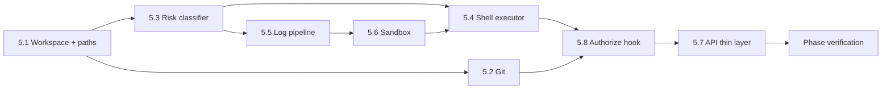

# M5 Implementation Plan — Workspace, Git, Shell, Sandbox（工作区 + Git + Shell + 沙箱）

Status: ready to execute
Branch: `feat/m5-workspace-shell-sandbox`（从 `feat/m4-human-gate-ui` 切出）
Source: `spec.md` v0.3.2 §8.2、§10.2、§11、§12；`handbook/phase-05-workspace-git-shell-sandbox.md`；`dev-plan.md`（TDD Operating Model）
Estimated effort: 5–7 days（一名工程师）
Depends on: M0 complete（`commits`、`artifacts`、`tool_calls` 表）；M4 complete（`dangerous_operation` / `deployment` gate + resolve API）

## 1. Goal

为生成项目提供**安全执行底座**：文件工作区、Git 切片提交、Shell 命令风险分级、Docker 沙箱、日志脱敏与分块存储，并产出 M2 `CodingHarness.authorize` 的**真实实现**。

- `generated-projects/{slug}/{repo,artifacts,logs}` + `meta.json`；路径逃逸一律拒绝
- `initRepo` + `commitSlice`：每切片一次 commit，写入 `commits` 表（关联 `taskId` / summary）
- `classifyCommand`：严格对齐 spec §12 五级风险；未知命令 → `high`
- `runCommand`：low/medium 本地执行；containable high → `dangerous_operation` gate → Docker；deploy/tunnel → `deployment` gate → **真实网络**（不进沙箱）
- `redact` + chunk：密钥永不进 DB/事件流；超大输出落 `logs/` 文件，DB 只存 metadata
- `createAuthorize`：`ToolOp` → 风险分级 → gate / 直接允许，供 M6 opencode permission bridge 复用

**M5 不做**：opencode 集成（M6）、右侧面板 Files/Terminal API（M8）、真实 Cloudflare Tunnel 配置 UI（M10）、Integration Gateway（M12）、用户可配沙箱策略（MVP 固定）。

## 2. 执行边界（必须遵守）

```text
packages/workspace     → 路径 containment、git、risk、shell、sandbox、log pipeline、authorize
apps/api（薄层）       → 可选 dev 路由 + 项目创建时 ensureWorkspace；gate 仍走 M4 GateService
packages/agent-core    → StubHarness 测试可注入 workspace.createAuthorize（不改 harness 接口）
```

**硬规则**：

- **任何** high / high_deploy 命令未经 gate `approve`（或允许的 `skip_risk_and_continue`）不得执行。
- deploy / tunnel / `vercel deploy` 等 **high_deploy** 绝不在 Docker 沙箱内跑。
- Docker 不可用时，containable high **不得**静默降级为本地执行 — 返回明确错误 + 可选 gate 仍创建但执行阶段失败。
- 写 `../`、绝对路径逃逸 repo root → 视为 high-risk「写项目外」，`authorize` 拒绝或走 gate。
- 命令输出 **先 redact 再 persist**；redaction 本身失败记为 incident（不含秘密值）。
- 不提供绕过 `runCommand` 的 shell 快捷路径（L3 终端在 M8 仍调同一 executor）。

## 3. 风险分级表（背下来，与 spec §12 一致）

| Risk | 示例 | 处理 |
| --- | --- | --- |
| `low` | `ls`, `rg`, `cat`, `npm test`, `npm run build`, `git status` | 本地 repo 执行 + 日志 |
| `medium` | 文件生成、非破坏性 DB init、启动本地 dev server | 本地执行 + 日志 |
| `medium_constrained` | `npm ci --ignore-scripts` + 已提交 lockfile + registry 已 pin | 本地执行，网络限 registry |
| `high` | 删文件、写项目外、未知脚本、访问 secrets、任意 `npm install`、破坏性 migration | `dangerous_operation` gate；批准后 Docker 沙箱（若可容器化） |
| `high_deploy` | deploy、`cloudflared tunnel`、Vercel 生产变更 | `deployment` gate；批准后**真实机器/网络**执行 |

### 依赖安装（R2 / M4 对齐）

| 命令 | 分类 |
| --- | --- |
| `npm install`（任意形式） | `high` |
| `npm ci` 无 `--ignore-scripts` | `high` |
| `npm ci --ignore-scripts` + lockfile 存在 + registry pin | `medium_constrained` |
| 未知 / 未在白名单 | `high`（默认更安全） |

## 4. TDD Rules for M5

1. Task 5.1–5.6 **先写失败测试**，再实现。
2. 测试使用 **临时目录**（`fs.mkdtemp`），不污染 `generated-projects/`；CI 不依赖 Docker 时沙箱测试用 **mock runner** 或 `describe.skipIf(!dockerAvailable)`。
3. 断言 **exitCode**、**文件存在**、**commits 行**、**artifacts 行**、**tool_call 事件**、**gate 创建/未执行** — 不接受「命令好像跑了」。
4. 脱敏测试用 **假 token / 假 env 值**，禁止把真实密钥写进 fixture。
5. 每步后 `pnpm --filter @oc/workspace test` + `pnpm -w test` 保持绿。

### M5 test matrix

| Area | Test file（建议） | 证明什么 |
| --- | --- | --- |
| Workspace layout | `packages/workspace/src/workspace.test.ts` | 目录 + meta.json；`../` 拒绝 |
| Path resolve | `packages/workspace/src/paths.test.ts` | repo/artifacts/logs 边界；symlink 逃逸拒绝 |
| Git | `packages/workspace/src/git.test.ts` | init；commitSlice → git hash + commits 行 |
| Risk classifier | `packages/workspace/src/risk.test.ts` | 每级一例；unknown→high；npm install→high；npm ci 约束→medium_constrained |
| Log pipeline | `packages/workspace/src/log-pipeline.test.ts` | redact；大输出 chunk；DB 仅 metadata |
| Sandbox | `packages/workspace/src/sandbox.test.ts` | mock/conditional Docker；无 Docker 时报错不静默 |
| Shell executor | `packages/workspace/src/shell.test.ts` | low 直跑；high 未批不跑；high_deploy 路由；事件 + tool_calls |
| Authorize | `packages/workspace/src/authorize.test.ts` | ToolOp shell/edit；high 需 gate；与 M2 ToolOp 形状对齐 |
| API 薄集成（可选） | `apps/api/src/workspace/workspace.test.ts` | 创建项目时 ensureWorkspace；POST dev run-command |

## 5. Prerequisites

| 检查 | 标准 |
| --- | --- |
| M0 DoD | `commits`、`artifacts`、`tool_calls` 表；`generated-projects/.gitkeep` |
| M4 DoD | `dangerous_operation` / `deployment` registry；`createGate` + `resolveGate` + policy |
| M1 DoD | `emit`、`tool_call.*` 事件类型 |
| projects.slug | 创建项目时已有唯一 slug，用于 `generated-projects/{slug}` |
| 分支 | 从 `feat/m4-human-gate-ui` 切 `feat/m5-workspace-shell-sandbox` |

## 6. Target Module Layout

```text
packages/workspace/src/
  types.ts                  # RiskLevel, WorkspaceMeta, CommandResult, OutputRef, ShellDeps
  paths.ts                  # resolveScopedPath, assertInsideRepo
  workspace.ts              # createWorkspace, writeFile, readFile, listFiles
  workspace.test.ts
  paths.test.ts
  git.ts                    # initRepo, commitSlice
  git.test.ts
  risk.ts                   # classifyCommand, classifyToolOp
  risk.test.ts
  log-pipeline.ts           # redact, persistOutput (inline vs chunk)
  log-pipeline.test.ts
  sandbox.ts                # isDockerAvailable, runInSandbox
  sandbox.test.ts
  shell.ts                  # runCommand
  shell.test.ts
  authorize.ts              # createAuthorize(deps) → DevContext.authorize
  authorize.test.ts
  index.ts

apps/api/src/workspace/       # 薄层（Task 5.7，可选但推荐）
  service.ts                # ensureWorkspaceForProject, createWorkspaceService
  routes.ts                 # GET /projects/:id/files（树+读）；POST /projects/:id/commands（dev）
  workspace.test.ts

packages/workspace/package.json
  dependencies: @oc/shared
  devDependencies: vitest
```

### Workspace `meta.json` 形状（锁定）

```json
{
  "version": 1,
  "projectId": "uuid",
  "slug": "my-project",
  "createdAt": "ISO-8601",
  "paths": {
    "root": "generated-projects/my-project",
    "repo": "generated-projects/my-project/repo",
    "artifacts": "generated-projects/my-project/artifacts",
    "logs": "generated-projects/my-project/logs"
  }
}
```

### OutputRef / chunk metadata（锁定）

```ts
type OutputRef =
  | { kind: "inline"; text: string; byteLength: number; hash: string }
  | { kind: "chunk"; path: string; byteLength: number; hash: string; summary: string };
```

- 内联阈值默认 **8192 bytes**（可常量 `INLINE_OUTPUT_MAX_BYTES`）
- chunk 文件写在 `{workspace}/logs/cmd-{toolCallId}.log`
- `artifacts` 表 `kind: "command_output"`；`tool_calls.output_ref` 存 JSON 字符串

## 7. Execution Order



**说明**：风险分类与日志管道先于 executor；authorize 在 shell 稳定后接 M2 `ToolOp`。

---

### Task 5.1 — Workspace layout + path containment

**Red**：`workspace.test.ts` + `paths.test.ts`

- `createWorkspace(projectId, slug)` 创建四目录 + `meta.json`
- `writeFile` / `readFile` / `listFiles` 仅在 `repo/` 下
- `../escape.txt`、`/etc/passwd`、symlink 跳出 → throw `PathEscapeError`

**Green**：`workspace.ts` + `paths.ts`

```ts
function createWorkspace(input: { projectId: string; slug: string; rootDir?: string }): WorkspacePaths;
function writeFile(repoRoot: string, relativePath: string, content: string): void;
function readFile(repoRoot: string, relativePath: string): string;
function listFiles(repoRoot: string, relativeDir?: string): string[];
```

- 默认 root：`process.cwd()/generated-projects/{slug}`
- `rootDir` 覆盖仅用于测试

**Verify**：`pnpm --filter @oc/workspace test workspace`

---

### Task 5.2 — Git service

**Red**：`git.test.ts`

- `initRepo(repoPath)` → `.git` 存在
- 写文件 → `commitSlice({ projectId, taskId, summary, tests, db, repoPath })` →
  - git log 有 1 commit
  - `commits` 表一行：`hash`、`task_id`、`summary`

**Green**：`git.ts`

- 使用 `child_process.execFile` 调 `git`，不用 shell 字符串拼接
- commit message 模板：`slice({taskId}): {summary}`；body 可附 tests JSON

**Verify**：`pnpm --filter @oc/workspace test git`

---

### Task 5.3 — Risk classifier

**Red**：`risk.test.ts` — **每级至少 1 例** + 默认 high

| 输入 | 期望 |
| --- | --- |
| `git status` | `low` |
| `echo hello > foo.ts`（文件生成语义） | `medium` |
| `npm ci --ignore-scripts` + lockfile | `medium_constrained` |
| `rm -rf node_modules` | `high` |
| `npm install lodash` | `high` |
| `vercel deploy` | `high_deploy` |
| `cloudflared tunnel run` | `high_deploy` |
| `totally-unknown-cmd` | `high` |

**Green**：`risk.ts`

```ts
type RiskLevel = "low" | "medium" | "medium_constrained" | "high" | "high_deploy";
function classifyCommand(cmd: string, ctx?: RiskClassifierContext): RiskLevel;
function classifyToolOp(op: ToolOp, ctx?: RiskClassifierContext): RiskLevel;
```

- `classifyToolOp`：`kind: "edit"` → `medium`；`kind: "read"` → `low`；`kind: "shell"` → `classifyCommand`
- `path` 含 `..` 或绝对路径在项目外 → `high`

**Verify**：`pnpm --filter @oc/workspace test risk`

---

### Task 5.4 — Shell executor + gating

**Red**：`shell.test.ts`

| 用例 | 期望 |
| --- | --- |
| `echo ok`（low） | exit 0；`tool_call.output`；output 已 redact |
| `npm install`（high）未 resolve gate | 不执行；gate open 或返回 `gated` 错误 |
| high + gate `approve` + Docker mock | 调用 sandbox runner |
| `vercel deploy`（high_deploy） | 创建 `deployment` gate；批准后调 **local** runner（非 sandbox） |
| reject decision | 不执行，返回明确拒绝 |

**Green**：`shell.ts`

```ts
type RunCommandInput = { projectId: string; cmd: string; cwd?: string };
type RunCommandResult = { exitCode: number; outputRef: OutputRef; gated?: boolean };

async function runCommand(deps: ShellDeps, input: RunCommandInput): Promise<RunCommandResult>;
```

**ShellDeps**（依赖注入，便于测试）：

```ts
type ShellDeps = {
  db: Db;
  projectId: string;
  repoPath: string;
  logsPath: string;
  onEvent?: (e: EventEnvelope) => void;
  createGate: (projectId: string, gateType: string, metadata?: GateMetadata) => GateRecord;
  waitForGate: (gateId: string) => Promise<string>;
  runLocal: (cmd: string, cwd: string) => Promise<{ exitCode: number; stdout: string; stderr: string }>;
  runSandbox: (cmd: string, projectPath: string) => Promise<{ exitCode: number; stdout: string; stderr: string }>;
  isDockerAvailable: () => boolean | Promise<boolean>;
};
```

Flow：

1. `classifyCommand`
2. low / medium / medium_constrained → `runLocal`（constrained 可记录 registry pin 检查占位）
3. high → `createGate("dangerous_operation", { riskLevel })` → `waitForGate` → 非 approve/skip → 中止
4. approve + Docker 可用 → `runSandbox`；Docker 不可用 → throw `DockerUnavailableError`
5. high_deploy → `createGate("deployment")` → approve → `runLocal`（真实网络）
6. stdout/stderr 合并 → `persistOutput` → emit `tool_call.*`

**Verify**：`pnpm --filter @oc/workspace test shell`

---

### Task 5.5 — Log pipeline（redact + chunk）

**Red**：`log-pipeline.test.ts`

- 输入含 `sk-test1234567890abcdef` 与 `process.env.FAKE_OPENAI_KEY` 值 → 输出 `***REDACTED***`
- 输入 > 8KB → 写 `logs/` 文件；DB `artifacts` + `tool_calls.output_ref` 仅 metadata
- 小输出 → inline ref，仍 redact

**Green**：`log-pipeline.ts`

```ts
const REDACTED = "***REDACTED***";
function redact(text: string, secrets?: SecretRegistry): { text: string; incidents: RedactionIncident[] };
function persistOutput(deps, input: { projectId: string; toolCallId: string; raw: string }): OutputRef;
```

- Secret 来源：env 名列表（`OPENAI_API_KEY`, `ANTHROPIC_API_KEY`, …）、token 正则、`Bearer ` 前缀
- `RedactionIncident` 记类型不含原始值

**Verify**：`pnpm --filter @oc/workspace test log-pipeline`

---

### Task 5.6 — Docker sandbox

**Red**：`sandbox.test.ts`

- `isDockerAvailable()` 可调用不抛
- mock `docker run`：high 命令走 sandbox 时挂载 repo、限制 network
- `isDockerAvailable() === false` 时 `runInSandbox` throw，**不** fallback local

**Green**：`sandbox.ts`

```ts
async function isDockerAvailable(): Promise<boolean>;
async function runInSandbox(projectPath: string, cmd: string): Promise<ExecResult>;
```

- 镜像：固定 `node:22-alpine` 或 `alpine:3.20`（常量，文档写明）
- 挂载：只读或读写 `repo`；`--network none` 默认（medium_constrained 测试可另测 network 限制）

**Verify**：`pnpm --filter @oc/workspace test sandbox`

---

### Task 5.8 — `createAuthorize`（M2 真实 authorize）

**Red**：`authorize.test.ts`

- `{ kind: "shell", command: "npm test" }` → `{ allow: true }`
- `{ kind: "shell", command: "npm install" }` + gate 未批 → `{ allow: false }`
- gate `approve` 后 → `{ allow: true }`
- `{ kind: "edit", path: "../outside" }` → deny

**Green**：`authorize.ts`

```ts
function createAuthorize(deps: AuthorizeDeps): DevContext["authorize"];
```

- 内部对 shell 调 `classifyCommand`；high 同步创建 gate 并 `waitForGate`（测试可缩短 poll）
- 返回形状对齐 `packages/agent-core/src/harness/types.ts`

**Verify**：`pnpm --filter @oc/workspace test authorize`

---

### Task 5.7 — API 薄层（推荐）

**Red**：`apps/api/src/workspace/workspace.test.ts`

- `POST /projects` 后 `generated-projects/{slug}/meta.json` 存在（或显式 `POST .../workspace/ensure`）
- `GET /projects/:id/files` 返回 repo 树（M8 前置）
- dev-only `POST /projects/:id/commands` 调 `runCommand`（仅 test env 或 `NODE_ENV !== production`）

**Green**：`workspace/service.ts` + `routes.ts`；挂到 `createApp`

- 项目创建 hook：`projects.createProject` 后 `ensureWorkspace`
- `runCommand` 复用 `createShellDeps(db, gates, project)`

**Verify**：`pnpm --filter @oc/api test workspace`

---

## 8. Phase Verification

```bash
pnpm -w build
pnpm -w typecheck
pnpm -w test

# 手动（有 Docker 时）
pnpm --filter @oc/api dev
# 1. 创建项目 → 检查 generated-projects/{slug}/
# 2. initRepo + writeFile + commitSlice
# 3. runCommand echo hello → 200 + tool_call 事件
# 4. runCommand npm install → gate；resolve approve → sandbox 或明确 Docker 错误
# 5. 含假 API key 的输出在 DB/SSE 中为 ***REDACTED***
```

## 9. Definition of Done

- [ ] 项目有 `generated-projects/{slug}/{repo,artifacts,logs}` + `meta.json`；路径逃逸拒绝
- [ ] Git init + `commitSlice` 写入 `commits` 表并关联 taskId
- [ ] 风险分类对齐 §12；unknown → high；`npm install` → high；约束 `npm ci` → medium_constrained
- [ ] low/medium 本地执行；containable high 经 gate 后 Docker；deploy/tunnel 经 gate 后真实网络
- [ ] 命令输出经 redaction；大输出 chunk 到文件，DB 仅 metadata
- [ ] Docker 缺失时 surfaced，不静默本地执行 high
- [ ] `createAuthorize` 可供 `StubHarness` / 未来 `OpencodeHarness` 注入
- [ ] containment、git、risk、executor、redaction、sandbox、authorize 均有先红后绿测试

## 10. Out of Scope

- M6 opencode server、`OpencodeHarness`、permission bridge 接线
- M7 测试 runner、preview server
- M8 Terminal/Files 完整 UI（M5 可提供 `GET /files` 数据 API）
- M10 真实 tunnel 凭证加密存储
- SSH 远程 workspace
- 用户可配 risk 表或沙箱镜像

## 11. Risks & Decisions

| 主题 | 决策 |
| --- | --- |
| 测试目录 | 默认 `mkdtemp`；`rootDir` 注入覆盖 |
| Docker CI | 无 Docker 时 sandbox 单测 skip + shell 测 mock `runSandbox` |
| Gate 等待 | 测试注入 `waitForGate` mock；集成测用 M4 `resolveGate` |
| npm 约束判定 | lockfile = `repo/package-lock.json` 或 `pnpm-lock.yaml` 存在；registry pin = `.npmrc` 含 `registry=` |
| high_deploy 本地执行 | M5 用 `runLocal` 模拟；不真连 Vercel，只验证路由与 gate 类型 |
| Authorize 阻塞 | MVP 同步 `waitForGate`；M6 可改 async permission callback |
| 与 M4 skip | `skip_risk_and_continue` 仅 low/medium dangerous_operation；shell 遵守 M4 policy |

## 12. What M6 / M7 / M8 / M10 Need From M5

| 产出 | 消费者 |
| --- | --- |
| `runCommand` + risk + gates | M6 slice loop 权威测试命令、opencode permission bridge |
| `commitSlice` | M6 每切片 commit + `diff.created` 前置 |
| `createAuthorize` | M6 `DevContext.authorize` |
| `redact` + `persistOutput` | M6 log bridge、M8 Terminal 日志 |
| `listFiles` / `GET /files` | M8 Files tab |
| `isDockerAvailable` | M9 Settings 环境检查 |
| workspace paths | M6 opencode `repoPath` |

## 13. Suggested PR Checklist

1. `pnpm -w test` 绿，列出新增 `@oc/workspace` 测试文件
2. 粘贴 `risk.test.ts` 中 `npm install` → high、`npm ci --ignore-scripts` → medium_constrained 断言
3. 粘贴 high 命令未批 gate 时不执行的测试名
4. 粘贴 redaction 前后片段（假 key）
5. `grep` 确认无 `exec(cmd)` shell 拼接；均为 `execFile` / 注入 runner

---

*下一步：切分支 `feat/m5-workspace-shell-sandbox`，按 Task 5.1 → 5.3 → 5.5 → 5.6 → 5.4 → 5.2 → 5.8 → 5.7 执行。*
