# M6 Implementation Plan — Development Workflow（开发工作流 + Opencode TDD 切片循环）

Status: complete
Branch: `feat/m6-development-workflow`（从 `feat/m5-workspace-shell-sandbox` 切出）
Source: `spec.md` v0.3.2 §3.1、§5、§6、§8.1、§10.3、§10.4、§12、§13；`handbook/phase-06-development-workflow.md`；`dev-plan.md`（TDD Operating Model）
Estimated effort: 8–12 days（一名工程师）
Depends on: M3 complete（PRD + acceptance criteria 版本化）；M4 complete（`tech_plan_confirm` / `slice_failure` / `change_review` gate）；M5 complete（`runCommand`、`commitSlice`、`createAuthorize`、workspace）

## 1. Goal

把**已确认 PRD** 变成**按功能切片提交的真实代码**，且每切片循环**有预算、有闸门、有权威测试结果**：

- 注册 7 个开发组 Agent（architect → devops-delivery）
- `DevState` 持久化：任务队列、`maxSliceAttempts=4`、`currentSliceAttempts`
- 技术方案生成 + `tech_plan_versions` 版本化 + **`tech_plan_confirm` gate**
- Planner 从验收标准拆出 **function slice 队列**（每切片含 scoped `testCommand`）
- **Per-slice 循环**（LangGraph）：Plan → `OpencodeHarness.runSlice` → **权威 scoped test** → commit → 下一切片
- 预算耗尽 → **`slice_failure` gate**（retry / replan / request_skip_slice / fail）
- `request_skip_slice` → **`change_review` gate**，更新 acceptance 或保持阻塞（禁止静默 waive）
- 每切片 commit → `commits` + `diffs` + `diff.created` 事件

**M6 不做**：全量 acceptance suite（M7 `Testing` 阶段）、preview server（M7）、右侧面板 diff UI（M8）、真实 deploy/tunnel（M10）、用户可配模型路由（§13 MVP 禁止）。

## 2. 编排边界（延续 M2/M3/M5，不得破坏）

```text
LangGraph / development engine（packages/workflow）  → 切片队列、重试预算、状态迁移、gate 节点、权威 test 判定
runAgent（packages/agent-core）                      → 单 Dev Agent 的 P/A/O/R
OpencodeHarness.runSlice（packages/agent-core）      → 切片内 TDD（写失败测试 → 实现 → 自跑）
runCommand + parseReporter（@oc/workspace + workflow）→ 切片边界权威 pass/fail（不信 opencode 自报）
commitSlice（@oc/workspace）                         → git commit + commits 行
createAuthorize（@oc/workspace）                    → permission bridge 风险分级 + gate
```

**硬规则**：

- `maxSliceAttempts`、`currentSliceAttempts`、是否 exhausted、是否进入 Change Review — **只在图节点 / 纯函数策略**，不进 Agent prompt 或 `OpencodeHarness` 内部。
- **权威 pass/fail** 只认 OneCompany 自己跑的 `slice.testCommand`（结构化 reporter，如 `vitest --reporter=json`），不信 opencode 自报（O4）。
- Per-slice 循环内**只跑当前切片 scoped checks**；全量 suite 留给 M7 `Testing`（H3）。
- `request_skip_slice` **必须**进 `change_review`，并更新 `acceptance_criteria_versions` 或保持 criterion 阻塞；不能只写 `risks` 了事（R4）。
- opencode shell/edit **必须** `permission: ask` + `createAuthorize`；high-risk **禁止**自动 allow。
- 重试计数器、commit 决策、gate 触发 **永远不能**写进 `OpencodeHarness` 或 Agent 推理循环。

## 3. 开发循环核心参数（背下来）

| 参数 | 默认值 | 来源 |
| --- | --- | --- |
| `maxSliceAttempts` | 4 | `@oc/shared` `DEFAULT_MAX_SLICE_ATTEMPTS` |
| `currentSliceAttempts` | 0（每切片重置） | spec §5.2 |
| 切片粒度 | 小功能单元，通常 1 commit | spec §5.3 |
| Tech plan gate | `tech_plan_confirm` | M4 registry |
| Slice failure gate | `slice_failure` | M4 registry |
| Skip 路径 | `request_skip_slice` → `Change Review` | spec §5.4, R4 |
| 权威测试 | `vitest --reporter=json`（可 per-slice 覆盖） | spec §10.4 O4 |
| opencode 绑定 | `127.0.0.1` loopback，每项目一 server | spec §10.4 O2 |

### 状态迁移（M6 范围内）

| From | To | 触发 |
| --- | --- | --- |
| `PRD Ready` | `Tech Plan Review` | `POST .../development/start`（或 requirement 完成后自动入口） |
| `Tech Plan Review` | `Developing` | `tech_plan_confirm` gate `approve` |
| `Tech Plan Review` | `Tech Plan Review` | gate `reject_and_redo` / `revise_then_approve` → replan |
| `Developing` | `Developing` | 切片失败但预算未尽；或 slice_failure `retry` |
| `Developing` | `Testing` | 全部切片 `passed`（M6 终点；M7 接管全量 suite） |
| `Developing` | `Tech Plan Review` | slice_failure `replan` |
| `Developing` | `Change Review` | slice_failure `request_skip_slice` 或用户变更 |
| `Developing` | `Failed` | slice_failure `fail` |
| `Change Review` | `Developing` | change_review `update_plan`（仅队列变更） |
| `Change Review` | `Tech Plan Review` | change_review `revise_tech_plan` |

## 4. TDD Rules for M6

1. Task 6.1–6.8、E1–E6 **先写失败测试**，再实现。
2. 断言 **DevState 行**、**tech_plan_versions 行**、**diffs 行**、**commits 行**、**gate 行**、**事件类型**、**status 迁移** — 不接受仅 Agent 输出文本作为证据。
3. **CI 默认不依赖 OpenAI API key 且默认不启动真实 opencode server**：Dev Agent 用 `ScriptedDevRunner`；切片循环集成测用 `StubHarness`；opencode 集成测 `describe.skipIf(!process.env.OC_OPENCODE_INTEGRATION)`。
4. 权威 test 边界单独测：`parseVitestJson` + `runAuthoritativeSliceCheck` 与 `StubHarness` 解耦。
5. 每步后 `pnpm --filter @oc/workflow test` + `pnpm -w test` 保持绿。

### M6 test matrix

| Area | Test file（建议） | 证明什么 |
| --- | --- | --- |
| Dev agent schema | `packages/shared/src/schemas/dev-agents.test.ts` | 7 类输出 zod 解析/拒绝 |
| Dev agent 注册 | `packages/agent-core/src/agents/development/registry.test.ts` | 7 个 `id@version` 可 resolve |
| Scripted dev runner | `packages/agent-core/src/agents/development/scripted-runner.test.ts` | fixture profile 确定性输出 |
| DevState 持久化 | `packages/workflow/src/development/state.test.ts` | create/update/load；队列与计数器 |
| Slice policy（纯函数） | `packages/workflow/src/development/slice-policy.test.ts` | 预算耗尽、下一切片、全部完成判定 |
| 权威 test 解析 | `packages/workflow/src/development/test-runner.test.ts` | vitest json → passed/failed |
| Tech plan + gate | `packages/workflow/src/development/tech-plan.test.ts` | 版本化 + gate + approve → Developing |
| 切片规划 | `packages/workflow/src/development/planner.test.ts` | acceptance → 非空 taskQueue |
| 切片循环（Stub） | `packages/workflow/src/development/slice-loop.test.ts` | fail→retry→pass→commit→diff |
| Slice failure gate | `packages/workflow/src/development/slice-failure-gate.test.ts` | 4 次失败 → gate；四选项 |
| Change review | `packages/workflow/src/development/change-review.test.ts` | skip → 更新 acceptance 或阻塞 |
| Permission bridge | `packages/agent-core/src/harness/permission-bridge.test.ts` | low allow；high gate |
| OpencodeHarness（可选） | `packages/agent-core/src/harness/opencode-harness.test.ts` | 有 SDK 时集成 |
| Development API | `apps/api/src/development/development.test.ts` | start / resume-gate / status |
| Gate resume | `apps/api/src/gates/gates-resume-dev.test.ts` | resolve 后 development 继续 |

## 5. Prerequisites

| 检查 | 标准 |
| --- | --- |
| M3 DoD | `prd_versions` + `acceptance_criteria_versions`；`PRD Ready` 可达 |
| M4 DoD | `tech_plan_confirm` / `slice_failure` / `change_review` registry + resolve + policy |
| M5 DoD | `ensureWorkspace`、`runCommand`、`commitSlice`、`createAuthorize` |
| M2 DoD | `CodingHarness` 接口 + `StubHarness`；`runAgent` P/A/O/R |
| DB 表 | `tech_plan_versions`、`diffs`、`commits`、`change_requests`、`human_gates`；**新增** `dev_sessions`（见 §6） |
| 共享类型 | `DevState`、`DevStateSchema`、`FunctionSliceTask`（需扩展 `testCommand`） |
| 分支 | 从 `feat/m5-workspace-shell-sandbox` 切 `feat/m6-development-workflow` |

## 6. Target Module Layout

```text
packages/shared/src/schemas/
  dev-agents.ts                 # ArchitectOutput, PlannerOutput, ...
  dev-agents.test.ts
  dev-state.ts                  # 扩展 FunctionSliceTask：testCommand, expectedFiles

packages/shared/src/db/
  schema.ts                     # + dev_sessions 表

packages/agent-core/src/
  agents/development/
    definitions.ts              # 7 个 AgentDefinition
    scripted-runner.ts          # CI 确定性 runner
    registry.test.ts
    scripted-runner.test.ts
  harness/
    opencode-server.ts          # E2 start/stop per project
    event-bridge.ts             # E3 opencode → EventEnvelope
    permission-bridge.ts        # E4 toToolOp + createAuthorize
    opencode-harness.ts         # E6 CodingHarness 实现
    test-reporter.ts            # parseVitestJson 等
    permission-bridge.test.ts
    opencode-harness.test.ts    # skipIf 无集成环境

packages/workflow/src/
  development/
    state.ts                    # dev_sessions 读写
    state.test.ts
    slice-policy.ts             # isSliceBudgetExhausted, allSlicesPassed, ...
    slice-policy.test.ts
    test-runner.ts              # runAuthoritativeSliceCheck
    test-runner.test.ts
    tech-plan.ts                # architect + 版本化 + gate
    tech-plan.test.ts
    planner.ts                  # planner → taskQueue
    planner.test.ts
    engine.ts                   # 主循环：tech plan → slices → gate resume
    slice-loop.test.ts
    slice-failure-gate.test.ts
    change-review.ts
    change-review.test.ts
    diffs.ts                    # captureDiff + emit diff.created
    types.ts
  index.ts                      # export development API

apps/api/src/
  development/
    service.ts
    routes.ts                   # POST start, POST resume-gate, GET status
    development.test.ts
  gates/
    resume.ts                   # 扩展：tech_plan_confirm, slice_failure, change_review
    gates-resume-dev.test.ts
  app.ts                        # wiring
```

### `dev_sessions` 表（新增，锁定）

```sql
dev_sessions (
  id TEXT PRIMARY KEY,
  project_id TEXT NOT NULL REFERENCES projects(id),
  state TEXT NOT NULL,          -- JSON: DevState + workflowMeta
  created_at TEXT NOT NULL,
  updated_at TEXT NOT NULL
)
```

`workflowMeta` 形状（存在 `state` JSON 内）：

```ts
type DevelopmentWorkflowMeta = {
  phase: "idle" | "tech_plan" | "planning" | "slicing" | "awaiting_gate" | "change_review" | "completed" | "failed";
  profile: DevFixtureProfile;   // scripted runner fixture
  gateId?: string;
  gateType?: "tech_plan_confirm" | "slice_failure" | "change_review";
  currentSliceId?: string;
};
```

### `FunctionSliceTask` 扩展（锁定）

```ts
{
  id: string;
  title: string;
  description?: string;
  acceptanceChecks?: string[];
  testCommand: string;           // 新增：权威 scoped test，如 "pnpm vitest run src/foo.test.ts --reporter=json"
  expectedFiles?: string[];      // 新增：可选，供 review/diff 校验
  status?: "pending" | "in_progress" | "passed" | "failed";
}
```

## 7. Execution Order

```mermaid
flowchart LR
  T61[6.1 Dev agents + schemas] --> T62[6.2 DevState]
  T61 --> E1[E1 Pin opencode SDK]
  E1 --> E2[E2 opencode server]
  T62 --> T63[6.3 Tech plan + gate]
  T63 --> T64[6.4 Slice planning]
  E2 --> E3[E3 Event bridge]
  E3 --> E4[E4 Permission bridge]
  E4 --> E5[E5 Log bridge]
  E5 --> E6[E6 OpencodeHarness]
  T64 --> T65[6.5 Slice loop Stub]
  E6 --> T65
  T65 --> T66[6.6 Slice failure gate]
  T66 --> T67[6.7 Change review]
  T67 --> T68[6.8 Diffs]
  T68 --> API[API + gate resume]
  API --> V[Phase verification]
```



**说明**：DevState 与 agent schema 先于 tech plan；**StubHarness 切片循环**先于 OpencodeHarness 接线；opencode 桥接可与 6.5 并行但不得阻塞 CI 绿。

---

### Task 6.1 — 开发组 Agent 注册 + Schema

**Red**：`dev-agents.test.ts` + `registry.test.ts`

- 7 个 agent：`architect`、`test-designer`、`planner`、`coding`、`review`、`qa`、`devops-delivery`
- 各 agent 输出有 zod schema（架构方案、切片列表、review 摘要等）
- `pickModel`：architect/planner/coding/review → `strong`；qa/devops → `standard`

**Green**：`packages/agent-core/src/agents/development/`

- `definitions.ts` + `registerDevelopmentAgents()`
- `scripted-runner.ts`：`DevFixtureProfile` = `minimal` | `two_slices` | `always_fail_slice`
- 扩展 `executor` 注入路径（复用 M3 `AgentRunner` 模式）

**Verify**：`pnpm --filter @oc/agent-core test development`

---

### Task 6.2 — DevState 持久化

**Red**：`state.test.ts`

- `createDevSession(projectId, repoPath)` → 空队列、`currentSliceAttempts=0`
- `saveDevState` / `loadDevState` round-trip
- `incrementSliceAttempts` / `resetSliceAttemptsForNewSlice` / `markSlicePassed`

**Green**：`development/state.ts` + `dev_sessions` migration

- `repoPath` / `worktreePath` 来自 M5 `ensureWorkspace(project).repo`
- `maxSliceAttempts` 默认 `DEFAULT_MAX_SLICE_ATTEMPTS`

**Verify**：`pnpm --filter @oc/workflow test state`

---

### Task 6.3 — 技术方案 + `tech_plan_confirm` gate

**Red**：`tech-plan.test.ts`

| 用例 | 期望 |
| --- | --- |
| PRD Ready 项目 start development | `tech_plan_versions` +1 行；status → `Tech Plan Review` |
| gate 创建 | `human_gate.created` type=`tech_plan_confirm` |
| resolve `approve` | status → `Developing`；phase → `planning` |
| resolve `reject_and_redo` | 仍在 `Tech Plan Review`；新版本 tech plan |

**Green**：`development/tech-plan.ts` + `engine.ts` 入口

- `runAgent(architect)` → 解析 `ArchitectOutputSchema` → insert `tech_plan_versions`
- `setStatus(Tech Plan Review)` + `createGate(tech_plan_confirm)`
- `resumeAfterGate` 分发 approve/reject

**Verify**：`pnpm --filter @oc/workflow test tech-plan`

---

### Task 6.4 — 切片规划（Planner）

**Red**：`planner.test.ts`

- acceptance criteria fixture → `taskQueue.length >= 1`
- 每切片有 `id`、`title`、`testCommand`（非空）
- `currentTask` 指向第一个 `pending` 切片

**Green**：`development/planner.ts`

- `runAgent(planner)` + 可选 `test-designer` 前置
- 输入：最新 PRD + acceptance + tech plan version
- 输出：写入 `DevState.taskQueue`

**Verify**：`pnpm --filter @oc/workflow test planner`

---

### Task 6.5 — Per-slice 循环（StubHarness 路径，先红后绿）

**Red**：`slice-loop.test.ts` + `test-runner.test.ts`

| 用例 | 期望 |
| --- | --- |
| 第一次权威 test 失败 | `currentSliceAttempts++`；**不** commit |
| 第二次权威 test 通过 | `commitSlice`；`commits` + `diffs`；切片 `passed` |
| 仅跑当前切片 `testCommand` | 不调全量 suite |
| StubHarness `passed` 与权威 test **独立** | 权威 fail 时即使 stub pass 也不 commit |

**Green**：`development/engine.ts` 切片子流程 + `test-runner.ts`

```ts
async function runSliceIteration(deps, state): Promise<SliceIterationResult>;
async function runAuthoritativeSliceCheck(deps, slice): Promise<{ passed: boolean; details: string }>;
```

Flow（单切片）：

1. `currentSliceAttempts = 0`（新切片）或沿用（重试）
2. 构建 `SliceSpec` from `currentTask`
3. `StubHarness.runSlice`（M6 CI 默认；生产换 `OpencodeHarness`）
4. **`runAuthoritativeSliceCheck`** via M5 `runCommand` + `parseVitestJson`
5. emit `test.result`（suite=sliceId, status=passed|failed）
6. fail + attempts < max → increment → 回到 3
7. pass → `commitSlice` + `captureDiff` + 下一切片

**Verify**：`pnpm --filter @oc/workflow test slice-loop`

---

### Task 6.6 — Slice Failure gate（预算耗尽，DoD 必需）

**Red**：`slice-failure-gate.test.ts`

| decision | 期望 |
| --- | --- |
| `retry` | `currentSliceAttempts` 归零或扩展预算；继续当前切片 |
| `replan` | status → `Tech Plan Review`；重跑 architect/planner |
| `request_skip_slice` | status → `Change Review`；**不** mark passed |
| `fail` | status → `Failed` |

**Green**：`slice-policy.ts` + engine gate 节点

- `shouldRaiseSliceFailureGate(attempts, max, lastCheckPassed)`
- `createGate(slice_failure)` + interrupt `awaiting_gate`

**Verify**：`pnpm --filter @oc/workflow test slice-failure-gate`

---

### Task 6.7 — Change Review（skip + 变更，R4）

**Red**：`change-review.test.ts`

- `request_skip_slice` → `change_requests` 行 + `change_request.created`
- `update_plan` + 接受跳过 → 更新 `acceptance_criteria_versions`；回到 `Developing`；切片标记 skipped 或 removed
- `revise_tech_plan` → `Tech Plan Review`
- `reject` → 保持阻塞（相关 acceptance 仍生效）

**Green**：`development/change-review.ts`

- 与 M4 `change_review` gate options 对齐：`update_plan` / `revise_tech_plan` / `reject`
- resolve 后 emit `change_request.resolved`

**Verify**：`pnpm --filter @oc/workflow test change-review`

---

### Task 6.8 — Diff 捕获

**Red**：扩展 `slice-loop.test.ts` 或 `diffs.test.ts`

- commit 后 `diffs` 表有 row；`diff.created` 事件 1 条
- `DevState.diffs` 追加 summary

**Green**：`development/diffs.ts`

- 可用 `git diff HEAD~1` 或 commit 前后文件列表生成 summary
- insert `diffs` + `emit({ type: "diff.created", diffId, summary })`

**Verify**：commit 路径集成测断言

---

### Task E1–E6 — OpencodeHarness（与 6.5 并行，集成环境验收）

#### E1 — 安装并 pin `@opencode-ai/sdk`

- `packages/agent-core/package.json` 精确版本（无 `^`）
- 环境变量：OneCompany 托管 API keys；禁用 opencode Zen/login 路径

**Verify**：lockfile 有固定版本；无 key 时 CI 不跑 opencode 集成测

#### E2 — `opencode-server.ts`

```ts
export async function startProjectServer(repoPath: string): Promise<{ url: string; close(): Promise<void> }>;
```

- `hostname: "127.0.0.1"`；`permission: { edit: "ask", bash: "ask" }`
- 每项目一个 server；`close()` 在 slice 结束或 pause 时调用

#### E3 — `event-bridge.ts`

- opencode SSE → `EventEnvelope` / `agent.*` / `tool_call.*`
- 大输出走 M5 `persistOutput`（E5）

#### E4 — `permission-bridge.ts`

```ts
export function toToolOp(permission: unknown): ToolOp;
export async function handlePermission(client, sessionId, perm, authorize): Promise<void>;
```

- 接 M5 `createAuthorize`；high → `dangerous_operation` gate

**Red**：`permission-bridge.test.ts`（mock authorize）

#### E5 — Log bridge

- 复用 `@oc/shared` `redact` + `@oc/workspace` `persistOutput`
- 禁止明文 secret 进 events/DB

#### E6 — `opencode-harness.ts`

- 实现 M2 `CodingHarness`；`runSlice` 末尾仍调 **`runAuthoritativeSliceCheck`**（与 Stub 路径一致）
- CI 默认 `StubHarness`；`OC_OPENCODE_INTEGRATION=1` 时跑 opencode 集成测

**Verify**：本地手动 `OC_OPENCODE_INTEGRATION=1 pnpm --filter @oc/agent-core test opencode`

---

### Task 6.9 — API + Gate Resume 扩展

**Red**：`development.test.ts` + `gates-resume-dev.test.ts`

| 端点 | 行为 |
| --- | --- |
| `POST /projects/:id/development/start` | 前置：`PRD Ready` + workspace；启动 tech plan 流程 |
| `GET /projects/:id/development/status` | 返回 phase、taskQueue 摘要、currentSliceAttempts |
| `POST /gates/:id/resolve` | 扩展现有路由：resolve 后 resume development（同 M3/M4 模式） |

**Green**：`apps/api/src/development/` + 扩展 `gates/resume.ts`

```ts
// resume.ts 分发
requirement_stuck → requirement.resumeAfterGate
tech_plan_confirm | slice_failure | change_review → development.resumeAfterGate
```

**Verify**：`pnpm --filter @oc/api test development`

---

## 8. Phase Verification

```bash
pnpm -w build
pnpm -w typecheck
pnpm -w test

# 手动 E2E（Scripted / Stub 路径，无需 opencode）
pnpm --filter @oc/api dev

# 1. 准备 PRD Ready 项目（M3 fixture 或 API）
curl -X POST localhost:3001/projects/<id>/development/start

# 2. Tech plan gate
curl -X POST localhost:3001/gates/<gateId>/resolve -d '{"decision":"approve"}'

# 3. 观察切片循环 → commits + diffs + test.result 事件
curl localhost:3001/projects/<id>/development/status

# 4. 强制失败切片 → 4 次后 slice_failure gate
curl -X POST localhost:3001/gates/<gateId>/resolve -d '{"decision":"request_skip_slice"}'
# → Change Review → update_plan

# 5. （可选）opencode 集成
OC_OPENCODE_INTEGRATION=1 pnpm --filter @oc/agent-core test opencode-harness
```

## 9. Definition of Done

- [x] 7 个开发 Agent 已注册，输出通过 schema 校验
- [x] `DevState` 持久化（队列、预算、每切片状态）
- [x] 技术方案版本化 + `tech_plan_confirm` gate；approve → `Developing`
- [x] Acceptance → 非空 function slice 队列（含 `testCommand`）
- [x] Per-slice 循环：失败测试优先（harness）→ 权威 scoped test → commit
- [x] 重试预算 4 次；耗尽 → `slice_failure` gate 四选项均可测
- [x] `request_skip_slice` → Change Review；更新 acceptance 或保持阻塞
- [x] 每切片 commit + `diffs` + `diff.created`
- [x] `OpencodeHarness` stub + `permission-bridge`；CI 默认 Stub 绿（opencode 集成 opt-in）
- [x] 权威 pass/fail 来自 OneCompany scoped test，非 opencode 自报
- [x] `POST /gates/:id/resolve` 可恢复 development 工作流
- [x] DevState、tech plan、slice loop、gate、change review、diff、permission 均有先红后绿测试

## 10. Out of Scope

- M7 全量 `Testing` phase、preview server、`test_results` 表填充
- M8 Files/Tests/Report 右侧面板 UI
- M9 Stream 内联 slice 卡片（M6 只保证事件类型齐全）
- M10 deploy / tunnel 真实执行
- 真实 opencode 在 CI 默认跑（仅 opt-in 集成测）
- 用户编辑 task queue UI
- `PRD Ready → Tech Plan Review` 的 **requirement_confirm** 产品化闸门（若未做，M6 `development/start` 可直接进入 architect；可在 M6 可选补 `requirement_confirm`）

## 11. Risks & Decisions

| 主题 | 决策 |
| --- | --- |
| CI 无 API key / 无 opencode | 默认 `ScriptedDevRunner` + `StubHarness`；opencode 集成 opt-in |
| 权威 test 命令 | 默认 `pnpm vitest run <glob> --reporter=json`；planner 写入每切片 `testCommand` |
| `dev_sessions` vs 扩展现有表 | 新增 `dev_sessions`，对称 `requirement_sessions` |
| Checkpointer | M6 最低：`dev_sessions.state` JSON；不强制 LangGraph SqliteSaver |
| Gate 等待 | 同 M4/M5：测试 mock `waitForGate`；集成测走 `POST /gates/:id/resolve` |
| Opencode SDK 漂移 | pin 精确版本；桥接层薄封装，集中适配 |
| Slice skip | 必须写 `acceptance_criteria_versions` 新版本；记录 `change_requests.decision` |
| Harness 选择 | `DevelopmentDeps.harness` 注入；默认 `StubHarness`，生产配置 `OpencodeHarness` |
| 全量 suite | M6 结束时 status 可进 `Testing`，但执行留给 M7 |

## 12. What M7 / M8 / M9 / M10 Need From M6

| 产出 | 消费者 |
| --- | --- |
| `DevState` + slice 队列 | M7 per-slice vs final suite 区分 |
| `test.result` 事件 | M7/M8 Tests tab |
| `diffs` + `diff.created` | M8 Files/Diff 视图 |
| `OpencodeHarness` + bridges | 生产开发循环 |
| `change_review` 流程 | M10 用户变更需求 |
| `tech_plan_versions` | M8 Report、M9 Hub |
| `POST /development/*` API | M9 控制台「开始开发」入口 |

## 13. Suggested PR Checklist

1. `pnpm -w test` 绿；列出新增 `development/*` 与 `harness/*` 测试
2. 粘贴 `slice-failure-gate.test.ts` 四选项断言摘要
3. 粘贴权威 test 失败时 **不** commit 的测试名
4. 粘贴 `change-review` 更新 `acceptance_criteria_versions` 的 DB 断言
5. `grep` 确认 `OpencodeHarness` 内无 `maxSliceAttempts` / `setStatus` 逻辑
6. 可选：`OC_OPENCODE_INTEGRATION=1` 本地 opencode 切片绿屏截图

---

*下一步：切分支 `feat/m6-development-workflow`，按 Task 6.1 → 6.2 → 6.3 → 6.4 → 6.5（Stub）→ 6.6 → 6.7 → 6.8 → 6.9 → E1–E6（并行）执行。*
