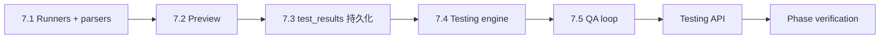

# M7 Implementation Plan — Testing & QA Integration + Local Preview（全量验收 + 本地预览）

Status: complete
Branch: `feat/m7-testing-preview`（从 `feat/m6-development-workflow` 切出）
Source: `spec.md` v0.3.2 §3.1、§5.5、§15、§16（preview 部分）、§10.3；`handbook/phase-07-testing-preview.md`；`dev-plan.md`（TDD Operating Model）
Estimated effort: 6–9 days（一名工程师）
Depends on: M5 complete（`runCommand`、日志管道、`createAuthorize`）；M6 complete（切片 commit、`DevState`、`test.result` 事件、status → `Testing` 入口）

## 1. Goal

在 M6 全部切片通过后，接管 **`Testing` 阶段**：跑**全量 acceptance suite**、启动**本地 preview**、把结果写入 `test_results` 并事件化，失败回 `Developing`，通过则进 `Awaiting Acceptance`（或用户请求部署时进 `Deploying`，由 M10 执行）。

**M7 交付**：

- `packages/workspace`：**全量 test runners**（Vitest / typecheck / build / Playwright）+ **preview 生命周期**
- `packages/workflow`：**Testing phase engine**（与 M6 per-slice 检查严格分离）
- `test_results` 表填充 + `test.result` 事件（suite 区分 `slice:*` vs `final:*`）
- Playwright 截图/trace 落 `artifacts/` + `artifact.created`
- QA agent 消费结果、请求修复、验证 preview 可达
- API：`POST /projects/:id/testing/start`、`GET .../testing/status`、`POST .../preview/start|stop`

**M7 不做**：右侧面板 Tests/Preview UI（M8）、真实 deploy/tunnel（M10）、Integration Gateway（M12）、用户可配 runner 命令（MVP 默认栈固定）。

## 2. 编排边界（延续 M5/M6，不得破坏）

```text
M6 development engine     → per-slice scoped test（slice.testCommand）；终点 status=Testing
M7 testing engine         → 全量 suite；preview 先启后测；权威 pass/fail 仍由 OneCompany 自跑
packages/workspace        → runVitest / runTypecheck / runBuild / runPlaywright / startPreview
runCommand（M5）          → 在 generated repo 内执行；medium 风险本地 dev server
test_results + events     → 结构化持久化；M8 Tests tab 只读消费
```

**硬规则（H3）**：

- **Per-slice checks**（M6）与 **final acceptance suite**（M7）**永不合并** — 不同 suite 前缀、不同 phase、不同 API。
- Playwright **必须**打本地 preview URL（与 Preview tab 同一 URL，§15）。
- Preview **必须先于** Playwright 全量 E2E；无 preview URL 不得标 Testing passed。
- 全量 suite 任一失败 → `Testing` → `Developing`（不静默 waive）。
- Runner 解析结构化 reporter（vitest json、tsc 输出、playwright json）— **不信**子进程 exit code  alone（对齐 M6 O4）。
- 启动 preview server = **medium** 风险：本地执行 + 日志；不创建 deployment gate。
- QA agent **只读**结果并产出修复建议；status 迁移仍在 workflow 纯函数/图节点。

### Per-slice vs Final 命名（锁定）

| 来源 | `test_results.suite` / 事件 `suite` | 何时写入 |
| --- | --- | --- |
| M6 切片循环 | `slice:{sliceId}` | 每切片权威 scoped check |
| M7 全量 | `final:vitest` | Testing phase |
| M7 全量 | `final:typecheck` | Testing phase |
| M7 全量 | `final:build` | Testing phase |
| M7 全量 | `final:playwright` | Testing phase（打 preview URL） |
| M7 全量 | `final:acceptance` | 可选：验收用例文本化检查 |

## 3. 状态迁移（M7 范围）

| From | To | 触发 |
| --- | --- | --- |
| `Testing` | `Testing` | 单 suite 失败重试（同 phase 内） |
| `Testing` | `Developing` | 全量 suite 失败（任一 final:* failed） |
| `Testing` | `Awaiting Acceptance` | 全量通过且 **未** 请求部署 |
| `Testing` | `Deploying` | 全量通过且用户/流程请求部署（M10 接管执行） |
| `Developing` | `Testing` | M6 切片再次全部完成 或 M7 修复后重新触发 testing |

M6 已在 `allSlicesPassed` 时 `setStatus(Testing)`；M7 **不修改**该触发点，而是在 `Testing` 入口跑全量 suite。

## 4. TDD Rules for M7

1. Task 7.1–7.5 **先写失败测试**，再实现。
2. 断言 **`test_results` 行**、**`artifacts` 行**、**`DevState.previewUrl`**、**status 迁移**、**事件类型** — 不接受仅 stdout 文本。
3. CI 默认用 **fixture repo**（最小可 build 的 generated app）+ **mock preview**（HTTP server 返回 200）+ **mock Playwright 输出**；真实 Playwright `describe.skipIf(!process.env.OC_PLAYWRIGHT_INTEGRATION)`。
4. Parser 单元测与 runner 集成测分离（样例 json 文件 fixture）。
5. 每步后 `pnpm -w test` 保持绿。

### M7 test matrix

| Area | Test file（建议） | 证明什么 |
| --- | --- | --- |
| Vitest 解析 | `packages/workspace/src/runners/vitest.test.ts` | json reporter → normalized result |
| Typecheck 解析 | `packages/workspace/src/runners/typecheck.test.ts` | tsc 输出 → passed/failed |
| Build 解析 | `packages/workspace/src/runners/build.test.ts` | build 输出 → passed/failed |
| Playwright 解析 | `packages/workspace/src/runners/playwright.test.ts` | json + trace 路径 |
| Preview 生命周期 | `packages/workspace/src/preview.test.ts` | start → GET 200 → stop；previewUrl 写入 |
| 结果持久化 | `packages/workflow/src/testing/results.test.ts` | insert test_results + emit test.result |
| Testing engine | `packages/workflow/src/testing/engine.test.ts` | 全绿 → Awaiting Acceptance；失败 → Developing |
| Preview 顺序 | `packages/workflow/src/testing/preview-order.test.ts` | Playwright 前必须有 previewUrl |
| QA agent | `packages/workflow/src/testing/qa-loop.test.ts` | 失败 → QA 输出 + 回 Developing |
| Testing API | `apps/api/src/testing/testing.test.ts` | start / status / preview |
| 与 M6 分界 | `packages/workflow/src/testing/slice-separation.test.ts` | final:* 与 slice:* 不混 |

## 5. Prerequisites

| 检查 | 标准 |
| --- | --- |
| M5 DoD | `runCommand`、`persistOutput`、`createAuthorize` |
| M6 DoD | 切片完成 → `Testing`；`dev_sessions`；`test.result` 已 emit（slice 级） |
| DB 表 | `test_results`、`artifacts` 已存在（M0）；**可选新增** `testing_sessions`（见 §6） |
| 共享类型 | `DevState.previewUrl` 已有；扩展 `TestResult` 或新增 `FinalSuiteResult` |
| 默认栈 | §10.1 固定栈（TypeScript + Vitest + 单页 dev server）；命令写死在 runner config |
| 分支 | 从 `feat/m6-development-workflow` 切 `feat/m7-testing-preview` |

## 6. Target Module Layout

```text
packages/shared/src/schemas/
  testing.ts                    # FinalSuiteResult, PreviewState, runner config types
  testing.test.ts

packages/workspace/src/
  runners/
    types.ts                    # NormalizedRunnerResult
    vitest.ts                   # runVitest + parseVitestJson（可复用 M6 parse）
    typecheck.ts
    build.ts
    playwright.ts
    index.ts
    *.test.ts
  preview.ts                    # startPreview / stopPreview / getPreviewHealth
  preview.test.ts

packages/workflow/src/
  testing/
    types.ts
    results.ts                  # persistTestResult, loadFinalResults
    suite-plan.ts               # 全量 suite 顺序与命令
    engine.ts                   # runTestingPhase, resumeAfterFailure
    qa.ts                       # runQaReview
    engine.test.ts
    preview-order.test.ts
    qa-loop.test.ts
    results.test.ts
    slice-separation.test.ts
  index.ts                      # export testing API

packages/agent-core/src/agents/development/
  scripted-runner.ts            # 扩展 QA profile：testing_pass / testing_fail

apps/api/src/
  testing/
    service.ts
    routes.ts
    testing.test.ts
  app.ts                        # wiring

handbook/
  m7-implementation-plan.md     # 本文档
```

### `testing_sessions` 表（可选，推荐）

对称 `dev_sessions`，存 Testing phase 元数据：

```sql
testing_sessions (
  id TEXT PRIMARY KEY,
  project_id TEXT NOT NULL REFERENCES projects(id),
  state TEXT NOT NULL,          -- JSON: { phase, previewUrl, lastRunId, suiteResults[] }
  created_at TEXT NOT NULL,
  updated_at TEXT NOT NULL
)
```

若 MVP 想少一张表，可把 `testingMeta` 塞进 `dev_sessions.state` JSON 的 `meta.testing` 字段 — **计划默认独立表**，便于 M8 查询。

### `NormalizedRunnerResult`（锁定）

```ts
type NormalizedRunnerResult = {
  suite: string;               // e.g. "final:vitest"
  status: "passed" | "failed" | "skipped";
  passedCount?: number;
  failedCount?: number;
  details?: string;
  logRef?: string;             // logs/ 路径或 inline
  artifactRefs?: string[];     // Playwright trace/screenshot
};
```

## 7. Execution Order



---

### Task 7.1 — Test Runners（workspace）

**Red**：`runners/*.test.ts` + fixture json 样例

| Runner | 默认命令（generated repo） | 解析 |
| --- | --- | --- |
| `runVitest` | `pnpm vitest run --reporter=json` | 复用/迁移 `parseVitestJson` |
| `runTypecheck` | `pnpm typecheck` 或 `tsc --noEmit` | 解析 error count |
| `runBuild` | `pnpm build` | exit + stderr 摘要 |
| `runPlaywright` | `pnpm exec playwright test --reporter=json` | json + 收集 trace 路径 |

**Green**：`packages/workspace/src/runners/`

- 统一 `runSuite(deps: ShellDeps, spec: SuiteSpec): Promise<NormalizedRunnerResult>`
- 通过 M5 `runCommand` 在 `repoPath` 执行
- Playwright 环境变量注入 `BASE_URL={previewUrl}`

**Verify**：`pnpm --filter @oc/workspace test runners`

**Note**：将 `packages/workflow/src/development/test-runner.ts` 的 `parseVitestJson` **下沉或 re-export** 到 `@oc/workspace`，避免双份解析逻辑。

---

### Task 7.2 — Local Preview Server

**Red**：`preview.test.ts`

| 用例 | 期望 |
| --- | --- |
| `startPreview` | 子进程启动 dev server；返回 `http://127.0.0.1:{port}` |
| HTTP GET preview URL | 200 |
| `stopPreview` | 进程退出；端口释放 |
| 重复 start | 先 stop 再 start，或返回已有实例 |
| 风险 | 走 medium 本地执行，不创 deployment gate |

**Green**：`packages/workspace/src/preview.ts`

```ts
export type PreviewHandle = { url: string; port: number; stop(): Promise<void> };

export async function startPreview(input: {
  projectId: string;
  repoPath: string;
  deps: ShellDeps;
  command?: string;  // default: pnpm dev --port 0 或固定端口扫描
}): Promise<PreviewHandle>;

export async function stopPreview(projectId: string): Promise<void>;
export async function getPreviewHealth(url: string): Promise<{ reachable: boolean; statusCode?: number }>;
```

- 进程注册表：`Map<projectId, PreviewHandle>`（单进程 MVP）
- 写入 `DevState.previewUrl` + emit `artifact.created`（kind=preview）
- 日志走 M5 `persistOutput`

**Verify**：`pnpm --filter @oc/workspace test preview`

---

### Task 7.3 — 结果持久化

**Red**：`results.test.ts`

- 每次 runner 结束 → `test_results` 一行（suite、status、details）
- emit `test.result`（与 M6 同类型，suite 用 `final:*` 前缀）
- Playwright 失败 → `artifacts` 行（trace png）+ `artifact.created`

**Green**：`packages/workflow/src/testing/results.ts`

```ts
export function persistRunnerResult(db, projectId, result: NormalizedRunnerResult, onEvent?): void;
export function loadTestResults(db, projectId, prefix?: "slice" | "final"): TestResultRow[];
```

**Verify**：DB 行 + 事件 seq 单调

---

### Task 7.4 — Testing Phase Engine

**Red**：`engine.test.ts` + `preview-order.test.ts`

| 用例 | 期望 |
| --- | --- |
| 项目 status=Testing，调用 `runTestingPhase` | 顺序：startPreview → typecheck → build → vitest → playwright |
| 全绿 | status → `Awaiting Acceptance`（默认无 deploy 请求） |
| vitest 失败 | status → `Developing`；`test_results` 有 failed |
| 无 preview 跑 playwright | 抛错或 skip（不得标 passed） |
| deploy 请求 flag | 全绿 → `Deploying`（仅改 status，M10 执行 deploy） |

**Green**：`packages/workflow/src/testing/engine.ts`

```ts
export async function runTestingPhase(deps: TestingWorkflowDeps, input: { projectId: string; requestDeploy?: boolean }): Promise<TestingRunResult>;
export async function getTestingStatus(deps, projectId): Promise<TestingRunResult>;
```

**Deps 形状**（对齐 M6）：

```ts
type TestingWorkflowDeps = {
  db: Db;
  onEvent?: (envelope: EventEnvelope) => void;
  repoPath: string;
  runCommand: ShellDeps; // 或嵌套 M5 ShellDeps
  loadDevState / saveDevState;
  setStatus;
  getProjectStatus;
  startPreview / stopPreview;
  runSuite: (spec) => Promise<NormalizedRunnerResult>;
  runAgent; // QA
};
```

**与 M6 衔接**：

- 方案 A（推荐）：`POST /projects/:id/testing/start` 显式触发（M6 只负责到 Testing status）
- 方案 B：M6 `engine` 在 `setStatus(Testing)` 后同步调用 `runTestingPhase` — **M7 先用方案 A**，避免 M6 测试变慢；文档注明 M9 可自动化

**Verify**：`pnpm --filter @oc/workflow test testing`

---

### Task 7.5 — QA Agent Loop

**Red**：`qa-loop.test.ts`

- 全量失败后 `runQaReview` → `QaOutput` 含修复建议
- `DevState.risks` 追加 QA 摘要
- 可选：创建 `change_requests` 行（"Testing failure remediation"）— 非 gate，仅记录
- status 已回 `Developing` 后，用户修复代码再 `testing/start`

**Green**：`packages/workflow/src/testing/qa.ts`

- `runAgent(DEVELOPMENT_AGENT_IDS.qa)` + 输入 final suite 摘要 + preview health
- Scripted profile：`testing_pass` / `testing_fail` 用于 CI

**Verify**：失败路径 QA notes 非空

---

### Task 7.6 — Testing API

**Red**：`apps/api/src/testing/testing.test.ts`

| 端点 | 行为 |
| --- | --- |
| `POST /projects/:id/testing/start` | 前置 status=`Testing`；跑全量 suite |
| `GET /projects/:id/testing/status` | 返回各 `final:*` 结果摘要、previewUrl |
| `POST /projects/:id/preview/start` | 仅启 preview（调试/M8 用） |
| `POST /projects/:id/preview/stop` | 停止 preview |

**Green**：`apps/api/src/testing/service.ts` + `routes.ts` + `app.ts` wiring

**Verify**：`pnpm --filter @oc/api test testing`

---

## 8. Phase Verification

```bash
pnpm -w build
pnpm -w typecheck
pnpm -w test

# 手动 E2E（fixture 路径）
pnpm --filter @oc/api dev

# 1. 完成 M6 切片 → status Testing
curl -X POST localhost:3001/projects/<id>/testing/start

# 2. 查看结果
curl localhost:3001/projects/<id>/testing/status

# 3. preview 可达
curl -X POST localhost:3001/projects/<id>/preview/start
curl http://127.0.0.1:<port>/

# 4. 强制失败 → Developing
# （fixture profile testing_fail）
curl localhost:3001/projects/<id>/testing/status  # projectStatus=Developing

# 5. （可选）真实 Playwright
OC_PLAYWRIGHT_INTEGRATION=1 pnpm --filter @oc/workspace test playwright
```

## 9. Definition of Done

- [x] Vitest、typecheck、build、Playwright runners 返回 `NormalizedRunnerResult`
- [x] `startPreview` 产出可达本地 URL，写入 `DevState.previewUrl`
- [x] 全量结果写入 `test_results` 并 emit `test.result`（`final:*` suite）
- [x] Playwright 使用与 Preview tab 相同的 preview URL
- [x] Testing 失败 → `Developing`；全绿 → `Awaiting Acceptance`（或 `Deploying` if requested）
- [x] Per-slice（`slice:*`）与 final（`final:*`）结果可区分查询
- [x] Playwright trace/screenshot 存 `artifacts/`（解析路径 + DB 行）
- [x] QA agent 消费失败结果并产出可测输出
- [x] `POST /projects/:id/testing/start` + status API 可用
- [x] Runner 解析、preview 生命周期、持久化、status 路由均有先红后绿测试

## 10. Out of Scope

- M8 Tests/Preview 右侧面板 UI
- M10 `Deploying` 真实 tunnel/deploy 执行
- M9 Stream 内联 testing 卡片
- 多栈支持（非默认 generated app 模板）
- CI 默认跑真实 Playwright（仅 opt-in）
- `testing_sessions` 若砍表，需在 DoD 注明改用 `dev_sessions.meta.testing`

## 11. Risks & Decisions

| 主题 | 决策 |
| --- | --- |
| M6 终点已是 Testing | M7 用显式 `testing/start` 触发全量 suite，不阻塞 M6 测试 |
| parseVitestJson 双份 | 迁移到 `@oc/workspace/runners`，workflow re-export 兼容 |
| Preview 端口冲突 | 127.0.0.1 动态端口 + 进程表 per project |
| Generated app 无 dev 脚本 | fixture repo 模板必须含 `dev`/`build`/`test` scripts（M6 commit 可种子 package.json） |
| Playwright 安装 | generated repo `pnpm exec playwright install` 标 high；测试用 mock json |
| Deploy 请求 | `requestDeploy` 布尔；M10 前只改 status 不真部署 |
| testing_sessions | 推荐独立表；MVP 可延后到 7.4 前决定 |

## 12. What M8 / M9 / M10 Need From M7

| 产出 | 消费者 |
| --- | --- |
| `test_results`（final:*） | M8 Tests tab |
| `DevState.previewUrl` + preview health | M8 Preview tab |
| `artifacts`（playwright trace） | M8 Tests tab 链接 |
| `GET /testing/status` | M9 控制台 |
| `Awaiting Acceptance` 入口 | M10/M11 最终验收 |

## 13. Suggested PR Checklist

1. `pnpm -w test` 绿；列出 `runners/`、`testing/` 新测试
2. 粘贴 `slice-separation.test.ts` 证明 `final:*` ≠ `slice:*`
3. 粘贴 preview-order 测试名（Playwright 前必须有 URL）
4. 粘贴 Testing 失败 → Developing 的 status 断言
5. 确认 M6 `slice-loop` 测试未调用全量 vitest
6. 可选：`OC_PLAYWRIGHT_INTEGRATION=1` 本地截图

---

*下一步：切分支 `feat/m7-testing-preview`，按 Task 7.1 → 7.2 → 7.3 → 7.4 → 7.5 → 7.6 执行。*
