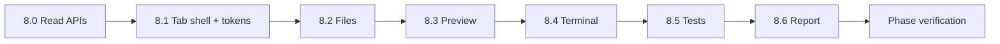

# M8 Implementation Plan — Right Panel Tabs（五 Tab 右侧面板）

Status: ready to execute
Branch: `feat/m8-right-panel-tabs`（从 `feat/m7-testing-preview` 切出）
Source: `spec.md` v0.3.2 §2.3、§14.5、§14.8、§15、§16（preview URL 展示）、§17（Report 只读渲染）；`handbook/phase-08-right-panel-tabs.md`；`dev-plan.md`（TDD Operating Model）
Estimated effort: 5–8 days（一名工程师）
Depends on: M1 complete（SSE + 事件类型）；M4 complete（`GateCard`、gate resolve API）；M5 complete（`GET /files`、`POST /commands`、日志管道）；M6 complete（`diffs`、`diff.created`）；M7 complete（`test_results`、`previewUrl`、`GET /testing/status`）

## 1. Goal

在 `apps/web` 实现 spec §14.5 规定的**恰好五个**右侧面板 Tab，全部对接真实后端数据，无假数据占位：

| Tab | 数据源 |
| --- | --- |
| Files | `GET /files`（repo + artifacts）、`GET /diffs`、git diff 只读 |
| Preview | `DevState.previewUrl`、`GET /preview/status`（health） |
| Terminal | `POST /commands`（M5 `runCommand`）+ gate 403 路径 |
| Tests | `GET /tests/results`（`slice:*` vs `final:*` 分区）+ `artifacts` 链接 |
| Report | `GET /report`（PRD、验收、风险、preview/deploy URL；delivery 段落显式空态） |

**M8 交付**：

- `apps/web`：Tab shell + 五个 Tab 组件 + Claude 暖色 token 基线（§14.8）
- `packages/shared`：右侧面板只读 DTO（zod schema + 测试）
- `apps/api`：读 API 薄层（diffs、tests、report、preview status；扩展 files 含 artifacts）
- UI contract 测试：五 Tab 数量、只读 Files、Preview 空/活态、Terminal gate 路径、Tests 分区、Report 空段落

**M8 不做**：左栏 Stream/Swimlane（M9）、顶栏/Project Hub/Settings（M9）、真实 deploy/tunnel（M10）、delivery report **生成**（M10 写 artifacts；M8 只渲染已有内容）、第六个 Tab、Files 内编辑（§2.3）、Terminal 绕过 risk grading（L3）。

## 2. 编排边界（延续 M5/M7，不得破坏）

```text
M5 runCommand              → Terminal 唯一执行路径；high-risk → gate；输出 redact + persist
M7 test_results + preview  → Tests / Preview tab 只读消费；不改 runner 逻辑
M6 diffs                   → Files tab diff 列表；不新增写路径
M4 GateCard + /gates       → Terminal 403 时内联 gate 卡片
SSE（M1）                  → Terminal 可选追加 tool_call.* 输出（增强，非阻塞 MVP）
```

**硬规则（U5 / L3 / H3）**：

- 右侧面板**恰好五个 Tab**；禁止第六 Tab 或额外面板。
- Files **只读**：树 + 内容 + diff 展示；**禁止** textarea 编辑保存。
- Terminal 命令**必须**走 `POST /projects/:id/commands`；不得直连 shell 或跳过 `createAuthorize`。
- Tests tab **必须**把 per-slice（`slice:*`）与 final（`final:*`）**视觉分区**（§5.5, H3）。
- Report **禁止** fake placeholder；无 delivery report 时显示明确「尚未生成」（M10 前正常）。
- Preview 无 URL 时显示 **empty state**，不是 error 页。

### 现有 API 与 M8 缺口

| 已有 | 缺口（M8 Task 8.0 补齐） |
| --- | --- |
| `GET /projects/:id/files`（仅 repo） | `?scope=repo\|artifacts\|all`；artifacts 路径前缀 `artifacts/` |
| `POST /projects/:id/commands` | Terminal 用；403 gate 时返回 `gateId`（增强响应体） |
| `GET /projects/:id/testing/status` | 可复用 `previewUrl`；另需 `GET /preview/status`（health 轮询） |
| — | `GET /projects/:id/diffs` |
| — | `GET /projects/:id/diffs/:diffId`（git patch 只读） |
| — | `GET /projects/:id/tests/results?prefix=slice\|final` |
| — | `GET /projects/:id/artifacts`（或合入 tests 响应） |
| — | `GET /projects/:id/report` |

## 3. 状态与数据流（M8 范围）

M8 **不新增** workflow 状态迁移；只读投影：

```text
projects.status          → Report 页眉 / Preview 上下文（可选 badge）
dev_sessions.state       → previewUrl、risks（Report）
prd_versions             → Report PRD 段
acceptance_criteria_versions → Report 验收段
tech_plan_versions       → Report 技术方案摘要（可选折叠）
test_results             → Tests tab（按 suite 前缀分组）
artifacts                → Tests tab 链接（trace/screenshot）
diffs                    → Files tab diff 列表
deployments              → Preview/Report deploy URL（有则显示，无则空态）
```

## 4. TDD Rules for M8

1. Task 8.0–8.6 **先写失败测试**（API + UI contract），再实现。
2. UI 测试用 `@testing-library/react` + `jsdom`（与 M4 `gate-card.test.tsx` 同模式）。
3. API 测试用 `setupTestApp()` + fixture 种子（PRD、test_results、diffs 行）。
4. **禁止** snapshot 全页；断言角色、文案、分区标题、`data-testid` 契约。
5. 每步后 `pnpm -w test` + `pnpm -w typecheck` 保持绿。

### M8 test matrix

| Area | Test file（建议） | 证明什么 |
| --- | --- | --- |
| Panel DTO schema | `packages/shared/src/schemas/panel.test.ts` | zod 解析 API 响应 |
| Files API 扩展 | `apps/api/src/panel/files.test.ts` | repo + artifacts 树；path 读取 |
| Diffs API | `apps/api/src/panel/diffs.test.ts` | 列表 + git patch |
| Tests API | `apps/api/src/panel/tests.test.ts` | slice/final 过滤 |
| Report API | `apps/api/src/panel/report.test.ts` | PRD 有则返回；delivery 空字段 |
| Preview status API | `apps/api/src/panel/preview.test.ts` | reachable / 无 preview 空态 |
| Tab shell | `apps/web/src/components/right-panel/right-panel.test.tsx` | 恰好 5 Tab |
| Files tab | `apps/web/src/components/right-panel/files-tab.test.tsx` | 只读；无 contenteditable |
| Preview tab | `apps/web/src/components/right-panel/preview-tab.test.tsx` | empty vs iframe src |
| Terminal tab | `apps/web/src/components/right-panel/terminal-tab.test.tsx` | ls 输出；high-risk → gate UI |
| Tests tab | `apps/web/src/components/right-panel/tests-tab.test.tsx` | 两分区；artifact 链接 |
| Report tab | `apps/web/src/components/right-panel/report-tab.test.tsx` | 空 delivery 文案；PRD 渲染 |
| Commands gate body | `apps/api/src/workspace/workspace.test.ts`（扩展） | 403 含 gateId |

## 5. Prerequisites

| 检查 | 标准 |
| --- | --- |
| M5 DoD | `GET /files`、`POST /commands`、redaction |
| M6 DoD | `diffs` 表有行；`diff.created` 事件 |
| M7 DoD | `test_results`（`final:*`）；`previewUrl`；`GET /testing/status` |
| M4 DoD | `GateCard` 组件；`POST /gates/:id/resolve` |
| Web 基建 | `@oc/web` vitest + testing-library 已配置 |
| 分支 | 从 `feat/m7-testing-preview` 切 `feat/m8-right-panel-tabs` |

## 6. Target Module Layout

```text
packages/shared/src/schemas/
  panel.ts                      # FilesTreeResponse, DiffSummary, TestResultRow, ReportSnapshot, PreviewStatus
  panel.test.ts

packages/workflow/src/
  panel/
    report.ts                     # buildReportSnapshot(db, projectId) — 复用 loadLatestPrd/Acceptance
    artifacts.ts                  # loadArtifactsForProject（或放 api 层）
    index.ts

apps/api/src/
  panel/
    service.ts                    # createPanelService
    routes.ts                     # diffs, tests, report, preview, files 扩展委托
    files.test.ts
    diffs.test.ts
    tests.test.ts
    report.test.ts
    preview.test.ts
  workspace/
    service.ts                    # listArtifactsFiles, readArtifact, getGitDiff
    routes.ts                     # files ?scope=；commands 403 增强
  app.ts                          # route panel

apps/web/src/
  lib/
    api.ts                        # typed fetch to API base
    panel-types.ts                # re-export from @oc/shared
  styles/
    tokens.css                    # §14.8 暖色 token（M9 扩展）
  components/right-panel/
    right-panel.tsx               # Tab shell
    files-tab.tsx
    preview-tab.tsx
    terminal-tab.tsx
    tests-tab.tsx
    report-tab.tsx
    *.test.tsx
  app/
    projects/[id]/page.tsx        # M8 验证页：仅右侧面板 + projectId
    dev/panel/page.tsx            # 可选：fixture project 演示

handbook/
  m8-implementation-plan.md       # 本文档
```

### 锁定 DTO（`packages/shared/src/schemas/panel.ts`）

```ts
export const FileScopeSchema = z.enum(["repo", "artifacts", "all"]);

export const FilesListResponseSchema = z.object({
  scope: FileScopeSchema,
  files: z.array(z.string()),
});

export const FileContentResponseSchema = z.object({
  path: z.string(),
  scope: z.enum(["repo", "artifacts"]),
  content: z.string(),
});

export const DiffSummarySchema = z.object({
  diffId: z.string(),
  summary: z.string(),
  createdAt: z.string(),
});

export const TestResultRowSchema = z.object({
  suite: z.string(),
  status: z.enum(["passed", "failed", "skipped", "pending"]),
  details: z.string().nullable().optional(),
  artifacts: z.array(z.object({ artifactId: z.string(), path: z.string(), kind: z.string() })).optional(),
});

export const TestsResultsResponseSchema = z.object({
  slice: z.array(TestResultRowSchema),
  final: z.array(TestResultRowSchema),
});

export const PreviewStatusSchema = z.object({
  previewUrl: z.string().optional(),
  deploymentUrl: z.string().optional(),
  health: z.object({
    reachable: z.boolean(),
    statusCode: z.number().optional(),
    playwrightReady: z.boolean().optional(),
    consoleErrorCount: z.number().optional(), // MVP: 0 或省略；不伪造
  }),
});

export const ReportSectionSchema = z.object({
  id: z.string(),
  title: z.string(),
  content: z.string().nullable(),
  emptyReason: z.string().optional(),
});

export const ReportSnapshotSchema = z.object({
  projectStatus: z.string(),
  previewUrl: z.string().optional(),
  deploymentUrl: z.string().optional(),
  risks: z.array(z.string()),
  sections: z.array(ReportSectionSchema),
});
```

## 7. Execution Order



---

### Task 8.0 — Panel Read APIs（api + workflow 投影）

**Red**：`apps/api/src/panel/*.test.ts`

| 端点 | 行为 |
| --- | --- |
| `GET /projects/:id/files?scope=all` | 合并 `repo/*` 与 `artifacts/*`（artifacts 带前缀） |
| `GET /projects/:id/files?scope=artifacts&path=...` | 读 artifacts 目录 |
| `GET /projects/:id/diffs` | `diffs` 表按 `created_at` 降序 |
| `GET /projects/:id/diffs/:diffId` | `git show` / `git diff` 只读文本（workspace `repoPath`） |
| `GET /projects/:id/tests/results` | `{ slice, final }` 调用 `loadTestResults` + join `artifacts` |
| `GET /projects/:id/preview/status` | `previewUrl` from dev_session；`getPreviewHealth`；`playwrightReady` = 最近 `final:playwright` passed |
| `GET /projects/:id/report` | `buildReportSnapshot`（见下） |

**Green**：

- `packages/workflow/src/panel/report.ts`：

```ts
export function buildReportSnapshot(db: Db, projectId: string, input: {
  projectStatus: ProjectStatus;
  previewUrl?: string;
  risks: string[];
}): ReportSnapshot;
```

固定 sections（无内容则 `content: null` + `emptyReason`）：

| section id | 来源 |
| --- | --- |
| `prd` | `loadLatestPrd`（无则 empty） |
| `acceptance` | `loadLatestAcceptance` |
| `tech-plan` | `tech_plan_versions` 最新（无则 empty） |
| `run-instructions` | `repo/README.md` 或 `RUN.md`（无则 empty，M10 前正常） |
| `delivery-report` | `artifacts/delivery-report.md`（M10 生成；无则 empty） |
| `test-summary` | 聚合 `test_results` 一行摘要 |
| `risks` | `DevState.risks` join 文本 |
| `urls` | preview + `deployments` 最新 url |

- `POST /commands` 403 增强：`{ error, gateId, gateType }` 便于 Terminal 渲染 `GateCard`

**Verify**：`pnpm --filter @oc/api test panel`

---

### Task 8.1 — Tab Shell + Visual Tokens

**Red**：`right-panel.test.tsx`

- `getAllByRole("tab")` 长度 === 5
- 标签文案恰好：Files, Preview, Terminal, Tests, Report
- 无第六个 tab

**Green**：

- `apps/web/src/styles/tokens.css`：`app.bg`、`surface.base`、`accent.primary`、`status.*`（对齐 §14.8）
- `right-panel.tsx`：紧凑 tab 行（`role="tablist"`）；选中态 copper accent；内容区 `role="tabpanel"`
- `apps/web/src/app/projects/[id]/page.tsx`：加载 `projectId`，渲染 `<RightPanel projectId={id} />`
- API base：`NEXT_PUBLIC_API_URL` 默认 `http://localhost:3001`

**Verify**：`pnpm --filter @oc/web test right-panel`

---

### Task 8.2 — Files Tab

**Red**：`files-tab.test.tsx`

| 用例 | 期望 |
| --- | --- |
| 渲染文件树 | `scope=all` 列表含 repo 与 artifacts 项 |
| 点击文件 | 显示只读 `<pre>`；无 `contenteditable` |
| 选中 diff | 显示 summary + patch 文本（mock API） |
| 尝试编辑 | 无保存按钮；无 input 型编辑器 |

**Green**：`files-tab.tsx`

- 左侧树（可折叠目录）；右侧内容/ diff 分栏
- `GET /files?scope=all` + `?path=` 懒加载内容
- `GET /diffs` 列表；点击 → `GET /diffs/:diffId`
- 大文件截断提示 + 链到 artifact（若 output chunk 在 logs）

**Verify**：`pnpm --filter @oc/web test files-tab`

---

### Task 8.3 — Preview Tab

**Red**：`preview-tab.test.tsx`

| 用例 | 期望 |
| --- | --- |
| 无 `previewUrl` | 文案含 "no preview" / 「尚未启动」；无 iframe |
| 有 URL | `iframe[src=previewUrl]` |
| Health 指示 | reachable 绿/灰；playwrightReady badge |

**Green**：`preview-tab.tsx`

- 顶栏：URL 文本 + health chips（reachable、Playwright ready）
- 主区域：全宽 iframe（**不要** card-in-card 嵌套，§14.5）
- 轮询 `GET /preview/status`（5s interval，tab 激活时）
- `deploymentUrl` 存在时 toggle「本地 / 部署」（M10 前有 deploy 则显示）

**Verify**：`pnpm --filter @oc/web test preview-tab`

---

### Task 8.4 — Terminal Tab

**Red**：`terminal-tab.test.tsx` + 扩展 `workspace.test.ts`

| 用例 | 期望 |
| --- | --- |
| `ls` | 调用 `POST /commands`；输出追加到 transcript |
| `npm install`（high） | 403 + 内联 `GateCard`；resolve 后可重试 |
| 无 bypass | 不 import node child_process |

**Green**：`terminal-tab.tsx`

- 输入框 + Submit；history 向上滚动
- 同步显示 `outputRef.text`（inline）或 artifact 链接（chunk）
- 403 → 解析 `gateId` → 嵌入现有 `GateCard` → `POST /gates/:id/resolve`
- 可选增强：订阅 SSE `tool_call.completed` 追加同一 transcript（同 projectId）

**Verify**：`pnpm --filter @oc/web test terminal-tab`；API high-risk gate 用例

---

### Task 8.5 — Tests Tab

**Red**：`tests-tab.test.tsx`

| 用例 | 期望 |
| --- | --- |
| 两分区标题 | 「Per-slice」与「Final acceptance」均可见 |
| final 行 | `final:vitest` 等 suite 名 + passed/failed |
| 失败行 | 展示 `details` 摘要 + artifact 链接 |
| 无结果 | 空态，非假数据 |

**Green**：`tests-tab.tsx`

- `GET /tests/results` → 两列或上下分区
- 状态色：success / danger / muted pending
- artifact 链接：`/api` 代理或 `file://` 禁止；用 API 读 artifacts 路径或展示相对 path + 复制
- 失败 trace：链接到 Files tab 对应 artifact（可选 cross-tab `onNavigate` callback）

**Verify**：`pnpm --filter @oc/web test tests-tab`

---

### Task 8.6 — Report Tab

**Red**：`report-tab.test.tsx`

| 用例 | 期望 |
| --- | --- |
| 有 PRD | section 渲染 markdown/纯文本 |
| 无 delivery | 显示 `emptyReason`（如「Delivery report — not generated yet」） |
| 无 deployment | 不显示假 URL |
| risks | 列表来自 snapshot |

**Green**：`report-tab.tsx`

- 按 `sections[]` 顺序渲染；`content === null` → 灰显 emptyReason
- PRD / acceptance 用 `<pre>` 或轻量 markdown（不引入重型 MD 引擎亦可）
- 页脚：previewUrl、deploymentUrl（可点击，外链 `rel="noopener"`）

**Verify**：`pnpm --filter @oc/web test report-tab`

---

## 8. Phase Verification

```bash
pnpm -w build
pnpm -w typecheck
pnpm -w test

# 手动（双进程）
pnpm --filter @oc/api dev
pnpm --filter @oc/web dev
# 1. 打开 /projects/<id> — 五 Tab 可切换
# 2. Files：树含 repo + artifacts；点击只读；diff 列表可见
# 3. Preview：无 URL 空态；POST preview/start 后 iframe 加载
# 4. Terminal：ls 有输出；npm install 出 gate 卡片
# 5. Tests：slice 与 final 分区；M7 跑完后 final 全绿
# 6. Report：PRD 有内容；delivery 段显示「尚未生成」
```

## 9. Definition of Done

- [ ] 恰好五个 Tab：Files, Preview, Terminal, Tests, Report
- [ ] Tab shell 符合 §14.8 暖色紧凑控制台密度
- [ ] Files 只读：树 + 内容 + diff；含 repo 与 artifacts
- [ ] Preview 嵌入本地 preview URL；无 URL 时空态；health 指示可达
- [ ] Terminal 走 `POST /commands`；high-risk 触发 gate；输出可见
- [ ] Tests 展示 normalized 结果；`slice:*` 与 `final:*` 分区；artifact 链接
- [ ] Report 展示 PRD、验收、风险；无 delivery 时显式空态（不造假）
- [ ] Panel 读 API + 各 Tab UI contract 测试先红后绿
- [ ] `pnpm -w test` + `pnpm -w typecheck` 绿

## 10. Out of Scope

- M9 左栏 Stream/Swimlane、顶栏、Project Hub、Settings、可拖拽分栏
- M10 delivery report **生成**、deploy gate 执行、tunnel 配置 UI
- M12 Integration Gateway
- Files 内编辑、第六 Tab、Terminal shell 直连
- Playwright 真实跑在 web E2E（M11 可选）；M8 以 component/contract 测为主
- Preview console-error 实时监控（MVP 可显示 `—`；接 Browser MCP 属 M12）

## 11. Risks & Decisions

| 主题 | 决策 |
| --- | --- |
| M8 页面 vs M9 布局 | M8 用 `/projects/[id]` 仅挂 RightPanel；M9 迁入 split layout，不 rewrite Tab |
| artifacts 文件树 | `listFiles(artifactsPath)` + 响应路径加 `artifacts/` 前缀 |
| diff 全文 | `git diff` 只读；失败时仅显示 `summary` |
| Terminal 流式 | MVP 同步 POST 响应；SSE 追加为可选增强 |
| Report markdown | 首版 `<pre>` 纯文本；避免引入重依赖 |
| API 聚合位置 | `buildReportSnapshot` 放 `@oc/workflow/panel`，API 薄包装 |
| CORS | web dev 需 API CORS 或 Next rewrite；`next.config.ts` 加 `/api/*` proxy 到 3001 |
| preview health 轮询 | 仅 Preview tab focused 时轮询，避免全局噪音 |
| consoleErrorCount | MVP 固定省略或 0；U7 完整指标留 M11/M12 |

## 12. What M9 / M10 / M11 Need From M8

| 产出 | 消费者 |
| --- | --- |
| `<RightPanel />` 组件 | M9 layout 右侧 slot |
| `GET /report`、`GET /tests/results` | M9 Project Hub artifact 卡片 |
| Preview tab + health chips | M9 Hub preview summary |
| Terminal + GateCard 集成 | M9 Stream「open in Terminal」深链 |
| Tests 分区 UI | M9 Stream inline test chips 跳转 |
| `tokens.css` | M9 全站样式扩展 |
| Files diff 视图 | M9 Stream inline diff chips |

## 13. Suggested PR Checklist

1. `pnpm -w test` 绿；列出 `right-panel/*.test.tsx` 与 `panel/*.test.ts`
2. 截图五 Tab（含 Preview 空态 + 有 URL）
3. 粘贴 `right-panel.test.tsx` 五 Tab 断言
4. 粘贴 Tests tab 双分区测试名
5. 粘贴 Report `delivery-report` emptyReason 断言
6. 确认 `grep contenteditable apps/web` 无 Files 编辑
7. 确认 Terminal high-risk 走 gate 的 API + UI 测试各一条

---

*下一步：切分支 `feat/m8-right-panel-tabs`，按 Task 8.0 → 8.1 → 8.2 → 8.3 → 8.4 → 8.5 → 8.6 执行。*
