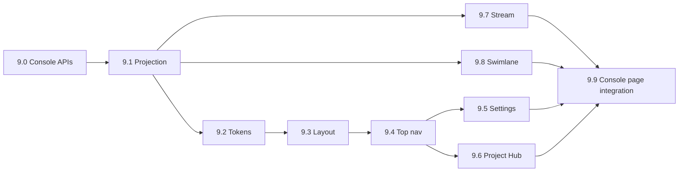

# M9 Implementation Plan — Info Stream + Swimlane + Console Shell（单投影双渲染器 + 顶栏/Hub/Settings）

Status: complete
Branch: `feat/m9-renderers`（从 `feat/m8-right-panel-tabs` 切出）
Source: `spec.md` v0.3.2 §8、§14.1–§14.8、§14.3.1、§20；`handbook/phase-09-renderers.md`；`dev-plan.md`（TDD Operating Model）
Estimated effort: 10–14 days（一名工程师）
Depends on: M1 complete（SSE + `EventEnvelope`）；M2 complete（P/A/O/R + failure 事件）；M3 complete（requirement 工作流 + completeness）；M4 complete（`GateCard` + gate resolve）；M6 complete（dev session、slice 进度）；M7 complete（testing/preview 状态）；M8 complete（`<RightPanel />`、panel 读 API、`tokens.css`）

## 1. Goal

交付 **完整控制台 shell**：顶栏 + 可拖拽左右分栏 + 左栏 Stream/Swimlane 双渲染器 + 右栏 M8 五 Tab，**单一事件投影**驱动全部 UI。

**M9 交付**：

| 区域 | 交付物 |
| --- | --- |
| 投影层 | `buildConsoleProjection`：SSE 事件 + durable snapshot → 统一 `ConsoleProjection` |
| Layout | 顶栏 64px + 左 44% / 右 56% 可拖拽分栏；右侧嵌 `<RightPanel />` |
| Top nav | 项目切换、status/phase/group/progress pills、run/pause、deploy 入口、avatar |
| Settings | 全局环境/密钥/tunnel 就绪 + 只读 policy chips（§14.6） |
| Project Hub | 多项目管理、9 阶段时间线、gate/artifact 摘要（§14.7） |
| Stream | §14.3.1 契约：用户卡、P/A/O/R 分组、内联 gate、sticky composer |
| Swimlane | agents × P/A/O/R 网格；与 Stream **同源投影** |
| API 薄层 | 项目列表、console snapshot、pause/resume、environment readiness |

**M9 不做**：真实 deploy/tunnel 执行（M10）、delivery report 生成（M10）、Integration Gateway（M12）、第三左栏模式（§20）、Settings 内项目管理、用户可配 model/sandbox/risk（§14.6）、Archive 真实软删（MVP 可 stub 为 disabled + tooltip）。

## 2. 编排边界（延续 M1/M4/M8，不得破坏）

```text
SSE GET /projects/:id/events/stream     → 投影唯一增量来源（实时）
GET /projects/:id/console/snapshot      → 初始 hydration + 轮询补强（status/session）
Stream renderer                         → 读 ConsoleProjection（无独立 store）
Swimlane renderer                       → 读同一 ConsoleProjection（禁止第二份 state）
GateCard / Composer                     → POST 现有 workflow/gate API；不 bypass policy
RightPanel（M8）                        → 嵌入 layout 右侧；deep link 由 Stream chips 触发 tab 切换
```

**硬规则（U6 / §14.3.1 / §8）**：

- Stream 与 Swimlane **禁止**各自维护 events/status/gates 副本；切换模式 **零数据丢失**。
- Composer 阻塞于 open gate 时，选项 **必须** mirror `getAllowedOptions`；custom 文本 **绑定** allowed decision，**不算**隐式批准。
- 顶栏 phase/group/progress pills **必须**与 `projects.status` 一致（Developing 时显示 Development Group + slice 进度，**不**把 requirement completeness 当 active phase）。
- 最多 **一个** blocking gate 高亮；历史 gate 折叠为 resolved chip。
- 大输出/tool result **折叠**为 artifact 链接（R5），禁止 Stream 内联全文。
- Settings **不得**出现 model routing、sandbox policy、shell-risk 配置、多项目管理控件。

### 现有 API 与 M9 缺口

| 已有 | 缺口（Task 9.0 补齐） |
| --- | --- |
| `GET /projects/:id/events/stream` | 投影 SSE 客户端封装 |
| `GET /projects/:id`、`GET /projects/:id/gates` | `GET /projects` 列表（Hub） |
| `POST /projects/:id/requirement/*` | Composer 路由映射文档化 |
| `POST /gates/:id/resolve` | Stream 内联 gate 复用 |
| M8 `GET /report`、`/preview/status`、`/tests/results` | Hub artifact 卡片消费 |
| M6 `GET /development/status` | snapshot 合并 slice 进度 |
| — | `GET /projects/:id/console/snapshot` |
| — | `POST /projects/:id/pause`、`POST /projects/:id/resume` |
| — | `GET /environment/readiness`（Settings + Hub 环境摘要） |
| — | （可选）`user.message` / `user.answer` 事件类型，补强 Stream 用户卡 |

## 3. ConsoleProjection 形状（锁定）

```ts
type ConsoleProjection = {
  project: { id: string; name: string; slug: string; status: ProjectStatus };
  phase: {
    label: string;           // e.g. "Developing"
    activeGroup: string;     // e.g. "Development Group"
    progressLabel?: string;  // e.g. "Slice 2 / 3"
  };
  requirement?: {
    rawRequirement: string;
    normalizedSummary: string;
    completenessScore: number;
    completenessLocked: boolean; // true once development started
    settledChips: string[];
    upcomingChips: string[];
  };
  dev?: {
    currentSliceId?: string;
    sliceIndex: number;
    sliceTotal: number;
    previewUrl?: string;
  };
  events: EventEnvelope[];     // ordered by seq
  openGates: GateRecord[];
  blockingGateId?: string;     // at most one emphasized
  agents: Record<string, {
    agentId: string;
    latestPlan?: string;
    latestAct?: string;
    latestObserve?: string;
    latestReflect?: string;
    failed?: boolean;
    activeRunId?: string;
  }>;
  swimlane: SwimlaneCell[][];  // derived, not separately stored
  streamItems: StreamItem[];   // derived render model
};
```

投影为 **纯函数**：`applyEvent(projection, envelope)` + `hydrateFromSnapshot(snapshot)`。React store 只持有 **一份** `ConsoleProjection` 引用。

### Phase / Group 映射（顶栏一致性）

| `ProjectStatus` | `activeGroup` | `progressLabel` 来源 |
| --- | --- | --- |
| `Draft Requirement` / `Asking Questions` | Requirement Group | completeness score（仅此阶段） |
| `PRD Ready` / `Tech Plan Review` | Requirement / Architecture | tech plan gate 或 PRD version |
| `Developing` / `Change Review` | Development Group | `sliceIndex+1 / sliceTotal` from dev session |
| `Testing` | QA Group | final suite progress from testing meta |
| `Deploying` / `Awaiting Acceptance` | Delivery Group | deploy / acceptance gate |
| `Delivered` | — | Delivered |
| `Paused` | （resume 前一组） | Paused |
| `Failed` | — | Failed |

## 4. TDD Rules for M9

1. Task 9.0–9.8 **先写失败测试**；投影纯函数与 UI contract 分离。
2. **同一 fixture** 同时断言 Stream 与 Swimlane 可见数据（用户消息、gate、agent 失败）— 禁止两套 fixture。
3. 投影测试放 `packages/shared` 或 `apps/web/src/lib/projection/`（无 React 依赖）；UI 测用 testing-library。
4. SSE 集成测可 mock `EventSource`；不依赖真实 OpenAI/opencode。
5. 每步后 `pnpm -w test` + `pnpm -w typecheck` 保持绿。

### M9 test matrix

| Area | Test file（建议） | 证明什么 |
| --- | --- | --- |
| Projection pure fn | `apps/web/src/lib/projection/projection.test.ts` | fixture 事件序列 → phase/gates/agents |
| Lossless switch | `apps/web/src/lib/projection/mode-switch.test.ts` | Stream↔Swimlane 同一 projection |
| Console snapshot API | `apps/api/src/console/console.test.ts` | snapshot 字段齐全 |
| Projects list API | `apps/api/src/projects/projects-list.test.ts` | Hub 列表 |
| Pause/resume API | `apps/api/src/projects/projects-pause.test.ts` | Paused ↔ 前状态 |
| Environment API | `apps/api/src/environment/environment.test.ts` | readiness 不泄露 secret |
| Layout shell | `apps/web/src/components/console/layout.test.tsx` | 分栏默认 44/56；右侧 RightPanel |
| Top nav | `apps/web/src/components/console/top-nav.test.tsx` | pills 与 Developing 状态一致 |
| Settings modal | `apps/web/src/components/console/settings-modal.test.tsx` | 无 model routing；有 env checks |
| Project Hub | `apps/web/src/components/console/project-hub.test.tsx` | 9 阶段时间线；Hub/dropdown 互斥 |
| Stream renderer | `apps/web/src/components/console/stream-renderer.test.tsx` | 用户卡、gate 内联、composer |
| Swimlane renderer | `apps/web/src/components/console/swimlane-renderer.test.tsx` | failed cell；user/gate marker |
| Composer policy | `apps/web/src/components/console/composer.test.tsx` | gate 阻塞时选项 mirror registry |

## 5. Prerequisites

| 检查 | 标准 |
| --- | --- |
| M1 DoD | SSE replay + live；`EventEnvelope` zod |
| M4 DoD | `GateCard`；`GET /projects/:id/gates`；resolve → resume |
| M8 DoD | `<RightPanel />` + panel APIs + `tokens.css` |
| Web | `/dev/events` 可参考 SSE 接线 |
| 分支 | 从 `feat/m8-right-panel-tabs` 切 `feat/m9-renderers` |

## 6. Target Module Layout

```text
packages/shared/src/schemas/
  console.ts                    # ConsoleSnapshot, EnvironmentReadiness, StreamItem types
  console.test.ts
  event-envelope.ts             # 可选扩展 user.message / user.answer

packages/workflow/src/console/
  snapshot.ts                   # buildConsoleSnapshot(db, projectId)
  index.ts

apps/api/src/
  console/
    service.ts
    routes.ts
    console.test.ts
  environment/
    service.ts                  # Node/pnpm/git/docker/playwright/path checks
    routes.ts
    environment.test.ts
  projects/
    service.ts                  # listProjects, pause, resume
    routes.ts                   # GET /, POST /:id/pause|resume
    projects-list.test.ts
    projects-pause.test.ts
  app.ts

apps/web/src/
  lib/
    projection/
      types.ts
      build-projection.ts       # applyEvent, buildStreamItems, buildSwimlane
      use-console-projection.ts # SSE + snapshot hook（单 store）
      projection.test.ts
      mode-switch.test.ts
    api.ts                      # 扩展 console/environment/projects APIs
  styles/
    tokens.css                  # 扩展 §14.8 全站 token（M8 基线上补全）
  components/console/
    console-layout.tsx          # 顶栏 + split + 左 renderer slot + RightPanel
    top-nav.tsx
    project-switcher.tsx
    settings-modal.tsx
    project-hub.tsx
    stream-renderer.tsx
    swimlane-renderer.tsx
    composer.tsx
    stream-item.tsx             # 单条 feed item（user/agent/gate/tool/...）
    *.test.tsx
  app/
    projects/[id]/page.tsx      # 迁入完整 ConsoleLayout（替换 M8 仅 RightPanel 页）

handbook/
  m9-implementation-plan.md     # 本文档
```

## 7. Execution Order



---

### Task 9.0 — Console Read/Control APIs

**Red**：`console.test.ts`、`projects-list.test.ts`、`projects-pause.test.ts`、`environment.test.ts`

| 端点 | 行为 |
| --- | --- |
| `GET /projects` | 列表：`id,name,slug,status,updatedAt`；Hub 搜索/filter 客户端做 |
| `GET /projects/:id/console/snapshot` | 聚合 project + requirement session + dev session + open gates + testing meta + risks + completeness |
| `POST /projects/:id/pause` | `setStatus(Paused)`；记录 pausedFrom（已有 history 逻辑） |
| `POST /projects/:id/resume` | `Paused` → `pausedFrom` |
| `GET /environment/readiness` | paths、key **就绪**（boolean，无值）、tunnel 配置状态、node/pnpm/git/docker/playwright/sqlite 检查 |

**Green**：`packages/workflow/src/console/snapshot.ts` + api services

```ts
export function buildConsoleSnapshot(db: Db, projectId: string): ConsoleSnapshot;
```

Composer 动作映射（文档 + 测试断言路径）：

| Composer 上下文 | API |
| --- | --- |
| 初始需求 / 补充需求 | `POST /projects/:id/requirement/start` |
| 回答问题 | `POST /projects/:id/requirement/answers` |
| Gate 决策 | `POST /gates/:id/resolve` |
| Change request（Developing） | M10 前可 stub 或 `POST /projects/:id/development/...` 占位 |

**Verify**：`pnpm --filter @oc/api test console environment projects-list`

---

### Task 9.1 — Event Projection（纯函数 + hook）

**Red**：`projection.test.ts`、`mode-switch.test.ts`

Fixture 至少含：

- `project.status_changed`
- `agent.plan/act/observe/reflect` 同 `runId`
- `agent.error` / `tool_call.failed`
- `human_gate.created` + `human_gate.resolved`
- `diff.created` / `test.result`
- requirement snapshot 中的 `rawRequirement` + `normalizedSummary`

**Green**：`build-projection.ts`

- `createInitialProjection(snapshot)`
- `applyEvent(projection, envelope)`
- `deriveStreamItems(projection)` — 含 origin tag：user | agent | system | gate
- `deriveSwimlane(projection)` — rows=已知 agents + User/Gate 伪行
- `useConsoleProjection(projectId)` — 启动时 fetch snapshot；SSE append；**单** `useState`/`useReducer`

**Verify**：fixture 断言 `blockingGateId` 唯一；Developing 时 `progressLabel` = slice 格式

---

### Task 9.2 — Visual Tokens（扩展 M8）

**Red**：token 快照测试或 style contract（`tokens.css` 变量存在）

**Green**：扩展 `apps/web/src/styles/tokens.css`

- 对齐 §14.8：`app.bg`、`surface.*`、`accent.*`、`status.*`
- 用户消息暖色 `surface.warm`；agent 中性 `surface.base`
- M8 `oc-*` class 迁移为统一 `--oc-*` 命名（最小 diff，可 alias 兼容）

**Verify**：layout/stream 组件使用 CSS 变量，无硬编码 `#hex` 主色

---

### Task 9.3 — Layout Shell

**Red**：`layout.test.tsx`

- 顶栏存在；下方左右分栏
- 默认宽度比约 44% / 56%（容差 ±2%）
- 右侧渲染 `RightPanel`；拖拽改变比例

**Green**：`console-layout.tsx`

- 顶栏 slot + `react-resizable-panels` 或轻量 pointer drag（避免重依赖可手写）
- 左栏：renderer slot + 底部 composer 区（Stream 模式）
- `/projects/[id]` 使用 `ConsoleLayout`

**Verify**：`pnpm --filter @oc/web test layout`

---

### Task 9.4 — Top Nav

**Red**：`top-nav.test.tsx`

| 用例 | 期望 |
| --- | --- |
| Developing 项目 | group = Development Group；progress = Slice n/m |
| Asking 项目 | group = Requirement Group；completeness 可见 |
| Avatar 点击 | 打开 Settings（mock） |
| Switcher 点击 | 打开 Project Hub（mock） |
| Run/Pause | Paused 时显示 Resume；active 时 Pause |

**Green**：`top-nav.tsx` + `project-switcher.tsx`

- pills 从 `ConsoleProjection.phase` 读取
- deploy 入口：Testing/Awaiting 时 enabled；M10 前点击 toast「Deploy in M10」或调 testing start+flag
- 项目切换：`router.push(/projects/:id)`

**Verify**：phase 不一致测试名写入 PR checklist

---

### Task 9.5 — Settings Modal

**Red**：`settings-modal.test.tsx`

- 含 workspace paths、API key readiness、tunnel status、env checks、policy chips
- **不含** project list、model routing、sandbox、shell-risk 编辑

**Green**：`settings-modal.tsx`

- `GET /environment/readiness` 驱动
- 密钥/tunnel 只显示 Ready / Missing / Configured，**不**显示值
- Policy chips 只读：auto model routing、fixed sandbox、governed shell、redaction

**Verify**：`queryByText('Model routing')` 在 settings 内为 null

---

### Task 9.6 — Project Hub Modal

**Red**：`project-hub.test.tsx`

| 用例 | 期望 |
| --- | --- |
| 打开 Hub | compact dropdown 关闭/隐藏 |
| 项目列表 | `GET /projects` 渲染多行 |
| 选中项目 | 右侧详情：9 阶段时间线 current marker |
| Gate 摘要 | open gates 列表 + Resolve 链到 Stream |
| Artifacts | PRD/acceptance/report 链到 M8 report 或占位 |

**Green**：`project-hub.tsx`

- 9 阶段：Draft → Asking → PRD → Tech plan → Developing → Testing → Deploy → Acceptance → Delivered
- Actions：Open、Pause/Resume（调 9.0 API）、New Project（`POST /projects`）
- Archive：MVP disabled +「Post-MVP」
- Footer：Hub vs Settings 职责说明（§14.7）

**Verify**：Hub 与 dropdown 互斥断言

---

### Task 9.7 — Information Stream Renderer

**Red**：`stream-renderer.test.tsx`、`composer.test.tsx`

§14.3.1 契约：

- 时间正序；底部 pin（mock scroll）
- 用户卡 vs agent 卡样式区分；raw requirement ≠ normalized summary
- P/A/O/R 分组；active 展开、完成折叠
- tool_call 行可展开；大 output → artifact link
- diff/test inline chips → `onNavigateTab('files'|'tests')` callback
- 单一 blocking gate 高亮；历史 gate → resolved chip
- Composer：无 gate 时 submit answers；有 gate 时选项 = allowed options

**Green**：`stream-renderer.tsx` + `stream-item.tsx` + `composer.tsx`

- 复用 M4 `GateCard`
- 「Open in Terminal」→ `onNavigateTab('terminal')`
- 展开/折叠 per-item + collapse-all

**Verify**：composer 在 gate 阻塞时不调用 requirement/start 当 approve

---

### Task 9.8 — Swimlane Renderer

**Red**：`swimlane-renderer.test.tsx` + 复用 `mode-switch.test.ts`

- 同一 projection fixture：Stream 中出现的 user 文案在 Swimlane marker 可见
- `agent.error` → failed cell 样式
- 切换按钮 Stream ↔ Swimlane 不 mutate projection（引用相等或深相等）

**Green**：`swimlane-renderer.tsx`

- 列：Plan | Act | Observe | Reflect
- 行：agents + User + Gate 紧凑行
- active 强调、完成紧凑、失败红/amber

**Verify**：lossless switch 测试名列入 DoD 证据

---

### Task 9.9 — Console Page Integration

**Green**：

- `/projects/[id]` → `<ConsoleLayout projectId={id} />`
- 左栏 mode toggle（Stream | Swimlane）
- E2E 手动路径写入手册 Verification

**Verify**：删除或 redirect M8 仅-RightPanel 占位文案；保留 `/dev/events` 调试页

---

## 8. Phase Verification

```bash
pnpm -w build
pnpm -w typecheck
pnpm -w test

# 手动（双进程）
pnpm --filter @oc/api dev
pnpm --filter @oc/web dev
# 1. 创建项目 → /projects/<id> 完整 shell
# 2. POST requirement/start → Stream 出现 user 卡 + agent 事件 SSE 追加
# 3. 顶栏 Developing：Development Group + Slice x/y
# 4. stuck gate → Stream 内联 GateCard → resolve → 工作流继续
# 5. 切换 Swimlane：同一 agent 失败态可见
# 6. Avatar → Settings；Switcher → Hub；Hub 打开时 dropdown 不重叠
# 7. 右侧五 Tab 仍可用；Stream diff chip 跳转 Files
```

## 9. Definition of Done

- [x] 单一 `ConsoleProjection` 馈送 Stream 与 Swimlane（无 per-view store）
- [x] §14.8 token 扩展并用于 shell 组件
- [x] Layout：顶栏 + 可拖拽分栏（默认 ~44/56）；右侧 M8 五 Tab
- [x] Top nav：switcher、status、phase、group、run/pause、deploy 入口、avatar
- [x] Settings 从 avatar 打开；仅全局环境/就绪；排除 model/sandbox/risk/项目管理
- [x] Project Hub 从 switcher 打开；多项目列表 + 9 阶段时间线 + artifact/gate 摘要
- [x] 顶栏 pills 与 lifecycle 一致（Developing 不显示 requirement completeness 为 phase）
- [x] Hub 与 compact dropdown 互斥
- [x] Stream：用户卡、P/A/O/R、内联 gate、折叠 verbose、sticky composer（§14.3.1）
- [x] Swimlane：agents × P/A/O/R + user/gate markers；失败态可见
- [x] Stream ↔ Swimlane 切换无损（同一 fixture 测试）
- [x] Console API + 投影 + 各 UI 模块先红后绿测试
- [x] `pnpm -w test` + `pnpm -w typecheck` 绿

## 10. Out of Scope

- M10 真实 deploy、tunnel 执行、delivery report 生成
- M11 §18 全量验收走查（M9 后做）
- M12 连接器 / Browser MCP console-error 实时监控
- Archive 数据库实现
- 第三左栏 crowded layout（§20）
- SqliteSaver / LangGraph checkpointer UI
- 用户编辑 Files、Terminal bypass

## 11. Risks & Decisions

| 主题 | 决策 |
| --- | --- |
| 投影放哪 | 纯函数 `apps/web/src/lib/projection`；snapshot 构建放 `@oc/workflow/console` |
| 用户事件 | 首版从 `ConsoleSnapshot.requirement` hydrate 用户卡；可选补 `user.answer` 事件 |
| SSE 断线 | 指数退避重连；重连后 `?afterSeq=lastSeq` |
| 分栏实现 | 优先轻量 pointer drag；避免引入过重 UI 库 |
| Deploy 按钮 | M10 前占位或 `requestDeploy` 布尔；不创建真实 tunnel |
| completeness 展示 | Developing 后 locking：顶栏 progress 只显示 slice/suite |
| Hub completeness | 项目卡片可显示历史分数；非 active phase pill |
| Archive | disabled stub，避免无 schema 的假实现 |
| `/dev/events` | 保留调试；生产控制台走 projection |

## 12. What M10 / M11 Need From M9

| 产出 | 消费者 |
| --- | --- |
| 完整 `ConsoleLayout` | M10 deploy 入口、delivery 状态展示 |
| `ConsoleProjection` + Stream | M10 change_request 用户消息 |
| Project Hub 时间线 | M11 Figma baseline 验收 |
| Settings env checks | M10 tunnel 配置状态 |
| Composer gate 路径 | M10 final_acceptance / deployment gate |
| Tab deep link API | M10 delivery 报告从 Hub 打开 |
| Pause/Resume | M11 `Paused` 可达性验收 |

## 13. Suggested PR Checklist

1. `pnpm -w test` 绿；粘贴 `mode-switch.test.ts` 断言摘要
2. 截图 Stream + Swimlane 同一项目切换前后
3. 截图 Settings（无 model routing）+ Project Hub 9 阶段
4. 粘贴 Developing 顶栏 pills 测试名（非 completeness）
5. 粘贴 composer gate-blocked 测试名
6. 确认 `grep -r "useState.*events" apps/web/src/components/console` 无第二套 event store
7. 确认 `/projects/[id]` 渲染 ConsoleLayout + RightPanel

---

*下一步：切分支 `feat/m9-renderers`，按 Task 9.0 → 9.1 → 9.2 → 9.3 → 9.4 → 9.5/9.6（可并行）→ 9.7 → 9.8 → 9.9 执行。*
