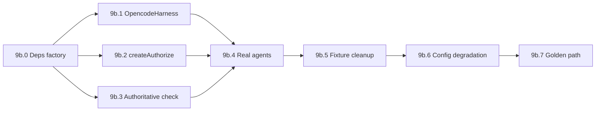

# M9.5 Implementation Plan — Real Engine Integration & De-stub（真实引擎接入）

Status: in_progress
Branch: `feat/m9.5-real-engine`（从 `feat/m9-renderers` 切出）
Source: `spec.md` v0.3.2 §10.1、§10.4、§12、§13、§15、§5.5、§8.2；`handbook/phase-09b-real-engine-integration.md`；`dev-plan.md` M9.5
Estimated effort: 8–12 days（一名工程师）
Depends on: M5 complete（`createAuthorize`、`runCommand`、redaction）；M6 complete（development workflow、`OpencodeHarness` 接口、permission bridge）；M7 complete（`runSuite`、preview、final suite）；M9 complete（控制台单投影；Composer 已不传 `profile`）

## 1. Goal

让**运行中的产品**走真实引擎，而不是 scripted fixture + stub 边界。

M2–M9 刻意在 **结构层**（图、gate、事件、投影、UI）用 fixture 保持可 demo；M5/M6/M7 的真实组件已存在于 package 测试，但 **API service 默认路径未接入**。本里程碑把 stub seam 全部替换，并把 fixture 降级为 **仅测试可用**。

**M9.5 交付**：

| 区域 | 交付物 |
| --- | --- |
| Development API | 默认 `OpencodeHarness` + `createAuthorize` + 真实 `runAuthoritativeCheck` |
| Requirement API | 默认真实 Agents SDK runner（§13 `pickModel`），非 `runScriptedRequirementAgent` |
| Testing API | QA agent 默认真实 runner；`runSuite` 默认非 fixture（保留 `OC_TESTING_FIXTURE` 仅测试） |
| OpencodeHarness | 实现真实 `runSlice`（非 throw stub）；`OC_OPENCODE_INTEGRATION` 仅控制 CI 集成测 |
| 配置降级 | 缺 `OPENAI_API_KEY` / opencode 不可用时的明确行为（§12） |
| 集成测 | flag 保护的 golden path：requirement → PRD → tech plan → 1+ governed slice → scoped tests → preview |

**M9.5 不做**（明确边界）：

- M10 deploy/tunnel、delivery report 生成
- M11 Stream §14.3.1 展示细化（run 分组、pin-to-bottom 等）— 见 `phase-11` Task 11.7
- 删除 `StubHarness` / scripted runners（**降级**为 test-only，不删）
- Integration Gateway（M12）

## 2. 问题陈述（Review 结论）

当前 API 层 **伪造整条开发管线**：

```ts
// apps/api/src/development/service.ts — buildDeps
harness: StubHarness,
authorize: async () => ({ allow: true }),
runAuthoritativeCheck: async () => ({ passed: true, details: "api-default-pass" }),
runner: runScriptedDevAgent,

// apps/api/src/requirement/service.ts
runner: runScriptedRequirementAgent,

// apps/api/src/testing/service.ts
runner: runScriptedDevAgent,
runSuite: OC_TESTING_FIXTURE === "1" ? fixture pass : real（agent 仍 scripted）

// packages/agent-core/src/harness/opencode-harness.ts
runSlice: throws unless OC_OPENCODE_INTEGRATION=1
```

后果：M6「opencode + permission bridge」与 M7「真实 test execution」只在 package 单测里成立；M10/M11 若在此之上验收会得到 **假绿**。

## 3. 编排边界（不得破坏）

```text
LangGraph / workflow（@oc/workflow）     → 预算、状态迁移、gate 节点、权威 test 判定
runAgent（@oc/agent-core）               → P/A/O/R 事件；pickModel(§13)；runner 可注入
OpencodeHarness.runSlice                 → 切片内 TDD；permission → createAuthorize
runAuthoritativeCheck（API 注入）        → M5 runCommand + parseVitestJson（不信 opencode 自报）
createAuthorize（@oc/workspace）          → §12 风险分级 + gate；禁止 allow:true 短路
```

**硬规则**：

- 默认 runtime path **禁止** `allow: true`、`passed: true`、scripted runner、fixture `profile`。
- `StubHarness` / scripted runners / fixture profile **仅**通过 env flag 或 test `buildDeps` 选项启用。
- 权威 pass/fail **只认** OneCompany 自跑 `slice.testCommand`（O4）。
- opencode shell/edit **必须**经 `createAuthorize`；high-risk **禁止**自动批准。
- 状态/预算/gate **不得**进入 harness 或 agent 内部循环（§10.1、§10.4）。

## 4. TDD Rules for M9.5

1. Task 9b.1–9b.7 **先写失败测试**，再改 wiring。
2. **两层测试**：
   - 默认 CI：`pnpm -w test` 仍不依赖 OpenAI key、不启动真实 opencode（test 显式 opt-in stub）。
   - 集成 flag：`OC_OPENCODE_INTEGRATION=1` + `OPENAI_API_KEY` 跑 golden path（CI optional job）。
3. 每个 stub 替换都要有 **回归测试**证明 runtime 默认不走 stub（例如 grep 级 contract test 或 integration assert）。
4. 断言 **事件类型**、**status 迁移**、**gate 创建**、**test.result status** — 不接受仅 HTTP 200。
5. 每步后 `pnpm -w test` + `pnpm -w typecheck` 保持绿。

### M9.5 test matrix

| Area | Test file（建议） | 证明什么 |
| --- | --- | --- |
| Dev deps factory | `apps/api/src/development/deps.test.ts` | 默认 harness ≠ StubHarness；authorize ≠ allow:true |
| Authoritative check | `apps/api/src/development/authoritative-check.test.ts` | fail 不 commit；pass 推进 |
| Governed authorize | `apps/api/src/development/authorize-integration.test.ts` | high-risk → gate |
| Requirement runner | `apps/api/src/requirement/runner.test.ts` | 默认非 scripted；有 key 时走真实 runner |
| Fixture leak grep | `apps/api/src/fixture-leak.test.ts` | 生产路径无 `profile:` / `happy_path` |
| OpencodeHarness | `packages/agent-core/src/harness/opencode-harness.test.ts` | `OC_OPENCODE_INTEGRATION=1` 时真实 slice |
| Testing service | `apps/api/src/testing/testing-runner.test.ts` | QA agent 默认非 scripted |
| Golden path | `apps/api/src/integration/golden-path.test.ts` | flag 保护端到端 |
| Config degradation | `apps/api/src/config/degradation.test.ts` | 缺 key 不 silent pass |
| Redaction | 扩展现有 M5/M6 测 | opencode/model I/O 进事件前 redact |

## 5. Prerequisites

| 检查 | 标准 |
| --- | --- |
| M5 DoD | `createAuthorize`、`runCommand`、`parseVitestJson` |
| M6 DoD | development engine + `StubHarness` 切片循环测绿 |
| M7 DoD | `runSuite`、preview lifecycle |
| M9 DoD | 控制台 projection；web composer **不传** `profile` |
| 本地 | opencode CLI 可安装；`OPENAI_API_KEY` 用于手动 golden path |
| 分支 | 从 `feat/m9-renderers` 切 `feat/m9.5-real-engine` |

## 6. Target Module Layout

```text
packages/agent-core/src/harness/
  opencode-harness.ts           # 实现真实 runSlice（M6 bridges）
  opencode-harness.test.ts      # 扩展集成测
  stub-harness.ts               # 保留；export 不变

packages/workspace/src/
  authorize.ts                  # 已有；API 接入
  runners/vitest.ts             # runVitest / parseVitestJson

apps/api/src/
  development/
    service.ts                  # buildDeps → 真实组件
    deps.ts                     # 新建：可测试的 deps factory（env 切换 stub）
    authoritative-check.ts      # runAuthoritativeCheck 实现
    development.test.ts         # 更新：默认非 stub
  requirement/
    service.ts                  # 真实 runner factory
    runner.ts                   # 新建：createRequirementRunner(db, onEvent)
  testing/
    service.ts                  # 真实 QA runner；runSuite 默认真实
  config/
    engine-mode.ts              # OPENAI_API_KEY / opencode 可用性检测
  integration/
    golden-path.test.ts         # describe.skipIf(!OC_OPENCODE_INTEGRATION)

handbook/
  m9.5-implementation-plan.md   # 本文档
```

## 7. Execution Order



---

### Task 9b.0 — Deps factory（可测试切换点）

**Red**：`deps.test.ts` — 默认 `createDevelopmentDeps()` 返回非 stub 实现；`OC_USE_STUB_ENGINE=1` 时返回 StubHarness + scripted runner。

**Green**：`apps/api/src/development/deps.ts`

```ts
export type EngineMode = "real" | "stub";

export function resolveEngineMode(): EngineMode;
export function createDevelopmentDeps(ctx: DevServiceContext, projectId: string): DevelopmentWorkflowDeps;
export function createRequirementDeps(ctx: ReqServiceContext): RequirementWorkflowDeps;
export function createTestingDeps(ctx: TestServiceContext, projectId: string): TestingWorkflowDeps;
```

- 默认 `real`；测试文件内 `OC_USE_STUB_ENGINE=1` 或 inject option。
- **禁止**在 `service.ts` 内联 stub 字面量。

**Verify**：`pnpm --filter @oc/api test deps`

---

### Task 9b.1 — Real OpencodeHarness

**Red**：`opencode-harness.test.ts` — `OC_OPENCODE_INTEGRATION=1` 时 `runSlice` 不 throw；发出 `tool_call.*` / `diff.created` 类事件（mock server 或 recorded fixture）。

**Green**：`packages/agent-core/src/harness/opencode-harness.ts`

- 实现 M6 设计：per-project `opencode serve`、loopback、session 隔离、event bridge → `EventEnvelope`。
- permission bridge → 注入的 `authorize`（Task 9b.2）。
- log bridge → redaction/chunking（§8.2）。
- API `createDevelopmentDeps` 默认绑定 `OpencodeHarness`（非 `StubHarness`）。

**Verify**：

```bash
OC_OPENCODE_INTEGRATION=1 pnpm --filter @oc/agent-core test opencode-harness
pnpm --filter @oc/api test development
```

---

### Task 9b.2 — Governed authorization

**Red**：`authorize-integration.test.ts` — high-risk `ToolOp` 创建 gate 且 `allow: false`；low-risk 放行；决策可审计。

**Green**：在 `createDevelopmentDeps` 中：

```ts
authorize: createAuthorize(projectId, {
  repoPath: paths.repo,
  createGate: (type) => gates.createGate(projectId, type),
  waitForGate: gates.waitForResolution,
}),
```

- 与 Terminal `POST /commands` 共用同一 `GateService`。
- 移除 `authorize: async () => ({ allow: true })`。

**Verify**：`pnpm --filter @oc/api test authorize-integration`

---

### Task 9b.3 — Authoritative scoped tests

**Red**：`authoritative-check.test.ts` — vitest json 失败 → `test.result` failed、不 commit、status 保持 `Developing`；通过 → commit + 下一切片。

**Green**：`apps/api/src/development/authoritative-check.ts`

```ts
export function createRunAuthoritativeCheck(deps: {
  shell: ShellDeps;
  repoPath: string;
}): DevelopmentWorkflowDeps["runAuthoritativeCheck"];
```

- 执行 `slice.testCommand`（默认 `vitest --reporter=json` 或 slice 覆盖）。
- `runCommand` + `parseVitestJson` → `{ passed, details }`。
- 移除 `passed: true` stub。

**Verify**：`pnpm --filter @oc/api test authoritative-check`

---

### Task 9b.4 — Real model-routed agents

**Red**：`runner.test.ts` — 默认 runner 调用真实 agent 执行路径（可 mock LLM client）；`pickModel` 被调用；P/A/O/R 事件契约不变。

**Green**：

- `apps/api/src/requirement/runner.ts` — `createRequirementRunner`：无 `runScriptedRequirementAgent` 于默认路径。
- `apps/api/src/testing/service.ts` — QA `runAgent` 同理。
- `apps/api/src/development/service.ts` — dev agents（architect/planner/…）走真实 runner。
- 保留 `runScripted*` 仅当 `resolveEngineMode() === "stub"` 或测试 inject。

**注意**：`runAgent` 已内置 `pickModel(agent.modelPolicy.tier)`；runner 应调用各 agent 的 prompt/tool 实现（若尚未实现，本 task 补最小真实 executor，仍 emit 契约事件）。

**Verify**：`pnpm --filter @oc/api test runner requirement development testing`

---

### Task 9b.5 — Fixture seam 清理

**Red**：`fixture-leak.test.ts` + 更新 `console.test.ts`（已无 profile）

**Green**：

- 确认 `apps/web` composer / `consoleApi.startRequirement` **不传** `profile`（已完成）。
- `development/routes.ts`：`profile` 仅当 `OC_USE_STUB_ENGINE=1` 或 test header 接受；生产默认忽略。
- `requirement/routes.ts`：同上。
- Repo grep：`profile: "happy_path"|"vague"|"stuck"|"minimal"` 仅出现在 `*.test.ts`。

**Verify**：

```bash
rg 'profile:\s*"(happy_path|vague|stuck|minimal|complete|improving)"' --glob '!**/*.test.ts' && exit 1 || true
pnpm --filter @oc/api test fixture-leak
```

---

### Task 9b.6 — Config & degradation

**Red**：`degradation.test.ts`

| 条件 | 期望 |
| --- | --- |
| 无 `OPENAI_API_KEY` | requirement/dev **不** silent pass；返回明确错误或 mock+prompt（§12） |
| opencode 未安装/未启动 | 清晰错误；不 auto-pass slice |
| 有 key + opencode | 正常推进 |

**Green**：`apps/api/src/config/engine-mode.ts`

- `getEngineReadiness()` 供 Settings / startup 使用（可扩展现有 `GET /environment/readiness`）。
- opencode + model I/O 经 redaction pipeline 再 emit（扩展现有 M5 测）。

**Verify**：`pnpm --filter @oc/api test degradation environment`

---

### Task 9b.7 — Golden-path integration test

**Red**：`integration/golden-path.test.ts`

```ts
describe.skipIf(!process.env.OC_OPENCODE_INTEGRATION)("golden path — M9.5", () => {
  // 1. POST /projects
  // 2. requirement/start（无 profile）→ 到 PRD Ready（或 gate resolve）
  // 3. development/start → tech plan gate approve
  // 4. ≥1 slice：真实 opencode + 真实 scoped test
  // 5. testing/start → preview URL 可达
  // 断言：无 api-default-pass；有真实 test.result；status 序列合理
});
```

**Verify**：

```bash
OC_OPENCODE_INTEGRATION=1 OPENAI_API_KEY=... pnpm --filter @oc/api test golden-path
pnpm -w typecheck && pnpm -w test && pnpm -w build
```

---

## 8. Manual Verification

```bash
pnpm migrate
pnpm --filter @oc/api dev
pnpm --filter @oc/web dev
# 1. 新建项目，输入真实需求（无 fixture）
# 2. 观察 Stream：P/A/O/R 来自真实 agent（非固定 scripted 文本）
# 3. 进入 Developing：opencode 活动 + permission gate（可触发 high-risk）
# 4. Tests tab：scoped result 与真实 vitest 一致
# 5. Settings：engine readiness 反映 key/opencode 状态
```

## 9. Definition of Done

- [ ] `development/service` 默认 `OpencodeHarness` + `createAuthorize` + 真实 `runAuthoritativeCheck`
- [ ] `requirement/service` 与 `testing/service` 默认真实 agent runner
- [ ] `OpencodeHarness.runSlice` 在产品中可用（非 throw stub）
- [ ] 无生产路径 `allow:true` / `passed:true` / fixture `profile`
- [ ] 缺 key / 不可用引擎按 §12 降级，不 fake success
- [ ] opencode/model I/O redaction 有测试覆盖
- [ ] `OC_OPENCODE_INTEGRATION=1` golden-path 集成测通过
- [ ] `pnpm -w test` + `pnpm -w typecheck` + `pnpm -w build` 绿

## 10. Risks & Decisions

| 主题 | 决策 |
| --- | --- |
| CI 默认 | 仍 stub；golden path 为 optional CI job |
| Stub 保留 | `OC_USE_STUB_ENGINE=1` + test inject；不删代码 |
| 权威 test | API 层 `authoritative-check.ts` 封装；workflow 接口不变 |
| opencode 版本 | pin + document in README/handbook |
| LLM  flaky | golden path 断言结构/事件/status，不断言 exact PRD 文案 |
| Testing fixture | 保留 `OC_TESTING_FIXTURE=1` 仅测试；默认 `runSuite` 真实 |

## 11. What M10 / M11 Need From M9.5

| 产出 | 消费者 |
| --- | --- |
| 真实 slice + test 结果 | M10 deploy 前「项目真能跑」 |
| 真实 requirement → PRD | M10 delivery report 内容可信 |
| governed opencode 日志 | M11 §18 安全/日志验收 |
| engine readiness API | M11 Settings 与 acceptance 一致 |

M11 Task 11.7（Stream §14.3.1 展示细化）**不依赖** M9.5，可并行，但建议在真实事件流上验收 UI polish。
