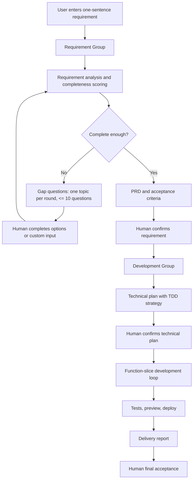
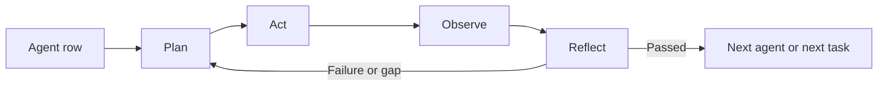

# OneCompany MVP Product And Architecture Spec

Status: draft locked from alignment rounds
Date: 2026-06-08
Language: TypeScript full stack

## 1. Product Positioning

OneCompany is a local-first multi-agent collaboration system. Its core positioning is:

> Turn a user's one-sentence requirement into a runnable and deployable web application.

The primary user is an independent developer. The product should help the user move from vague intent to confirmed requirements, implementation, tests, preview, deployment, and final delivery artifacts.

The MVP must include:

- Complete agent backend flow.
- Frontend flow visualization and user control console.
- Multi-project management.
- Local-first execution.
- Runnable generated web app.
- Source code, logs, acceptance cases, run instructions, test scripts, initialization data, Dockerfile or Docker Compose, and delivery report.

The first stage focuses on generating new applications from scratch. Existing-codebase modification is a later capability, but the architecture should leave room for it.

## 2. Product Scope

### 2.1 MVP In Scope

- Web application generation from user requirement.
- Requirement confirmation workflow with repeated gap questioning.
- PRD and acceptance criteria generation.
- Technical plan confirmation.
- Test-driven development workflow.
- Multi-agent development loop with planning, action, observation, and reflection.
- Human-in-the-loop approval cards.
- Local project workspace creation and git management.
- Risk grading for shell/tool operations.
- Docker sandbox for high-risk operations.
- Local preview and optional Cloudflare Tunnel deployment URL.
- Persistent logs for agent events, tool calls, command output, diffs, and test results.
- Final delivery report and project artifacts.

### 2.2 Future Scope

- Existing-codebase modification.
- SSH remote workspace support.
- External A2A-compatible agent gateway.
- More deployment targets beyond local preview and Cloudflare Tunnel.
- Marketplace-like agent registration and installation.
- More granular enterprise permission model.

### 2.3 Non Goals For MVP

- Fully autonomous execution of high-risk operations without confirmation.
- User-configurable model routing strategy.
- Replacing internal workflow state with pure A2A communication.
- Direct editing inside the file viewer. MVP can display files and diffs; code edits are performed by agents or terminal.

## 3. End-To-End Lifecycle



The project status machine is:

```text
Draft Requirement
-> Asking Questions
-> PRD Ready
-> Tech Plan Review
-> Developing
-> Testing
-> Deploying
-> Awaiting Acceptance
-> Delivered / Failed / Paused
```

## 4. Requirement Confirmation Group

The requirement stage is a sequential workflow with loops. Its goal is to turn vague input into a confirmed PRD and acceptance criteria.

### 4.1 Requirement Agents

| Agent | Responsibility |
| --- | --- |
| Intake Agent | Normalize the user's raw input, identify app type, user goal, and missing context. |
| Requirement Analyst Agent | Extract functional requirements, roles, pages, workflows, data objects, integrations, constraints, and non-functional requirements. |
| Completeness Scorer Agent | Score requirement completeness and identify critical gaps. |
| Question Planner Agent | Generate the next focused question round. Each round has one theme and fewer than 10 questions. |
| PRD And Acceptance Agent | Produce PRD, acceptance criteria, assumptions, risks, and downstream development documents. |

### 4.2 Requirement State

The requirement workflow maintains a durable `RequirementState`:

```ts
type RequirementState = {
  projectId: string;
  rawRequirement: string;
  normalizedSummary: string;
  targetUsers: string[];
  userGoals: string[];
  coreFeatures: string[];
  pagesAndFlows: Array<{
    name: string;
    purpose: string;
    userActions: string[];
  }>;
  dataObjects: Array<{
    name: string;
    fields?: string[];
    relationships?: string[];
  }>;
  rolesAndPermissions: string[];
  integrations: string[];
  nonFunctionalRequirements: string[];
  risks: string[];
  assumptions: string[];
  gaps: Array<{
    topic: string;
    severity: "low" | "medium" | "critical";
    question: string;
  }>;
  completenessScore: number;
  questionRounds: Array<{
    topic: string;
    questions: string[];
    answers: string[];
  }>;
  prdVersion?: string;
  acceptanceCriteriaVersion?: string;
};
```

### 4.3 Requirement Loop

1. User enters a one-sentence requirement.
2. Intake Agent normalizes the request.
3. Requirement Analyst Agent extracts structured requirements.
4. Completeness Scorer Agent produces score and gap list.
5. If the score is below threshold or critical gaps remain, Question Planner Agent creates a focused question round.
6. User answers via option tabs or custom input.
7. Requirement state is updated and rescored.
8. When completeness score is at least 85 and no critical gap remains, PRD And Acceptance Agent generates PRD and acceptance criteria.
9. User confirms the requirement package before development starts.

Users may force entry into development before the threshold is met, but the system must record this as a risk in the project log and delivery report.

## 5. Development Group

The development stage uses Plan + ReAct and TDD. It works from confirmed PRD and acceptance criteria.

### 5.1 Development Agents

| Agent | Responsibility |
| --- | --- |
| Architect Agent | Produce technical plan, architecture, stack recommendation, data model, risk analysis, and deployment approach. |
| Test Designer Agent | Convert acceptance criteria into unit, integration, and Playwright E2E tests. |
| Planner Agent | Break work into function slices and maintain the task queue. |
| Coding Agent | Implement code changes, update generated app files, and maintain local project structure. |
| Review Agent | Review diffs, architecture consistency, security risks, and missing tests. |
| QA Agent | Run tests, inspect logs, verify browser behavior, and request fixes. |
| DevOps And Delivery Agent | Produce Dockerfile or Compose, run instructions, deployment setup, initialization data, and final delivery report. |

### 5.2 Development State

```ts
type DevState = {
  projectId: string;
  repoPath: string;
  worktreePath: string;
  sandboxMode: "local" | "docker";
  techPlanVersion: string;
  taskQueue: FunctionSliceTask[];
  currentTask?: FunctionSliceTask;
  testResults: TestResult[];
  diffs: DiffSummary[];
  commits: Array<{
    hash: string;
    taskId: string;
    summary: string;
  }>;
  previewUrl?: string;
  deploymentUrl?: string;
  deliveryArtifacts: string[];
  risks: string[];
};
```

### 5.3 Plan + ReAct Loop

Development is organized by function slice. A function slice is a small, testable feature unit, usually mapped to one git commit.

For each function slice:

1. Plan: define task goal, acceptance checks, expected files, tools, risks, and test strategy.
2. Act: write failing tests first, then implement code and necessary files.
3. Observe: run type checks, tests, builds, browser checks, and inspect logs/diffs.
4. Reflect: summarize what passed, what failed, what must be fixed, and whether replanning is required.
5. Fix loop: if checks fail, repeat Act -> Observe -> Reflect.
6. Commit: once accepted, create one git commit for the function slice.
7. Continue to next slice.

The development stage can loop internally, but user confirmation is required for dangerous operations, deployment, final acceptance, and material changes to confirmed requirements or technical plan.

### 5.4 Change Handling

If the user modifies the requirement after the technical plan is confirmed:

- Create a Change Request.
- Re-analyze impact on PRD, acceptance criteria, data model, tests, and existing code.
- Identify affected commits and rollback options.
- Update the plan before continuing.
- Record the change in the delivery report.

The generated project must be managed by git so partial rollback is possible.

## 6. Human-In-The-Loop Gates

The system must include human confirmation at:

- Requirement confirmation.
- Technical plan confirmation.
- Deployment confirmation.
- Dangerous operation confirmation.
- Final acceptance.

Human confirmation UI should use option tabs and support custom input.

Default actions:

- Approve.
- Revise then approve.
- Reject and redo.
- Skip risk and continue.
- Custom instruction.

Every gate decision must be stored in the event log and included where relevant in the delivery report.

## 7. Agent Registry

Agents must be registrable and versioned so the system can add, remove, or replace agents later.

Workflow definitions must reference `agentId@version`, not hard-coded classes.

```ts
type AgentDefinition = {
  id: string;
  version: string;
  group: "requirement" | "development";
  role: string;
  description: string;
  inputSchema: unknown;
  outputSchema: unknown;
  tools: string[];
  modelPolicy: {
    tier: "cheap" | "standard" | "strong";
    supportsReasoning?: boolean;
  };
  riskLevel: "low" | "medium" | "high";
  permissions: Array<"read" | "write" | "shell" | "network" | "deploy">;
  executor: string;
};
```

The registry should be designed so future A2A Agent Cards can be generated from registered agent definitions.

## 8. Event Model And Streaming

Internal agent communication should not rely on SSE. Internal workflow coordination should use durable workflow state, an event log, and task state transitions.

SSE is used to stream backend events to the frontend.

The same event dataset must support two frontend render modes:

- Information stream: Opencode/Codex-like chronological feed.
- Swimlane view: agent rows with Plan, Act, Observe, and Reflect columns.

This means the frontend has two renderers over the same source of truth, not two separate state systems.

### 8.1 Event Types

```ts
type AgentEvent =
  | { type: "project.status_changed"; projectId: string; status: string }
  | { type: "agent.started"; projectId: string; agentId: string; runId: string }
  | { type: "agent.plan"; projectId: string; agentId: string; summary: string }
  | { type: "agent.act"; projectId: string; agentId: string; summary: string }
  | { type: "agent.observe"; projectId: string; agentId: string; summary: string }
  | { type: "agent.reflect"; projectId: string; agentId: string; summary: string }
  | { type: "tool_call.started"; projectId: string; toolCallId: string; toolName: string }
  | { type: "tool_call.output"; projectId: string; toolCallId: string; output: string }
  | { type: "diff.created"; projectId: string; diffId: string; summary: string }
  | { type: "test.result"; projectId: string; suite: string; status: "passed" | "failed" }
  | { type: "human_gate.created"; projectId: string; gateId: string; gateType: string }
  | { type: "human_gate.resolved"; projectId: string; gateId: string; decision: string }
  | { type: "artifact.created"; projectId: string; artifactId: string; path: string };
```

The product must show each agent's plan, observation, reflection summary, tool calls, and execution results. It must not expose hidden chain-of-thought. UI labels should use terms like "推理摘要", "计划", "观察", and "反思摘要".

### 8.2 Logging Policy

The system must fully retain:

- Tool calls.
- Command output.
- Diffs.
- Test results.
- Deployment logs.
- Human gate decisions.

The frontend should default to collapsed display for verbose logs and allow users to expand details.

## 9. A2A Compatibility Direction

A2A is treated as a future interoperability layer, not the MVP's internal orchestration mechanism.

Current design decision:

- MVP internal orchestration: LangGraph state, durable event log, task state, and SSE to frontend.
- Future external interoperability: A2A gateway that exposes selected project or agent capabilities.

Relevant A2A concepts to support later:

- Agent Card discovery through a well-known endpoint.
- Task, Message, Part, and Artifact data model.
- Send message, streaming message, get task, list tasks, cancel task, subscribe to task, and push notification configuration operations.
- JSON-RPC, HTTP+JSON/REST, streaming updates, and optional gRPC binding.
- Versioning via A2A protocol version metadata.

Design implication:

- `AgentDefinition` should be mappable to an A2A Agent Card.
- `AgentEvent` and project artifacts should be mappable to A2A Task updates and Artifacts.
- Internal tools can still use MCP-style tool interfaces; A2A is for agent-to-agent collaboration, while MCP is for agent-to-tool capability usage.

References checked on 2026-06-08:

- https://developers.googleblog.com/en/a2a-a-new-era-of-agent-interoperability/
- https://a2a-protocol.org/latest/specification/
- https://a2a-protocol.org/latest/topics/a2a-and-mcp/

## 10. Technical Architecture

The system is local-first and full-stack TypeScript.

### 10.1 Core Stack

| Layer | Choice |
| --- | --- |
| Frontend | Next.js, React, Tailwind CSS, shadcn/ui |
| Backend API | Hono, TypeScript |
| Agent orchestration | LangGraph.js |
| Agent SDK | OpenAI Agents SDK TS |
| Database | SQLite |
| ORM | Drizzle ORM |
| Testing | Vitest, Playwright |
| Workspace execution | Local workspace plus Docker sandbox |
| Deployment support | Local preview and Cloudflare Tunnel |
| Generated app default stack | Next.js/React, Node API, SQLite, Playwright, Docker Compose |

During the requirement phase, the system should recommend the generated app's tech stack to the user as selectable options. The default recommendation is the stack above.

### 10.2 Suggested Monorepo Structure

```text
apps/
  web/                 # Next.js control console
  api/                 # Hono backend API and SSE endpoints
packages/
  agent-core/          # agent registry, LangGraph workflows, OpenAI Agents SDK integration
  workflow/            # requirement and development graph definitions
  workspace/           # project workspace, git, shell, sandbox, file operations
  shared/              # shared types and schemas
  ui/                  # shared UI components if needed
data/
  app.sqlite           # local SQLite database
generated-projects/
  {projectSlug}/
    repo/              # generated app source
    artifacts/         # PRD, acceptance, reports, screenshots, logs
    logs/
    meta.json
```

### 10.3 Database Entities

Recommended SQLite tables:

- `projects`
- `project_status_history`
- `requirement_sessions`
- `requirement_scores`
- `prd_versions`
- `agents`
- `agent_runs`
- `events`
- `tool_calls`
- `human_gates`
- `artifacts`
- `test_results`
- `deployments`
- `change_requests`
- `commits`

## 11. Workspace, Git, And Project Management

The product must support multiple projects.

Each project has an independent directory. Later versions can add SSH workspace support.

Each generated project should include:

- Source code.
- Git repository.
- Test scripts.
- Initialization data.
- Dockerfile or Docker Compose.
- Running instructions.
- Artifacts directory.
- Logs.
- Delivery report.

Git policy:

- Initialize git for each generated project.
- Commit per function slice where practical.
- Link each commit to task ID, tests, and summary.
- Use git as the rollback boundary for change requests and failed function slices.

## 12. Risk Control And Sandbox

The MVP uses shell risk grading.

| Risk | Examples | Handling |
| --- | --- | --- |
| Low | `ls`, `rg`, `cat`, `npm test`, `npm run build`, `git status` | Run locally and log. |
| Medium | `npm install`, file generation, DB init, starting local service | Run locally by default and log. |
| High | deleting files, writing outside project, unknown scripts, accessing secrets, external downloads, deploy, starting tunnel, destructive DB migration | Require human confirmation and use Docker sandbox where applicable. |

Sandbox policy:

- High-risk operations enter Docker sandbox when applicable.
- Low and medium operations run in the local project workspace by default.
- This policy is not user-configurable in MVP.

Secrets policy:

- Do not persist API keys in logs.
- If a required third-party API key is missing, agents should generate mock data and clearly prompt the user to provide the missing key.
- Cloudflare Tunnel token or command can be stored only in local encrypted configuration in a later implementation.

## 13. Model Routing

The system may use multi-model routing.

Default routing strategy:

- Requirement analysis and gap questioning: cheaper or standard model.
- Architecture, coding, review, and risk analysis: stronger model.
- Test summarization and report drafting: standard model.

Users cannot configure model routing in MVP. Project-level override can exist internally for future use.

## 14. Frontend Product Design

The UI uses a top navigation bar plus lower left-right split layout.

The selected direction combines visual option 1 and visual option 2. Visual option 3 is excluded because it is too crowded.

### 14.1 Global Layout

```text
Top Navigation
Lower Main Area
  Left Panel: agent process
  Right Panel: files, preview, terminal, tests, report
```

Recommended layout:

- Top nav height: 56-64px.
- Lower area: full remaining viewport height.
- Left and right panels: resizable split.
- Default ratio: left 42-46%, right 54-58%.

### 14.2 Top Navigation

The top navigation follows visual option 2.

Required elements:

- Project switcher.
- Current project status.
- Current phase.
- Active agent group indicator.
- Run or pause control.
- Deployment entry.
- User avatar dropdown.

Settings should be accessed through the avatar dropdown. Settings may include local workspace path, API key status, Cloudflare Tunnel configuration, and environment checks. It should not expose model routing configuration in MVP.

### 14.3 Left Panel: Information Stream

The default left panel is an Opencode/Codex-like information stream.

It displays:

- User requirement and follow-up answers.
- Requirement completeness score.
- Agent events in chronological order.
- Plan, Act, Observe, Reflect summaries.
- Tool calls.
- Command outputs.
- Diffs.
- Test results.
- Human confirmation cards.
- Risk warnings.

Verbose details are collapsed by default.

### 14.4 Left Panel: Swimlane Mode

The left panel must include a button to switch from information stream to swimlane mode.

Swimlane mode renders the same underlying event data.



Swimlane view structure:

- Rows: agents.
- Columns: Plan, Act, Observe, Reflect.
- Cells: latest event summaries, tool calls, test status, and handoff status.
- Active cells are visually emphasized.
- Completed cells are compact.
- Failed cells show risk or retry state.

The information stream and swimlane must not maintain separate state. They are two renderers over the same event stream.

### 14.5 Right Panel Tabs

The right panel has exactly five MVP tabs:

| Tab | Purpose |
| --- | --- |
| Files | File tree for project source and artifacts; display file content and diffs. |
| Preview | Preview the generated web app through local URL or deployment URL. |
| Terminal | Free terminal for MVP. |
| Tests | Unit, integration, typecheck, build, Playwright E2E, and acceptance test results. |
| Report | PRD, run instructions, delivery report, risks, deployment URL, and final acceptance summary. |

The tab design should avoid overcrowding. The right side should combine the useful structure of visual option 1 and visual option 2.

## 15. Testing And Playwright

Playwright's role:

- Browser-based E2E testing.
- Acceptance test automation.
- Local preview verification.
- Screenshot and trace capture for debugging.
- Confirming that generated apps are actually reachable and usable, not just built successfully.

The MVP test stack:

- Vitest for unit and integration tests.
- TypeScript typecheck.
- Build command.
- Playwright for browser acceptance checks.

The system should show test results in the Tests tab and summarize them in the delivery report.

## 16. Deployment

Supported MVP deployment flow:

- Local preview server.
- Optional Cloudflare Tunnel URL supplied by the user.
- Deployment confirmation gate before exposing a URL.

Cloudflare Tunnel modes:

- User can manually provide and run a tunnel.
- System can use a tunnel token or command later, subject to local encrypted config and confirmation.

Deployment is considered high-risk and must require human confirmation.

## 17. Delivery Artifacts

Each project must produce:

- Application source code.
- Running logs.
- Acceptance cases.
- Run instructions.
- Test scripts.
- Initialization data.
- Dockerfile or Docker Compose.
- Delivery report.
- Risk summary.
- Deployment or preview URL.

Delivery report sections:

- Requirement summary.
- Confirmed tech stack.
- Feature list.
- Directory structure.
- Run instructions.
- Test results.
- Deployment URL.
- Risks and limitations.
- Follow-up recommendations.

## 18. MVP Acceptance Criteria

The MVP is accepted when:

- User can create a project from a simple web app requirement.
- Requirement group completes analysis, scoring, gap questioning, and PRD generation.
- Human can confirm requirement and technical plan through option cards plus custom input.
- Development group creates a project, implements function slices, and records agent events.
- Tests are generated and run.
- The generated web app is locally previewable.
- Dockerfile or Docker Compose and run instructions are generated.
- Delivery report is complete.
- High-risk operations require confirmation and are logged.
- Final user acceptance is captured.
- No unresolved high-risk issue remains.

## 19. Implementation Priority

Recommended MVP build order:

1. Project and database foundation.
2. Agent registry and event log.
3. Requirement workflow.
4. Human gate UI.
5. Development workflow skeleton.
6. Workspace, shell, git, and sandbox service.
7. Right panel tabs: Files, Preview, Terminal, Tests, Report.
8. Information stream renderer.
9. Swimlane renderer using the same event data.
10. Delivery report and Cloudflare Tunnel handoff.

## 20. Confirmed UI Direction

Final aligned UI direction:

- Use top navigation plus lower left-right split.
- Top navigation follows visual option 2.
- User settings live in avatar dropdown.
- Right panel uses visual option 1 plus visual option 2 and includes five tabs: Files, Preview, Terminal, Tests, Report.
- Left panel defaults to an Opencode/Codex-like information stream.
- Keep a switch button that changes left panel rendering to the multi-agent swimlane.
- Swimlane and information stream are based on the same event source.
- Do not use visual option 3 for MVP because it is too crowded.
