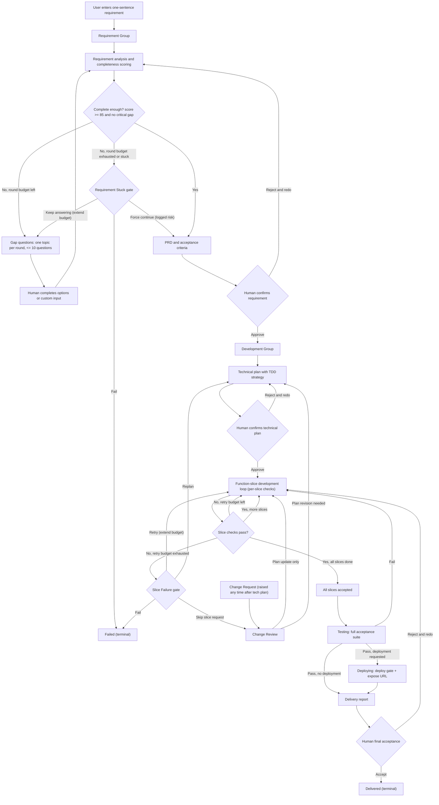
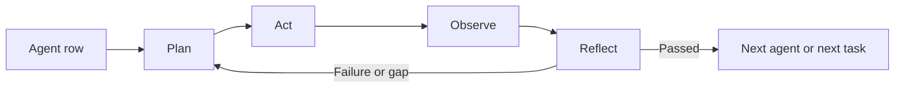

# OneCompany MVP Product And Architecture Spec

Version: 0.3
Status: draft, revised after business-logic, implementation-plan, Figma UI baseline, and development-engine review
Date: 2026-06-08
Language: TypeScript full stack

## Revision Notes (0.1 -> 0.3)

Changes are traceable by ID. H/M/L items landed in 0.2 (business-logic review); R items landed in 0.2.1 (implementation-plan review).

### 0.2 — business-logic review

- H1 — Loop termination and failure exits added: question-round budget and stuck detection (§4.2, §4.3), per-slice retry budget (§5.2, §5.3), and explicit `Failed` transitions in the status machine (§3).
- H2 — Status machine rewritten as a complete cyclic state machine with loop-backs, `Paused` entry/resume, and a `Change Review` state (§3).
- H3 — Per-slice checks (in-loop) are now explicitly distinct from the final `Testing` and `Deploying` phases (§3, §5.3, §5.5).
- M1 — Change-request events and a `Change Review` status added (§3, §8.1).
- M2 — Failure and lifecycle events added: `project.created`, `agent.error`, `run.failed`, `tool_call.failed` (§8.1).
- M3 — Missing tables added: `tech_plan_versions`, `acceptance_criteria_versions`, `diffs` (§10.3).
- M4 — `npm install` risk grading reconciled with the "external downloads" rule (§12).
- M5 — Deploy/tunnel marked as confirmation-gated but not sandboxed (§12).
- L1 — Question cap standardized to "at most 10" everywhere (§3, §4.1).
- L2 — `completenessScore` defined on a 0–100 scale (§4.2, §4.3).
- L3 — Free terminal output is captured into logs and subject to risk grading (§8.2, §14.5).
- L4 — "Skip risk and continue" restricted to low/medium operation gates only (§6).
- L5 — LangGraph vs OpenAI Agents SDK orchestration boundary defined (§10.1).

### 0.2.1 — implementation-plan review

- R1 — Event log semantics clarified: durable workflow state is the control source, while event log is the append-only audit and UI streaming source (§8).
- R2 — Dependency-install risk tightened: lifecycle scripts are high risk unless disabled or explicitly allowlisted (§12).
- R3 — Initial complete requirements can move directly from `Draft Requirement` to `PRD Ready` (§3.1).
- R4 — Skipping a slice must enter Change Review and update acceptance criteria; it cannot silently waive a required feature (§5.3, §5.4).
- R5 — Logging must redact secrets before persistence and store large outputs as artifact chunks (§8.2).

### 0.2.2 — Figma UI baseline

- U1 — Claude-inspired warm console style fixed as the MVP visual baseline, with explicit color-token intent and compact engineering-console density (§14, §14.8).
- U2 — Stream Mode now includes user-originated messages and a sticky user composer; it is not only an agent event feed (§14.3).
- U3 — Settings is fixed as an avatar-dropdown modal for global environment and secret readiness only; it does not manage projects or expose model/sandbox/risk-policy configuration (§14.2, §14.6).
- U4 — Project Hub is fixed as a project-switcher modal for multi-project management, project status/risk/gate overview, preview/deploy state, and project artifacts (§14.2, §14.7).
- U5 — Right panel five-tab layout is visually fixed from the Figma baseline: Files, Preview, Terminal, Tests, Report (§14.5).
- U6 — Stream and Swimlane modes remain two renderers over the same event-and-state projection; switching modes must preserve user messages, gates, agent events, and tool/test/diff summaries (§8, §14.4).

### 0.3 — development engine (opencode)

- O1 — Development-group coding execution runs on opencode behind a swappable `CodingHarness` boundary; LangGraph still owns macro workflow, budgets, status, and gates (§10.1, §10.4).
- O2 — Each project runs its own local opencode server (`opencode serve`, loopback only), lifecycle-managed and isolated to that project's workspace (§10.4, §11).
- O3 — Three bridges connect opencode to OneCompany governance: event bridge (→ `EventEnvelope`/`AgentEvent`), permission bridge (→ §12 risk grading + sandbox + gate), and log bridge (→ §8.2 redaction + chunking) (§10.4, §12).
- O4 — opencode runs the intra-slice TDD loop, but authoritative pass/fail is produced by OneCompany's own scoped test run at the slice boundary and surfaced to the frontend; LangGraph decides transitions on that authoritative result (§10.4, §15, §14.5).
- O5 — opencode model selection is governed by §13 routing using OneCompany-managed keys; opencode's own login/Zen provider paths are disabled (§10.4, §13).

## 1. Product Positioning

OneCompany is a local-first multi-agent collaboration system. Its core positioning is:

> Turn a user's one-sentence requirement into a runnable and deployable web application.

The primary user is an independent developer. The product should help the user move from vague intent to confirmed requirements, implementation, tests, preview, deployment, and final delivery artifacts.

The MVP must include:

- Complete agent backend flow.
- Frontend flow visualization and user control console.
- Multi-project management.
- Local-first execution.
- Runnable generated web app.
- Source code, logs, acceptance cases, run instructions, test scripts, initialization data, Dockerfile or Docker Compose, and delivery report.

The first stage focuses on generating new applications from scratch. Existing-codebase modification is a later capability, but the architecture should leave room for it.

## 2. Product Scope

### 2.1 MVP In Scope

- Web application generation from user requirement.
- Requirement confirmation workflow with repeated gap questioning.
- PRD and acceptance criteria generation.
- Technical plan confirmation.
- Test-driven development workflow.
- Multi-agent development loop with planning, action, observation, and reflection.
- Human-in-the-loop approval cards.
- Local project workspace creation and git management.
- Risk grading for shell/tool operations.
- Docker sandbox for high-risk operations.
- Local preview and optional Cloudflare Tunnel deployment URL.
- Persistent logs for agent events, tool calls, command output, diffs, and test results.
- Final delivery report and project artifacts.

### 2.2 Future Scope

- Existing-codebase modification.
- SSH remote workspace support.
- External A2A-compatible agent gateway.
- More deployment targets beyond local preview and Cloudflare Tunnel.
- Marketplace-like agent registration and installation.
- More granular enterprise permission model.

### 2.3 Non Goals For MVP

- Fully autonomous execution of high-risk operations without confirmation.
- User-configurable model routing strategy.
- Replacing internal workflow state with pure A2A communication.
- Direct editing inside the file viewer. MVP can display files and diffs; code edits are performed by agents or terminal.

## 3. End-To-End Lifecycle



Cross-cutting transitions (not drawn per-node to keep the diagram readable):

- Pause: from any active state the user may pause the run, moving the project to `Paused`. Resuming returns to the exact state it left.
- Fail: any active state may move to `Failed` on an unrecoverable error or a human fail decision at a gate.

### 3.1 Project Status Machine

States:

```text
Draft Requirement
Asking Questions
PRD Ready
Tech Plan Review
Developing
Change Review
Testing
Deploying
Awaiting Acceptance
Delivered            (terminal)
Failed               (terminal)
Paused               (cross-cutting, resumable)
```

Transitions:

| From | To | Trigger |
| --- | --- | --- |
| Draft Requirement | Asking Questions | Analysis finds gaps or score below threshold |
| Draft Requirement | PRD Ready | Initial analysis finds score >= 85 and no critical gap |
| Asking Questions | Asking Questions | Next question round, while round budget remains |
| Asking Questions | PRD Ready | Score >= 85 and no critical gap |
| Asking Questions | PRD Ready | Human force-continue at Requirement Stuck gate (logged as risk) |
| Asking Questions | Failed | Human chooses fail at Requirement Stuck gate |
| PRD Ready | Asking Questions | Human rejects requirement |
| PRD Ready | Tech Plan Review | Human confirms requirement |
| Tech Plan Review | Tech Plan Review | Human rejects plan; architect replans |
| Tech Plan Review | Developing | Human confirms technical plan |
| Developing | Developing | Slice fix loop, while per-slice retry budget remains |
| Developing | Testing | All slices accepted |
| Developing | Tech Plan Review | Replan chosen at Slice Failure gate |
| Developing | Failed | Human chooses fail at Slice Failure gate |
| Developing | Change Review | Change request or skip-slice request raised |
| Change Review | Developing | Impact analyzed; plan updated in place |
| Change Review | Tech Plan Review | Change requires technical-plan revision |
| Testing | Developing | Final acceptance suite fails |
| Testing | Deploying | Final acceptance suite passes and deployment requested |
| Testing | Awaiting Acceptance | Final acceptance suite passes and no deployment requested |
| Deploying | Awaiting Acceptance | Deployment confirmed and URL exposed |
| Awaiting Acceptance | Developing | Human rejects final delivery |
| Awaiting Acceptance | Delivered | Human accepts |
| any active state | Paused | User pauses run |
| Paused | previous active state | User resumes run |
| any active state | Failed | Unrecoverable error or human fail decision |

## 4. Requirement Confirmation Group

The requirement stage is a sequential workflow with loops. Its goal is to turn vague input into a confirmed PRD and acceptance criteria.

### 4.1 Requirement Agents

| Agent | Responsibility |
| --- | --- |
| Intake Agent | Normalize the user's raw input, identify app type, user goal, and missing context. |
| Requirement Analyst Agent | Extract functional requirements, roles, pages, workflows, data objects, integrations, constraints, and non-functional requirements. |
| Completeness Scorer Agent | Score requirement completeness on a 0–100 scale and identify critical gaps. |
| Question Planner Agent | Generate the next focused question round. Each round has one theme and at most 10 questions. |
| PRD And Acceptance Agent | Produce PRD, acceptance criteria, assumptions, risks, and downstream development documents. |

### 4.2 Requirement State

The requirement workflow maintains a durable `RequirementState`:

```ts
type RequirementState = {
  projectId: string;
  rawRequirement: string;
  normalizedSummary: string;
  targetUsers: string[];
  userGoals: string[];
  coreFeatures: string[];
  pagesAndFlows: Array<{
    name: string;
    purpose: string;
    userActions: string[];
  }>;
  dataObjects: Array<{
    name: string;
    fields?: string[];
    relationships?: string[];
  }>;
  rolesAndPermissions: string[];
  integrations: string[];
  nonFunctionalRequirements: string[];
  risks: string[];
  assumptions: string[];
  gaps: Array<{
    topic: string;
    severity: "low" | "medium" | "critical";
    question: string;
  }>;
  completenessScore: number;        // 0–100 scale
  completenessThreshold: number;    // default 85
  maxQuestionRounds: number;        // round budget, default 6
  questionRounds: Array<{
    topic: string;
    questions: string[];            // at most 10 per round
    answers: string[];
    scoreAfter: number;             // score recorded after this round, for stuck detection
  }>;
  prdVersion?: string;
  acceptanceCriteriaVersion?: string;
};
```

### 4.3 Requirement Loop

`completenessScore` is on a 0–100 scale; the default threshold is 85.

1. User enters a one-sentence requirement.
2. Intake Agent normalizes the request.
3. Requirement Analyst Agent extracts structured requirements.
4. Completeness Scorer Agent produces score and gap list.
5. If the score is below threshold or critical gaps remain, and the question-round budget (`maxQuestionRounds`, default 6) is not exhausted, Question Planner Agent creates a focused question round of at most 10 questions.
6. User answers via option tabs or custom input.
7. Requirement state is updated and rescored; the new score is recorded in `questionRounds[].scoreAfter`.
8. When completeness score is at least the threshold and no critical gap remains, PRD And Acceptance Agent generates PRD and acceptance criteria.
9. User confirms the requirement package before development starts.

Loop termination (H1). The requirement loop must not run forever:

- Round budget: once `maxQuestionRounds` rounds have run without reaching the threshold, the loop stops asking automatically.
- Stuck detection: if the score improves by less than 3 points across two consecutive rounds while still below threshold, the loop is considered stuck.
- On budget-exhausted or stuck, the system raises a Requirement Stuck human gate (§6) with options: keep answering (extend the budget), force continue to PRD (recorded as a risk in the project log and delivery report), or fail the project (status -> `Failed`).

Users may still force entry into development before the threshold is met via the gate; the system records this as a risk in the project log and delivery report.

## 5. Development Group

The development stage uses Plan + ReAct and TDD. It works from confirmed PRD and acceptance criteria.

### 5.1 Development Agents

| Agent | Responsibility |
| --- | --- |
| Architect Agent | Produce technical plan, architecture, stack recommendation, data model, risk analysis, and deployment approach. |
| Test Designer Agent | Convert acceptance criteria into unit, integration, and Playwright E2E tests. |
| Planner Agent | Break work into function slices and maintain the task queue. |
| Coding Agent | Implement code changes, update generated app files, and maintain local project structure. |
| Review Agent | Review diffs, architecture consistency, security risks, and missing tests. |
| QA Agent | Run tests, inspect logs, verify browser behavior, and request fixes. |
| DevOps And Delivery Agent | Produce Dockerfile or Compose, run instructions, deployment setup, initialization data, and final delivery report. |

### 5.2 Development State

```ts
type DevState = {
  projectId: string;
  repoPath: string;
  worktreePath: string;
  sandboxMode: "local" | "docker";
  techPlanVersion: string;
  taskQueue: FunctionSliceTask[];
  currentTask?: FunctionSliceTask;
  maxSliceAttempts: number;        // per-slice retry budget, default 4
  currentSliceAttempts: number;    // attempts spent on currentTask
  testResults: TestResult[];
  diffs: DiffSummary[];
  commits: Array<{
    hash: string;
    taskId: string;
    summary: string;
  }>;
  previewUrl?: string;
  deploymentUrl?: string;
  deliveryArtifacts: string[];
  risks: string[];
};
```

### 5.3 Plan + ReAct Loop

Development is organized by function slice. A function slice is a small, testable feature unit, usually mapped to one git commit.

For each function slice:

1. Plan: define task goal, acceptance checks, expected files, tools, risks, and test strategy.
2. Act: write failing tests first, then implement code and necessary files.
3. Observe: run the per-slice checks scoped to this slice — type checks, the slice's unit/integration tests, build, targeted browser checks — and inspect logs/diffs.
4. Reflect: summarize what passed, what failed, what must be fixed, and whether replanning is required.
5. Fix loop: if per-slice checks fail, repeat Act -> Observe -> Reflect while the per-slice retry budget (`maxSliceAttempts`, default 4) is not exhausted.
6. Commit: once accepted, create one git commit for the function slice.
7. Continue to next slice.

Loop termination (H1). If the per-slice retry budget is exhausted, the system raises a Slice Failure human gate (§6) with options: retry (extend the budget), replan (status -> `Tech Plan Review`), request skip slice (status -> `Change Review`), or fail the project (status -> `Failed`).

The development stage can loop internally, but user confirmation is required for dangerous operations, deployment, final acceptance, and material changes to confirmed requirements or technical plan.

### 5.4 Change Handling

If the user modifies the requirement after the technical plan is confirmed:

- Create a Change Request; the project moves to `Change Review` (§3).
- Re-analyze impact on PRD, acceptance criteria, data model, tests, and existing code.
- Identify affected commits and rollback options.
- Update the plan before continuing: if only the task queue changes, return to `Developing`; if the architecture or technical plan changes, return to `Tech Plan Review`.
- Record the change in the delivery report.

If a user requests skipping a failed function slice, it is treated as a Change Request. The system must update PRD and acceptance criteria, or keep the related acceptance criterion blocking. A required feature cannot be silently waived only by recording a risk.

The generated project must be managed by git so partial rollback is possible.

### 5.5 Per-Slice Checks vs Final Testing And Deployment

The per-slice checks in §5.3 step 3 are scoped to the current slice and run inside the development loop. They are distinct from the project-level `Testing` and `Deploying` phases (H3):

- Testing phase: after all slices are accepted, the project enters `Testing` and runs the full acceptance suite across the whole app — unit, integration, typecheck, build, Playwright E2E, and acceptance cases (§15). If the full suite fails, the project returns to `Developing`.
- Deploying phase: if the full suite passes and the user requested deployment, the project enters `Deploying`, which requires the deployment gate (§6, §16) before exposing a URL. If no deployment is requested, the project goes straight to `Awaiting Acceptance`.

## 6. Human-In-The-Loop Gates

The system must include human confirmation at:

- Requirement confirmation.
- Technical plan confirmation.
- Requirement stuck (round budget exhausted or loop stuck).
- Slice failure (per-slice retry budget exhausted).
- Change request review.
- Deployment confirmation.
- Dangerous operation confirmation.
- Final acceptance.

Human confirmation UI should use option tabs and support custom input.

Default actions (availability depends on gate type):

- Approve.
- Revise then approve.
- Reject and redo.
- Skip risk and continue.
- Custom instruction.

Per-gate action policy (L4). "Skip risk and continue" is only offered for low- and medium-risk operation gates (e.g. a medium-risk dangerous-operation prompt). It must not be offered for deployment confirmation, destructive (high-risk) operation confirmation, requirement confirmation, technical plan confirmation, or final acceptance. The stuck/failure gates expose their own scoped options (keep answering, force continue, retry, replan, request skip slice through Change Review, fail) instead of the generic set.

Every gate decision must be stored in the event log and included where relevant in the delivery report.

## 7. Agent Registry

Agents must be registrable and versioned so the system can add, remove, or replace agents later.

Workflow definitions must reference `agentId@version`, not hard-coded classes.

```ts
type AgentDefinition = {
  id: string;
  version: string;
  group: "requirement" | "development";
  role: string;
  description: string;
  inputSchema: unknown;
  outputSchema: unknown;
  tools: string[];
  modelPolicy: {
    tier: "cheap" | "standard" | "strong";
    supportsReasoning?: boolean;
  };
  riskLevel: "low" | "medium" | "high";
  permissions: Array<"read" | "write" | "shell" | "network" | "deploy">;
  executor: string;
};
```

The registry should be designed so future A2A Agent Cards can be generated from registered agent definitions.

## 8. Event Model And Streaming

Internal agent communication should not rely on SSE. Internal workflow coordination should use durable workflow state, an event log, and task state transitions.

SSE is used to stream backend events to the frontend.

Control-source boundary (R1):

- Durable workflow state and task state are the control source for LangGraph transitions, budgets, resumes, and recoveries.
- The append-only event log is the audit source and frontend streaming source.
- UI views are projections over the event log plus the current durable state snapshot.
- Status recovery should replay or inspect durable state first, then use the event log for audit, UI history, and correlation.

The same event dataset must support two frontend render modes:

- Information stream: Opencode/Codex-like chronological feed.
- Swimlane view: agent rows with Plan, Act, Observe, and Reflect columns.

This means the frontend has two renderers over the same event-and-state projection, not two separate UI state systems.

### 8.1 Event Types

Every persisted event must use a stable envelope. The payload union below keeps `projectId` for readability, but the database and SSE stream should persist and stream the envelope:

```ts
type EventEnvelope<TPayload> = {
  eventId: string;
  seq: number;                 // monotonically increasing per project
  schemaVersion: string;
  projectId: string;
  runId?: string;
  agentId?: string;
  correlationId?: string;
  timestamp: string;
  payload: TPayload;
};
```

SSE replay uses `seq` or `eventId` as the cursor. Event payload shapes may evolve only by schema versioning.

```ts
type AgentEvent =
  | { type: "project.created"; projectId: string; name: string }
  | { type: "project.status_changed"; projectId: string; status: string }
  | { type: "agent.started"; projectId: string; agentId: string; runId: string }
  | { type: "agent.plan"; projectId: string; agentId: string; summary: string }
  | { type: "agent.act"; projectId: string; agentId: string; summary: string }
  | { type: "agent.observe"; projectId: string; agentId: string; summary: string }
  | { type: "agent.reflect"; projectId: string; agentId: string; summary: string }
  | { type: "agent.error"; projectId: string; agentId: string; runId: string; message: string }
  | { type: "run.failed"; projectId: string; agentId: string; runId: string; reason: string }
  | { type: "tool_call.started"; projectId: string; toolCallId: string; toolName: string }
  | { type: "tool_call.output"; projectId: string; toolCallId: string; output: string }
  | { type: "tool_call.failed"; projectId: string; toolCallId: string; error: string }
  | { type: "diff.created"; projectId: string; diffId: string; summary: string }
  | { type: "test.result"; projectId: string; suite: string; status: "passed" | "failed" }
  | { type: "human_gate.created"; projectId: string; gateId: string; gateType: string }
  | { type: "human_gate.resolved"; projectId: string; gateId: string; decision: string }
  | { type: "change_request.created"; projectId: string; changeRequestId: string; summary: string }
  | { type: "change_request.resolved"; projectId: string; changeRequestId: string; decision: string }
  | { type: "artifact.created"; projectId: string; artifactId: string; path: string };
```

The product must show each agent's plan, observation, reflection summary, tool calls, and execution results. It must not expose hidden chain-of-thought. UI labels should use terms like "推理摘要", "计划", "观察", and "反思摘要".

### 8.2 Logging Policy

The system must fully retain:

- Tool calls.
- Command output, including output from commands run in the free terminal (§14.5).
- Diffs.
- Test results.
- Deployment logs.
- Human gate decisions.
- Agent and run failures (`agent.error`, `run.failed`, `tool_call.failed`).
- Change request creation and resolution.

The frontend should default to collapsed display for verbose logs and allow users to expand details.

Log retention must not leak secrets (R5):

- Redact secrets before writing to the database, artifacts, or frontend stream.
- Redaction should use known environment variable names, a local secret registry, and token-like pattern matching.
- Large command outputs should be chunked into artifact files under the project `logs/` or `artifacts/` directory.
- The database should store output metadata such as path, byte length, hash, and summary rather than duplicating very large blobs.
- Redaction failures are high-risk incidents and must be recorded in the delivery report without exposing the secret value.

## 9. A2A Compatibility Direction

A2A is treated as a future interoperability layer, not the MVP's internal orchestration mechanism.

Current design decision:

- MVP internal orchestration: LangGraph durable workflow state, event log, task state, and SSE to frontend.
- Future external interoperability: A2A gateway that exposes selected project or agent capabilities.

Relevant A2A concepts to support later:

- Agent Card discovery through a well-known endpoint.
- Task, Message, Part, and Artifact data model.
- Send message, streaming message, get task, list tasks, cancel task, subscribe to task, and push notification configuration operations.
- JSON-RPC, HTTP+JSON/REST, streaming updates, and optional gRPC binding.
- Versioning via A2A protocol version metadata.

Design implication:

- `AgentDefinition` should be mappable to an A2A Agent Card.
- `AgentEvent` and project artifacts should be mappable to A2A Task updates and Artifacts.
- Internal tools can still use MCP-style tool interfaces; A2A is for agent-to-agent collaboration, while MCP is for agent-to-tool capability usage.

References checked on 2026-06-08:

- https://developers.googleblog.com/en/a2a-a-new-era-of-agent-interoperability/
- https://a2a-protocol.org/latest/specification/
- https://a2a-protocol.org/latest/topics/a2a-and-mcp/

## 10. Technical Architecture

The system is local-first and full-stack TypeScript.

### 10.1 Core Stack

| Layer | Choice |
| --- | --- |
| Frontend | Next.js, React, Tailwind CSS, shadcn/ui |
| Backend API | Hono, TypeScript |
| Agent orchestration | LangGraph.js |
| Agent SDK | OpenAI Agents SDK TS |
| Development coding engine | opencode (headless, local, via CodingHarness adapter) |
| Database | SQLite |
| ORM | Drizzle ORM |
| Testing | Vitest, Playwright |
| Workspace execution | Local workspace plus Docker sandbox |
| Deployment support | Local preview and Cloudflare Tunnel |
| Generated app default stack | Next.js/React, Node API, SQLite, Playwright, Docker Compose |

During the requirement phase, the system should recommend the generated app's tech stack to the user as selectable options. The default recommendation is the stack above.

Orchestration boundary (L5). LangGraph.js and the OpenAI Agents SDK have non-overlapping responsibilities:

- LangGraph.js owns the macro workflow: group and phase transitions, the requirement and development graphs, durable workflow state, loop budgets (question rounds, slice retries), status transitions, and human-gate nodes.
- OpenAI Agents SDK owns single-agent execution inside a node: one agent's internal ReAct reasoning, its tool calls, and tool/agent handoffs scoped to that step.
- Loop termination, status changes, and gates live in LangGraph, never inside an individual agent's ReAct loop. An agent reports outcomes; LangGraph decides transitions.

Coding engine boundary. Single-agent execution inside a node is further abstracted behind a `CodingHarness` adapter so the Development group can run on the opencode engine while the rest of the system stays unchanged. The Requirement group and non-coding agents use the OpenAI Agents SDK; the Development group uses `OpencodeHarness`. See §10.4.

### 10.2 Suggested Monorepo Structure

```text
apps/
  web/                 # Next.js control console
  api/                 # Hono backend API and SSE endpoints
packages/
  agent-core/          # agent registry, LangGraph workflows, OpenAI Agents SDK + CodingHarness/opencode integration
  workflow/            # requirement and development graph definitions
  workspace/           # project workspace, git, shell, sandbox, file operations
  shared/              # shared types and schemas
  ui/                  # shared UI components if needed
data/
  app.sqlite           # local SQLite database
generated-projects/
  {projectSlug}/
    repo/              # generated app source
    artifacts/         # PRD, acceptance, reports, screenshots, logs
    logs/
    meta.json
```

### 10.3 Database Entities

Recommended SQLite tables:

- `projects`
- `project_status_history`
- `requirement_sessions`
- `requirement_scores`
- `prd_versions`
- `tech_plan_versions`
- `acceptance_criteria_versions`
- `agents`
- `agent_runs`
- `events`
- `tool_calls`
- `diffs`
- `human_gates`
- `artifacts`
- `test_results`
- `deployments`
- `change_requests`
- `commits`

### 10.4 Development-Group Coding Engine (opencode via CodingHarness)

Single-agent execution inside a node (§10.1) is provided through a swappable `CodingHarness` boundary. The Requirement group and non-coding agents use the OpenAI Agents SDK; the Development group runs on opencode (an open-source AI coding agent) wrapped as `OpencodeHarness`. LangGraph's responsibilities are unchanged — it still owns macro workflow, budgets, status transitions, and gates.

CodingHarness boundary:

- `CodingHarness` exposes `runSlice(slice, ctx)` returning a stream that is mapped to `EventEnvelope`/`AgentEvent`, plus an `authorize(op)` hook the harness must call before any shell/edit.
- MVP ships one real implementation (`OpencodeHarness`) plus a test stub. The interface keeps the engine swappable and unit-testable; budgets, retries, status, and gates never move into the harness.

Local opencode server (one per project):

- Each project runs its own local opencode server (`opencode serve` / SDK `createOpencodeServer()`), bound to loopback (`127.0.0.1`) on a per-project port, optionally protected by a server password. It is fully local-first.
- The server is lifecycle-managed: started when the development group begins, pointed at that project's `generated-projects/{projectSlug}/repo` workspace, and closed on completion or pause. Sessions and permissions are isolated per project.
- opencode is pinned to a known version behind the adapter to contain upstream API churn.

Three governance bridges:

- Event bridge — subscribe to the opencode SSE event stream and translate its bus events into `EventEnvelope`/`AgentEvent` (Plan/Act/Observe/Reflect, tool calls, command output, diffs). The information stream and swimlane render these normalized events unchanged (§14.3.1).
- Permission bridge — opencode is configured to ask before shell/edit/tool actions; each `permission.asked` is routed through risk grading and the sandbox policy (§12) and either auto-allowed (low risk) or raised as a `dangerous_operation` human gate, then answered through opencode's permission API. No action bypasses governance.
- Log bridge — opencode tool and command output passes through secret redaction and large-output chunking (§8.2, R5) before it is persisted or shown.

State and TDD boundary:

- `DevState` remains the durable control source; loop budgets, retries, and status transitions live in LangGraph (L5), never inside opencode's loop.
- opencode runs the intra-slice TDD loop (write failing test, implement, run, fix). However, the authoritative pass/fail used to drive state transitions and shown in the Tests tab and information stream is produced by OneCompany's own scoped test run at the slice boundary, using structured reporter output (for example `vitest --reporter=json`, Playwright JSON reporter). opencode's intermediate test runs are surfaced as informational events only.
- LangGraph commits each completed slice via the workspace git service (§11).

Model and credentials:

- Model selection follows §13 routing, applied to opencode by passing the chosen provider and model into each development session, using OneCompany-managed API keys. opencode's own login and hosted "Zen" provider paths are disabled so routing and credentials have a single path.

## 11. Workspace, Git, And Project Management

The product must support multiple projects.

Each project has an independent directory. Later versions can add SSH workspace support.

Each generated project should include:

- Source code.
- Git repository.
- Test scripts.
- Initialization data.
- Dockerfile or Docker Compose.
- Running instructions.
- Artifacts directory.
- Logs.
- Delivery report.

Git policy:

- Initialize git for each generated project.
- Commit per function slice where practical.
- Link each commit to task ID, tests, and summary.
- Use git as the rollback boundary for change requests and failed function slices.

## 12. Risk Control And Sandbox

The MVP uses shell risk grading.

| Risk | Examples | Handling |
| --- | --- | --- |
| Low | `ls`, `rg`, `cat`, `npm test`, `npm run build`, `git status` | Run locally and log. |
| Medium | file generation, non-destructive DB init, starting local service | Run locally by default and log. |
| Medium (constrained) | dependency install via `npm ci --ignore-scripts` with a committed lockfile and the registry pinned, or lifecycle scripts explicitly allowlisted | Run locally with network limited to the configured registry, and log. |
| High | deleting files, writing outside project, unknown scripts, accessing secrets, arbitrary external downloads, unpinned or arbitrary `npm install`, dependency installs that run unreviewed lifecycle scripts, destructive DB migration | Require human confirmation; run in Docker sandbox where containable. |
| High (deploy/network) | deploy, starting Cloudflare Tunnel | Require human confirmation; run against the real workspace and network, not the sandbox. |

Note on dependency install (M4/R2). `npm install` fetches and may execute third-party code, so it is not plain "run locally". It is treated as Medium (constrained) only when run as `npm ci --ignore-scripts` against a committed lockfile with the registry pinned, or when lifecycle scripts are explicitly allowlisted by policy. Any unpinned install, arbitrary install, first-time lockfile generation, or install that runs unreviewed lifecycle scripts is High and follows the external-download rule.

Sandbox policy:

- Containable high-risk operations (unknown scripts, destructive file or DB operations, external downloads) enter the Docker sandbox when applicable.
- Deploy and tunnel operations are high-risk and confirmation-gated, but they run against the real workspace and network rather than the sandbox, because they need the actual app and outbound connectivity that the sandbox isolates (M5).
- Low and medium operations run in the local project workspace by default.
- This policy is not user-configurable in MVP.

Engine permission bridge (O3). When the development group runs on opencode (§10.4), opencode is configured to ask for permission on shell/edit/tool actions; each request is routed through this same risk grading and sandbox policy, and high-risk actions raise the same human gate. opencode never executes an action that bypasses this policy.

Secrets policy:

- Do not persist API keys in logs.
- If a required third-party API key is missing, agents should generate mock data and clearly prompt the user to provide the missing key.
- Cloudflare Tunnel token or command can be stored only in local encrypted configuration in a later implementation.

## 13. Model Routing

The system may use multi-model routing.

Default routing strategy:

- Requirement analysis and gap questioning: cheaper or standard model.
- Architecture, coding, review, and risk analysis: stronger model.
- Test summarization and report drafting: standard model.

Users cannot configure model routing in MVP. Project-level override can exist internally for future use.

Engine model routing (O5). When the development group runs on opencode (§10.4), this routing policy still applies: OneCompany selects each development agent's provider and model per this strategy and passes it into the opencode session using OneCompany-managed API keys. opencode's own login and hosted "Zen" provider paths are disabled so there is a single routing and credential path.

## 14. Frontend Product Design

The UI uses a top navigation bar plus lower left-right split layout.

The selected direction combines visual option 1 and visual option 2. Visual option 3 is excluded because it is too crowded.

The MVP visual baseline is captured in the Figma file:

- File: `OneCompany Console - Claude Style Draft`
- URL: https://www.figma.com/design/r1RF1q4KzBEQHLBWVhGD0X
- Reference frames: `OneCompany Console / Stream Mode`, `OneCompany Console / Swimlane Mode`, `OneCompany Console / Settings Modal`, `OneCompany Console / Project Hub Modal`, and `Claude-inspired Style Tokens`.

The implementation should follow the Figma baseline for layout, information hierarchy, density, and visual tone, while treating this written spec as the source of truth for behavior and data rules.

### 14.1 Global Layout

```text
Top Navigation
Lower Main Area
  Left Panel: agent process
  Right Panel: files, preview, terminal, tests, report
```

Recommended layout:

- Top nav height: 64px in the desktop baseline.
- Lower area: full remaining viewport height.
- Left and right panels: resizable split.
- Default ratio: left 42-46%, right 54-58% (the Figma desktop baseline uses roughly 43% / 57%).
- Right panel tabs and content should remain visible without requiring horizontal scrolling at the baseline desktop width.
- The left panel may scroll vertically, but the user composer in Stream Mode should remain available at the bottom of the left panel.

### 14.2 Top Navigation

The top navigation follows visual option 2.

Required elements:

- Project switcher.
- Current project status.
- Current phase.
- Active agent group indicator.
- Run or pause control.
- Deployment entry.
- User avatar dropdown.

The project switcher is also the entry point for Project Hub (§14.7). The compact dropdown may show recent projects and a New Project action, while the full Project Hub modal handles project search, filtering, inspection, and project-level actions.

Settings should be accessed through the avatar dropdown. Settings may include local workspace path, API key status, Cloudflare Tunnel configuration, and environment checks. It should not expose model routing configuration, sandbox policy configuration, shell risk grading configuration, or multi-project management in MVP.

Top-nav state pills must describe one coherent lifecycle state. For example, when the project is in `Developing`, the active group pill should show `Development Group`, and the progress pill should show function-slice progress such as `Slice 2 / 3` rather than an in-progress requirement completeness score. Requirement completeness can still appear as historical or project-card metadata, but not as the active phase indicator after development has started.

### 14.3 Left Panel: Information Stream

The default left panel is an Opencode/Codex-like information stream.

It displays:

- User requirement and follow-up answers.
- User-authored gate responses, custom instructions, and requirement changes.
- Requirement completeness score.
- Agent events in chronological order.
- Plan, Act, Observe, Reflect summaries.
- Tool calls.
- Command outputs.
- Diffs.
- Test results.
- Human confirmation cards.
- Risk warnings.

The stream must clearly distinguish user-originated items from agent-originated items. The Figma baseline shows a user message card immediately after the current requirement summary so the user can see what was submitted and what can still be edited in the requirement loop.

Stream Mode must include a persistent user composer near the bottom of the left panel. The composer supports:

- Answering current gap questions.
- Adding supplementary requirements.
- Providing custom text for a human gate.
- Sending final acceptance or rejection notes where the active gate permits it.
- Opening option tabs for gate-specific choices.

The composer must not bypass gate policies. If a workflow is blocked on a gate, free text is attached to an allowed gate decision rather than treated as an implicit approval.

Verbose details are collapsed by default.

### 14.3.1 Information Stream Interaction Contract (Opencode/Claude-Code style)

This is a rendering and interaction contract over the normalized event stream (§8). It is engine-agnostic: it must work whether a step is produced by the in-house OpenAI Agents SDK loop or by an external coding harness (see §10.1).

Streaming and ordering:

- Events append in real time over SSE, newest at the bottom.
- The view stays pinned to the latest item while the user is at the bottom; scrolling up pauses auto-scroll and shows a "jump to latest" affordance.
- In-flight items stream incrementally (partial agent output, streamed command lines) and finalize in place.

Item taxonomy and origin distinction:

- Every item maps to one `AgentEvent` type (§8.1) and is tagged with its origin: user, agent, system, or gate.
- User-originated items (requirement, answers, custom gate input, change requests) use the warm user style and an avatar marker; agent and system items use the neutral style. The two must never be visually ambiguous.
- The original user input is preserved verbatim as a raw item; the system's normalized requirement is a separate summary item. Do not render the two identically.

Agent step structure (Plan / Act / Observe / Reflect):

- Each agent run renders as a grouped thread keyed by `runId` / `agentId` / `correlationId`.
- Steps are labeled Plan, Act, Observe, Reflect. The active segment is expanded; completed segments collapse to a one-line summary.
- Tool calls render as a compact row (tool name + status + duration), expandable to arguments and result. Large results are folded behind an artifact link (§8.2, R5), never inlined in full.
- Command output streams as lines, collapsed by default, with "open in Terminal tab" for the full log. Output is secret-redacted before display and persistence (R5).
- Diffs render as an inline mini-diff with expand and a link to the Files tab; test results render as pass/fail chips with a link to the Tests tab.

Human gates inline:

- An open gate renders as an inline actionable card showing only the options allowed for that gate type (§6). Custom text attaches to an allowed decision and never counts as implicit approval.
- At most one gate is open/blocking at a time and is visually emphasized. Previously decided gates collapse to a resolved historical chip (decision + actor + time) with a "view decision log" link.

Composer and density:

- The composer is sticky and context-aware. With no blocking gate it accepts answers, supplementary requirements, and change requests; when a gate blocks, its options mirror that gate's allowed decisions and free text binds to one of them.
- Verbose details are collapsed by default; provide expand-all / collapse-all and per-item expand. Completed runs compact automatically; the current run stays expanded.

Single projection:

- The stream and the swimlane (§14.4) are two renderers over the same event projection plus the current durable-state snapshot (§8). The stream holds no separate state.

### 14.4 Left Panel: Swimlane Mode

The left panel must include a button to switch from information stream to swimlane mode.

Swimlane mode renders the same underlying event data.



Swimlane view structure:

- Rows: agents.
- Columns: Plan, Act, Observe, Reflect.
- Cells: latest event summaries, tool calls, test status, and handoff status.
- Active cells are visually emphasized.
- Completed cells are compact.
- Failed cells show risk or retry state, driven by `agent.error` / `run.failed` / `tool_call.failed` events.

The information stream and swimlane must not maintain separate state. They are two renderers over the same event stream.

Swimlane Mode should be available from the same left-panel switcher as Stream Mode. It should preserve the top requirement summary and project context while changing only the event renderer. It should not remove the ability to inspect gate state or user-originated messages; those items are shown as cells or compact markers derived from the same projection.

### 14.5 Right Panel Tabs

The right panel has exactly five MVP tabs:

| Tab | Purpose |
| --- | --- |
| Files | File tree for project source and artifacts; display file content and diffs. |
| Preview | Preview the generated web app through local URL or deployment URL. |
| Terminal | Free terminal for MVP. |
| Tests | Unit, integration, typecheck, build, Playwright E2E, and acceptance test results. |
| Report | PRD, run instructions, delivery report, risks, deployment URL, and final acceptance summary. |

Free terminal policy (L3). The free terminal is not a bypass of governance: its command output is captured into the event log and command-output retention (§8.2), and commands entered there are subject to the same risk grading (§12) as agent-issued commands, including confirmation for high-risk operations.

The tab design should avoid overcrowding. The right side should combine the useful structure of visual option 1 and visual option 2.

The Figma baseline fixes the following tab-level UX expectations:

- Files: source and artifact tree, read-only file content, and diff display.
- Preview: browser-like preview surface with local preview URL or deployment URL.
- Terminal: free terminal surface connected to the governed shell executor.
- Tests: normalized suite status with pass/fail summaries and artifact links.
- Report: PRD, acceptance cases, run instructions, risk summary, deployment/preview URL, and delivery report sections.

### 14.6 Settings Modal

Settings is a global environment modal opened from the avatar dropdown.

It should include:

- Local workspace paths, including generated-project root and artifact/log locations.
- API key and secret readiness status, without revealing secret values.
- Cloudflare Tunnel configuration status, including user-provided URL or command/token readiness.
- Environment checks for Node, pnpm, Git, Docker, SQLite/database path, and Playwright/browser availability.
- Read-only policy chips for automatic model routing, fixed sandbox policy, governed shell risk grading, and secret redaction.

Settings must not include:

- Multi-project management. That belongs in Project Hub (§14.7).
- User-configurable model routing.
- User-configurable sandbox policy.
- User-configurable shell risk grading policy.
- Raw secret values.

### 14.7 Project Hub Modal

Project Hub is a multi-project management modal opened from the project switcher, not from Settings.

It should include:

- Search and filters for project status, risk, and delivery state.
- Project list with name, generated-project path, status, completeness, open gates, risk count, and recent update time.
- Selected project summary with status, active group, completeness, open gates, risk items, commit count, and created time.
- Lifecycle/status flow timeline from Draft Requirement through Testing/Delivery state.
- Open human gate summary and actions such as Resolve Gate and View Log.
- Preview and deployment summary, including local preview URL, deployment URL/tunnel state, Open Preview, and Deploy actions.
- Project artifact cards for PRD, acceptance cases, delivery report, project folder, logs, screenshots/traces, and generated source.
- Project-level actions: Open, Pause/Resume, Archive, and New Project.

Project Hub is the primary UI for multi-project management in MVP. The top-nav dropdown may show a compact recent-project list, but the modal is the canonical management surface.

The compact project-switcher dropdown and the full Project Hub modal are mutually exclusive. Opening Project Hub should close or hide the compact dropdown so the Hub search/filter area is not visually overlapped.

### 14.8 Visual Style Tokens

The MVP should use a Claude-inspired warm console style: warm paper surfaces, dark ink text, copper/orange primary actions, muted warm borders, green success states, amber warnings, and red danger states.

Suggested token intent:

| Token | Intent |
| --- | --- |
| `app.bg` | warm off-white page background |
| `surface.base` | paper-like panel surface |
| `surface.raised` | cards, modals, tabs |
| `surface.warm` | user messages, selected project, and active warm emphasis |
| `border.muted` | warm neutral borders and dividers |
| `text.primary` | dark ink text |
| `text.muted` | warm gray supporting text |
| `accent.primary` | copper/orange primary buttons, active tabs, progress |
| `accent.soft` | low-emphasis active surface |
| `status.success` | green success and delivered state |
| `status.warning` | amber warning and gate-needed state |
| `status.danger` | red high-risk and failed state |

The visual style should stay compact and operational. Avoid marketing-page hero treatment, decorative gradient orbs, oversized cards, or a crowded third-panel layout.

## 15. Testing And Playwright

Playwright's role:

- Browser-based E2E testing.
- Acceptance test automation.
- Local preview verification.
- Screenshot and trace capture for debugging.
- Confirming that generated apps are actually reachable and usable, not just built successfully.

The MVP test stack:

- Vitest for unit and integration tests.
- TypeScript typecheck.
- Build command.
- Playwright for browser acceptance checks.

Per-slice checks run a scoped subset during the development loop (§5.3); the `Testing` phase runs the full suite across the whole app (§5.5). The system should show test results in the Tests tab and summarize them in the delivery report.

The local preview server must be available before final acceptance testing. Playwright and the Preview tab should verify the same local preview URL before optional deployment is attempted.

## 16. Deployment

Supported MVP deployment flow:

- Local preview server.
- Optional Cloudflare Tunnel URL supplied by the user.
- Deployment confirmation gate before exposing a URL.

Cloudflare Tunnel modes:

- User can manually provide and run a tunnel.
- System can use a tunnel token or command later, subject to local encrypted config and confirmation.

Deployment is considered high-risk and must require human confirmation. Per §12, deploy and tunnel operations are confirmation-gated but run against the real workspace and network rather than the Docker sandbox.

## 17. Delivery Artifacts

Each project must produce:

- Application source code.
- Running logs.
- Acceptance cases.
- Run instructions.
- Test scripts.
- Initialization data.
- Dockerfile or Docker Compose.
- Delivery report.
- Risk summary.
- Deployment or preview URL.

Delivery report sections:

- Requirement summary.
- Confirmed tech stack.
- Feature list.
- Directory structure.
- Run instructions.
- Test results.
- Deployment URL.
- Risks and limitations, including any forced-continue decisions, approved acceptance-scope changes from skip-slice requests, or skip-risk decisions.
- Follow-up recommendations.

## 18. MVP Acceptance Criteria

The MVP is accepted when:

- User can create a project from a simple web app requirement.
- Requirement group completes analysis, scoring, gap questioning, and PRD generation.
- The requirement loop terminates on its own via the round budget or stuck detection and surfaces the Requirement Stuck gate instead of looping forever.
- Human can confirm requirement and technical plan through option cards plus custom input.
- The console implements the Figma baseline: top nav, Stream Mode with user messages and sticky composer, Swimlane switcher, right-side five tabs, avatar Settings modal, and project-switcher Project Hub.
- Development group creates a project, implements function slices, and records agent events.
- The per-slice retry budget is enforced and surfaces the Slice Failure gate when exhausted.
- Tests are generated and run, with per-slice checks and a final full acceptance suite.
- The generated web app is locally previewable before optional deployment, and Playwright can verify the preview URL.
- Dockerfile or Docker Compose and run instructions are generated.
- Delivery report is complete.
- High-risk operations require confirmation and are logged.
- The development group runs on the opencode engine under full governance: the permission bridge routes opencode shell/edit actions through risk grading, sandbox, and gates; logs are secret-redacted; and authoritative per-slice and final test status is surfaced to the frontend.
- Command logs are retained with secret redaction and large-output artifact chunking.
- The project can reach `Failed` and `Paused` states through their defined transitions.
- Final user acceptance is captured.
- No unresolved high-risk issue remains.

## 19. Implementation Priority

Recommended MVP build order:

1. Project and database foundation.
2. Event log, status machine, and human gate foundation.
3. Agent registry and orchestration skeleton.
4. Requirement workflow, including round budget and stuck detection.
5. Human gate UI, including stuck/failure/change-review gates.
6. Development workflow skeleton, including per-slice retry budget.
7. Workspace, shell, git, sandbox service, and local preview service.
8. Claude-inspired visual tokens and console layout shell.
9. Right panel tabs: Files, Preview, Terminal, Tests, Report.
10. Information stream renderer with user cards, inline gates, and sticky composer.
11. Settings modal and Project Hub modal.
12. Swimlane renderer using the same event data.
13. Delivery report and Cloudflare Tunnel handoff.

## 20. Confirmed UI Direction

Final aligned UI direction:

- Use top navigation plus lower left-right split.
- Top navigation follows visual option 2.
- User settings live in avatar dropdown.
- Right panel uses visual option 1 plus visual option 2 and includes five tabs: Files, Preview, Terminal, Tests, Report.
- Left panel defaults to an Opencode/Codex-like information stream.
- The information stream includes both user-originated messages and agent-originated events, plus a sticky user composer for answers, custom gate input, and requirement changes.
- Keep a switch button that changes left panel rendering to the multi-agent swimlane.
- Swimlane and information stream are based on the same event source.
- Settings opens from the avatar dropdown and manages only global environment/secrets/readiness.
- Project Hub opens from the project switcher and manages multiple projects.
- The visual baseline is the Figma file `OneCompany Console - Claude Style Draft`, using a Claude-inspired warm console palette.
- Do not use visual option 3 for MVP because it is too crowded.
